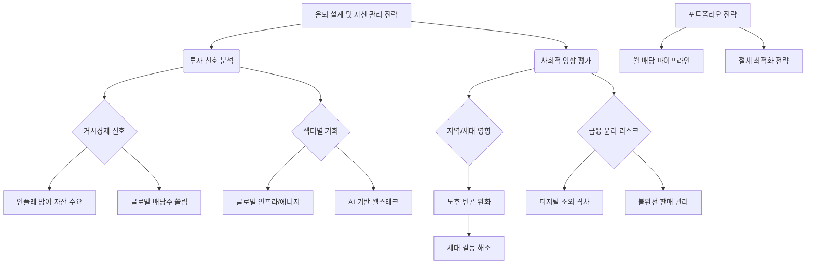

# 은퇴 설계 및 시니어 자산 관리 전략 분석
## 투자 신호 + 사회적 영향 평가

---

## 📌 기사 기본 정보

- **날짜**: 2026-01-16 (기사 발행 기준)
- **출처**: 2026 자산관리 포럼 리포트
- **카테고리**: 경제 > 생활경제 > 노후대비
- **핵심 주제**: 5060 세대의 은퇴 준비 패러다임 전환 (단순 저축 → 전문 컨설팅 기반 자산 재배치)

**메타데이터**
- 주요 타겟: 5060 세대 (베이비부머 및 X세대 초반)
- 자산 구조 특성: 부동산 편중도 70~80%
- 핵심 주체: 전문 자산관리사(FA), 세무사, 연금 전문가
- 주요 변수: 에너지 물가 인상, 건강보험료 부과 체계, 양도·상속세 개편
- 핵심 기술: AI 기반 자동 자산 배분, 연금 절세 알고리즘

---

## 🔍 기사를 통한 투자 신호 추출

### 1단계: 핵심 사건 분해

**What (무엇이 일어났는가?)**
- 은퇴 준비 방식이 '단순 축적'에서 '전문 상담을 통한 효율적 인출 및 절세 전략'으로 급격히 변화
- 연금 자산의 포트폴리오 다변화(주식화)와 부동산 유동화(주택연금 등)가 대중화됨

**When (언제 일어났는가?)**
- 2026년 1월 16일 (고물가·고환율 '뉴노멀' 시대 진입기)
- 베이비부머의 완전 은퇴와 X세대의 은퇴 준비가 맞물리는 시점

**Why (왜 일어났는가?)**
- 기대수명 연장으로 '장수 리스크' 현실화
- 에너지 가격 및 공공요금 급등으로 인한 생활 물가 쇼크
- 복잡해진 세제 환경(상속·종부세 등)으로 인한 자산 지키기 난이도 상승

**Who (누가 주도하는가?)**
- 금융권 (은행/증권/보험 시니어 특화 센터)
- 정부 (연금 개혁 및 건보료 체계 개편 주도)
- 디지털 시니어 (모바일 금융에 능수한 은퇴 예정자들)

---

### 2단계: 투자 신호 해석

#### A. **긍정적 신호 (Bullish)**

**① 실버 금융 산업의 폭발적 성장**
- **신호**: 은퇴 자산 관리 서비스 수요 급증
- **의미**: 단순 예적금이 아닌 수익형 상품 및 컨설팅 시장의 팽창
- **투자 기회**: 시니어 자산관리 특화 금융사, 퇴직연금(IRP) 시장 점유율 상위 기업
- **관련 섹터**: 증권사, 자산운용사, 헬스케어 결합 금융 서비스

**② 자산 운용 패러다임의 변화**
- **신호**: "연금의 주식화" 및 글로벌 배당주 선호 현상
- **의미**: 원화 자산 및 부동산 편중에서 글로벌 우량 자산으로 부의 이동
- **투자 기회**: 글로벌 월 배당 ETF, 인프라 및 리츠(REITs) 관련 기업
- **관련 섹터**: 고배당 섹터, 글로벌 인덱스 펀드 운용사

**③ AI 웰스테크(Wealth-Tech)의 부상**
- **신호**: 고도화된 절세 및 인출 인공지능 알고리즘 필요성 증대
- **의미**: 개인화된 로보어드바이저가 인간 컨설턴트를 보조하거나 대체
- **투자 기회**: 핀테크 보안 업체, AI 자산 관리 알고리즘 개발사

---

#### B. **위험 신호 (Bearish)**

**① 스태그플레이션형 노후 위기**
- **신호**: 에너지 가격 인상으로 인한 가계 실질 소득 감소
- **의미**: 고정된 연금 소득보다 지불해야 할 물가 상승폭이 더 커짐
- **투자 리스크**: 
  - 정기 예금 등 실질 금리가 마이너스인 자산의 가치 하락
  - 필수 소비재 가격 상승으로 인한 은퇴자의 가처분 소득 위축

**② 부동산 유동성 위기 (하우스 푸어)**
- **신호**: 자산의 대부분이 부동산에 묶여 있음
- **의미**: 급격한 세금 인상이나 의료비 발생 시 대응 능력 부재
- **투자 리스크**: 
  - 고가 대형 평수 부동산의 처분 지연 및 가치 하락 가능성
  - 거래 절벽 시 자산 동결 리스크

**③ 정책 및 세제 불확실성**
- **신호**: 건보료 및 연금 개혁안의 잦은 변경
- **의미**: 장기적인 은퇴 계획을 수립하기 어려운 환경
- **투자 리스크**: 정책 신뢰도 하락으로 인한 소극적 자산 운용 및 자본 유출

---

### 3단계: 섹터별 투자 기회 매트릭스

#### ✅ **높은 기대도 + 낮은 리스크**

**글로벌 인프라 및 에너지 펀드**
- 인플레이션 헤지가 가능하며 안정적인 배당 수익 창출
- 에너지 가격 상승기에 수익성 강화되는 구조
- **투자 추천도**: ⭐⭐⭐⭐⭐

관련 기업군:
- 글로벌 전력망/인프라 리츠
- 유틸리티 고배당주
- 에너지 저장 및 관리 시스템 업체

---

#### ⚠️ **높은 기대도 + 높은 리스크**

**AI 기반 시니어 핀테크 플랫폼**
- 차세대 금융 시장을 주도할 잠재력이 크나, 기술 경쟁이 치열함
- 규제 변화에 따라 수익 모델이 크게 흔들릴 수 있음
- **투자 추천도**: ⭐⭐⭐ (중장기 관찰 필요)

주의사항:
- 전통 금융사와의 파트너십 구축 여부 확인
- 고령층 UI/UX 최적화 완성도 평가

---

#### ❌ **낮은 기대도 + 높은 리스크**

**수익성이 낮은 단기 예적금 상품**
- 물가 상승률을 따라잡지 못해 실질 자산 가치가 하락함
- 세금 및 건보료 합산 시 사실상 마이너스 수익 가능성
- **투자 추천도**: ⭐ (회피 권장)

---

## 💰 구체적 투자 신호 변환

### 신호 1: 현금 흐름(Cash Flow) 중심의 자산 재편 신호

**기사의 핵심 문구**
> "단순 저축에서 절세 기반의 현금 흐름 창출 전략으로 변화"

**투자 해석**
- 자산의 '크기'보다 '흐름'이 중요한 시대로 진입
- 월 배당 및 분기 배당 상품에 대한 수요가 구조적으로 증가
- **실행 전략**: 
  1. 월 배당형 ETF(미국/한국) 포트폴리오 비중 확대
  2. 주택연금 및 즉시연금 등 안정적 파이프라인 구축 검토

---

### 신호 2: 에너지 및 물가 연동형 자산의 필요성 신호

**기사의 핵심 문구**
> "에너지 가격 인상과 고령화 의료비 지출이 예상치를 상회"

**투자 해석**
- 전통적인 6:4(주식:채권) 자산 배분의 한계 노출
- 원자재 및 에너지 인프라 자산이 포트폴리오의 필수 요소화
- **실행 전략**: 
  1. 글로벌 원자재 ETF 및 에너지 섹터 비중 편입
  2. 물가연동채(TIPS) 등 인플레이션 방어 자산 모니터링

---

### 신호 3: 전문 컨설팅 서비스의 프리미엄화 신호

**기사의 핵심 문구**
> "전문가 상담을 통한 연금 체계 최적화가 노후 소득의 질을 결정"

**투자 해석**
- 자산 관리의 '지식 집약도'가 높아짐에 따라 관련 서비스 가격 상승
- 금융사의 수익원이 수수료에서 '구독형/자문형' 서비스로 이전
- **실행 전략**: 
  1. 디지털 자문 플랫폼 선도 기업 주식 관심 종목 추가
  2. 시니어 특화 점포를 확장하는 대형 금융지주 주시

---

## 🌍 사회적 영향 평가

### A. 긍정적 사회 영향

**1. 노후 빈곤 문제의 제도적 완화**
- 효율적인 자산 운용을 통해 국가의 복지 부담을 개인이 일정 부분 해소
- **사회 혁신 가치**: 건강한 노후 자립 생동력 확보

**2. 자산 수명 연장을 통한 세대 간 갈등 해소**
- 부모 세대가 경제적 자립을 이룸으로써 자녀 세대의 부양 부담 경감
- **사회 혁신 가치**: 지속 가능한 세대 공존 모델 정립

---

### B. 부정적 사회 영향 및 위험

**1. 디지털 금융 소외에 따른 격차 심화**
- 전문 컨설팅과 디지털 툴을 활용하지 못하는 저소득/고령층의 빈곤 심화
- **사회 혁신 위험**: 정보 비대칭으로 인한 '금융 양극화' 현상 발생

**2. 고위험 투자 유도로 인한 자산 손실 위험**
- 수익률 중심의 공격적 마케팅으로 인해 은퇴 자금을 잃게 되는 '불완전 판매' 리스크
- **사회 혁신 위험**: 시니어 세대의 사회적 안전망 붕괴 가능성

---

### C. 투자자로서의 사회적 책임 체크리스트

**✓ 기업 윤리 차원**
- [ ] 금융사가 고령층을 대상으로 불완전 판매를 방제하는 시스템을 갖췄는가?
- [ ] AI 알고리즘이 특정 상품만을 추천하도록 편향되지는 않았는가?

**✓ 지역 및 사회 기여 차원**
- [ ] 소외된 고령층을 위한 금융 교육 프로그램을 운영하는가?
- [ ] 시니어 일자리 창출과 연계된 투자 모델을 지원하는가?

---

## 📊 투자 의사결정 매트릭스

### 시나리오별 분석

#### 시나리오 1: 하이 인플레이션 지속 (확률 40%)

**가정**: 에너지 가격 상방 고착화 및 실질 금리 마이너스 지속
**투자 신호**: ⭐⭐⭐⭐⭐ (에너지/인프라/실물 자산 매수)
**수혜 섹터**: 글로벌 인프라, 월 배당 ETF, 금 및 원자재

#### 시나리오 2: 정책 지원 및 시장 안정화 (확률 40%)

**가정**: 연금 세제 혜택 강화 및 AI 자산 관리 대중화
**투자 신호**: ⭐⭐⭐⭐ (금융 플랫폼 및 배당주 중심 운용)
**수혜 섹터**: 핀테크 플랫폼, 대형 금융지주, 리츠(REITs)

#### 시나리오 3: 경기 침체 및 자산 가격 하락 (확률 20%)

**가정**: 내수 소비 침체 가속화 및 부동산 가격 급변동
**투자 신호**: ⭐⭐ (현금 확보 및 국채 선호)
**수혜 섹터**: 단기 채권, 금리 연동형 현금성 자산

---

## 🎯 결론: 당신의 투자 전략 수립

### 즉시 실행 (이번 주)
1. **자산 구성비 확인**: 현재 부동산과 예적금에 치우친 비중을 체크하고, 월 배당형 모델로의 전환 가능성 타진
2. **글로벌 배당 ETF 스터디**: 에너지 및 인프라 섹터가 포함된 우량 배당 ETF 리스트업

### 3개월 후 평가 (4월)
1. **생활 물가 지표 확인**: 에너지 요금 인상 추이가 노후 가처분 소득에 미치는 영향 재평가
2. **금융사 시니어 서비스 만족도 조사**: 이용 중인 금융사의 컨설팅 역량 평가 및 이동 여부 결정

### 12개월 후 평가 (2027년 1월)
1. **연금 자산 수익률 및 절세 효과 분석**: 지난 1년간의 자산 리모델링 성과 측정
2. **세대 간 자본 이전 계획 수정**: 변화된 세제 환경에 따른 상속/증여 플랜 업데이트

---

## 📝 Obsidian 연결 구조

