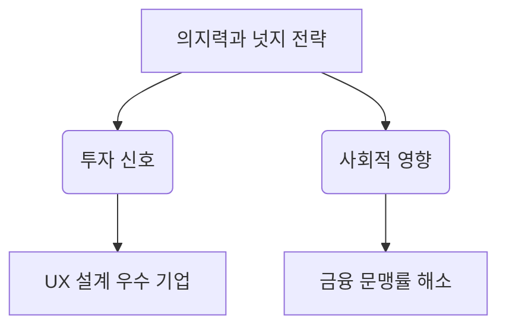

# 행동경제학: 의지력과 넛지(Nudge) 전략 분석
## 투자 신호 + 사회적 영향 평가

---

## 📌 기사 기본 정보

- **날짜**: 2026-01-16
- **출처**: 경제 심리학 포럼 (행동경제학 특집)
- **카테고리**: 경제 > 행동경제학 > 심리
- **핵심 주제**: 인간의 제한된 의지력 보완을 위한 '넛지(Nudge)' 설계와 경제적 의사결정

**메타데이터**
- 주요 이론: 리처드 탈러의 넛지(Nudge), 행동주의 경제학
- 핵심 변수: 선택 설계(Choice Architecture), 디폴트 옵션(Default Option)
- 영향 분야: 금융 상품 가입, 저축 습관, 정부 정책 수용도
- 주요 주체: 소비자(경제 주체), 정책 설계자, 금융 상품 개발자

---

## 🔍 기사를 통한 투자 신호 추출

### 1단계: 핵심 사건 분해

**What (무엇이 일어났는가?)**
- 인간의 의지력은 유한한 자원임을 인정하고, 부드러운 개입(넛지)을 통해 더 나은 경제적 선택을 유도하는 설계가 기업과 정부의 핵심 경쟁력으로 부상

**When (언제 일어났는가?)**
- 2026-01-16 (디지털 플랫폼의 알고리즘 기반 소비가 극에 달한 시점)

**Why (왜 일어났는가?)**
- 과잉 정보와 선택의 피로감이 소비자의 합리적 판단을 저해
- 기업은 고객 이탈을 막기 위해, 정부는 사회적 비용(복지 등)을 줄이기 위해 행동경제학 도입

**Who (누가 주도하는가?)**
- 빅테크 플랫폼 (사용자 경험 설계자)
- 금융 기관 (연금 및 자산 관리 상품 기획자)
- 공공 부문 (넛지 유닛, 정책 설계팀)

---

### 2단계: 투자 신호 해석

#### A. **긍정적 신호 (Bullish)**

**① 플랫폼 기업의 '락인(Lock-in)' 효과 강화**
- **신호**: 구독 경제와 자동 결제 시스템에 넛지 설계 도입
- **의미**: 소비자가 인지하지 못하는 사이 서비스를 지속 이용하게 만드는 설계 능력
- **투자 기회**: UX/UI 설계 역량이 뛰어난 글로벌 빅테크 및 구독 기반 서비스 기업

**② 자산 관리형 핀테크의 부상**
- **신호**: 소비자의 '지출'보다 '저축'을 넛지하는 자동 투자 알고리즘 선호
- **의미**: 의지력 없이도 자산이 불어나는 구조를 제공하는 플랫폼의 점유율 확대
- **투자 기회**: 로보어드바이저, 자동 저축 솔루션 보유 기업

---

#### B. **위험 신호 (Bearish)**

**① 다크 넛지(Dark Nudge)에 대한 규제 강화**
- **신호**: 소비자를 기만하는 해지 방해, 자동 결제 유도 등에 대한 사회적 반감 증대
- **의미**: '넛지'가 '조작'으로 인식될 경우 강력한 법적 규제와 기업 평판 하락 리스크
- **투자 리스크**: 부도덕한 가입 유도 방식을 사용하는 플랫폼 기업의 규제 비용 발생

**② 소비자 주권 의식의 각성**
- **신호**: 알고리즘에 의한 선택 설계에 대한 거부감 및 '디지털 미니멀리즘' 부상
- **의미**: 설계된 의지력 보완보다 '자체적 통제'를 원하는 소비층의 이탈

---

### 3단계: 섹터별 투자 기회 매트릭스

#### ✅ **높은 기대도 + 낮은 리스크**

**금융 보안 및 투명한 고지 플랫폼**
- 넛지의 긍정적 측면을 활용하면서도 소비자 보호를 강화하는 솔루션
- **투자 추천도**: ⭐⭐⭐⭐

---

## 💰 구체적 투자 신호 변환

### 신호 1: 디폴트 옵션(Default Option)의 위력

**투자 해석**: 기부가입이나 자동 연장 등 '기본 설정'이 기업 매출에 미치는 영향이 지대함. 투명한 디폴트 옵션을 제공하면서도 고객 이익을 높이는 기업이 진정한 승자가 됨.

---

## 🌍 사회적 영향 평가

### A. 긍정적 사회 영향
- **저축률 상승**: 의지력이 약한 서민층도 넛지를 통해 안정적인 노후 자금 확보 가능
- **사회적 비용 절감**: 장기 기증 유도, 절전 장화 등 공익적 정책의 자발적 참여 확대

### B. 부정적 사회 영향
- **자유 의지의 훼손**: 설계자가 의도한 방향으로만 군중이 움직이는 '소프트 독재' 리스크

---

## 📊 투자 의사결정 매트릭스

- **시나리오 1**: 긍정적 넛지 대중화 → ESG 금융 기업 성장 (확률 60%)
- **시나리오 2**: 다크 넛지 규제 폭풍 → 플랫폼 기업 조정 (확률 40%)

---

## 🎯 결론: 당신의 투자 전략 수립

- **즉시 실행**: 투자 중인 앱이나 플랫폼의 탈퇴 및 가입 절차가 투명한지 확인 (규제 리스크 체크)
- **3개월 후**: 행동경제학을 마케팅에 적용하여 매출 효율을 올리는 '착한 테크' 주식 선별

---

## 📝 Obsidian 연결 구조

