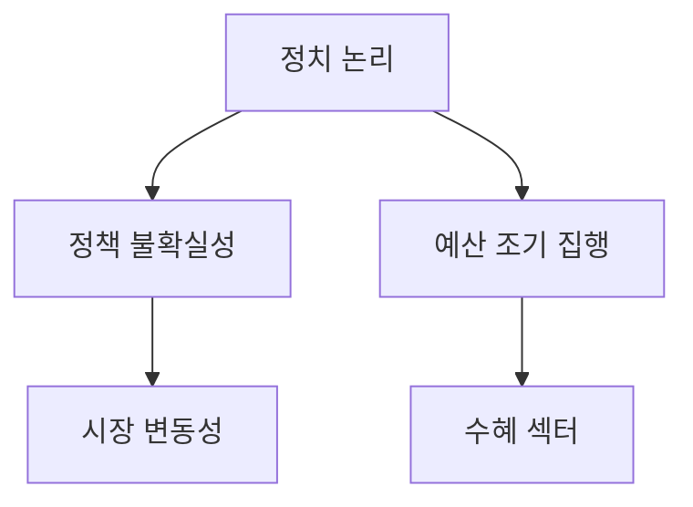

# 정치와 경제의 상관관계: 정책 불확실성과 시장의 향방
## 투자 신호 + 사회적 영향 평가

---

## 📌 기사 기본 정보

- **날짜**: 2026-01-16
- **출처**: 정책 경제 분석실 (Election & Market Special)
- **카테고리**: 경제 > 정책 > 정치경제
- **핵심 주제**: 선거 정기 주기와 경제 정책의 상관관계 및 시장에 미치는 불확실성 리스크

**메타데이터**
- 주요 변수: 지방선거(2026년 6월), 대통령 지지율, 금리 가이드라인
- 핵심 주체: 정부, 여야 정당, 중앙은행, 주요 이해관계자(재계)
- 영향 분야: 인프라 투자, 세제 개편, 규제 완화/강화 영역
- 키워드: 폴리코노미(Policonomy), 포퓰리즘 리스크, 정책 일관성

---

## 🔍 기사를 통한 투자 신호 추출

### 1단계: 핵심 사건 분해

**What (무엇이 일어났는가?)**
- 선거를 앞두고 대규모 지역 개발 공약과 선심성 세제 혜택이 쏟아지며 경제 논리가 정치 논리에 종속되는 '폴리코노미' 현상 심화

**When (언제 일어났는가?)**
- 2026-01-16 (6월 지방선거를 5개월 앞둔 시점)

**Why (왜 일어났는가?)**
- 표심 확보를 위한 단기 부양책 필요성 증대
- 정권 중반기 동력 확보를 위한 성과 과시형 정책 발표

**Who (누가 주도하는가?)**
- 여야 정치권 (공약 경쟁)
- 기재부 등 정부 부처 (재정 집행 가속화)

---

### 2단계: 투자 신호 해석

#### A. **긍정적 신호 (Bullish)**

**① 지역 개발 및 건설 인프라 수혜**
- **신호**: 새만금, 가덕도 등 대규모 국책 사업 추진 속도업
- **의미**: 선거 전 가시적 성과를 위해 예산 조기 집행 및 규제 완화
- **투자 기회**: 토목/건설 관련사, 지역 기반 시설 업체

**② 특정 업종 세제 혜택 및 지원**
- **신호**: 반도체/AI 등 전략 산업에 대한 추가 보조금 논의
- **의미**: 국가 경쟁력 강화라는 명분 하에 정치적 전폭 지원
- **투자 기회**: 전략 산업 내 중소 협력사 (낙수효과)

---

#### B. **위험 신호 (Bearish)**

**① 재정 건전성 악화 및 국채 금리 상승**
- **신호**: 과도한 재정 지출 공약 남발
- **의미**: 국채 발행 증가에 따른 금리 상방 압력 및 민간 투자 위축
- **투자 리스크**: 금리에 민감한 성장주 및 고부채 기업

**② 선거 후 '정책 뒤집기' 리스크**
- **신호**: 여야 간 극한 대립으로 인한 법안 처리 지연
- **의미**: 선거 결과에 따라 기존 추진되던 사업의 전면 재검토 가능성
- **투자 리스크**: 정치적 배경이 강한 테마주 및 정부 수주 의존 기업

---

### 3단계: 섹터별 투자 기회 매트릭스

#### ✅ **높은 기대도 + 낮은 리스크**

**에너지 안보 및 원전 섹터**
- 여야 간 이견이 적은 국가 생존 전략 차원의 산업
- **투자 추천도**: ⭐⭐⭐⭐

---

## 💰 구체적 투자 신호 변환

### 신호 1: 정책의 '지속가능성' 체크

**투자 해석**: 기사에서 언급된 "이번엔 진짜"라는 수사는 정치적 문구일 가능성이 높음. 실제 예산안 반영 여부와 국회 통과 가능성을 필터링하여 실질 수혜주를 가려내야 함.

---

## 🌍 사회적 영향 평가

### A. 긍정적 사회 영향
- **일시적 경기 부양**: 낙후 지역에 인프라가 깔리며 지역민의 삶의 질 일시적 개선

### B. 부정적 사회 영향
- **사회적 불신 누적**: 잦은 계획 변경으로 인한 정책 신뢰 붕괴 및 사회적 갈등 심화
- **미래 세대의 짐**: 선심성 예산으로 인한 국가 부채 누적

---

## 🎯 결론: 당신의 투자 전략 수립

- **즉시 실행**: 선거 테마주와 실질 수혜주 엄격히 구분하여 포트폴리오 정비
- **3개월 후**: 선거 공약 중 법적·예산적 근거가 마련된 핵심 사업 위주로 집중 투자

---

## 📝 Obsidian 연결 구조

