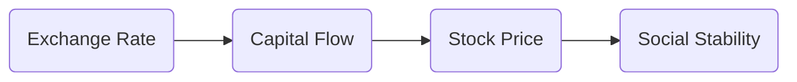

# 주식시장과 외환시장의 상관관계 연계 분석
## 투자 신호 + 사회적 영향 평가

---

## 📌 기사 기본 정보

- **날짜**: 2026-01-16
- **출처**: 글로벌 금융 동향 분석실
- **카테고리**: 경제 > 금융 > 자본시장
- **핵심 주제**: 주가 변동과 환율의 상호작용 및 외국인 투자자의 자금 흐름 패턴

**메타데이터**
- 핵심 변수: 원/달러 환율, 코스피(KOSPI) 실적, 외국인 순매수/순매도
- 주요 주체: 연준(Fed), 한국은행, 외국인 기관 투자자, 서학개미
- 영향 분야: 증시 유동성, 수출 기업 채산성, 국가 신용도
- 상호 관계성: 환율 상승(원화 약세) → 수출 경쟁력 제고 vs 외국인 자금 이탈 우려

---

## 🔍 기사를 통한 투자 신호 추출

### 1단계: 핵심 사건 분해

**What (무엇이 일어났는가?)**
- 환율의 변동폭이 커지면서 주식 시장의 외국인 수급이 환율 흐름에 극도로 민감하게 반응하는 '환율-증시 커플링' 심화

**When (언제 일어났는가?)**
- 2026-01-16 (미국 금리 정책 불확실성과 중동 분쟁이 겹친 시기)

**Why (왜 일어났는가?)**
- 외국인 입장에서는 '주가 수익'만큼이나 '환차익'이 중요하기 때문
- 한국 시장은 대외 의존도가 높아 글로벌 리스크 발생 시 '현금 인출기' 역할을 수행하는 구조적 한계

**Who (누가 주도하는가?)**
- 환 투기 세력 및 글로벌 헤지펀드
- 국내 수출 대기업 (삼성전자, 자동차 등)
- 통화 정책 당국

---

### 2단계: 투자 신호 해석

#### A. **긍정적 신호 (Bullish)**

**① 환율 안정 기반의 외국인 귀환**
- **신호**: 환율이 고점에서 횡보하거나 완만한 하향 곡선 진입
- **의미**: 외국인의 환차손 우려 해소 및 저가 매수세 유입 가능성
- **투자 기회**: 환율 안정기 매수세가 쏠리는 대형 우량주 (반도체, 자동차)

**② 환율 상승 수혜 수출 섹터의 어닝 서프라이즈**
- **신호**: 고환율 상태 지속
- **의미**: 달러 환산 매출 증가로 인한 영업이익 극대화
- **투자 기회**: 해외 매출 비중이 높은 자동차, 조선, 변압기 섹터

---

#### B. **위험 신호 (Bearish)**

**① '환율 1400원선 터치'에 따른 패닉 셀링**
- **신호**: 원/달러 환율의 급격한 돌파
- **의미**: 한국 경제의 펀더멘털 의구심 증폭 및 자본 도피(Capital Flight) 시작
- **투자 리스크**: 내수 소비주, 에너지 수입 비중이 높은 유틸리티 기업 (한전 등)

**② '역샌드위치' 환율 위기**
- **신호**: 엔저(엔화 약세)와 원화 강세가 동시에 일어날 경우
- **의미**: 일본 기업과의 수출 경합도에서 한국 기업의 가격 경쟁력 상실

---

### 3단계: 섹터별 투자 기회 매트릭스

#### ✅ **높은 기대도 + 낮은 리스크**

**해외 생산 거점 확보 수출 대기업**
- 환율 변동에 유연하게 대응 가능하며 환리스크 헤지 능력이 뛰어남
- **투자 추천도**: ⭐⭐⭐⭐⭐

---

## 💰 구체적 투자 신호 변환

### 신호 1: 외국인 수급의 골든 크로스(Golden Cross)

**투자 해석**: 환율이 하락하면서 외국인이 코스피 대형주를 순매수하기 시작하는 시점이 시장의 강력한 반등 신호임. 이때가 포트폴리오 비중 확대의 적기.

---

## 🌍 사회적 영향 평가

### A. 긍정적 사회 영향
- **자본시장 건전성**: 환율 안정을 통한 외국인 투자 정착은 한국 증시의 '코리아 디스카운트' 해소의 초석

### B. 부정적 사회 영향
- **부의 양극화**: 고환율로 인한 수입 물가 폭등은 서민 경제의 고통(식료품, 에너지비 상승)으로 직결되어 사회적 불안 야기

---

## 🎯 결론: 당신의 투자 전략 수립

- **즉시 실행**: 환율 흐름과 외국인 수급의 일별 상관관계 차트 모니터링 (반대로 움직이는가?)
- **3개월 후**: 환율 고착화 여부에 따른 수출 vs 내수 비중 리밸런싱

---

## 📝 Obsidian 연결 구조

