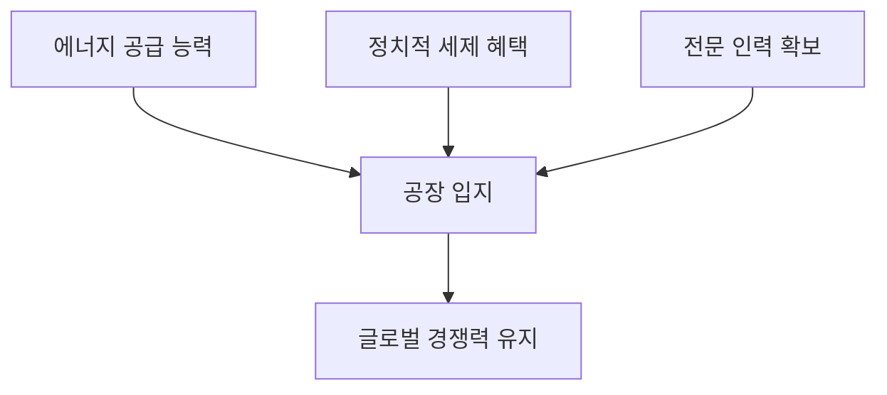

# 반도체 클러스터 입지 전이: 용인-평택 vs 새만금-전남 분석
## 투자 신호 + 사회적 영향 평가

---

## 📌 기사 기본 정보

- **날짜**: 2026-01-19
- **출처**: IT 산업 경제 정론
- **카테고리**: 산업 > 반도체 > 국토균형발전
- **핵심 주제**: 반도체 클러스터의 수도권(용인) 집중 문제와 비수도권(새만금/전남) 이전론의 실효성 쟁점

**메타데이터**
- 핵심 변수: RE100 이행 능력, 전력 계통망 확보, 전문 인력 정주 여건
- 주요 주체: 삼성전자, SK하이닉스, 지방자치단체(전남, 전북), 산자부
- 영향 지역: 경기도 용인/평택 vs 새만금/전남(광주/나주)
- 핵심 키워드: 에너지 분권, 인재 블랙홀, 분산에너지 활성화 특별법

---

## 🔍 기사를 통한 투자 신호 추출

### 1단계: 핵심 사건 분해

**What (무엇이 일어났는가?)**
- 전력 소모가 극심한 반도체 공장의 전력 부족 해결을 위해, 재생에너지가 풍부한 호남권(새만금/전남)으로의 이전론이 정책 화두로 부상

**When (언제 일어났는가?)**
- 2026-01-19 (수도권 전력망 포화 문제가 가시화된 시점)

**Why (왜 일어났는가?)**
- 용인 반도체 클러스터 완공 시 원전 수십 기 분량의 전력을 끌어와야 하는 현실적 한계
- 글로벌 고객사들의 RE100(재생에너지 100%) 요구 강화

**Who (누가 주도하는가?)**
- 탈수도권 정책을 추진하는 정부 부처
- 에너지 자립도를 높이려는 비수도권 지자체 전문 위원회

---

### 2단계: 투자 신호 해석

#### A. **긍정적 신호 (Bullish)**

**① 에너지 분권 및 호남권 인프라 가치 재발견**
- **신호**: 전력 계통망 우위에 기반한 공장 입지 선정 기준 강화
- **의미**: 전기를 많이 생산하는 지역(전남/전북)이 전기를 많이 쓰는 산업을 흡수하는 구조적 변화
- **투자 기회**: 호남권 산업단지 인프라 건설사, 스마트 그리드 전력망 구축 업체

**② 재생에너지 공급망의 전략적 자산화**
- **신호**: 반도체 산업이 RE100 이행을 위해 태양광·풍력 단지와 인접하려는 경향
- **의미**: 재생에너지 확보가 기업의 생존권과 직결
- **투자 기회**: 대규모 재생에너지 단지 구축 및 운영사

---

#### B. **위험 신호 (Bearish)**

**① 인재 확보의 불확실성 (가장 큰 아킬레스건)**
- **신호**: 반도체 석·박사급 인력의 수도권 선호 현상 고착
- **의미**: 공장은 지어도 일할 사람이 내려오지 않는 '유령 클러스터' 위험
- **투자 리스크**: 비수도권 이전을 전제로 투자한 기업의 생산성 저하 가능성

**② 물류 및 협력사 생태계 단절**
- **신호**: 소부장(소재·부품·장비) 업체들이 용인 인근에 집대성되어 있는 현실
- **의미**: 나홀로 이전 시 발생하는 물류비용 및 협업 효율 저하
- **투자 리스크**: 공급망 수직계열화가 중요한 반도체 산업의 구조적 비효율 발생

---

### 3단계: 섹터별 투자 기회 매트릭스

#### ✅ **높은 기대도 + 낮은 리스크**

**송전망 구축 및 전력 하드웨어**
- 입지가 용인이든 전남이든, 대규모 전력 인프라 확충은 필수적임
- **투자 추천도**: ⭐⭐⭐⭐⭐

---

## 💰 구체적 투자 신호 변환

### 신호 1: '전기 밥그릇'이 입지를 정한다

**투자 해석**: 과거에는 교통이 입지를 결정했다면, 앞으로는 '안정적인 무탄소 에너지(CFE)' 공급지가 입지를 결정함. 전력 사정이 좋은 지역의 신규 산업단지 수혜주를 선점해야 함.

---

## 🌍 사회적 영향 평가

### A. 긍정적 사회 영향
- **국토 균형 발전**: 수도권 집중 완화 및 지역 일자리 창출로 인한 지방 소멸 방지
- **에너지 효율화**: 전기를 생산지 인근에서 소비함으로써 송전 손실 및 사회적 갈등(송전탑 건설 등) 완화

### B. 부정적 사회 영향
- **인프라 불균형 심화**: 정주 여건(교육, 병원) 미비 상태에서의 강제 이전은 인력 유출 및 가족 해체 우려

---

## 🎯 결론: 당신의 투자 전략 수립

- **즉시 실행**: '분산에너지 활성화 특별법' 통과 여부 및 지역별 차등 전기요금제 도입 논의 모니터링
- **3개월 후**: 반도체 기업들의 실제 지방 투자 MOU 체결 여부를 신호로 지역 인프라 기업 비중 조절

---

## 📝 Obsidian 연결 구조

