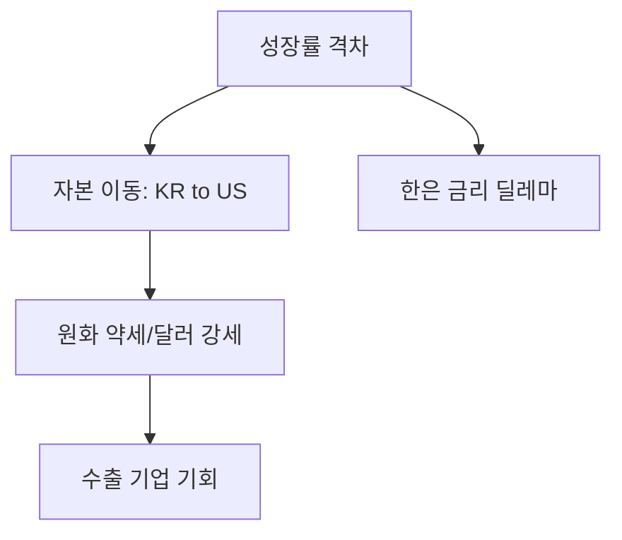

# 글로벌 거시경제 분석: 한미 성장률 역전 현상과 시사점
## 투자 신호 + 사회적 영향 평가

---

## 📌 기사 기본 정보

- **날짜**: 2026-01-20
- **출처**: 글로벌 매크로 인사이트 보고서
- **카테고리**: 경제 > 거시경제 > 글로벌금융
- **핵심 주제**: 미국과 한국의 경제 성장률 역전 현상 및 이에 따른 통화 정책 차별화(Divergence) 리스크 분석

**메타데이터**
- 핵심 지표: 실질 GDP 성장률, 잠재 성장률, 기준 금리차
- 주요 주체: 美 연준(Fed), 한국은행, 글로벌 IB(Investment Bank)
- 영향 분야: 원/달러 환율, 채권 금리, 외국인 자본 유출입
- 키워드: 경제 펀더멘털, 소비 복원력, 산업 구조 고도화 격차

---

## 🔍 기사를 통한 투자 신호 추출

### 1단계: 핵심 사건 분해

**What (무엇이 일어났는가?)**
- 거대 경제국인 미국의 성장률이 한국을 앞지르는 '성장률 역전'이 고착화되며, 한국 경제의 저성장 기조(New Normal) 우려 심화

**When (언제 일어났는가?)**
- 2026-01-20 (연초 거시경제 전망이 수정되는 시점)

**Why (왜 일어났는가?)**
- 미국: 강력한 고용 시장, 인공지능(AI) 혁명 주도, 공격적인 재정 지출로 인한 내수 활황
- 한국: 고금리·고물가에 따른 내수 위축, 인구 고령화로 인한 잠재 성장률 하락, 중국 경기 둔화의 직격탄

**Who (누가 주도하는가?)**
- 미국의 혁신 테크 기업 (성장 견인)
- 글로벌 자산 배분 펀드 매니저 (역전에 따른 자금 이동 주도)

---

### 2단계: 투자 신호 해석

#### A. **긍정적 신호 (Bullish)**

**① 미국 주식 및 달러 자산의 프리미엄 강화**
- **신호**: 한미 성장률 격차 확대
- **의미**: 돈은 성장이 있는 곳으로 흐름. 미국 시장의 매력도 압도적 우위 유지
- **투자 기회**: 미국 S&P500/나스닥 인덱스, 미국 성장주, 달러 기반 자산(TIPS 등)

**② 국내 수출 우량주의 실적 개선**
- **신호**: 미국 경기가 독보적으로 좋다는 의미
- **의미**: 미국 소비자들의 구매력이 여전하여 한국의 대미 수출(반도체, 자동차) 기회 지속
- **투자 기회**: 대미 수출 비중이 절대적인 국내 우량 제조업체

---

#### B. **위험 신호 (Bearish)**

**① 원화 가치의 장기적 하방 압력**
- **신호**: 국가 간 기초 체력(성장률) 차이
- **의미**: 저성장 국가인 한국 통화에 대한 투자 매력 감소 → 고환율 상태 고착화
- **투자 리스크**: 원화 표시 자산(국내 주식, 채권)의 실질 수익률 하락

**② 한은의 금리 인하 제약**
- **신호**: 미국은 고성장으로 금리를 높게 유지(Higher for Longer)
- **의미**: 한미 금리 역전폭을 줄이기 위해 한국은행이 경기 부양을 위한 금리 인하를 단행하기 어려운 딜레마
- **투자 리스크**: 가계 부채 부담이 높은 내수주 및 중소형 건설주

---

### 3단계: 섹터별 투자 기회 매트릭스

#### ✅ **높은 기대도 + 낮은 리스크**

**글로벌 자산 배분 포트폴리오**
- 한국 경제의 저성장 리스크를 헤지하기 위해 자산의 일정 비율을 반드시 달러/성장 자산으로 배분
- **투자 추천도**: ⭐⭐⭐⭐⭐ (필수 생존 전략)

---

## 💰 구체적 투자 신호 변환

### 신호 1: '체급 역전'은 패러다임의 변화

**투자 해석**: 기사에서 언급된 성장률 역전은 일시적 현상이 아님. 한국의 잠재 성장률이 1%대로 추락하는 가운데 나타난 구조적 현상이므로, '한국 증시 올인' 전략은 매우 위험함.

---

## 🌍 사회적 영향 평가

### A. 긍정적 사회 영향
- **기업 체질 개선 촉구**: 성장의 한계를 느낀 국내 기업들이 글로벌 시장으로 눈을 돌리며 해외 시장 점령 기회로 작용

### B. 부정적 사회 영향
- **자본 유출 및 공동화**: 유능한 인재와 자본이 미국 등 고성장 국가로 떠나는 '두뇌 및 자본 유출' 현상 심화
- **상대적 박탈감**: 미국 경제의 호황 소식과 대비되는 국내 내수 경기의 혹한기로 인한 사회적 활력 저하

---

## 🎯 결론: 당신의 투자 전략 수립

- **즉시 실행**: 전체 자산 중 미국 주식/달러 자산의 비중을 50% 이상으로 점진적 상향 조정
- **3개월 후**: 한미 금리차 추이에 따른 채권 포트폴리오 듀레이션(Duration) 재설계

---

## 📝 Obsidian 연결 구조

