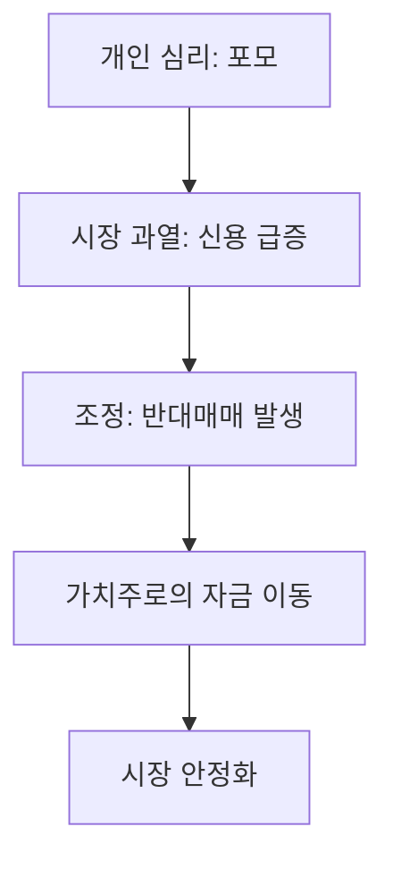

# 자본시장 금융·주식 투자 심리와 시장 동향 분석
## 투자 신호 + 사회적 영향 평가

---

## 📌 기사 기본 정보

- **날짜**: 2026-01-20
- **출처**: 자본시장 동향 리포트
- **카테고리**: 경제 > 금융 > 증시
- **핵심 주제**: 개인 투자자의 '포모(FOMO)' 현상과 시장의 극심한 변동성 속 주식 투자 전략

**메타데이터**
- 핵심 변수: 고객 예탁금 규모, 신용거래 융자 잔고, 변동성 지수(VIX)
- 주요 주체: 서학개미(해외 개인 투자자), 국내 동학개미, 금융 당국
- 영향 분야: 코스피/코스닥 유동성, 리테일 기반 증권사 실적
- 키워드: 포모(FOMO) 증후군, 쏠림 현상, 신용 리스크, 시장 조정 가능성

---

## 🔍 기사를 통한 투자 신호 추출

### 1단계: 핵심 사건 분해

**What (무엇이 일어났는가?)**
- 특정 섹터(AI, 2차전지 등)로의 과도한 자금 쏠림과 '나만 뒤처질 수 없다'는 개인 투자자들의 심리(FOMO)가 폭발하며 시장의 비이성적 과열 양상 노출

**When (언제 일어났는가?)**
- 2026-01-20 (일부 테마주의 급등락이 반복되는 혼돈의 장세)

**Why (왜 일어났는가?)**
- 낮은 금리에서 벗어난 고금리 시기, 자산 증식의 절박함 증대
- SNS 및 유튜브를 통한 정보의 실시간 확산과 확증 편향 강화

**Who (누가 주도하는가?)**
- 커뮤니티 기반의 개인 투자자 군단
- 레버리지를 활용한 초단타 매매 세력

---

### 2단계: 투자 신호 해석

#### A. **긍정적 신호 (Bullish)**

**① 풍부한 증시 대기 자금**
- **신호**: 높은 예탁금 수준 유지
- **의미**: 조정 시 언제든 들어올 수 있는 '저가 매수' 대기력이 강함
- **투자 기회**: 거래 대금 증가에 따른 수수료 수익 증대가 예상되는 대형 증권주

**② 혁신 미래 테마의 확장성**
- **신호**: AI 등 실질적 기술 변화에 대한 시장의 강력한 믿음
- **의미**: 테마를 넘어선 산업의 구조적 성장에 대한 신호
- **투자 기회**: 실질적 기술력과 실적이 뒷받침되는 AI 인프라 및 소프트웨어 핵심주

---

#### B. **위험 신호 (Bearish)**

**① '신용 만기'에 따른 투매 리스크**
- **신호**: 과도한 신용거래 융자 잔고
- **의미**: 주가가 일정 수준 하락할 경우 반대매매가 쏟아지며 하락을 가속화하는 '마진 콜' 연쇄 반응 우려
- **투자 리스크**: 부채 비율이 높고 개인 비중이 큰 급등 테마주

**② 시장의 인내심 한계 (FOMO의 끝)**
- **신호**: 실적 발표 시즌, 기대치에 못 미치는 성과 확인
- **의미**: 꿈(Hope)으로 상승하던 주가가 현실(Reality)을 만나며 급격한 밸류에이션 리택싱(Retaxing) 발생

---

### 3단계: 섹터별 투자 기회 매트릭스

#### ✅ **높은 기대도 + 낮은 리스크**

**안정적 배당 및 수익성이 검증된 저PBR 가치주**
- 쏠림세가 진정될 때 자금이 유입될 수 있는 안전판 역할
- **투자 추천도**: ⭐⭐⭐⭐

---

## 💰 구체적 투자 신호 변환

### 신호 1: 대중과 반대로 가라 (역발상 투자)

**투자 해석**: 기사에서 '포모'가 언급될 때는 이미 파티가 끝물일 확률이 높음. 모두가 환호하며 레버리지를 일으킬 때 개인 투자자는 '익절' 후 현금 비중을 높이는 용기가 필요함.

---

## 🌍 사회적 영향 평가

### A. 긍정적 사회 영향
- **금융 문맹 탈출**: 전 국민적 관심 증대로 금융 지식 상향 평준화 기반 마련

### B. 부정적 사회 영향
- **영끌/빚투의 사회적 부작용**: 자산 손실로 인한 가계 경제 파탄 및 사회 전반의 근욕 의욕 저하
- **상대적 빈곤감 심화**: 성공 사례만 부각되어 정상적 저축을 하는 이들의 박탈감 유발

---

## 🎯 결론: 당신의 투자 전략 수립

- **즉시 실행**: 본인 계좌의 신용/미수 사용 여부 재점검 및 과도한 쏠림주 분할 매도
- **3개월 후**: 시장의 과열이 진정된 후 실적 기반 우량주로 포트폴리오 재편

---

## 📝 Obsidian 연결 구조

