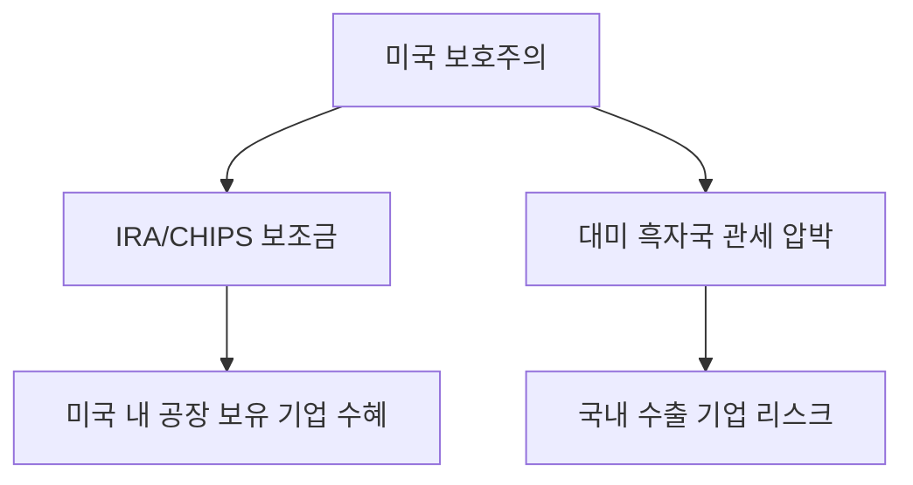

# 글로벌 무역 분석: 미국의 '함포 자본주의'와 무역 보호주의
## 투자 신호 + 사회적 영향 평가

---

## 📌 기사 기본 정보

- **날짜**: 2026-01-20
- **출처**: 국제통상 전략 리포트
- **카테고리**: 경제 > 무역 > 글로벌지정학
- **핵심 주제**: 미국의 자국 중심주의 무역 정책과 공급망 무기화(Gunboat Capitalism)에 따른 한국 무역 구조의 위기

**메타데이터**
- 주요 주체: 미국 상무부(DOC), USTR(미국무역대표부), 한국 산업통상자원부
- 핵심 변수: IRA(인플레이션 감축법), 반도체 지원법(CHIPS Act), 대미 무역 흑자 규모
- 영향 분야: 국내 주력 수출 품목(자동차, 반도체, 철강), 한미 FTA 환경
- 키워드: 신중상주의, 함포 자본주의, 공급망 리스크, 가치 동맹

---

## 🔍 기사를 통한 투자 신호 추출

### 1단계: 핵심 사건 분해

**What (무엇이 일어났는가?)**
- 미국이 자국의 국방 및 경제 안보를 명분으로 과거 제국주의 시절의 '함포 외교'와 유사한 초강력 무역 압박(함포 자본주의)을 전방위적으로 행사

**When (언제 일어났는가?)**
- 2026-01-20 (글로벌 공급망이 '가치 기반'으로 완전히 쪼개지는 시점)

**Why (왜 일어났는가?)**
- 중국의 추격을 완전히 따돌리고 자국 내에 첨단 제조 시설을 강제로 유치하려는 전략
- 달러 패권 유지를 위한 경제적 무력 과시

**Who (누가 주도하는가?)**
- 미국의 초당적 보호무역 강경파
- 미국 내 공장을 지으라고 압박받는 한국/일본/유럽의 글로벌 기업들

---

### 2단계: 투자 신호 해석

#### A. **긍정적 신호 (Bullish)**

**① 미국 내 현지 공장을 보유한 수혜주**
- **신호**: 미국 정부의 보조금 및 세제 혜택 집중
- **의미**: 미국의 울타리 안으로 들어간 기업은 '미국산' 대우를 받으며 시장 점유율 확대 가능
- **투자 기회**: 이미 미국 내 조지아/텍사스 등에 대규모 기지를 완공한 한국의 전기차, 배터리, 반도체 기업

**② 미국의 방위 산업/전략 기술 동맹군**
- **신호**: 한미 방산 협력 및 기술 공유 강화
- **의미**: 안보와 경제의 결합으로 한국 방산 기업의 글로벌 공급망 진입 가속
- **투자 기회**: K-방산 선도 기업

---

#### B. **위험 신호 (Bearish)**

**① '대미 무역 흑자'에 대한 보복 리스크**
- **신호**: 한국의 대미 수출 규모가 사상 최대치를 경신하며 미국 무역 적자의 주요 원인으로 지목
- **의미**: 환율 조작국 지정 압박이나 추가 관세, 쿼터 제한 등의 보복 조치 가능성 상존
- **투자 리스크**: 대미 수출 의존도가 50%를 넘어서는 자동차 및 부품 중소업체

**② '미국 내 투자' 강요에 따른 자본 유출**
- **신호**: 국내 설비 투자 대신 미국 행 결정 증가
- **의미**: 국내 공장 공동화(Hollowing Out) 및 국내 고용 시장 위축
- **투자 리스크**: 국내 내수 기반의 기계/설비 하청 업체

---

### 3단계: 섹터별 투자 기회 매트릭스

#### ✅ **높은 기대도 + 낮은 리스크**

**미국 중심 공급망(Supply Chain) 재배치 관련주**
- 미국 본토에 직접 진출하여 세제 혜택을 온전히 누리는 기업
- **투자 추천도**: ⭐⭐⭐⭐⭐

---

## 💰 구체적 투자 신호 변환

### 신호 1: '안보'가 '수익'을 이긴다

**투자 해석**: 기사에서 언급된 '함포 자본주의'는 더 이상 경제 논리가 아닌 힘의 논리로 시장이 움직임을 뜻함. 단순히 원가 경쟁력이 높은 기업보다 '정치적 안전성'을 확보한 기업에 자원을 집중해야 함.

---

## 🌍 사회적 영향 평가

### A. 긍정적 사회 영향
- **한미 경제 동맹 강화**: 혈맹에서 '경제적 생존 동맹'으로 격상되어 강력한 안보 방벽 형성

### B. 부정적 사회 영향
- **국내 일자리 상실**: 대기업들의 생산 기지 미국 이전으로 인한 국내 청년 일자리 부족 및 지역 경제 위축
- **물가 상승**: 효율적인 중국산 대신 비싼 미국산 부품을 써야 하는 구조로 인한 장기적인 제품 가격 상승

---

## 🎯 결론: 당신의 투자 전략 수립

- **즉시 실행**: 투자 기업 중 '미국 법인 실적'과 '보조금 수령 가능성'이 명확한 종목으로 포트폴리오 압축
- **3개월 후**: 미국의 추가 무역 장벽 발표(관세 등) 추이에 따라 대미 수출 비중 과다 종목 비중 축소

---

## 📝 Obsidian 연결 구조

