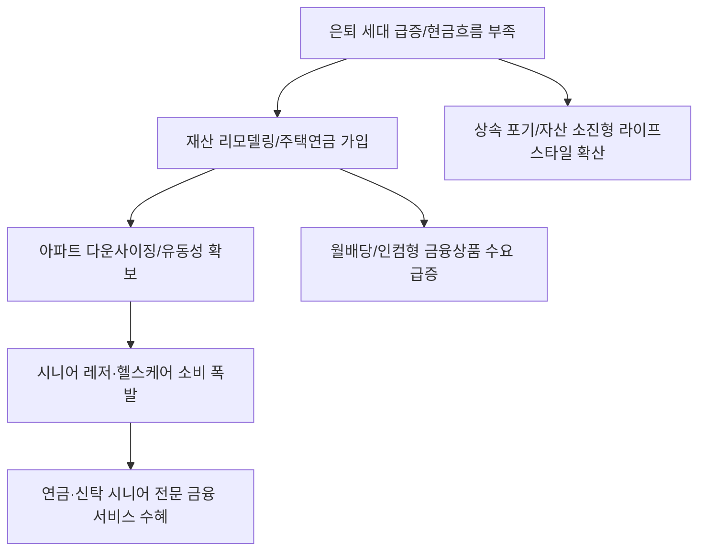

# 재테크/은퇴 분석: 은퇴 후 현금흐름과 주택연금 활용 재산 리모델링 전략
## 투자 신호 + 사회적 영향 평가

---

## 📌 기사 기본 정보

- **날짜**: 2026-02-27
- **출처**: 대한민국 실버 경제 및 노후 자산 관리 전략 리포트
- **카테고리**: 경제 > 재테크 > 은퇴설계
- **핵심 주제**: 초고령 사회 진입에 따른 은퇴 후 안정적 현금흐름 확보 전략 분석, 특히 아파트 재건축/재입주 시점의 자산 가치 변화와 주택연금을 결합한 '재산 리모델링'을 통해 삶의 질을 유지하는 구체적 방법론 제시

**메타데이터**
- 주요 이슈: 자산은 크지만 현금이 부족한 '에셋 리치, 캐시 푸어(Asset Rich, Cash Poor)' 고령층 급증
- 핵심 전략: 주택연금 가입 시점 최적화 + 아파트 평수 줄이기(Downsizing) + 배당 자산 결합
- 주요 주체: 6070 은퇴 세대, 주택금융공사, 자산관리 전문가
- 키워드: 주택연금, 현금흐름, 재산 리모델링, 은퇴 설계, 자산 유동화

---

## 🔍 기사를 통한 투자 신호 추출

### 1단계: 핵심 사건 분해

**What (무엇이 일어났는가?)**
- 은퇴자들이 부동산(아파트)에 묶인 자산을 유동화하여 매달 생활비를 받는 현금흐름으로 전환하려는 니즈가 폭발함. 특히 재건축 아파트 보유자가 재입주 대신 주택연금을 수령하거나, 작은 평수로 옮기며 남은 차액을 연금형 자산에 투자하는 '전략적 이동'이 은퇴 설계의 정석으로 부상함.

**When (언제 일어났는가?)**
- 2026-02-27 (베이비부머 세대의 은퇴가 정점에 달하고, 부동산 가격 정체로 인해 시세 차익보다 '연금 수익'의 가치가 더 높게 평가받는 시점)

**Why (왜 이 중요한가?)**
- 국민연금만으로는 품위 있는 노후가 불가능하다는 인식이 확산되었기 때문
- 자녀에게 상속하기보다 '내가 쓰고 죽자'는 실용주의적 노후 관념이 정착되었기 때문
- 주택연금 대출 한도 및 가입 기준 완화 등 정책적 지원이 강화되었기 때문

**Who (누가 주도하는가?)**
- 노후 현금 흐름이 절실한 실버 세대
- 이들의 자산을 유동화해주고 관리해주는 신탁 및 자산운용사

---

### 2단계: 투자 신호 해석

#### A. **긍정적 신호 (Bullish)**

**① 실버 세대의 소비를 책임지는 '헬스케어 및 시니어 레저' 섹터**
- **신호**: 주택연금 등 자산 유동화로 가처분 소득이 늘어난 고령층의 구매력 상승
- **의미**: 돈이 있는 노인들이 건강과 여가에 아낌없이 투자함
- **투자 기회**: 프리미엄 실버타운 운영 사, 전문 의료기기 및 건강기능식품 대장주, 여행/상조 서비스

**② 월배당 및 꾸준한 현금 흐름을 제공하는 '인컴(Income)형 금융 상품'**
- **신호**: 부동산 매각 자금이나 연금 차액을 안정적 배당주로 옮기려는 수요 증가
- **의미**: 변동성보다 '확정된 수익'을 주는 자산이 최고의 대우를 받음
- **투자 기회**: 고배당 리츠(REITs), 월배당 커버드콜 ETF, 우량 회사채 펀드

---

#### B. **위험 신호 (Bearish)**

**③ 실버 세대의 이탈이 가속화되는 '대형 평수 노후 아파트' 시장**
- **신호**: 관리비 부담과 연금 가입을 위한 다운사이징 매물 적체
- **의미**: 은퇴자들이 떠나는 지역이나 평형의 자산 가치 하락 압력 가중
- **투자 리스크**: 편의시설이 부족한 외곽 지역의 대형 아파트, 재건축 속도가 느린 구축 주택

**④ '상속'에 의존하던 가족 경영 중소기업 및 자영업 섹터**
- **신호**: 증여 대신 '주택연금' 가입으로 자산이 소진되는 흐름 확대
- **의미**: 자녀 세대가 물려받을 자본이 줄어들어 창업이나 가업 승계 동력 약화
- **투자 리스크**: 자금력이 부족한 2세 경영 기반 기업, 고령층의 자산 소진으로 타격을 받는 상속 관련 법무/세무 서비스(일부)

---

### 3단계: 섹터별 투자 기회 매트릭스

#### ✅ **높은 기대도 + 낮은 리스크**

**금융 자산을 안전하게 연금화해주는 '보험 및 개인연금 전문 금융사'**
- 자산 리모델링 과정에서 발생하는 거액의 일시금을 연금으로 전환하거나 신탁 관리하는 서비스는 영구적인 수수료 비즈니스임
- **투자 추천도**: ⭐⭐⭐⭐⭐

---

## 💰 구체적 투자 신호 변환

### 신호 1: '집'을 '지갑'으로 바꾸는 거대한 머니무브에 올라타라

**투자 해석**: 기사는 부동산이 '소유와 투기'의 대상에서 '연금과 복지'의 수단으로 전이되고 있음을 시사함. 투자자는 지금 즉시 '실버 자본'이 흘러가는 길목을 선점해야 함. 주택연금 가입자가 늘어날수록 주택금융공사의 채권 발행은 늘어나며, 은퇴자들의 주머니에서 나오는 돈은 '의료'와 '자산관리'로 향함. 이 거대한 인구 구조적 파도에서는 자산의 가치를 지키는 기업보다, 자산의 '유동성'을 관리해주는 기업이 이길 것임.

---

## 🌍 사회적 영향 평가

### A. 긍정적 사회 영향
- **고령층 빈곤 문제 완화 및 내수 활성화**: 주택에 잠긴 자산을 깨워 실질 소비로 연결함으로써 노인 빈곤율을 낮추고 실버 경제 활성화에 기여
- **효율적인 주거 자원 배분 유도**: 대가족형 큰 집에서 1~2인 가구용 작은 집으로의 이동(다운사이징)을 촉진하여 부족한 도심 주택 공급 문제 해결에 간접적 보탬

### B. 부정적 사회 영향
- **부의 대물림 단절과 세대 간 자산 격차 심화**: 부모의 자산이 연금으로 소진됨에 따라 자녀 세대의 자산 형성 기반이 약화되고, 이는 수저 계급론과 연계된 새로운 사회적 갈등 유발
- **주택 시장의 유동성 경색 위험**: 주택연금 가입 주택이 늘어날수록 매매 시장에 나오는 물량이 줄어들어 주택 시장의 거래 활력이 저하될 수 있는 장기 리스크 상존

---

## 🎯 결론: 당신의 투자 전략 수립

- **즉시 실행**: 실버 비즈니스(헬스케어, 자산관리) 선도주 비중 확대, 자산 유동화 관련 금융 인프라 종목 편입
- **3개월 후**: 정부의 주택연금 가입 대상 확대 정책 및 은퇴 세대의 실제 자산 이동 통계 데이터 확인 후 포트폴리오 리밸런싱

---

## 📝 Obsidian 연결 구조

