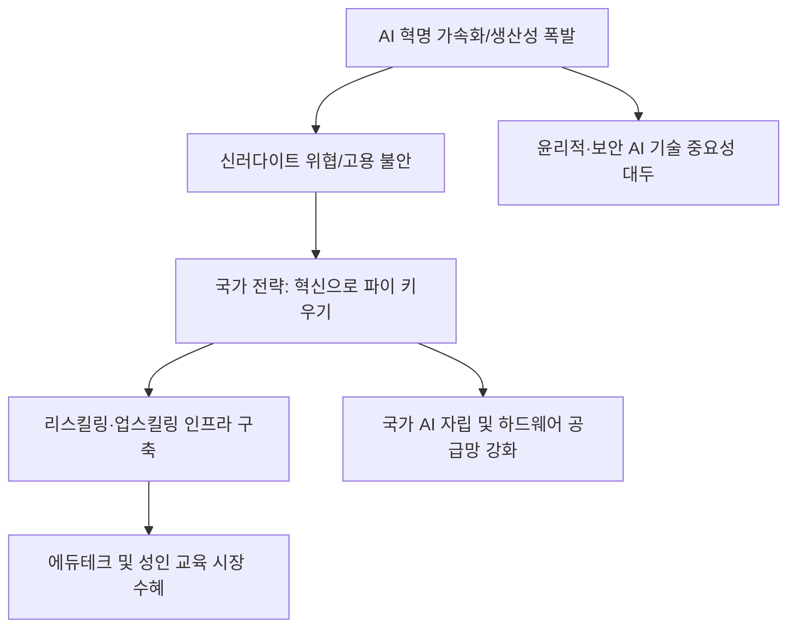

# 정책/기술 분석: AI 혁명과 '신러다이트' 위협을 넘는 국가 생존 전략
## 투자 신호 + 사회적 영향 평가

---

## 📌 기사 기본 정보

- **날짜**: 2026-02-27
- **출처**: 대한민국 AI 기술 정책 및 미래 일자리 전략 보고서
- **카테고리**: 경제 > 정책 > 인공지능/사회
- **핵심 주제**: 인공지능(AI)이 인간의 지능을 대체하며 발생하는 대규모 고용 불안과 이에 따른 '신러다이트(Neo-Luddite, 기술 파괴)' 운동의 확산 위협을 진단하고, 혁신을 통해 전체 파이를 키우고 시장의 역동성을 회복하여 AI와 인간이 상생하는 국가 차원의 연착륙 전략 분석

**메타데이터**
- 주요 이슈: AI 발 화이트칼라 해고 공포 및 사회적 반발 확산
- 핵심 전략: AI 리터러시 교육 강화 + 전직 지원 시스템 혁신 + 혁신 유도 규제 샌드박스 확대
- 주요 주체: 과학기술정보통신부, 고용노동부, 글로벌 AI 빅테크, 전문직 노조
- 키워드: AI 혁명, 신러다이트, 기술 수용성, 일자리 전환, 국가 경쟁력

---

## 🔍 기사를 통한 투자 신호 추출

### 1단계: 핵심 사건 분해

**What (무엇이 일어났는가?)**
- AI의 급성장이 단순 반복 노동을 넘어 변호사, 회계사, 개발자 등 고숙련 전문직의 자리까지 위협하자, 기술 발전을 거부하거나 속도 조절을 요구하는 '신러다이트' 정서가 사회 전반에 확산됨. 정부는 이를 방치할 경우 국가 경쟁력이 도태될 것으로 보고, 규제보다는 '성장과 재교육'을 통한 돌파구를 마련하겠다는 강력한 정책 신호를 보냄.

**When (언제 일어났는가?)**
- 2026-02-27 (AI 에이전트가 기업 현장에 대거 투입되며 실질적인 인력 감축이 통계로 증명되기 시작한 시점)

**Why (왜 이 중요한가?)**
- 기술 거부 운동이 격화될 경우 혁신 기업들의 발목이 잡힐 수 있기 때문
- 국가 간 AI 주권 경쟁에서 뒤처지는 순간 '기술 식민지'가 될 위험이 크기 때문
- 일자리 소멸에 대응한 새로운 세원(로봇세 등)과 분배 모델 정립이 시급하기 때문

**Who (누가 주도하는가?)**
- 기술 주도권을 놓지 않으려는 정부와 혁신 기업가 그룹
- 인공지능 도입에 따른 생존권 위배를 주장하는 전통적 전문직 및 노동 단체

---

### 2단계: 투자 신호 해석

#### A. **긍정적 신호 (Bullish)**

**① 'AI 리스크'를 관리하고 '인간의 재교육'을 돕는 Ed-Tech 및 리스킬링 사**
- **신호**: 정부의 대규모 'AI 전환 교육' 예산 편성 및 기업의 인력 재배치 수요 증가 
- **의미**: 기존 인력을 AI 활용 인재로 바꾸는 '교육 기술'은 국가적 생존 전략과 맞물려 성장함
- **투자 기회**: 성인용 평생 교육 플랫폼, AI 역량 진단 솔루션 기업, 맞춤형 커리어 전환 컨설팅 사

**② AI의 부작용을 기술적으로 해결하는 '윤리적 AI 및 보안 테크' 선도주**
- **신호**: 신러다이트 위협을 완화하기 위한 AI 투명성 제고 및 저작권 보호 기술 채택 확대
- **의미**: "안전한 AI"를 만드는 기술은 규제 당국의 승인을 가장 먼저 받으며 시장을 독점함
- **투자 기회**: AI 거버넌스 관리 도구 개발사, 워터마크 및 데이터 프라이버시 보안 기업

---

#### B. **위험 신호 (Bearish)**

**③ 기술 혁신에 저항하며 '규제 강화'에만 베팅하는 전통적 이익 단체 관련주**
- **신호**: AI 도입 금지 소송 및 단체 교섭을 통한 기술 채택 거부 운동 가속화
- **의미**: 기술의 흐름을 막으려는 시도는 결국 장기적인 '비용 상승'과 '경쟁력 붕괴'를 초래함
- **투자 리스크**: 디지털 전환에 실패한 연공급제 기반의 대규모 공기업 및 제조업, 고비용 저효율 전문 서비스업

**④ 국가적 AI 전략에서 소외된 '범용 소프트웨어(Legacy SW)' 섹터**
- **신호**: AI 에이전트로 인해 기존의 단순 툴형 소프트웨어 수요 급감
- **의미**: 혁신 없는 기존 SW는 신러다이트의 피해자가 아니라 AI의 포식 대상이 됨
- **투자 리스크**: 자체 AI 엔진이 없거나 데이터 독점력이 없는 국내 ERP/관리용 소프트웨어 주

---

### 3단계: 섹터별 투자 기회 매트릭스

#### ✅ **높은 기대도 + 낮은 리스크**

**국가 프로젝트인 'AI 인프라 및 전용 반도체(NPU)' 국산화 기업**
- 신러다이트 위협에도 불구하고 정부가 끝까지 밀어줄 수밖에 없는 분야는 '기술 자립'임. 국가 예산이 쏟아지는 확정적 수혜주임
- **투자 추천도**: ⭐⭐⭐⭐⭐

---

## 💰 구체적 투자 신호 변환

### 신호 1: '기계 파괴'가 아닌 '기계 소유'에 투자하라

**투자 해석**: 기사는 AI 혁명이 멈출 수 없는 기차임을 시사함. 신러다이트 운동은 그 기차에 치이지 않으려는 절규일 뿐임. 투자자는 지금 즉시 '기술의 수용성'이 높은 기업과 국가에 집중해야 함. 노동 집약적인 산업에서 빠져나와, AI를 통해 '인간 한 명당 생산성'을 10배 이상 끌어올리는 하이퍼 효율 기업을 찾아야 함. 신러다이트의 공포가 클수록, 역설적으로 그 공포를 해결해주는 AI 인프라의 가치는 천정부지로 솟을 것임.

---

## 🌍 사회적 영향 평가

### A. 긍정적 사회 영향
- **전 국민적 역량 강화(AI Literacy) 촉발**: 기술적 소외 계층을 최소화하려는 국가적 노력으로 국민 전체의 지적·기술적 수준이 상향 평준화되는 계기 마련
- **새로운 산업 및 일자리 창출**: AI와 공존하는 과정에서 과거에는 상상하지 못했던 'AI 조련사', '데이터 큐레이터' 등 새로운 형태의 고소득 직업군 탄생 기여

### B. 부정적 사회 영향
- **기술적 대량 실직과 사회적 소외 가중**: 재교육 속도가 기술 발전 속도를 따라가지 못할 경우 발생하는 대규모 실직과 이로 인한 빈곤 및 사회적 고립 극대화
- **러다이트 운동의 과격화와 국가 혼란**: 일자리를 잃은 군중의 분노가 정치적 극단주의나 물리적 폭력으로 번져 민주주의 시스템과 시장의 안정을 저해하는 사회적 리스크

---

## 🎯 결론: 당신의 투자 전략 수립

- **즉시 실행**: AI 인프라 및 기업용 솔루션(B2B AI) 비중 강화, 디지털 전환 의지가 없는 종목 과감히 매도
- **3개월 후**: 정부의 'AI 상생 법안'의 구체적 골자(세제 혜택 및 지원금) 확인 후 관련 에듀테크 섹터 비중 조율

---

## 📝 Obsidian 연결 구조

