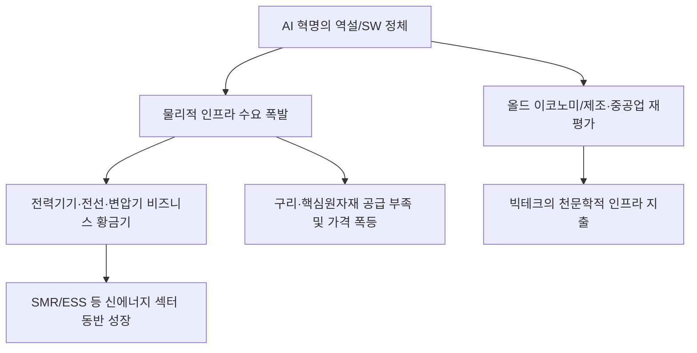

# 증시/산업 분석: AI 혁명의 역설과 '올드 이코노미'의 부활, 하드웨어의 습격
## 투자 신호 + 사회적 영향 평가

---

## 📌 기사 기본 정보

- **날짜**: 2026-02-27
- **출처**: 글로벌 산업 구조 재편 및 2026년 주식 시장 주도 섹터 분석 리포트
- **카테고리**: 경제 > 증시 > 산업/기술
- **핵심 주제**: 인공지능(AI) 혁명이 소프트웨어를 넘어 전력, 변압기, 구리, 인프라 등 이른바 '올드 이코노미(Old Economy)'의 폭발적 수요를 창출하는 역설적 상황 분석, 그리고 소프트웨어 기업들의 수익성 부재와 대비되는 산업재·인프라 섹터의 강세 현상 진단

**메타데이터**
- 주요 이슈: 소프트웨어(SaaS) 기업들의 주가 정체 vs 전력·기계·전선 섹터의 신고가 릴레이
- 핵심 원동력: AI 데이터센터 건설 붐 + 노후 전력망 교체 주기 + 구리 등 핵심 원자재 부족
- 주요 주체: 전력 기자재 대장주(HD현대일렉트릭 등), 글로벌 테크 빅테크, 원자재 채굴 사
- 키워드: AI 역설, 올드 이코노미 부활, 산업재 강세, 인프라 부재, 구리 가격 폭등

---

## 🔍 기사를 통한 투자 신호 추출

### 1단계: 핵심 사건 분해

**What (무엇이 일어났는가?)**
- AI가 천재적인 지능을 보여줄수록, 그 지능을 유지하기 위한 '물리적 에너지'와 '인프라'의 한계가 드러남. AI 모델을 돌리기 위한 거대한 데이터센터는 엄청난 전력을 소모하며, 이를 뒷받침할 변압기, 전선, 냉각 장치, 전력망(Grid) 수요가 전 세계적으로 공급을 초과함. 결과적으로 첨단 기술주보다 '기름 냄새 나는' 산업재 주식들이 수익률 상단을 차지하는 기현상 발생.

**When (언제 일어났는가?)**
- 2026-02-27 (소프트웨어 기업들이 AI 초기 기대감 이후 실질적인 '수익 모델(Monetization)' 증명에 어려움을 겪는 반면, 인프라 기업들은 수년 치 일감을 이미 확보한 시점)

**Why (왜 이 중요한가?)**
- AI의 한계는 논리력(SW)이 아니라 물리적 자원(HW)에 있다는 것이 입증되었기 때문
- 지난 20년간 홀대받던 제조·중공업 섹터의 밸류에이션이 근본적으로 재평가(Re-rating)되고 있기 때문
- '구리' 등 산업의 쌀이 되는 원자재가 국가 안보 자산으로 격상되었기 때문

**Who (누가 주도하는가?)**
- 전력 부족 문제 해결을 위해 천문학적 자금을 투입하는 글로벌 빅테크(MS, 구글, 아마존 등)
- 전 세계적인 전력 인프라 교체 및 증설을 주도하는 각국 정부

---

### 2단계: 투자 신호 해석

#### A. **긍정적 신호 (Bullish)**

**① AI를 지탱하는 '전력 및 냉각 시스템' 독점 기술 보유사**
- **신호**: 전력기기 수출 단가(P)와 물량(Q)의 동시 상승 지속 
- **의미**: 20년 만에 찾아온 초호황기(Super Cycle). 한 번 깔리면 바꾸기 힘든 '인프라 해자' 구축
- **투자 기회**: 국내외 변압기 대장주, 전선 및 구리 관련주, 액침 냉각(Immersion Cooling) 기술 기업

**② '에너지 자립'을 꾀하는 소형 모듈 원자로(SMR) 및 신재생 저장 장치(ESS)**
- **신호**: 데이터센터 전용 전력원으로서의 SMR 도입 공식화 뉴스 상시화
- **의미**: 기존 전력망의 한계를 넘는 '독자적인 에너지원'을 가진 섹터의 폭발적 성장
- **투자 기회**: SMR 핵심 설계/제조 사, 대용량 ESS 배터리 관리 시스템 전문 기업

---

#### B. **위험 신호 (Bearish)**

**③ 실적 없이 '기대'만으로 버티던 '순수 AI 소프트웨어(SaaS)'**
- **신호**: 기술력은 좋으나 기업 고객(B2B)들의 지출 대비 수익성 지표(ROI) 부진 
- **의미**: "무엇을 할 수 있는가?"가 아닌 "얼마를 벌어다 주는가?"의 혹독한 검증기 진입
- **투자 리스크**: 독자적인 수익 모델 없이 오픈AI 등 거대 모델을 단순 재가공하는 스타트업형 상장사

**④ 에너지 비용 상승을 소비자에게 전가하지 못하는 '전통적 가전/제조'**
- **신호**: 원자세(구리, 알루미늄) 가격 폭등 및 전기료 인상에 따른 생산 단가 압박
- **의미**: 제품 가격을 올리면 수요가 꺾이고, 안 올리면 마진이 증발하는 딜레마
- **투자 리스크**: 원자재 비중이 높은 중저가 생활 가전 제조사, 물류비 부담이 큰 내수 중심 유통주

---

### 3단계: 섹터별 투자 기회 매트릭스

#### ✅ **높은 기대도 + 낮은 리스크**

**글로벌 공급망 재편으로 '미국/유럽 현지 공장'을 보유한 한국 산업재 대장주**
- 미-중 갈등과 보호무역주의 속에서도 인프라 부족 문제를 해결해줄 유일한 대안으로 인정받으며 관세 등 규제 리스크에서 상대적으로 자유로움
- **투자 추천도**: ⭐⭐⭐⭐⭐

---

## 💰 구체적 투자 신호 변환

### 신호 1: '디지털 뇌'보다 '물리적 신체(인프라)'를 먼저 확보하라

**투자 해석**: 기사는 AI 혁명의 주도권이 코드(Code)에서 하드웨어(Steel & Copper)로 이동했음을 시사함. 투자자는 지금 즉시 '화려한 기술주'의 환상에서 깨어나 '단단한 산업재'로 포트폴리오의 앞줄을 바꿔야 함. AI가 똑똑해질수록 전 세계는 '변압기'와 '구리' 쟁탈전을 벌일 것이며, 이들의 이익은 향후 5~10년간 우상향할 가능성이 매우 큼. 소프트웨어는 옥석 가리기가 끝날 때까지 관망하고, 지금 당장 돈을 쓸어 담는 '인프라의 왕'들에게 올라타야 함.

---

## 🌍 사회적 영향 평가

### A. 긍정적 사회 영향
- **노후 사회 기반 시설의 현대화 가속**: AI 수요로 인해 지지부진하던 국가 전력망과 물류 체계가 최첨단으로 업그레이드되며 국가 전체의 에너지 효율과 안전성 향상 기여
- **전통 제조 강국의 부활과 일자리 창출**: 소외되었던 중공업, 전기, 기계 분야의 가치가 재발견되며 숙련된 기술직들의 처우 개선과 지역 경제 활성화 선순환 촉진

### B. 부정적 사회 영향
- **원자재 발 인플레이션 및 공공 요금 인상**: 구리 등 산업 원자재 가격 폭등과 막대한 전력 소모는 결국 전기료 인상과 물가 상승으로 이어져 서민 가계의 부담 가중 사회적 고통 수반
- **AI 격차(AI Divide)의 심화**: 거대 자본을 가진 빅테크만 전력과 인프라를 독점하고, 중소기업이나 후발국들은 인프라 비용을 감당하지 못해 기술 발전의 혜택에서 소외되는 글로벌 양극화 발생 리스크

---

## 🎯 결론: 당신의 투자 전략 수립

- **즉시 실행**: 소프트웨어/SaaS 비중 하향 평준화, 전력기기/구리/원자력 섹터 비중 50% 이상 상향 조정
- **3개월 후**: 빅테크 기업들의 인프라 투자(CapEx) 계획 발표 내역과 구리 재고 추이 분석 후 추가 매수 시점 확정

---

## 📝 Obsidian 연결 구조

