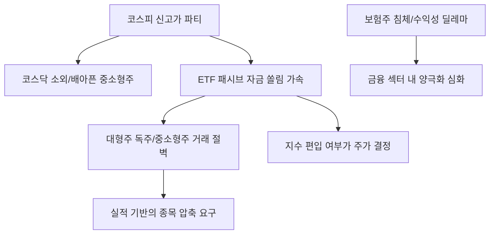

# 주식/금융 분석: '배아픈' 코스닥과 '속앓는' 보험주, ETF 중심 장세의 명암
## 투자 신호 + 사회적 영향 평가

---

## 📌 기사 기본 정보

- **날짜**: 2026-02-27
- **출처**: 대한민국 증시 섹터별 양극화 및 ETF 수급 집중 분석 리포트
- **카테고리**: 경제 > 주식 > 금융/보험
- **핵심 주제**: 코스피 대형주 위주의 독주 속에 소수 종목군(반도체, 자동차)에만 자금이 쏠리며 발생하는 코스닥 중소형주의 소외 현상과, 금리 변동성 및 규제 리스크로 수익성이 정체된 보험주·소외 섹터의 딜레마 및 ETF 중심의 패시브 자금 쏠림 현상 분석

**메타데이터**
- 주요 이슈: 코스피 6300 돌파에도 코스닥 지수 상대적 부진 (양극화)
- 핵심 원인: ETF로의 자금 집중(쏠림) + 실적 가시성이 높은 대형주 선호 현상
- 주요 주체: ETF 자산운용사, 코스닥 상장 중소기업, 보험사 리스크 관리팀
- 키워드: 코스닥 소외, 보험주 딜레마, ETF 쏠림, 패시브 자산, 실적 기반 차별화

---

## 🔍 기사를 통한 투자 신호 추출

### 1단계: 핵심 사건 분해

**What (무엇이 일어났는가?)**
- 코스피 대장주들이 사상 최고가를 경신하는 화려한 잔치가 벌어지는 동안, 코스닥은 시총 상위권의 부진과 자금 유출로 '상대적 박탈감'에 빠짐. 투자자들이 개별 종목 분석보다 지수나 테마 ETF를 선호하면서, ETF에 포함되지 못한 중소형주들은 실적이 좋아도 주가가 제자리인 '패시브의 저주'가 나타남. 특히 보험주는 금리 인하 기대감과 IFRS17 규제 리스크가 맞물려 수익성 방어에 고전 중임.

**When (언제 일어났는가?)**
- 2026-02-27 (지수 대형주 중심의 외국인 매수세가 극대화되어 개인들의 테마주/소형주 전락이 두드러진 시점)

**Why (왜 이 중요한가?)**
- 자본 시장의 '허리(중소기업)'가 무너지면 장기적으로 산업 생태계가 위축되기 때문
- 'ETF 전성시대'에 살아남기 위한 중소기업들의 IR 전략 대전환이 필요하기 때문
- 금융 섹터 내에서도 은행(수혜)과 보험(소외)의 운명이 극명하게 갈리고 있기 때문

**Who (누가 주도하는가?)**
- 시장의 유동성을 특정 섹터로 몰아넣는 ETF 운용역과 알고리즘 매매
- 실적 가시성이 보장된 대형주로만 피신하는 기관 투자자

---

### 2단계: 투자 신호 해석

#### A. **긍정적 신호 (Bullish)**

**① '배아픈' 코스닥 속 진흙 속의 진주, 'ETF 신규 편입' 후보군**
- **신호**: 코스닥 내 실적 급증 및 시총 순위 상승 중인 우량 중소형주
- **의미**: 향후 대형 테마 ETF(AI, 로봇 등)에 새롭게 편입될 때 패시브 자금의 폭발적 매수세 기대
- **투자 기회**: 실적 턴어라운드가 확인된 소부장(소재·부품·장비) 강소기업

**② '속앓는' 보험주 중 자본 건전성이 압도적인 1등 대장주**
- **신호**: 업계 전반의 부진 속에서도 배당 성향을 유지하며 견고한 CSM(계약서비스마진)을 보여주는 곳
- **의미**: 섹터 전체가 저평가될 때 진정한 1등 기업은 향후 업황 회복 시 가장 가파르게 반등함
- **투자 기회**: 국내 시장 점유율 1위 생명/손해보험사, 주주 환원 의지가 확고한 보험 지주

---

#### B. **위험 신호 (Bearish)**

**③ ETF에 포함되지 못하고 '거래량'이 말라가는 소외 중소형주**
- **신호**: 평균 거래 대금이 시총 대비 현저히 낮고 기관/외국인 관심 밖인 종목 
- **의미**: 실적과 무관하게 자금이 돌지 않아 주가가 장기 횡보하거나 하락할 운명
- **투자 리스크**: 독자적인 테마나 기술 해자가 없는 일반 제조/부품주

**④ 금리 인하와 시스템 규제에 취약한 '2금융권 및 영세 보험사'**
- **신호**: 자산 운용 수익률 하락 및 지급여력비율(K-ICS) 불안정 소식
- **의미**: 금융 시장의 파티가 끝나갈 때 가장 먼저 부실 리스크가 터져 나올 곳
- **투자 리스크**: 자본 확충 부담이 큰 중소형 보험사, 부동산 PF 대출 비중이 높은 캐피탈 사

---

### 3단계: 섹터별 투자 기회 매트릭스

#### ✅ **높은 기대도 + 낮은 리스크**

**글로벌 증시와 국내 대형주를 잇는 '지수형 고배당 ETF'**
- 개별 종목의 '배아픔'을 겪기보다, 전체적인 머니무브의 흐름(외국인 매수세)을 그대로 타는 패시브 상품이 가장 안전한 고수익처임
- **투자 추천도**: ⭐⭐⭐⭐

---

## 💰 구체적 투자 신호 변환

### 신호 1: '패시브의 파도'를 타거나, '압도적 실력'을 가지거나

**투자 해석**: 기사는 한국 증시가 '승자 독식(Winner-takes-all)' 구조로 바뀌었음을 시사함. 투자자는 지금 즉시 '언젠가는 오르겠지'라는 막연한 기대감으로 들고 있는 소외 중소형주를 정리해야 함. 대신, ETF 자금이 유입되는 통로(지수 구성 종목)에 있거나, ETF 권력을 이길 정도의 압도적인 '이익의 질'을 증명하는 종목으로 압축해야 함. 보험주는 리스크 관리가 끝난 대장주 외에는 보수적 관점을 유지해야 할 때임.

---

## 🌍 사회적 영향 평가

### A. 긍정적 사회 영향
- **자본 시장의 효율성 제고 및 우량 기업 집중 지원**: 시장의 자금이 검증된 우량 기업으로 집중되며 국가 산업 경쟁력과 자본 배분의 효율성이 높아지는 순기능 수행
- **개인 투자자의 중장기 자산 형성 유도**: ETF 활성화를 통해 개별 종목의 투기적 매매보다 분산 투자가 일상화되며 건강한 자본주의 문화 정착

### B. 부정적 사회 영향
- **중소·벤처 생태계의 고사 위기**: 대형주로만 돈이 쏠리며 유망한 중소기업들이 자금 조달에 어려움을 겪고, 이는 신산업 싹을 자르는 사회적 손실로 이어질 우려
- **섹터 소외에 따른 자산 양극화 심화**: 특정 업종(보험 등) 종사자나 해당 섹터에 투자한 고령층의 자산 가치 정체로 인한 사회적 불만과 경제적 불평등 지속 리스크

---

## 🎯 결론: 당신의 투자 전략 수립

- **즉시 실행**: 코스닥 소외주 비중 축소, 지수 대형주 및 배당 ETF 비중 하향 평준화, 우량 보험주 1종목 선별 보유
- **3개월 후**: 다음 분기 ETF 지수 정기 변경(Rebalancing) 리스트 확인 후 선제적 종목 이동

---

## 📝 Obsidian 연결 구조

