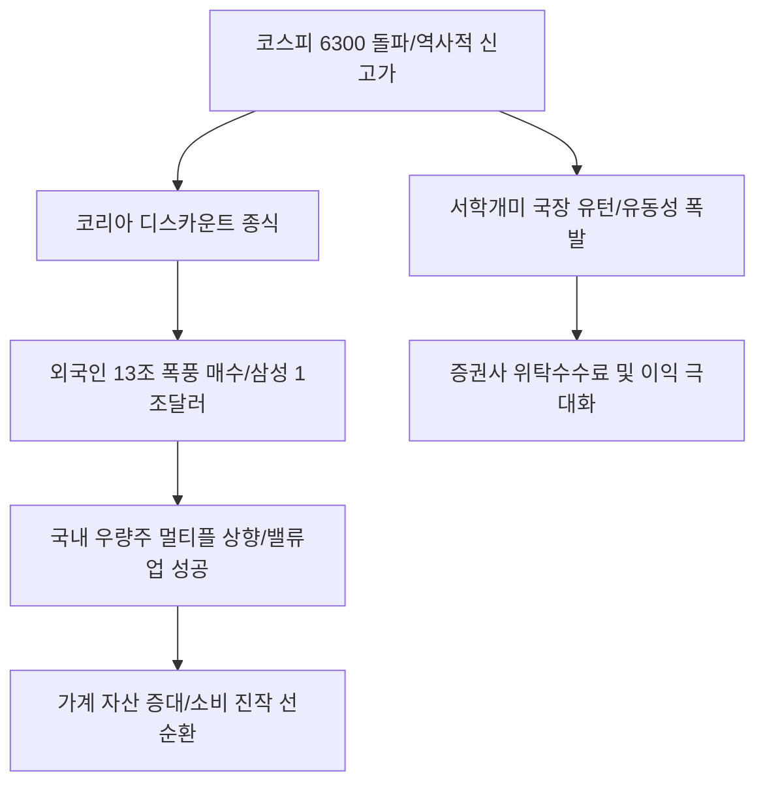

# 주식/거시 분석: 코스피 6300 시대와 삼성 시총 1조 달러, '국장 유턴'의 서막
## 투자 신호 + 사회적 영향 평가

---

## 📌 기사 기본 정보

- **날짜**: 2026-02-27
- **출처**: 대한민국 증시 대전환 및 글로벌 자본 시장 리포트
- **카테고리**: 경제 > 주식 > 거시금융
- **핵심 주제**: 코스피 지수가 역사적 고점인 6300선을 돌파하고 삼성전자가 시가총액 1조 달러 클럽에 가입하는 등 한국 증시의 '체질 대전환' 현상 분석, 그리고 외국인의 기록적인 매수세와 해외 주식(서학개미)으로 떠났던 개인 투자자들이 국내 시장(국장)으로 회귀하는 '머니 리턴' 현상 진단

**메타데이터**
- 주요 수치: 코스피 6300 돌파, 외국인 13조 원 순매수(결정적 매듭), 삼성전자 $1T 달성
- 핵심 동력: 기업 밸류업 프로그램의 결실 + AI 반도체 공급망 장악 + 지배구조 개선 성공
- 주요 주체: 외국인 투자자, 삼성전자 경영진, 유턴 서학개미, 금융위원회
- 키워드: 코스피 6300, 삼성 시총 1조달러, 국장 유턴, 밸류업 성공, 지배구조 혁명

---

## 🔍 기사를 통한 투자 신호 추출

### 1단계: 핵심 사건 분해

**What (무엇이 일어났는가?)**
- 한국 증시가 '코리아 디스카운트'를 완전히 벗어던지고 글로벌 주류 시장으로 편입됨. 외국인들이 한 달 만에 13조 원을 쏟아부으며 지수를 견인했고, 시총 1,000조 원을 넘긴 삼성전자는 이제 애플, 엔비디아와 어깨를 나란히 함. "한국 주식은 안 된다"며 떠났던 개인들이 다시 돌아오며 하락 시마다 강력한 지지선을 형성하는 '유동성 파티' 국면 진입.

**When (언제 일어났는가?)**
- 2026-02-27 (지배구조 개선 법제화와 AI 반도체 수익성이 숫자로 확인되며 기술적·심리적 저항선이 동시에 무너진 시점)

**Why (왜 이 중요한가?)**
- 한국 자산의 평가 잣대(Multiple)가 저성장 국가에서 '하이테크 혁신 국가'로 상향되었기 때문
- 주주 환원이 선택이 아닌 생존이 되며 배당과 자사주 소각이 일상화되었기 때문
- 국민의 자산 비중이 부동산에서 주식으로 이동하는 '자본가 혁명'의 시작점이기 때문

**Who (누가 주도하는가?)**
- 한국 기업의 현금 흐름과 기술 해자를 인정한 글로벌 헤지펀드 및 연기금
- 정부의 강력한 증시 부양 및 지배구조 정상화 의지를 믿기 시작한 스마트 개미

---

### 2단계: 투자 신호 해석

#### A. **긍정적 신호 (Bullish)**

**① '삼성그룹' 및 '반도체 공급망' 핵심 생태계 기업의 동반 밸류업**
- **신호**: 삼성 시총 1조 달러 달성에 따른 하부 벤더들의 멀티플 리레이팅(Re-rating)
- **의미**: 대장주가 길을 열면 2순위, 3순위 부품·소재 사들도 글로벌 기준가에 맞춰 주가가 재설정됨
- **투자 기회**: 반도체 HBM 핵심 장비주, 차세대 공정 소재사, 삼성전자 우선주

**② 지배구조 개선의 수혜를 입는 '저평가 지주사 및 자산주'**
- **신호**: 지수 6000 시대에도 여전히 PBR 1 이하인 우량 지주사들의 자사주 소각 뉴스
- **의미**: "안 올려주면 우리가 강제로 올리겠다"는 주주들의 목소리가 실제 주가 상승으로 연결됨
- **투자 기회**: 국내 대표 금융지주사, 핵심 영업 가치를 보유한 대형 지주사

---

#### B. **위험 신호 (Bearish)**

**③ 실적 없이 '낙수 효과'만 기대하는 부실 중소 테마주**
- **신호**: 지수 폭등세에 편승하여 이유 없이 급등하나 실적 발표 시 하한가 추락 
- **의미**: 이번 장세는 '질적 성장' 장세이므로 실체가 없는 종목은 철저히 소외되거나 뒤늦게 폭락함
- **투자 리스크**: AI 관련 키워드만 달고 실적은 적자인 코스닥 소형주

**④ 주식 시장으로 자금이 이탈하는 '지방 부동산 및 수익형 호텔' 섹터**
- **신호**: "집 사느니 주식 산다"는 심리 확산에 따른 부동산 거래 대금 급감
- **의미**: 부동산 불패 신화의 종말과 증시의 자금 블랙홀 현상이 맞물려 자산 가치 하방 압력
- **투자 리스크**: 수도권 외곽 상가, 분양권 전매 위주 부동산, 오피스텔 직접 투자 종목

---

### 3단계: 섹터별 투자 기회 매트릭스

#### ✅ **높은 기대도 + 낮은 리스크**

**국내 증시의 '유동성 통로'인 대형 증권사 및 거래소 인프라 관련주**
- 서학개미의 유턴과 외국인의 13조 매수는 증권사의 위탁매매 및 신용공여 이익을 폭증시킴. 지수 고점 여부와 무관하게 거래량 자체가 돈임
- **투자 추천도**: ⭐⭐⭐⭐⭐

---

## 💰 구체적 투자 신호 변환

### 신호 1: '코리아 디스카운트'의 해소는 '복리의 마법'의 시작이다

**투자 해석**: 기사는 한국 증시의 '레벨 업'이 일시적 현상이 아닌 구조적 전환임을 시사함. 투자자는 지금 즉시 '해외 주식 100%' 포트폴리오를 재검검하고, 저평가된 국내 핵심 자산을 일정 부분 채워야 함. 코스피 6000 시대는 주가가 비싸진 것이 아니라, 이제야 '제값'을 받기 시작한 것임. 삼성전자의 1조 달러 달성은 시작일 뿐이며, 이를 따라갈 '제2의 삼성' 후보군(현대차, KB금융 등)을 선점하는 것이 최고의 전략임.

---

## 🌍 사회적 영향 평가

### A. 긍정적 사회 영향
- **국민 자산 형성의 선순환 구조 확립**: 주가 상승과 배당 확대를 통해 국민들의 가계 자산이 풍부해지며 내수 소비 진작과 노후 준비 문제 해결에 결정적 기여
- **기업 거버넌스의 민주화**: 소액 주주들의 권리가 보호받고 대주주의 전횡이 차단되면서, 신뢰할 수 있는 투명한 자본주의 시장 생태계 조성

### B. 부정적 사회 영향
- **자산 양극화의 새로운 형태**: 증시에 올라탄 층과 소외된 층, 혹은 여전히 부동산에만 자산이 묶인 층 간의 부의 격차가 단기간에 폭발하며 사회적 박탈감 형성
- **투기 광풍과 과도한 레버리지 리스크**: 지수 6000 돌파에 고무된 신규 투자자들이 빚을 내어 투자(신용융자)하다 발생할 수 있는 시장 급변동 시의 연쇄 파산 우려 사회적 리스크

---

## 🎯 결론: 당신의 투자 전략 수립

- **즉시 실행**: 해외 주식 일부 익절 후 국내 '밸류업' 섹터 및 반도체 대장주로 40% 이상 포지션 이동
- **3개월 후**: 정부의 주주 환원 세제 혜택 법안 발효 상황과 외국인 자금의 연속성 데이터를 기반으로 비중 추가 확대 고민

---

## 📝 Obsidian 연결 구조

