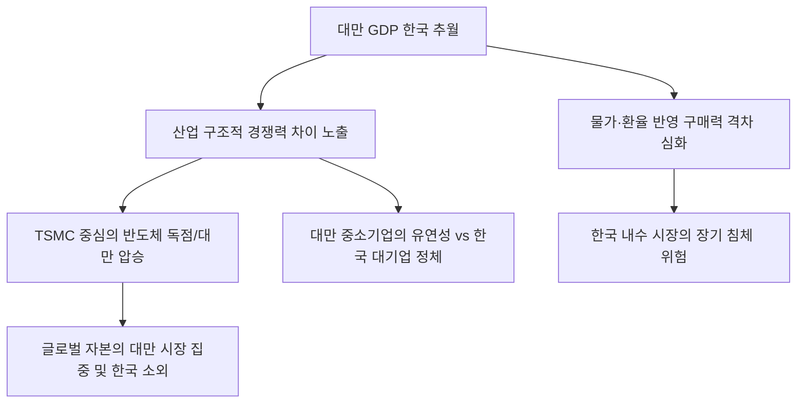

# 거시/국가 분석: 대만 GDP의 한국 추월과 '구매력 격차'의 구조적 함의
## 투자 신호 + 사회적 영향 평가

---

## 📌 기사 기본 정보

- **날짜**: 2026-02-28
- **출처**: 글로벌 거시 경제 지표 및 아시아 신흥 공업국 성장성 비교 리포트
- **카테고리**: 경제 > 거시경제 > 국가경쟁력
- **핵심 주제**: 1인당 국내총생산(GDP)에서 대만이 한국을 공식 추월하고, 물가를 반영한 구매력 평가(PPP) 기준으로는 그 격차가 더욱 벌어진 현상을 분석하며, 반도체 중심의 산업 구조와 중소기업 활력, 환율 및 물가 정책 등 양국 경제의 근본적 경쟁력 차이 진단

**메타데이터**
- 주요 수치: 대만 1인당 GDP $35,000 돌파 (한국 추월), PPP 기준 대만 승
- 핵심 동력: TSMC 중심의 글로벌 반도체 생태계 독점 + 효율적 정부 재정 관리
- 주요 주체: 대한민국 기획재정부, 대만 행정원, 글로벌 반도체 업계, IMF/월드뱅크
- 키워드: 대만 GDP 추월, 구매력 평가(PPP), TSMC 효과, 중소기업 강점, 국가 경쟁력 역전

---

## 🔍 기사를 통한 투자 신호 추출

### 1단계: 핵심 사건 분해

**What (무엇이 일어났는가?)**
- 오랜 기간 한국의 뒤를 쫓던 대만이 반도체 초호황에 힘입어 1인당 부의 수준에서 한국을 앞질렀으며, 실질적인 삶의 질을 결정하는 구매력에서도 한국보다 우수한 성적표를 받음. 이는 단순한 숫자의 역전이 아니라, 한국의 대기업 중심-가계 부채 기반 성장 모델이 대만의 중소기업 강소국-반도체 독점 성장 모델에 판정패했음을 시사함.

**When (언제 일어났는가?)**
- 2026-02-28 (글로벌 공급망이 기술 패권 중심으로 재편되며 AI 반도체 가치가 최대로 치솟은 시점)

**Why (왜 이 중요한가?)**
- "한국이 아시아의 용 중 1등"이라는 자부심이 붕괴되며 투자자들의 자금이 대만 시장으로 이탈하는 근거가 되기 때문
- 가계 부채에 짓눌린 한국과 달리 탄탄한 저축과 건전한 산업 생태계를 가진 대만의 매력이 부각되기 때문
- PPP 격차는 한국의 높은 물가와 주거비 부담이 실질 소득을 갉아먹고 있음을 증거하기 때문

**Who (누가 주도하는가?)**
- 전 세계 AI 칩의 90% 이상을 제조하며 대만 국부의 원천이 된 TSMC와 그 협력사들
- 과도한 부동산 규제와 부채 관리 실패로 내수 활력을 잃은 한국의 경제 당국

---

### 2단계: 투자 신호 해석

#### A. **긍정적 신호 (Bullish)**

**① '대만식 성공 모델'을 복제하거나 그 공급망에 올라탄 한국 강소기업**
- **신호**: 삼성·SK 비중보다 대만 TSMC 공급망(오사트 등)에 직납하는 비중이 늘어나는 기업
- **의미**: 한국 경제 전체는 우울해도, 대만의 성장 가도에 올라탄 특정 기술주는 독자적 상승
- **투자 기회**: 글로벌 반도체 후공정(OSAT) 소재 사, 대만 반도체 장비 시장 점유율 상위 기업

**② 실질 구매력을 중시하는 '가성비 위주의 실용 소비' 섹터**
- **신호**: PPP가 낮은 한국 상황을 반영하여 저렴하면서도 질 높은 PB 상품 및 구독 서비스 성장
- **의미**: 돈이 없는 한국 국민들은 이제 '사치'보다 '생존형 효율 소비'에 집중함
- **투자 기회**: 대형 유통사 PB 전문 제조 소형주, 중저가 건강기능식품 스타트업

---

#### B. **위험 신호 (Bearish)**

**③ 대만과의 '원가 경쟁' 및 '기술 집중도'에서 밀리는 한국의 기존 주력 제조**
- **신호**: 스마트폰, 가전, 일반 디스플레이 등 대만이 '선택과 집중'으로 포기했거나 압도 중인 분야
- **의미**: 대만이 반도체에 올인해 성공하는 동안, 이것저것 다 하던 한국의 범용 가전/제조는 마진 하락
- **투자 리스크**: 대만 미디어텍(MediaTek) 등과 경쟁하는 중저가 칩셋 사, 대만 부품사로 대체되는 가전 부품주

**④ '가계 부채'와 '고물가'에 묶여 성장이 멈춘 한국 내수 유통·금융**
- **신호**: 일본식 '장기 불황'의 초기 증상인 소비 위축과 대출 연체율 상승 
- **의미**: 국가 간 GDP 역전은 곧 통화 가치와 구매력의 장기적 약세로 이어짐
- **투자 리스크**: 부채가 많은 가계를 대상으로 하는 저축은행, 고가 명품 위주의 국내 유통주

---

### 3단계: 섹터별 투자 기회 매트릭스

#### ✅ **높은 기대도 + 낮은 리스크**

**국가 리스크를 분산한 '아시아 신흥 공업국 통합 ETF' 및 대만 기술주 직접 투자**
- 한국의 부진을 대만의 성공으로 헤지(Hedge)하는 전략. 아시아의 기술 패권을 쥔 TSMC와 그 주변 생태계는 현재 전 세계 자본이 가장 신뢰하는 피난처임
- **투자 추천도**: ⭐⭐⭐⭐⭐

---

## 💰 구체적 투자 신호 변환

### 신호 1: '1등의 오만'을 버리고 '강소국'의 효율성에 배팅하라

**투자 해석**: 기사는 한국 경제가 구조적 '성장의 벽'에 부딪혔음을 시사함. 투자자는 지금 즉시 '한국 기업이니까 사준다'는 애국 투자를 멈춰야 함. 오히려 대만이 왜 성공했는지(중소기업의 유연성, 전기료 등 제조 원가 경쟁력 유지)를 분석하고, 국내 종목 중에서도 이러한 '대만식 효율성'을 가진 기업을 찾아야 함. 또한, 한국 주식 비중의 일부를 대만 반도체 지수로 옮기는 것은 거시 경제적 역전을 대비한 가장 기초적인 자산 방어임.

---

## 🌍 사회적 영향 평가

### A. 긍정적 사회 영향
- **국가적 위기의식 고취를 통한 패러다임 전환 계기 마련**: 대만에 추월당했다는 충격이 낡은 대기업 중심 경제 구조를 혁파하고, 작지만 강한 중소·벤처 기업을 육성하는 실질적인 정책 변화 유도
- **실물 물가 안정의 중요성 부각**: 구매력(PPP) 격차 해결을 위해 유통 구조 혁신과 부동산 가격 거품 제거 등 서민들의 '실질 소득'을 올리는 사회적 논의 활성화

### B. 부정적 사회 영향
- **상대적 박탈감에 따른 인력 유출 가속화**: "한국에서 일하느니 대만이나 해외 테크 기업으로 가겠다"는 우수 이공계 인재들의 탈출(Brain Drain)이 빨라지며 국가 기술 근간 훼손 우려
- **세대 간·계층 간 갈등 심화**: 성장 동력 상실의 책임을 서로에게 전가하고, 줄어드는 파이를 두고 벌이는 복지 대결 등 사회적 갈등 비용 급증 리스크

---

## 🎯 결론: 당신의 투자 전략 수립

- **즉시 실행**: 한국 내수 비중 하향 평준화, 대만 반도체/기술주 직접 투자 혹은 ETF 편입 확대
- **3개월 후**: 대만과 한국의 분기별 GDP 격차 변화 및 한국 정부의 출구 전략(밸류업 등) 실효성 재검토

---

## 📝 Obsidian 연결 구조

