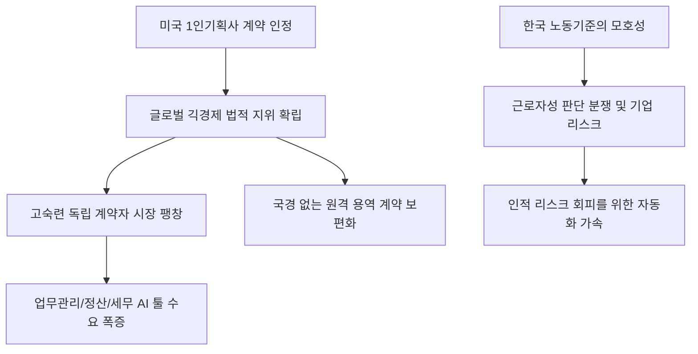

# 노동/법률 분석: 미국의 '1인 기획사 용역계약' 인정과 한국의 모호한 노동 기준
## 투자 신호 + 사회적 영향 평가

---

## 📌 기사 기본 정보

- **날짜**: 2026-02-28
- **출처**: 글로벌 노동 법률 트렌드 및 대한민국 특수고용형태 근로자 분석 리포트
- **카테고리**: 경제 > 노동 > 법률/사회
- **핵심 주제**: 미국 법원이 1인 기획사(독립 계약자)의 용역 계약을 공식적인 비즈니스 주체로 인정하며 노동법적 보호와 자율성을 동시에 보장하는 추세인 반면, 한국은 여전히 근로자성과 사용자성을 가르는 포괄적이고 모호한 기준에 머물러 발생하는 '긱 경제(Gig Economy)' 종사자들의 권리 사각지대 및 분쟁 현황 분석

**메타데이터**
- 주요 이슈: 플랫폼 종사자, 크리에이터 등 1인 기업가의 법적 지위 확립
- 핵심 차이: 미국(명확한 용역 계약 주체 인정) vs 한국(근로자성 판단의 불투명성)
- 주요 주체: 고용노동부, 플랫폼 기업, 유튜버/프리랜서 단체, 법원
- 키워드: 1인 기획사, 용역 계약, 근로자성, 긱 경제, 노동법 사각지대

---

## 🔍 기사를 통한 투자 신호 추출

### 1단계: 핵심 사건 분해

**What (무엇이 일어났는가?)**
- 미국에서는 크리에이터나 고숙련 프리랜서가 세운 '1인 기획사'를 정당한 사업 파트너로 인정하여 계약의 자유를 보장하는 판결이 잇따름. 반면 한국은 형식은 계약직인데 실질은 근로자인 경우(타다, 배달 라이더 등)에 대한 판단 기준이 사건마다 제각각이라, 기업은 법적 리스크를 안고 종사자는 사회 보장의 혜택을 받지 못하는 '복합 불확실성'에 갇혀 있음.

**When (언제 일어났는가?)**
- 2026-02-28 (글로벌 긱 경제 규모가 전통 노동 시장을 위협할 정도로 커지고, AI 에이전트를 활용한 1인 기업이 급증하는 시점)

**Why (왜 이 중요한가?)**
- 노동법의 경계가 '고용'에서 '계약'으로 이동하는 거대한 패러다임 전환이기 때문
- 한국 기업들이 노동법 리스크를 피하려 외주화를 선호하지만, 법적 기준이 정립되지 않아 잠재적 비용이 크기 때문
- 1인 자영업자/프리랜서의 금융 접근성(대출 등)이 법적 지위에 따라 달라지기 때문

**Who (누가 주도하는가?)**
- 명확한 표준 계약과 자율권을 요구하는 고숙련 1인 기업가들
- 유연한 인력 운용을 위해 노동법 개정을 촉구하는 플랫폼 및 스타트업 경영계

---

### 2단계: 투자 신호 해석

#### A. **긍정적 신호 (Bullish)**

**① '1인 기획사 및 프리랜서' 전문 업무 관리 소프트웨어(SaaS) 기업**
- **신호**: 용역 계약 인정 추세로 인한 독립 계약자들의 세무, 법무, 정산 자동화 수요 폭증 
- **의미**: 노동법이 복잡해질수록 이를 시스템으로 관리해주는 플랫폼의 지배력이 강화됨
- **투자 기회**: 1인 기업 전용 세무 자동화 앱, 독립 계약자용 협업 툴 개발사

**② 고숙련 인재와 기업을 잇는 '전문직 매칭 및 계약 보증' 서비스**
- **신호**: 미국식 용역 계약 모델의 국내 도입과 전문직 긱 워커 시장의 양적 팽창
- **의미**: 법적 분쟁을 줄여주는 '신뢰 기반의 중개 플랫폼'이 채용 시장의 대세가 됨
- **투자 기회**: IT/법률/디자인 전문 프리랜서 매칭 플랫폼, 계약 이행 보증 보험사

---

#### B. **위험 신호 (Bearish)**

**③ '포괄적 근로자성' 리스크에 노출된 단순 인력 파견 및 플랫폼 운송업**
- **신호**: 한국의 명확하지 않은 노동 기준에 따른 거액의 퇴직금/수당 소급 청구 소송 
- **의미**: 기업 이익의 상당 부분이 한순간에 법적 합의금으로 증발할 수 있는 시한폭탄 리스크
- **투자 리스크**: 가이드라인 없이 다수의 배달/운송 종사자를 거느린 상장 플랫폼 사

**④ 전통적인 '공채 및 정규직' 중심의 고비용 HR 서비스 제공 기업**
- **신호**: 기업들이 정규직 채용을 줄이고 '용역 계약' 기반의 프로젝트 중심 인력 운용 선호
- **의미**: 과거의 채용 대행 모델은 쇠퇴하고, 유연한 계약 관리가 안 되는 곳은 도태됨
- **투자 리스크**: 전통적인 헤드헌팅 사, 대규모 집합 교육 위주의 HR 컨설팅 업체

---

### 3단계: 섹터별 투자 기회 매트릭스

#### ✅ **높은 기대도 + 낮은 리스크**

**글로벌 노동 시장의 유연성을 선점한 '미국 기반의 글로벌 긱 워커 플랫폼'**
- 이미 법적 지위가 확립된 시장에서 축적된 데이터와 운영 노하우를 가진 글로벌 기업은 한국 시장의 혼란을 틈타 시장을 장악할 가능성이 높음
- **투자 추천도**: ⭐⭐⭐⭐

---

## 💰 구체적 투자 신호 변환

### 신호 1: '직원'을 뽑는 기업보다 '파트너'를 모으는 플랫폼을 사라

**투자 해석**: 기사는 고용의 형태가 '소속'에서 '연결'로 바뀌었음을 시사함. 투자자는 지금 즉시 '인건비 비중'이 높은 기업의 리스크를 재점검해야 함. 대신, 1인 기획사와 효율적인 용역 계약을 맺어 고정비를 낮추거나, 그런 계약의 기술적 기반을 제공하는 '인프라 기업'에 집중해야 함. 미국에서 시작된 용역 계약 인정 트렌드는 결국 한국의 법률 체계도 바꿀 것이며, 그 과정에서 탄생할 '디지털 인사관리' 대장주를 선점하는 것이 핵심임.

---

## 🌍 사회적 영향 평가

### A. 긍정적 사회 영향
- **다양한 노동 형태의 존중과 개인의 자율성 극대화**: 9-to-6 출퇴근이 아닌 개인의 역량에 따른 유연한 노동을 법적으로 보호함으로써 삶과 일의 조화를 돕고 혁신적인 창업 생태계 조성 기여
- **노사 분쟁의 투명한 해결 기반 마련**: 모호한 기준 대신 명확한 '용역 계약서' 중심의 문화가 정착되어 기업과 종사자 간의 불필요한 법적 소송 비용 절감 및 상생 협력 유도

### B. 부정적 사회 영향
- **사회 안전망의 해체와 노동 양극화**: '사장님'이라는 지위 뒤에 숨겨진 저소득 플랫폼 노동자들의 건강권과 연금이 무너지고, 고숙련자와 저숙련자 간의 사회 보장 격차가 극단적으로 벌어지는 리스크
- **기업의 책임 회피 수단으로 악용**: 정규직으로 고용해야 할 인력을 강제로 1인 기획사 형태로 계약하게 하여 노동법을 우회하려는 나쁜 선례들이 만연하여 사회 전체의 고용 안정성 홰손 우려

---

## 🎯 결론: 당신의 투자 전략 수립

- **즉시 실행**: 노동 리스크가 큰 로컬 플랫폼주 비중 조절, 글로벌 원격 채용 및 계약 관리 플랫폼(Deel 등) 관련 수혜주 탐색
- **3개월 후**: 한국 법원의 플랫폼 종사자 근로자성 관련 대법원 판례 및 정부의 '미래 노동법' 초안 발표 내용 확인

---

## 📝 Obsidian 연결 구조

