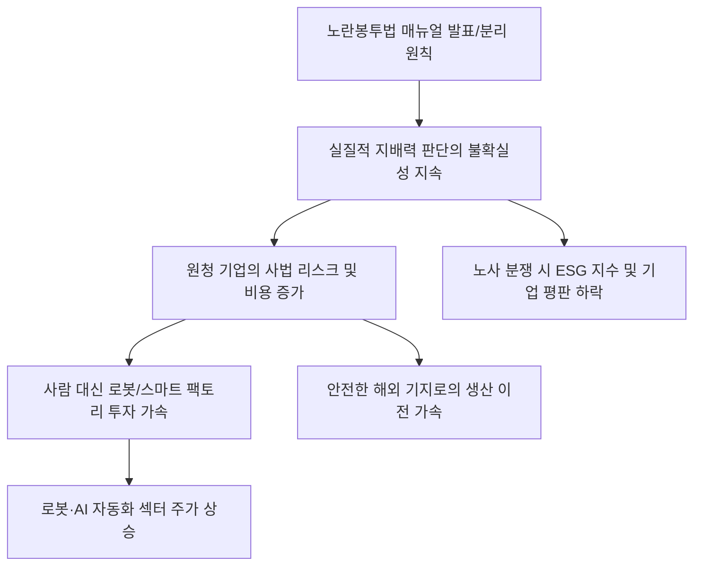

# 노동/법률 분석: 노동부의 '노란봉투법' 매뉴얼과 원·하청 분리 원칙의 함의
## 투자 신호 + 사회적 영향 평가

---

## 📌 기사 기본 정보

- **날짜**: 2026-02-28
- **출처**: 고용노동부 가이드라인 및 대한민국 노사 관계 법률 분석 리포트
- **카테고리**: 경제 > 노동 > 법률/정책
- **핵심 주제**: 고용노동부가 발표한 이른바 '노란봉투법(노동조합법 제2조·제3조 개정안)' 후속 매뉴얼에 담긴 '원·하청 노조 교섭 분리' 대원칙의 법적 해석과, 이로 인해 발생할 수 있는 노사 관계의 새로운 지형 및 기업 경영 리스크 관리 전략 분석

**메타데이터**
- 주요 이슈: 하청 노조의 원청 상대 교섭권 인정 범위 논란과 노동부의 지침 발표
- 핵심 원칙: '실질적 지배력' 판단 기준과 원·하청 교섭 창구의 물리적 분리
- 주요 주체: 고용노동부, 민주노총/한국노총, 대형 제조 기업(원청), 협력 업체(하청)
- 키워드: 노란봉투법, 교섭 분리, 실질적 지배력, 부당노동행위, 노사 리스크

---

## 🔍 기사를 통한 투자 신호 추출

### 1단계: 핵심 사건 분해

**What (무엇이 일어났는가?)**
- 노란봉투법 통과 이후 현장의 혼란이 가중되자, 노동부가 "원청이 하청 노조와 직접 교섭해야 할 의무는 '실질적 지배력'이 있는 경우로 제한하며, 원칙적으로 원청과 하청의 노사 관계는 분리되어야 한다"는 보수적인 가이드라인을 제시함. 이는 노조의 교섭 요구 폭주를 막으려는 경영계의 우려를 일부 반영한 것으로 보이나, 법원의 판례와 충돌할 소지가 있어 현장의 '법적 불확실성'은 여전히 큼.

**When (언제 일어났는가?)**
- 2026-02-28 (법 시행 초기 단계에서 기업들이 단체 교섭 시기를 앞두고 대응 전략 수립에 박차를 가하는 시점)

**Why (왜 이 중요한가?)**
- 원청 기업이 하청 노조의 파업 리스크를 상시적으로 안게 되었기 때문
- '실질적 지배력'의 자의적 해석에 따라 경영진이 형사 처벌(부당노동행위)을 받을 위험이 있기 때문
- 노사 관계 리스크가 주가(ESG)의 핵심 변수로 작동하기 때문

**Who (누가 주도하는가?)**
- 노사 관계 안정과 기업 투자 유치를 우선시하는 노동부 행정 라인
- 법리적 허점을 파고들어 원청의 사용자성을 확대하려는 노동계 법률 지원단

---

### 2단계: 투자 신호 해석

#### A. **긍정적 신호 (Bullish)**

**① '노사 관계 리스크'를 기술로 해결하는 스마트 팩토리 및 자동화 섹터**
- **신호**: 노동법 리스크를 피하기 위한 '인적 의존도 낮추기' 투자 사상 최대 
- **의미**: 법이 까다로워질수록 사람 대신 로봇을 쓰는 것이 기업에겐 가장 저렴한 비용이 됨
- **투자 기회**: 산업용 로봇 대장주, 물류 자동화 솔루션 기업, AI 기반 공정 최적화 SW

**② 기업의 법적 대응력을 높여주는 '리포트 테크 및 컴플라이언스' 서비스**
- **신호**: 노란봉투법 대응을 위한 전문 변호사 및 노무 컨설팅 수요 급증
- **의미**: 복잡한 법리를 시스템적으로 관리해주고 리스크를 사전에 소명하는 툴이 필수재가 됨
- **투자 기회**: 기업용 리걸테크(Legal-tech) 상장사, 대형 법무법인 제휴 금융 서비스

---

#### B. **위험 신호 (Bearish)**

**③ 하청 업체 비중이 높고 노동 집약적인 '대형 장치 산업'**
- **신호**: 원청 작업장 내 하청 노조의 점거 파업 및 교섭 요구 상시화 
- **의미**: 생산 라인 한 곳만 멈춰도 전체 공정이 마비되는 구조적 취약성 노출
- **투자 리스크**: 조선, 자동차, 건설업 중 외주 비중 50% 이상의 기업

**④ '지배구조(G)' 및 '사회(S)' 점수가 급락하는 분쟁 기업**
- **신호**: 노란봉투법 위반 관련 검찰 조사 및 고용부 시정 명령 뉴스 공시
- **의미**: 글로벌 ESG 투자 자금의 이탈 명분을 제공하며 주가 멀티플 하락 압력
- **투자 리스크**: 노사 분열이 심각하고 법적 공방이 진행 중인 상위 시총 대형주

---

### 3단계: 섹터별 투자 기회 매트릭스

#### ✅ **높은 기대도 + 낮은 리스크**

**글로벌 공급망이 다변화되어 국내 노동법 리스크에서 자유로운 '해외 생산 기지' 보유주**
- 국내 노동법이 강해질수록 생산 기지를 해외로 옮긴 기업들의 '리스크 관리 효율'이 상대적으로 돋보이게 됨
- **투자 추천도**: ⭐⭐⭐⭐

---

## 💰 구체적 투자 신호 변환

### 신호 1: '노란봉투'의 방어막은 기술이고, 공격로은 해외다

**투자 해석**: 기사는 국내 노사 관계가 사법 리스크의 한가운데에 진입했음을 시사함. 투자자는 지금 즉시 '하청 노동자'와의 접점이 얼마나 많은지(생산 구조)를 종목 선정의 1순위로 두어야 함. 원·하청 분리 원칙이 지켜지지 않을 경우 발생할 영업 손실을 감당할 수 없는 기업은 포트폴리오에서 제외해야 함. 반대로, 노란봉투법을 기점으로 '자동화 100%'를 선언하는 기업은 규제 리스크를 성장 동력으로 바꾸는 진정한 승자가 될 것임.

---

## 🌍 사회적 영향 평가

### A. 긍정적 사회 영향
- **노동 시장의 이중 구조 개선 단초 마련**: 하청 노동자들의 열악한 처우를 원청이 함께 고민하게 함으로써 극심한 임금 격차를 완화하고 노동 기본권의 질적 향상 도모
- **기업의 투명한 하청 관리 및 상생 문화 확산**: 법적 책임을 피하기 위해서라도 하청 업체의 경영 환경과 안전 보건을 체계적으로 지원하는 '진짜 상생' 시스템 구축 촉진

### B. 부정적 사회 영향
- **심각한 노사 갈등으로 인한 산업 경쟁력 약화**: 연중 계속되는 교섭과 파업 리스크는 기업의 투자 의지를 꺾고, 불확실성을 증대시켜 국내 자본의 해외 도피 가속화
- **하청 업체의 도산 및 일감 실종**: 원청이 법적 리스크를 피하려 하청 업체와의 계약을 해지하고 직접 고용 대신 자동화/기계화로 급선회할 경우, 수많은 영세 하청 노동자들의 생계 위협 사회적 리스크

---

## 🎯 결론: 당신의 투자 전략 수립

- **즉시 실행**: 노동 집약적 대형 제조주 비중 축소, 로봇 및 공정 자동화 섹터 비중 30% 신규 진입
- **3개월 후**: 매뉴얼 발표 이후 제기되는 첫 판결 결과와 대규모 단체 교섭 시기의 노사 분쟁 빈도 데이터 확인 후 리밸런싱

---

## 📝 Obsidian 연결 구조

