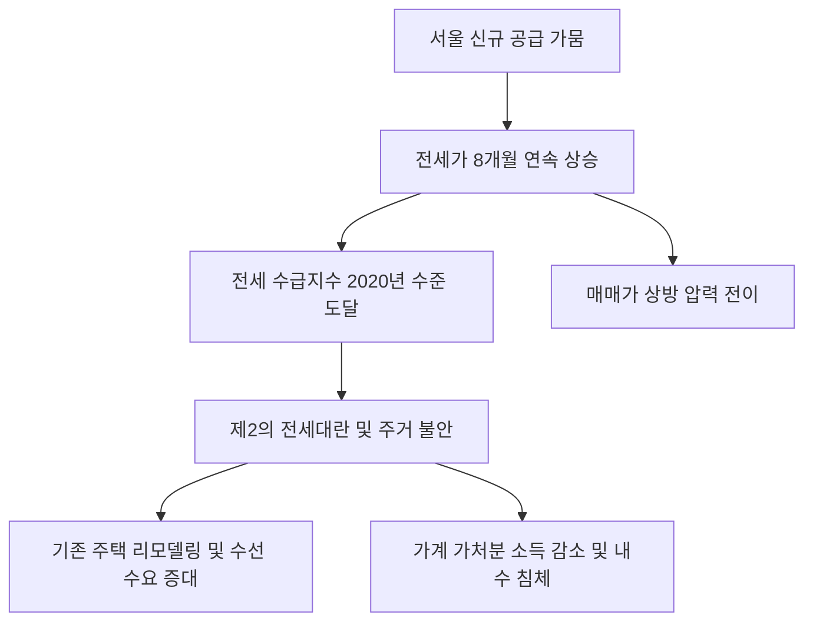

# 부동산/민생 분석: 서울 전세가의 8개월 연속 상승과 제2의 '전세대란' 경고음
## 투자 신호 + 사회적 영향 평가

---

## 📌 기사 기본 정보

- **날짜**: 2026-02-28
- **출처**: 대한민국 주택 시장 수급 지수 및 전월세 시장 정밀 모니터링 리포트
- **카테고리**: 경제 > 부동산 > 전세시장
- **핵심 주제**: 서울 도심 내 신규 주택 '공급 가뭄'이 심화되며 전세가격이 8개월 연속 상승하고, 전세 수급 지수가 2020년 전세대란 직전 수준까지 치솟는 등 서민 주거 안정에 심각한 위기 징후가 포착된 현상 분석

**메타데이터**
- 주요 수치: 서울 전셋값 8개월 연속 상승, 전세 수급 지수 2020년 데자뷔 수준
- 핵심 원인: 아파트 입주 물량 급감 + 고금리에 따른 매매 수요의 전세 전환 + 빌라 사기 여파
- 주요 주체: 무주택 서민, 전세 임대인(다주택자), 국토교통부, 서울시 주택정책실
- 키워드: 공급 가뭄, 전세 상승, 2020년 데자뷔, 전세 수급 지수, 서민 주거 불안

---

## 🔍 기사를 통한 투자 신호 추출

### 1단계: 핵심 사건 분해

**What (무엇이 일어났는가?)**
- 서울의 아파트 전세 시장이 극심한 '물건 부족' 상태에 빠짐. 매매로 집을 사기에는 부담이 큰 수요자들이 연장 계약을 하거나 전세로 머물면서 매물은 사라졌는데, 정작 신규로 지어지는 아파트는 역대급으로 적어 전세가가 천정부지로 솟고 있음. 이는 2020년 임대차법 시행 직후 겪었던 극심한 혼란의 초기 단계와 매우 흡사함.

**When (언제 일어났는가?)**
- 2026-02-28 (이사 철 성수기를 앞두고 입주 물량 공백기가 겹친 결정적 시점)

**Why (왜 이 중요한가?)**
- 전세가의 상승은 결국 매매가를 밀어 올리는 '에스컬레이터' 역할을 하기 때문
- 가계의 가처분 소득이 주거비로 빨려 들어가며 내수 소비가 죽는 악순환이 시작되기 때문
- 빌라/다세대 회피 현상으로 인해 아파트 전세로의 '쏠림'이 구조화되었기 때문

**Who (누가 주도하는가?)**
- 서울 핵심지에 전세를 내놓을 수 있는 상위 10%의 다주택자/법인
- 자산의 70% 이상이 전세 보증금에 묶여 있는 무주택 적령기 세대

---

### 2단계: 투자 신호 해석

#### A. **긍정적 신호 (Bullish)**

**① '대체 주거 모델'을 제공하는 기업형 임대 및 코리빙(Co-living) 섹터**
- **신호**: 아파트 전세난을 피해 표준화된 품질과 안정적 거주를 보장하는 '전문 임대 주택' 수요 폭증
- **의미**: 개인 간의 불안한 전세 계약 대신 대기업이 운영하는 렌탈 하우스가 '뉴 노멀'로 정착
- **투자 기회**: 국내 대형 건설사 소속 주택 관리 운용사, 글로벌 코리빙 플랫폼 기업

**② 전세보증금 보호를 위한 '부동산 권리 보험 및 핀테크' 서비스**
- **신호**: 전세가 상승에 따른 보증금 규모 확대와 빌라 사기 트라우마로 인한 보안 니즈 강화 
- **의미**: 전세 계약의 위험을 분산해주는 '보험'과 '에스크로' 서비스가 필수재로 등극함
- **투자 기회**: 보증 보험 전문 기업, 블록체인 기반 부동산 등기 및 계약 검증 사

---

#### B. **위험 신호 (Bearish)**

**③ 주거비 상승으로 인해 '가처분 소득'이 급감하는 내수 유통/요식업**
- **신호**: 전세 대출 이자 및 보증금 증액 부담에 따른 지갑 닫기 현상 가속화 
- **의미**: 주거비가 오르면 가장 먼저 '외식'과 '의류' 등 비필수재 시장이 타격을 받음
- **투자 리스크**: 서울 비중이 높은 대형 마트, 중저가 패션 브랜드, 배달 음식 프랜차이즈

**④ '공급 부족'을 해결하지 못하는 수도권 기반의 영세 건설사**
- **신호**: 원자재 값 상승과 PF(프로젝트 파이낸싱) 경색으로 인해 착공을 못 하는 현장 급증
- **의미**: 공급 부족이라는 호재가 있어도, 정작 지을 능력이 없어 수익을 못 내는 '돈 가뭄'의 역설
- **투자 리스크**: 부채 비율이 높고 단가가 높은 도심 정비 사업에만 매달리는 지방 중견 건설사

---

### 3단계: 섹터별 투자 기회 매트릭스

#### ✅ **높은 기대도 + 낮은 리스크**

**신규 공급의 대안인 '노후 단지 리모델링 및 인테리어' 대장주**
- 새 집이 안 지어지면 기존 집을 고쳐서 전세 가치를 높이려는 수요가 늘어남. 정비 사업이 막힐수록 리모델링 시장은 활황을 누림
- **투자 추천도**: ⭐⭐⭐⭐

---

## 💰 구체적 투자 신호 변환

### 신호 1: '공급 가뭄'의 끝은 '신고가 매매'로 연결된다, 6개월 전을 보라

**투자 해석**: 기사는 부동산 시장의 '전세-매매 상승 압력'이 임계점에 도달했음을 시사함. 투자자는 지금 즉시 '서울 핵심지 소형 아파트'의 전세가율(전세가/매매가 비율)을 체크해야 함. 전세가가 매매가의 70~80%을 넘어서는 단지는 조만간 매매가로 전이될 확률 99%임. 현재의 전세난은 깡통전세의 위험이 아니라, 강력한 '밀어 올리기' 장세의 전조임. 부동산 관련 금융 상품이나 건설주보다는, 실물 자산 그 자체나 자산 가치 상승을 방어할 수 있는 리츠(REITs)로 대피해야 함.

---

## 🌍 사회적 영향 평가

### A. 긍정적 사회 영향
- **부동산 투명성 제고를 위한 정책 혁신 유도**: 전세 사기와 공급 부족이 동시에 터지며, 정부가 빌라 시장 정상화와 임대차 계약의 디지털 보증 시스템 도입을 서두르는 긍정적 촉매제 역할
- **합리적 주택 소비 문화 확산**: 소유에 집착하기보다 '기업형 임대'나 '공유 주택' 등 선진국형 주거 모델에 대한 거부감이 낮아지며 주거 선택의 다양성 확대

### B. 부정적 사회 영향
- **청년·서민층의 자산 형성 기회 차단**: 소득의 대부분을 전세금 증액이나 대출 이자로 지출하게 되어, 결혼·출산을 포기하는 사회적 절벽 현상 심화
- **서울 집중화와 지역 격차 극대화**: 서울 전세가는 오르는데 지방은 역전세난이 발생하는 '부동산 양극화'로 인해 국가 균형 발전이 무너지고 지방 소멸 가속화 사회적 리스크

---

## 🎯 결론: 당신의 투자 전략 수립

- **즉시 실행**: 수도권 핵심지 부동산 리츠 비중 확대, 인테리어/자재 대장주 매수 관점 전환
- **3개월 후**: 정부의 '공급 활성화' 실질 대책(3기 신도시 입주 앞당기기 등) 발표 여부와 전세가 상승세 정체 여부 확인

---

## 📝 Obsidian 연결 구조

