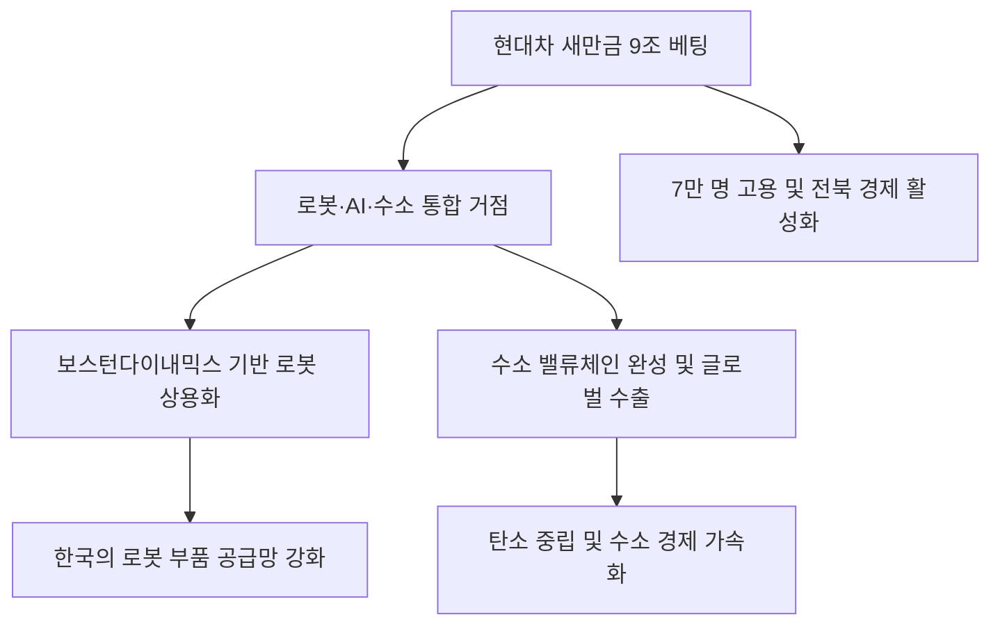

# 산업/지역 분석: 현대차의 새만금 9조 '메가 베팅'과 로봇·AI·수소 거점 구축
## 투자 신호 + 사회적 영향 평가

---

## 📌 기사 기본 정보

- **날짜**: 2026-02-28
- **출처**: 대한민국 미래 모빌리티 전략 및 새만금 산업 단지 활성화 리포트
- **카테고리**: 경제 > 산업 > 자동차/모빌리티
- **핵심 주제**: 현대차그룹이 새만금 국가산업단지에 9조 원 규모의 대규모 투자를 확정하고, 로봇(Robotics), 인공지능(AI), 수소 필드(Hydrogen Field)를 결합한 '미래 모빌리티 통합 거점'을 조성하여 7만 명 이상의 고용 창출과 지역 경제 대전환을 예고한 현황 분석

**메타데이터**
- 투자 규모: 9조 원 (단일 기업 최대급)
- 핵심 기술: 보스턴 다이내믹스 기반 로보틱스, 수소 연료 전지, 자율주행 AI
- 주요 주체: 현대자동차그룹, 전라북도, 국토교통부, 새만금개발청
- 키워드: 현대차 새만금 투자, 미래 모빌리티 거점, 수소 허브, 로봇 공장, 7만 명 고용

---

## 🔍 기사를 통한 투자 신호 추출

### 1단계: 핵심 사건 분해

**What (무엇이 일어났는가?)**
- 현대차그룹이 새만금을 전기차를 넘어선 '로봇·AI·수소'의 글로벌 전초 기지로 낙점함. 단순 생산 공장이 아닌, 보스턴 다이내믹스의 로봇 기술과 자율주행 소프트웨어 거점, 그리고 수소 밸류체인을 집대성한 테크 센터를 구축하여 미래 먹거리 산업을 선점하겠다는 전략임. 이는 낙후된 전북 지역을 첨단 기술의 핵심지로 바꾸는 국가적 프로젝트임.

**When (언제 일어났는가?)**
- 2026-02-28 (글로벌 완성차 업체들이 'SW 중심의 회사(SDV)'로 체질을 바꾸고, 수소 패권을 쥐기 위해 사활을 건 시점)

**Why (왜 이 중요한가?)**
- 현대차의 미래 비전이 '바퀴 달린 로봇'과 '수소 경제'에 있음을 입증하는 실질적 증거이기 때문
- 수도권 집중화 문제를 해결할 유일한 '대안적 첨단 산업 거점'으로서 새만금의 가치가 확정되었기 때문
- 7만 명 규모의 고용은 전북 지역뿐만 아니라 국내 소부장 하청 업체 생태계 전체의 성장을 예고하기 때문

**Who (누가 주도하는가?)**
- 정의선 회장을 필두로 한 현대차그룹의 미래 전략 본부
- RE100과 저렴한 부지를 앞세워 기업을 유치한 정부 및 지자체

---

### 2단계: 투자 신호 해석

#### A. **긍정적 신호 (Bullish)**

**① '보스턴 다이내믹스'와 연계된 국내 로봇 부품 및 AI 소프트웨어 사**
- **신호**: 현대차 새만금 센터 내 로봇 대량 생산 및 R&D 클러스터 조성 
- **의미**: 글로벌 1위 로봇 기술의 '현지화'를 담당할 국내 협력사들의 급성장 기회
- **투자 기회**: 감속기, 서보모터 등 로봇 핵심 부품주, 자율주행 인지 AI 기술 기업

**② 수소 밸류체인(생산-운송-충전)의 핵심 인프라 제조 사**
- **신호**: 새만금을 수소 모빌리티 허브로 만들겠다는 초대형 투자 계획
- **의미**: 그동안 지지부진하던 수소 테마가 '현대차의 현금 투자'로 실체가 확인됨
- **투자 기회**: 수소 연료 전지 스택 소재 사, 수소 탱크용 탄소 섬유 제조 기업

---

#### B. **위험 신호 (Bearish)**

**③ 기존 '내연기관 부품' 위주의 전통적 하청 업체**
- **신호**: 현대차의 투자가 로봇, AI, 수소에만 편중(전통 엔진 공장 배제) 
- **의미**: 새만금 파티에서 소외된 채, 본진(울산/기아)의 생산량 감소를 견뎌야 하는 몰락의 길
- **투자 리스크**: 엔진 부품, 변속기 전문 부하사 중 기술 전환 의지가 없는 상장사

**④ 부동산 거품에만 편승하려는 새만금 인근 '무분별한 기획 부동산'**
- **신호**: 9조 투자 소식에 따른 인근 토지 및 상가 분양가 폭증 
- **의미**: 실질적인 고용과 인구 유입까지는 최소 5~10년이 걸리는 장기 프로젝트임
- **투자 리스크**: 기초 인프라가 없는 논밭 형태의 기약 없는 기획 부동산 테마주

---

### 3단계: 섹터별 투자 기회 매트릭스

#### ✅ **높은 기대도 + 낮은 리스크**

**현대차그룹의 '미래 인프라'를 함께 깔아주는 계열사 및 대형 건설 사**
- 9조 원의 공사 물량은 일단 건물과 공장, 도로를 짓는 곳에 먼저 떨어짐. 현대글로비스(수소 운송), 현대모비스(로봇 모듈) 등의 실적은 담보된 것이나 다름없음
- **투자 추천도**: ⭐⭐⭐⭐⭐

---

## 💰 구체적 투자 신호 변환

### 신호 1: '전통 차' 버리고 '모빌리티 인프라'를 잡아라

**투자 해석**: 기사는 현대차의 정체성이 '제조업'에서 '로봇·AI·에너지 서비스업'으로 이동했음을 시사함. 투자자는 지금 즉시 포트폴리오 내의 현대차 비중을 '글로벌 모빌리티 플랫폼' 시각으로 재배치해야 함. 새만금은 단순한 생산 기지가 아니라 현대차의 '운영체제(OS)'가 물리적으로 구현되는 첫 번째 실험실임. 여기서 나오는 로봇과 수소 차의 데이터는 향후 현대차의 밸류에이션을 테슬라와 같은 수준으로 끌어올릴 결정적 열쇠가 될 것임.

---

## 🌍 사회적 영향 평가

### A. 긍정적 사회 영향
- **국토 균형 발전의 실질적 모델 제시**: 단순 보조금이 아닌 대기업의 '현금 투자'와 '고숙련 일자리'를 통해 지역 소멸 위기를 극복하고 국가적 성장 동력을 다각화하는 긍정적 선례 남김
- **수소/로봇 기술 자립 및 글로벌 수출 거점 확보**: 세계 최고 수준의 로봇 및 수소 기술을 상용화하여 'K-로봇'과 'K-수소'라는 제2의 반도체 수출 품목 육성 기여

### B. 부정적 사회 영향
- **수도권과의 기술 격차 및 정주 여건 논란**: 첨단 일자리는 늘어나지만 우수 인재들이 거주할 수 있는 의료, 교육, 문화 인프라가 뒷받침되지 않을 경우 발생하는 인력 수급 난항 및 사회적 불만
- **대외 기술 종속 우려**: 보스턴 다이내믹스 등 해외 원천 기술에 대한 과도한 의존이 지속될 경우, 새만금이 단순 '조립 공장'으로 전락하며 부가가치의 해외 유출이 우려되는 리스크

---

## 🎯 결론: 당신의 투자 전략 수립

- **즉시 실행**: 현대차 그룹주 및 수소/로봇 핵심 협력사 비중 확대, 새만금 인프라 건설 대장주 편입
- **3개월 후**: 정부의 새만금 지원 특별법 제정 속도와 현대차의 구체적인 착공 시점 및 채용 공고 통계 확인

---

## 📝 Obsidian 연결 구조

