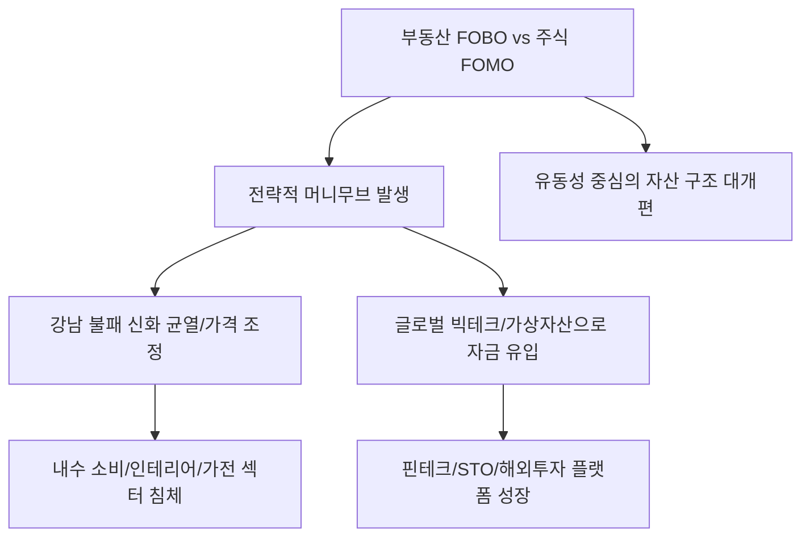

# 부동산/투자 분석: 부동산 FOBO와 주식 FOMO, 강남 불패의 균열과 머니무브
## 투자 신호 + 사회적 영향 평가

---

## 📌 기사 기본 정보

- **날짜**: 2026-03-02
- **출처**: 대한민국 자산 시장 머니무브 및 심리 지표 분석 리포트
- **카테고리**: 경제 > 부동산 > 투자심리
- **핵심 주제**: 부동산 시장의 'FOBO(Fear of Better Options, 더 나은 선택지가 있을 거라는 공포)'와 주식 시장의 'FOMO(Fear of Missing Out, 나만 소외될 거라는 공포)'가 교차하며, 강남 불패 신화에 균열이 생기고 자금이 글로벌 금융 자산으로 급격히 이동하는 '머니무브' 현상 분석

**메타데이터**
- 주요 이슈: 고금리 상시화에 따른 부동산 환금성 리스크 부각
- 핵심 심리: 부동산 FOBO(관망/매도 고민) vs 주식 FOMO(글로벌 우량주 추격 매수)
- 주요 주체: 자산가 그룹, 영끌 투자자, 글로벌 자산 운용사
- 키워드: FOBO, FOMO, 강남 불패 균열, 머니무브, 자산 포트폴리오 재편

---

## 🔍 기사를 통한 투자 신호 추출

### 1단계: 핵심 사건 분해

**What (무엇이 일어났는가?)**
- "집은 사두면 무조건 오른다"는 강남 불패 신화가 흔들리며, 부동산을 가진 자들은 더 좋은 수익률(주식 등)을 놓치고 있다는 FOBO에 빠짐. 반면, 글로벌 빅테크나 가상자산의 폭등을 보며 주식 시장에 올라타지 못한 사람들은 FOMO에 시달림. 이 두 심리가 충돌하며 부동산을 팔아 주식/코인으로 옮겨가는 거대한 '머니무브'가 현실화됨.

**When (언제 일어났는가?)**
- 2026-03-02 (부동산 규제 강화와 고금리 압박이 지속되는 가운데, 엔비디아 등 글로벌 기술주의 독주가 멈추지 않는 시점)

**Why (왜 일어났는가?)**
- 부동산은 '무거운 자산(낮은 유동성)'인 반면, 금융 자산은 '가벼운 자산(높은 유동성)'으로 위기 시 대응 속도 차이가 극명하기 때문
- 인구 구조상 부동산 수요의 질적 하락이 예견되며 '장기 우상향'에 대한 근본적 의구심 발생
- 24시간 거래되는 글로벌 금융 자산의 접근성이 과거에 비해 압도적으로 좋아짐

**Who (누가 주도하는가?)**
- 공격적으로 포트폴리오를 조정하는 고액 자산가 및 스마트 머니
- 부동산에 묶인 자산을 유동화하여 '기회 비용'을 살리려는 영끌 출구 전략 세대

---

### 2단계: 투자 신호 해석

#### A. **긍정적 신호 (Bullish)**

**① 글로벌 우량주 및 배당 중심의 '금융 자산' 섹터로의 자금 쏠림**
- **신호**: 부동산 매도 대금의 해외 주식 계좌 유입 공식 확인
- **의미**: 국내 내수 경기가 안 좋아도 글로벌 1등 기업들은 한국 자산가들의 돈으로 더 비싸짐
- **투자 기회**: 미국 빅테크(MAG7 등), 글로벌 지수 추종 ETF, 고배당 리츠(REITs)

**② '자산 유동화'와 '디지털 자산' 관리 플랫폼의 활성화**
- **신호**: 부동산을 쪼개 파는 STO(토큰증권)나 간편 해외 투자 앱 이용자 급증
- **의미**: 무거운 부동산을 가벼운 금융 상품으로 바꾸는 '중간자'들이 돈을 범
- **투자 기회**: 증권사 기반 STO 플랫폼, 소수점 투자 지원 핀테크 사

---

#### B. **위험 신호 (Bearish)**

**③ '강남권 대형 아파트' 및 '고가 오피스텔'의 가격 조정 가속화**
- **신호**: 신고가 거래 단절 및 급매물 위주의 거래 형성
- **의미**: 자산가들이 부동산을 '전략적 매도' 대상으로 보기 시작했다는 신호
- **투자 리스크**: 강남 3구 부동산 직접 투자 주택 및 관련 담보 대출 익스포저가 큰 제2금융권

**④ '부동산 기반' 내수 소비재 및 가전/인테리어 섹터의 침체**
- **신호**: 이사 수요 급감 및 주거 관련 대형 소비 위축 
- **의미**: 자산이 부동산에 묶여 있거나, 주식으로 옮겨가느라 '실물 소비'를 줄임
- **투자 리스크**: 가구, 가전, 인테리어 자재 기업, 고가 주방기기 브랜드

---

### 3단계: 섹터별 투자 기회 매트릭스

#### ✅ **높은 기대도 + 낮은 리스크**

**글로벌 '현금 흐름'이 보장되는 고퀄리티 성장주**
- 부동산의 높은 세금과 낮은 수익률을 피한 자금은 결국 '확률적으로 가장 승률 높은' 곳에 모임
- **투자 추천도**: ⭐⭐⭐⭐⭐

---

## 💰 구체적 투자 신호 변환

### 신호 1: '강남 집값'보다 '나스닥 지수'가 내 자산을 더 잘 지킨다

**투자 해석**: 기사는 자산의 '지정학적 위치'가 바뀌고 있음을 시사함. 한국의 좁은 땅에 갇힌 자산이 전 세계로 뻗어 나가는 과정임. 투자자는 지금 즉시 '부동산 불패'라는 낡은 신앙을 버려야 함. 부동산이 포트폴리오의 70% 이상이라면 이를 50% 이하로 줄이고, 줄인 만큼을 '글로벌 유동성 자산'으로 채워야 함. 지금의 하락은 단순 조정이 아니라 '자산의 성격' 자체가 바뀌는 거대한 파도의 시작임.

---

## 🌍 사회적 영향 평가

### A. 긍정적 사회 영향
- **자본의 효율적 재배치**: 생산성 없는 부동산에 묶여 있던 거대 자본이 주식, 채권, 벤처 투자 등 생산적 금융 시장으로 흘러들어가 산업 전반의 자본 수급 개선 기여
- **투자 민주화 및 금융 지능 향상**: 전 국민이 부동산 이외의 글로벌 거시 경제에 관심을 갖게 되며 개인의 자산 관리 역량이 고도화되는 계기 마련

### B. 부정적 사회 영향
- **내수 경기 위축과 자산 양극화 심화**: 부동산 가격 하락으로 인한 역자산 효과(Reverse Wealth Effect)가 소비 위축을 가져오고, 금융 자본을 미리 선점한 층과 그렇지 못한 층 간의 격차 폭발
- **국부 유출 논란 및 국내 자본 시장 소외**: 국내 부동산을 판 돈이 한국 주식이 아닌 미국 주식으로만 쏠리면서 코리아 디스카운트 심화 및 국가적 자본 기반 약화 리스크

---

## 🎯 결론: 당신의 투자 전략 수립

- **즉시 실행**: 부동산 비중 축소 계획 수립, 해외 우량주 적립식 매수 시작, 자산 유동화가 쉬운 포트폴리오로 재구축
- **3개월 후**: 강남권 실거래가 지수 추이와 해외 주식 순매수 결제 대금 추이를 비교 분석하여 머니무브 속도에 따른 추가 대응

---

## 📝 Obsidian 연결 구조

