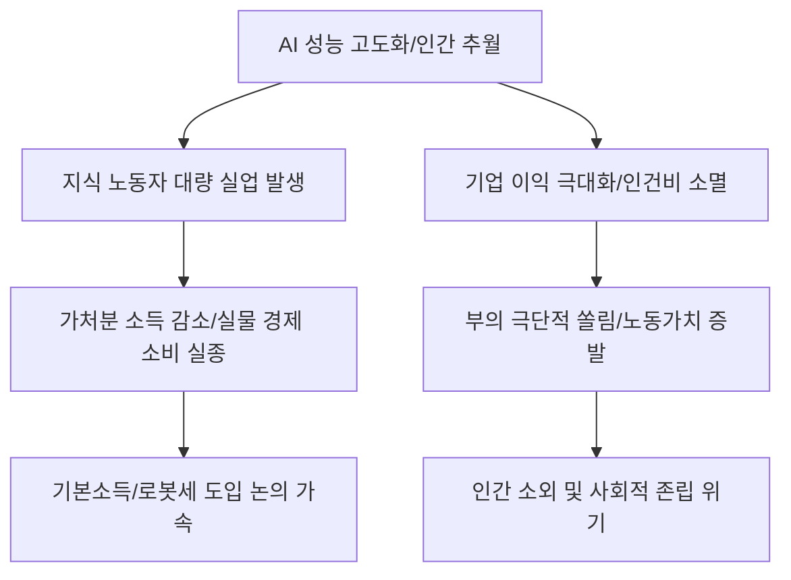

# AI/거시 분석: 인공지능의 역설, 고성능화가 불러올 '고용 붕괴' 시나리오
## 투자 신호 + 사회적 영향 평가

---

## 📌 기사 기본 정보

- **날짜**: 2026-03-02
- **출처**: 글로벌 기술 트렌드 및 노동 시장 장기 전망 리포트
- **카테고리**: 경제 > 인공지능 > 사회/고용
- **핵심 주제**: AI의 성능이 인간의 지능을 추월하는 '고성능화'가 가속화될수록 역설적으로 인간의 노동 가치가 급락하여 대규모 실업과 소비 위축으로 이어지는 'AI 발 실물 경제 침체'의 메커니즘과 파괴적 시나리오 분석

**메타데이터**
- 주요 이슈: 화이트칼라(지식 노동자)의 대량 해고 리스크
- 핵심 지표: AI 대체 지수, 기업별 자동화에 따른 인건비 절감액 및 해고율
- 주요 주체: 글로벌 빅테크, AI 솔루션 도입 기업, 지식 노동자, 정부 규제 당국
- 키워드: AI의 역설, 고용 붕괴, 실물 경제 침체, 노동의 가치 하락, 기본소득 논의

---

## 🔍 기사를 통한 투자 신호 추출

### 1단계: 핵심 사건 분해

**What (무엇이 일어났는가?)**
- AI가 단순히 보조적인 툴을 넘어 '독립적인 업무 수행자'로 진화함에 따라, 과거 자동화의 안전지대였던 법률, 금융, 코딩, 기획 등 고숙련 지식 노동자의 자리가 위태로워짐. 이는 단기적으로 기업의 '이익 극대화'를 가져오지만, 장기적으로는 해고된 노동자들의 '소비력 상실'로 이어져 전체 시장의 수요가 붕괴되는 부메랑으로 돌아오고 있음.

**When (언제 일어났는가?)**
- 2026-03-02 (범용 인공지능(AGI)에 근접한 모델이 기업 현장에 본격 투입되며 화이트칼라 해고가 통계로 잡히기 시작한 시점)

**Why (왜 이 중요한가?)**
- 생산량은 늘어나는데 살 사람이 없는 '공급 과잉 - 수요 부족'의 전형적인 대공황 모델로 진입할 위험 때문
- 과거 산업혁명과 달리 대체되는 속도가 인간의 재교육 속도보다 압도적으로 빠르기 때문
- 소득의 원천이 '노동'에서 '자본(AI 소유)'으로 급격히 쏠리며 부의 재분배 기제가 마비되었기 때문

**Who (누가 주도하는가?)**
- 생산성 지상주의를 외치는 주주들과 비용 절감이 절실한 경영진
- 인간보다 100배 빠르고 정확한 AI 에이전트 개발사들

---

### 2단계: 투자 신호 해석

#### A. **긍정적 신호 (Bullish)**

**① 인간의 노동력을 완전히 배제한 '하이퍼 오토메이션(Hyper-automation)' 선도 기업**
- **신호**: 인건비 비중을 1/10로 줄이면서도 매출을 유지하는 기업들의 영업이익률 폭발
- **의미**: 노동 리스크가 없는 '기구화된 자본'이 시장 가치를 독점함
- **투자 기회**: AI 파운데이션 모델 보유 기업, 공정 자동화 소프트웨어(SaaS) 대장주

**② 인적 자원보다 '지식 재산권(IP)' 및 '데이터 자산' 중심의 기업**
- **신호**: 사람이 없어도 IP 로열티나 데이터 사용료로 돈을 버는 모델의 부각
- **의미**: '사람'은 리스크고 '기계/데이터'는 확실한 수익임
- **투자 기회**: 대형 게임 IP 보유사, 글로벌 음원/영상 배급사, 데이터 거래소 관련주

---

#### B. **위험 신호 (Bearish)**

**③ '교육 및 전문 자격증' 기반의 전통적 지식 서비스 섹터**
- **신호**: AI의 전문 지식 시험 합격 및 실무 대체 뉴스 상시화 
- **의미**: 변호사, 회계사, 개발자 등 고액 연봉 직종의 '가격 경쟁력' 상실 및 수요 급감
- **투자 리스크**: 전통적인 인력 기반 컨설팅사, 단순 지식 전달 위주의 교육 기업

**④ 대중의 가처분 소득 감소에 직격탄을 맞는 '필수 소비재 외' 섹터**
- **신호**: 실질 소득 감소에 따른 중산층의 소비 절벽 징후
- **의미**: 아무리 싸고 좋은 물건을 AI가 만들어도 살 사람이 없으면 주가는 폭락함
- **투자 리스크**: 가구, 가전, 중가 패션 브랜드, 해외 여행 관련 서비스

---

### 3단계: 섹터별 투자 기회 매트릭스

#### ✅ **높은 기대도 + 낮은 리스크**

**글로벌 '기본소득 및 재분배' 정책의 수혜가 예상되는 필수 인프라**
- 고용 붕괴 시 정부는 결국 천문학적 재정을 풀어 소비를 지탱할 것임. 이때 가장 먼저 돈이 흐르는 곳은 식료품, 통신, 결제 인프라임
- **투자 추천도**: ⭐⭐⭐⭐

---

## 💰 구체적 투자 신호 변환

### 신호 1: '노동 주식'을 버리고 '자본(기계) 주식'을 소유하라

**투자 해석**: 기사는 부의 원천이 인간의 땀에서 AI의 비트(Bit)로 이동했음을 선언함. 투자자는 지금 즉시 '인건비 비중이 높은' 서비스 기업이나 제조 기업 비중을 최소화해야 함. 대신, 직원이 10명뿐인데 시총 1조가 넘는 '하이퍼 효율 기업'이나, 전 세계 AI의 뇌를 담당하는 '인프라 독점 기업'으로 자산을 옮겨야 함. 노동의 종말은 곧 자본 권력의 극대화를 의미하며, 당신은 그 자본의 편에 서 있어야만 생존할 수 있음.

---

## 🌍 사회적 영향 평가

### A. 긍정적 사회 영향
- **인간의 해방과 창의적 시간 확보**: 단순·반복적 지식 노동에서 인간이 해방되어 철학, 예술, 정서적 유대 등 인류 본연의 가치에 집중할 수 있는 '여가의 시대' 개막 가능성
- **생산성 폭발을 통한 절대적 빈곤 해소**: AI가 생산하는 초저가 재화와 서비스를 통해 전 인류의 물질적 풍요가 상향 평준화되는 기술적 유토피아 기반 마련

### B. 부정적 사회 영향
- **중산층 붕괴와 극심한 사회적 혼란**: 노동의 가치가 상실된 다수의 실직자가 느끼는 박탈감과 경제적 빈곤이 폭동이나 극단적 정치 성향으로 번지며 국가 시스템 붕괴 리스크
- **인간 존엄성의 상실과 정체성 위기**: "생계를 위한 노동"이 사라진 시대에 인간이 삶의 의미를 찾지 못하고 무력감에 빠지는 '정신적 아노미' 현상 확산 사회적 위기

---

## 🎯 결론: 당신의 투자 전략 수립

- **즉시 실행**: 포트폴리오 내 인력 집약형 상장사 전량 매도 유도, AI 인프라 및 IP 수익 기업 비중 70% 이상 상향
- **3개월 후**: 정부의 'AI 세금' 도입 논의나 '로봇세' 등 정책 환경 변화 확인 후 재분배 플랫폼주 편입 검토

---

## 📝 Obsidian 연결 구조

