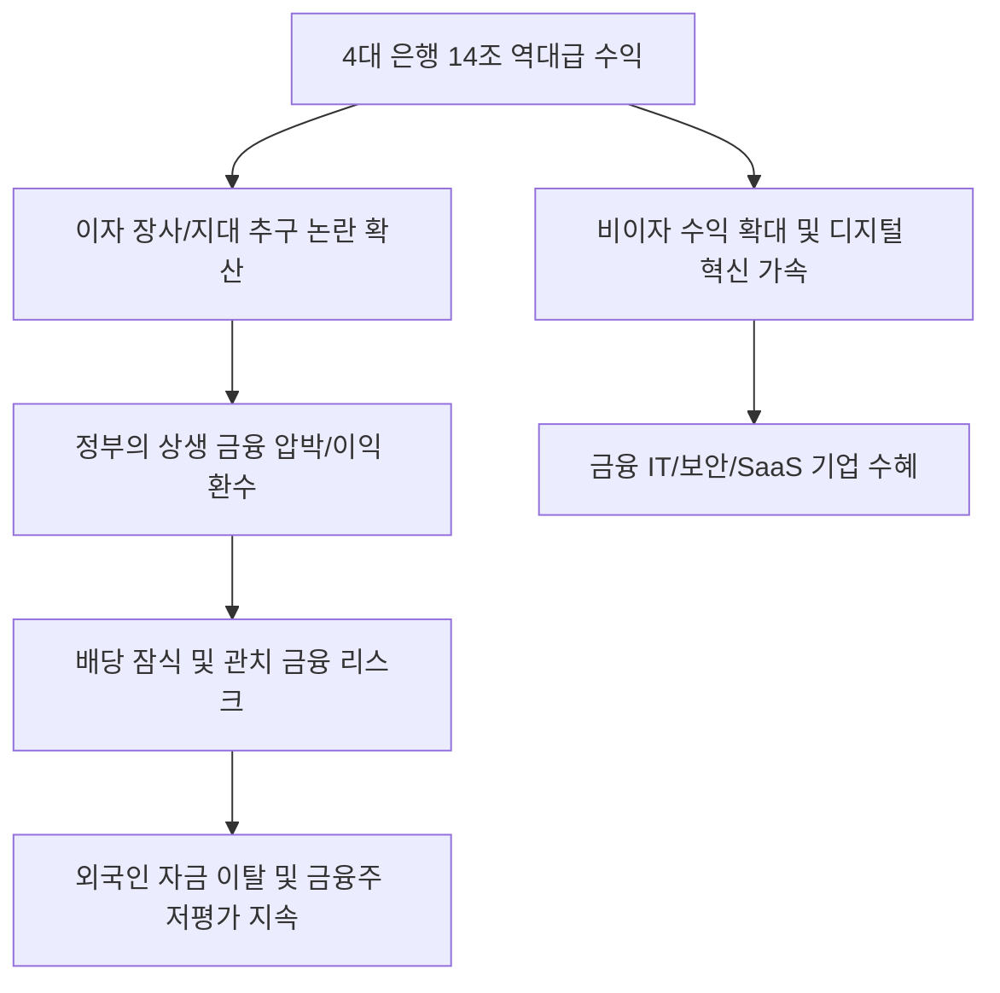

# 금융/정책 분석: 4대 시중은행 14조 역대급 수익, '혁신'인가 '지대'인가
## 투자 신호 + 사회적 영향 평가

---

## 📌 기사 기본 정보

- **날짜**: 2026-03-03
- **출처**: 대한민국 금융권 수익 구조 및 상생 금융 정책 분석 리포트
- **카테고리**: 경제 > 금융 > 산업/정책
- **핵심 주제**: 2025년 4대 시중은행(KB, 신한, 하나, 우리)이 사상 최대인 14조 원의 당기순이익을 기록하며 발생한 '이자 장사' 논란과, 이것이 실질적인 금융 혁신의 결과인지 아니면 과점 체제의 지대 추구(Rent-seeking)인지에 대한 심층 분석 및 정부의 상생 금융 압박 수위 전망

**메타데이터**
- 주요 수치: 4대 은행 합산 당기순이익 14조 원 돌파
- 핵심 이슈: 예대금리차(NIM) 확대 및 가계/기업 대출 이자 수익 비중 과다
- 주요 주체: 금융위원회, 금감원, 4대 금융지주, 대출 이용자(가계/소상공인)
- 키워드: 역대급 수익, 이자 장사 논란, 지대 추구, 상생 금융, 횡재세(Windfall Tax) 논의

---

## 🔍 기사를 통한 투자 신호 추출

### 1단계: 핵심 사건 분해

**What (무엇이 일어났는가?)**
- 고금리 기조 속에서 예금 금리는 천천히 올리고 대출 금리는 빠르게 올리는 '예대마진 인색함'을 통해 은행들이 역대 최대 수익을 올림. 이를 바라보는 국민적 시선이 따가워지자, 정치권과 당국은 '이자 환수' 또는 '상생 금융'이라는 명목으로 은행의 이익을 사회로 강제 환원하려는 압박을 시작함.

**When (언제 일어났는가?)**
- 2026-03-03 (2025년 연간 실적 발표가 마무리되며 은행권의 막대한 배당과 성과급 잔치가 기사화된 시점)

**Why (왜 이 중요한가?)**
- 은행주의 배당 매력(Dividend Yield)이 높아지는 신호인 동시에, 정부 규제 리스크(Regulation Risk)가 최고조에 달하는 양면성을 띠기 때문
- 은행의 수익 구조가 비이자 부문(혁신)이 아닌 이자 부문(지대)에 편중되어 있어 지속 가능성에 의문이 제기됨

**Who (누가 주도하는가?)**
- '돈 잔치'를 경고하며 강력한 사회적 책임을 요구하는 정부 당국
- 주주 가치 제고를 위해 배당 확대를 요구하는 국내외 행동주의 펀드

---

### 2단계: 투자 신호 해석

#### A. **긍정적 신호 (Bullish)**

**① '주주 환원' 강화에 따른 고배당주로서의 가치 부각**
- **신호**: 역대급 이익을 기반으로 한 자사주 소각 및 배당 성향 상향 계획 발표
- **의미**: 규제 압박에도 불구하고 실질적인 현금 흐름이 넘쳐나기에 배당주 투자의 최적기
- **투자 기회**: 국내 4대 금융 지주사(KB, 신한 등), 고배당 ETF

**② '비이자 부문'에서 성과를 내는 디지털 뱅킹 선도주**
- **신호**: 단순 대출 외에 자산 관리(WM), IB 등에서 수익 비중을 높이는 흐름
- **의미**: 정부의 이자 규제에서 상대적으로 자유롭고 진짜 '혁신'으로 인정받는 분야
- **투자 기회**: 플랫폼 경쟁력이 압도적인 인터넷 전문 은행, 글로벌 진출 비중이 높은 금융사

---

#### B. **위험 신호 (Bearish)**

**③ '상생 금융' 명목의 대규모 충당금 적립 및 비용 전가**
- **신호**: 정부 압박에 의한 소상공인 이자 환급 및 대규모 사회 공헌 기여금 출연
- **의미**: 장부상 이익은 크지만 실질적으로 주주에게 돌아올 몫이 정부에 의해 차단됨
- **투자 리스크**: 정부 지침에 민감하게 반응할 수밖에 없는 국책 성격의 은행 및 지주사

**④ 가계 부채 부실화에 따른 '건전성 리스크' 현실화**
- **신호**: 연체율 상승 및 부동산 PF 부실 채권 처리 부담 가중 
- **의미**: 현재의 이익은 과거의 산물일 뿐, 미래에는 막대한 부실을 메워야 할 위험 상존
- **투자 리스크**: 대출 포트폴리오 중 중저신용자 및 고위험 부동산 PF 비중이 높은 금융주

---

### 3단계: 섹터별 투자 기회 매트릭스

#### ✅ **높은 기대도 + 낮은 리스크**

**금융 시스템 전산화 및 '보안 솔루션' 공급 기술 기업**
- 은행이 돈을 많이 벌수록 시스템 고도화와 디지털 자산 보호에 대한 투자는 늘어날 수밖에 없음. 규제 리스크에서 벗어나 은행의 지갑에서 돈을 버는 섹터임
- **투자 추천도**: ⭐⭐⭐⭐

---

## 💰 구체적 투자 신호 변환

### 신호 1: '숫자'에 취하지 말고 '정책의 칼날'을 보라

**투자 해석**: 기사는 은행의 이익이 '독'이 될 수 있음을 시사함. 14조라는 숫자는 투자자에게 기쁨이지만, 정치권에게는 공격의 명분임. 투자자는 지금 즉시 '배당 수익률'만 보고 은행주를 매수하기보다, 정부가 요구하는 '상생 금융 비용'이 이익의 몇 %를 잠식할지 계산해야 함. 이익 대비 규제 비용 변동성이 적은 상장사를 선별하는 것이 2026년 금융주 투자의 핵심임.

---

## 🌍 사회적 영향 평가

### A. 긍정적 사회 영향
- **서민 금융 안전망 강화**: 은행의 막대한 수익 일부가 저금리 대출 전환, 이자 감면 등으로 흘러들어 가 가계와 소상공인의 연쇄 도산을 막는 방파제 역할 수행
- **금융 서비스의 디지털 혁신 유도**: 단순 예대마진 구조의 한계를 느낀 은행들이 살아남기 위해 기술 기반의 새로운 수익 모델을 찾으며 금융 생태계 전반의 기술 고도화 기여

### B. 부정적 사회 영향
- **시장 원리의 훼손과 관치 금융 논란**: 사기업의 정당한 이익을 정부가 압박해 가져가는 선례는 글로벌 투자자들에게 '코리아 디스카운트'의 확실한 증거로 작용하여 장기적 자본 유출 위험
- **실패한 차주의 '도덕적 해이' 조장**: 성실한 상환자보다 연체자에게 혜택이 집중되는 상생 금융 정책이 반복될 경우, 사회 전반의 규범과 금융 질서가 붕괴되는 사회적 리스크

---

## 🎯 결론: 당신의 투자 전략 수립

- **즉시 실행**: 이자 수익 의존도가 90% 이상인 종목 비중 축소, 비이자 수익(디지털, 글로벌) 비중 30% 이상인 종목으로 교체 매수
- **3개월 후**: 금융당국의 배당 가이드라인 발표 및 횡재세 도입 여부 확정 후 금융 섹터 전체 비중 리밸런싱

---

## 📝 Obsidian 연결 구조

