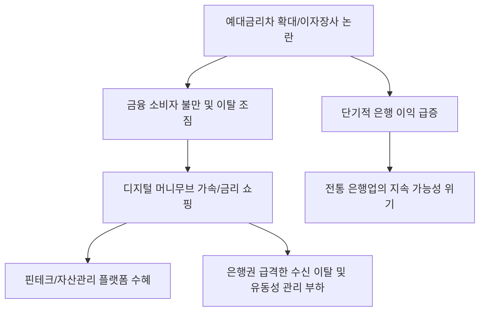

# 금융/리스크 분석: 예대금리차 확대와 머니무브 시대의 '이자 장사' 경고등
## 투자 신호 + 사회적 영향 평가

---

## 📌 기사 기본 정보

- **날짜**: 2026-03-03
- **출처**: 대한민국 예금·대출 금리 추이 및 자본 이동(Money Move) 분석 리포트
- **카테고리**: 경제 > 금융 > 금리/수급
- **핵심 주제**: 고금리 기조 유지 속에서 은행들의 예대금리차(예금 금리와 대출 금리의 차이)가 다시 확대되며 '이자 장사' 논란이 재점화되는 현상과, 조금이라도 높은 금리를 찾아 빠르게 이동하는 '머니무브' 체제에서 은행들이 겪는 유동성 관리 리스크 분석

**메타데이터**
- 주요 이슈: 예대금리차 확대에 따른 은행권 수익 독점 비판
- 핵심 지표: NIM(순이자마진) 변화, 파킹통장 및 정기예금 잔액 변동, 가상자산/해외주식으로의 자금 이탈액
- 주요 주체: 금융소비자, 1금융권 은행, 저축은행, 빅테크 금융 플랫폼
- 키워드: 예대금리차, 머니무브, 이자 장사, 유동성 리스크, 금리 쇼핑

---

## 🔍 기사를 통한 투자 신호 추출

### 1단계: 핵심 사건 분해

**What (무엇이 일어났는가?)**
- 기준 금리가 동결되거나 소폭 하락하는 중에도 시중 은행들은 대출 금리를 높게 유지하면서 예금 금리는 빠르게 내려 예대마진을 챙기고 있음. 이에 분노한 소비자들이 은행 예금을 빼서 채권, 해외 주식, 비트코인 등으로 옮기는 '디지털 머니무브'가 가속화 중이며, 이는 은행들의 수신 구조를 불안정하게 만드는 요인이 됨.

**When (언제 일어났는가?)**
- 2026-03-03 (인공지능 발 증시 랠리와 가상자산 호황이 겹치면서 은행 예금의 기회비용이 극대화된 시점)

**Why (왜 이 중요한가?)**
- 은행의 수익성이 좋아 보이지만, 실상은 수급이 '썰물'처럼 빠져나가는 유동성 위기의 전조일 수 있기 때문
- 스마트폰 앱을 통한 '0.1% 금리 쇼핑'이 일상화되어 은행의 고객 충성도가 제로(0)에 가까워졌기 때문

**Who (누가 주도하는가?)**
- 발 빠른 정보력을 바탕으로 자산을 분산하는 2040 스마트 투자자
- 경쟁적 금리 제시를 통해 시중 자금을 흡수하려는 핀테크 플랫폼 및 증권사

---

### 2단계: 투자 신호 해석

#### A. **긍정적 신호 (Bullish)**

**① '자산 관리(WM) 및 중개 서비스'를 제공하는 핀테크 대장주**
- **신호**: 은행에서 빠져나온 돈이 머무르는 '길목'의 거래량 폭증 
- **의미**: 돈이 어디로 가든, 그 돈을 옮겨주고 관리해주는 곳은 수수료 대박을 터뜨림
- **투자 기회**: 국내외 대표 핀테크 플랫폼, 증권사 MTS 선도주, 가상자산 거래 서비스 제공 기업

**② 높은 금리를 제공하는 '특수 목적 채권' 및 '고금리 예금 대안' 상품**
- **신호**: 정기 예금 이탈 자금을 흡수하는 월배당 ETF 및 회사채 시장 활성화
- **의미**: 은행보다 1%라도 더 높은 안정적 수익을 주는 곳으로 자본이 영구 이동함
- **투자 기회**: 월배당 커버드콜 ETF, 우량 회사채 펀드, 단기 국채 금리 추종 상품

---

#### B. **위험 신호 (Bearish)**

**③ 수신 기반이 약한 '중소형 저축은행 및 제2금융권'의 유동성 사각지대**
- **신호**: 예금 금리 경쟁에서 대형 은행에 밀려 뱅크런(펀드런) 우려 노출
- **의미**: 돈이 빠져나갈 때 가장 먼저 무너지는 것은 신용도가 낮고 금리 차별화가 안 되는 곳임
- **투자 리스크**: PF 부실 노출도가 높고 예금 이탈이 시작된 상장 저축은행 및 캐피탈 사

**④ '충성도 낮은 예금' 비중이 높은 대형 시중 은행의 밸류에이션 정체**
- **신호**: 실적은 좋으나 미래 예금 확보를 위한 마케팅 비용 및 이자 비용 상승 예고
- **의미**: 현재의 고이익은 '막판 불꽃'일 수 있으며, 자금 탈출 속도가 빨라질수록 건전성 관리 비용 급증
- **투자 리스크**: 가계 대출 의존도가 지나치게 높고 비이자 수익 기반이 약한 시중 은행주

---

### 3단계: 섹터별 투자 기회 매트릭스

#### ✅ **높은 기대도 + 낮은 리스크**

**글로벌 현금 흐름을 선점한 '전자 결제 및 송금' 글로벌 기업**
- 머니무브가 심해질수록 국경을 넘는 자금 이동과 결제 건수는 비약적으로 늘어남. 전 세계 돈의 흐름을 쥐고 있는 인프라 기업은 이자 장사 논란과 무관한 수혜주임
- **투자 추천도**: ⭐⭐⭐⭐⭐

---

## 💰 구체적 투자 신호 변환

### 신호 1: '금리 장벽'을 넘는 자본의 대탈출을 목격하라

**투자 해석**: 기사는 은행이라는 폐쇄된 공간에 더 이상 돈이 갇혀 있지 않음을 시사함. 투자자는 지금 즉시 '은행 수익성 개선'이라는 단순 지표에 속지 말아야 함. 은행 예금이 이탈하여 '어디로 흘러가고 있는가'가 훨씬 중요한 투자 지표임. 현재 그 자금은 '안전한 고배당'이나 '초성장 기술주'로 흐르고 있음. 은행주 대신, 은행을 탈출한 자금을 관리해주는 '디지털 자산 관리자'를 사는 것이 최고의 헤지 전략임.

---

## 🌍 사회적 영향 평가

### A. 긍정적 사회 영향
- **금융 소비자의 권리 강화와 시장 효율성 제고**: 금리 비교가 쉬워지며 소비자들이 더 나은 선택을 할 수 있게 되었고, 은행들 간의 실질적인 경쟁을 유도하여 금융 서비스의 질적 향상 기여
- **자본의 생산적 재배치 가속**: 은행 금고에 잠겨 있던 돈이 주식/채권 시장으로 흘러 들어가 기업들의 투자 자금으로 활용되며 경제의 활력을 높이는 선순환 촉진

### B. 부정적 사회 영향
- **금융 시스템의 변동성 확대와 '디지털 뱅크런' 리스크**: 스마트폰 터치 몇 번으로 조 단위의 돈이 순식간에 빠져나가는 시대에, 은행들의 유동성 위기가 사회 전체의 신용 경색으로 순식간에 전이될 수 있는 사회적 공포 증폭
- **정보 격차에 따른 부의 양극화 심화**: 머니무브에 동참하지 못하는 고령층이나 정보 취약 계층은 낮은 금리에 자산이 묶여 실질 가치가 하락하는 반면, 발 빠른 투자자들은 자산을 불려가는 격차 확대 위험

---

## 🎯 결론: 당신의 투자 전략 수립

- **즉시 실행**: 포트폴리오 내 전통 은행 비중 20% 이내로 축소, 핀테크 및 자산 관리 플랫폼 비중 상향, '파킹통장형' ETF 비중 확대
- **3개월 후**: 미 기준 금리 변화에 따른 머니무브 방향성(유턴 vs 가속) 재점검 후 자산 재배치

---

## 📝 Obsidian 연결 구조

