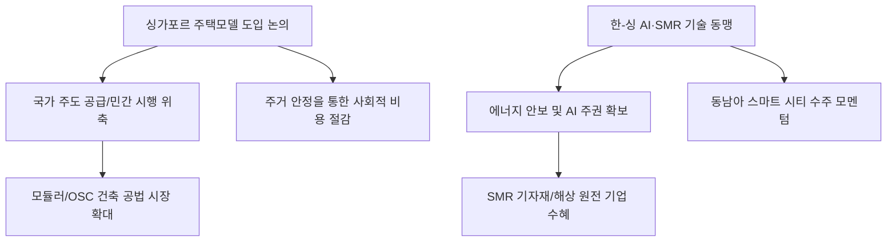

# 외교/기술 분석: 싱가포르 부동산 모델과 AI·SMR 동맹, '국가 주도'의 미래 전략
## 투자 신호 + 사회적 영향 평가

---

## 📌 기사 기본 정보

- **날짜**: 2026-03-03
- **출처**: 글로벌 정책 혁신 매거진 및 한-싱가포르 기술 외교 분석 리포트
- **카테고리**: 경제 > 외교 > 기술/부동산
- **핵심 주제**: 싱가포르의 주택 공급 모델(공공 주도)과 한국의 건설 역량이 결합하여 글로벌 부동산 위기를 돌파하려는 시도와, 인공지능(AI) 및 소형모듈원자로(SMR) 분야에서의 한·싱 기술·에너지 동맹을 통한 미래 산업 주도권 확보 전략 분석

**메타데이터**
- 주요 이슈: 자국 우선주의 속 '정책 및 기술 소국'들의 연합(Small Giant Alliance)
- 핵심 키워드: 싱가포르 주택모델(HDB), SMR(소형 모듈 원자로), AI 주권, 에너지 안보
- 주요 주체: 대한민국 외교부/국토부, 싱가포르 투자청(GIC), 글로벌 SMR 개발사, AI 연구소
- 키워드: 싱가포르 모델, SMR 동맹, AI 주권 협력, 국가 주도 공급, 미래 기술 외교

---

## 🔍 기사를 통한 투자 신호 추출

### 1단계: 핵심 사건 분해

**What (무엇이 일어났는가?)**
- 한국 정부가 싱가포르의 공공 주택 모델(HDB)을 벤치마킹하여 국내 주거 불안을 해결하려는 움직임을 보이며, 동시에 싱가포르는 한국의 SMR 제조 능력과 AI 응용 기술을 탐내고 있음. 양국은 전략적으로 '부동산 공급 모델 + 차세대 에너지 + AI 안보'를 묶어 글로벌 거강대국 사이에서 생존권을 확보하려는 '테크-폴리시(Tech-Policy) 동맹'을 구축함.

**When (언제 일어났는가?)**
- 2026-03-03 (전 세계적으로 에너지 부족과 주거비 폭등이 사회 붕괴 위기를 초래하며 실용주의적 국가 간 연합이 절실해진 시점)

**Why (왜 이 중요한가?)**
- 싱가포르 모델은 단순한 부동산 대책이 아니라 '국가 지속 가능성'의 상징이기 때문
- SMR은 데이터 센터 폭증에 따른 AI 시대의 필수 에너지원이기 때문
- 한국의 제조력과 싱가포르의 금융/운영력이 만나면 제3국(동남아 등) 시장을 장악할 수 있기 때문

**Who (누가 주도하는가?)**
- 국가 경제의 체질 개선을 원하는 전략적 정책 입안자들
- 국경을 넘어 대규모 인프라 수주를 노리는 대형 건설사 및 원전 기자재 기업

---

### 2단계: 투자 신호 해석

#### A. **긍정적 신호 (Bullish)**

**① 'SMR 및 차세대 에너지 인프라' 핵심 기자재 공급사**
- **신호**: 싱가포르-한국 간 SMR 시범 사업 및 공동 투자 펀드 조성 뉴스
- **의미**: 좁은 영토에서 고밀도 전력이 필요한 국가들에게 SMR은 '구원투수'임. 수주 봇물 예고
- **투자 기회**: SMR 핵심 설계 기술 보유사, 원전 주단조품 제조사, 해상 원전 플랫폼 기업

**② 공공 주도 개발과 연공된 '하이엔드 모듈러 건축' 기술 기업**
- **신호**: 싱가포르식 고층 공공 주택 공급을 위한 프리캐스트 콘크리트(PC) 및 모듈러 공법 채택 가속화
- **의미**: 건설이 '현장 시공'에서 '공장 제조'로 바뀌며 공기 단축과 원가 절감의 핵심이 됨
- **투자 기회**: 대형 건설사 내 모듈러 사업부, OSC(Off-Site Construction) 전문 기업

---

#### B. **위험 신호 (Bearish)**

**③ '민간 시행/분양' 위주의 전통적 부동산 개발 섹터의 위축**
- **신호**: 싱가포르 모델(공공 주도 저렴한 공급)의 국내 도입 논의 활성화
- **의미**: 민간 개발업자의 마진율이 정부 규제와 공공 공급에 밀려 장기적으로 축소됨
- **투자 리스크**: 고가 분양 위주의 시행사, 수도권 정비 사업 위주의 중소 건설사

**④ 독자적 생태계 없이 '외산 AI'에만 의존하는 일반 소프트웨어 기업**
- **신호**: 싱가포르처럼 'AI 주권' 확보를 위한 국가 간 공동 모델 개발 추진
- **의미**: 글로벌 빅테크의 AI를 단순히 재판매하는 기업은 국가적 전략에서 소외됨
- **투자 리스크**: 자체 모델이나 특화 데이터 없이 API만 활용하는 단순 챗봇 서비스 사

---

### 3단계: 섹터별 투자 기회 매트릭스

#### ✅ **높은 기대도 + 낮은 리스크**

**국가 간 '기술 표준' 및 '보안 통신 인프라'를 담당하는 데이터 센터 중립주**
- AI와 에너지가 결합하는 지점에서 보안과 전송을 책임지는 인프라 주는 어떤 정책 변화에도 살아남는 필수재임
- **투자 추천도**: ⭐⭐⭐⭐⭐

---

## 💰 구체적 투자 신호 변환

### 신호 1: '에너지'를 쥔 건설주가 미래의 '진짜 부동산 주'다

**투자 해석**: 기사는 부동산과 에너지가 더 이상 분리된 영역이 아님을 시사함. 싱가포르 모델은 에너지 효율과 주거 안정을 동시에 추구함. 투자자는 지금 즉시 '단순 아파트 건설사'에서 'SMR 기반 에너지 인프라 건설사'로 시각을 넓혀야 함. 한국 건설사 중 SMR 기술을 내포하고 싱가포르 등 해외 공공 수주 역량이 있는 대장주를 선점하는 것이 10년 성장의 핵심임.

---

## 🌍 사회적 영향 평가

### A. 긍정적 사회 영향
- **주거 안정의 새로운 패러다임 제시**: 싱가포르식 공공 주도의 안정적 공급을 통해 청년 및 서민층의 자산 형성 사다리를 복원하고 사회적 갈등 완화 기여
- **저탄소 에너지 혁명 선도**: SMR 배치를 통해 탄소 배출 없이 AI 시대에 필요한 거대한 전력 수요를 충당함으로써 지구 온난화 대응과 산업 발전을 동시에 달성

### B. 부정적 사회 영향
- **국가 비대화에 따른 민간 창의성 위축**: 모든 공급을 국가가 주도할 경우 발생할 수 있는 관료주의적 비효율과 소비자의 선택권 제한 및 민간 시장 활력 저하 위험
- **기술 식민지화 리스크**: AI와 원자력 등 핵심 기술에 대한 국가 간 동맹이 특정 강대국이나 기업의 이익에 종속될 경우 발생하는 국가 주권 침해 및 기술 유출 우려

---

## 🎯 결론: 당신의 투자 전략 수립

- **즉시 실행**: 포트폴리오 내 SMR 관련주 비중 30%로 상향, 모듈러 건축 선도 기업 탐색 및 편입
- **3개월 후**: 한-싱 정상회담이나 구체적인 SMR 공동 개발 로드맵 발표 내용 확인 후 비중 확대 시점 조율

---

## 📝 Obsidian 연결 구조

