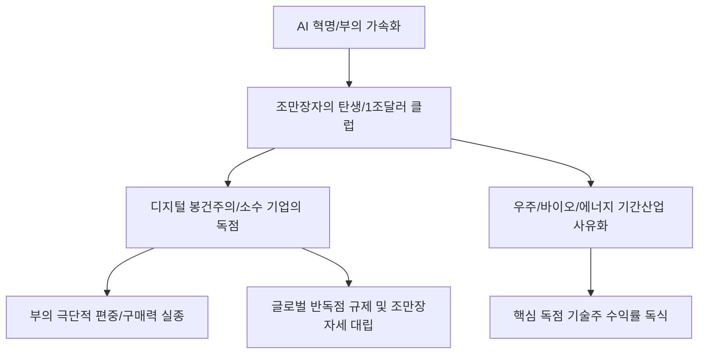

# 거시/경제 분석: 조만장자(Trillionaire)의 탄생과 빅테크 지배력의 거대 재편
## 투자 신호 + 사회적 영향 평가

---

## 📌 기사 기본 정보

- **날짜**: 2026-03-03
- **출처**: 글로벌 부의 불균형 리서치 및 빅테크 독점력 분석 리포트
- **카테고리**: 경제 > 거시경제 > 기업/산업
- **핵심 주제**: 인공지능(AI) 혁명을 통해 개인 자산 1,000조 원(1조 달러) 시대를 여는 '조만장자(Trillionaire)'의 등장이 임박하며, 소수 빅테크 기업들이 전 세계 부와 데이터, 에너지를 독점하며 발생시키는 권력 지형의 재편과 이에 따른 사회적 파급 효과 분석

**메타데이터**
- 주요 이슈: 자산 1조 달러(Trillionaire) 첫 후보 등장 (머스크, 젠슨 황 등)
- 핵심 원동력: AI 가속기 시장 독점, 우주 인터넷, 로보틱스 상용화
- 주요 주체: 글로벌 억만장자, 빅테크 5대장(MAGMA), 반공정 규제 당국
- 키워드: 조만장자, 부의 독점, 빅테크 재편, AI 자본주의, 디지털 봉건주의

---

## 🔍 기사를 통한 투자 신호 추출

### 1단계: 핵심 사건 분해

**What (무엇이 일어났는가?)**
- 자산의 증가 속도가 인류 역사상 유례를 찾기 힘들 정도로 가속화됨. 과거 백만장자, 억만장자를 넘어 이제는 국가 예산과 맞먹는 부를 개인이 소유하는 '조만장자'의 탄생이 눈앞임. 이들은 단순한 부자를 넘어 AI 인프라와 우주 항로 등 인류의 생존에 필수적인 '미래 기간 산업'을 사유화하며 디지털 권력을 영속화하고 있음.

**When (언제 일어났는가?)**
- 2026-03-03 (AI 연산 능력의 기하급수적 성장과 빅테크 기업 가치가 사상 최고치를 경신하며 부의 쏠림 현상이 통계적 임계점을 넘은 시점)

**Why (왜 이 중요한가?)**
- 부의 집중이 '혁신'을 넘어 '장벽'이 되어 경쟁을 가로막고 있기 때문
- 조만장자의 탄생은 곧 '국가 권력'에 대한 위협이자 새로운 글로벌 통치 체제의 등장이기 때문
- 이들이 집행하는 거대 투자금이 곧 전 세계 주식 시장의 방향타가 되기 때문

**Who (누가 주도하는가?)**
- AI의 핵심 뇌를 쥐고 있는 테크 천재 경영자들
- 이들의 독점적 지배력에 올라타서 거대 배당을 챙기는 소수의 기관 투자자

---

### 2단계: 투자 신호 해석

#### A. **긍정적 신호 (Bullish)**

**① 조만장자가 이끄는 '에코시스템(Ecosystem)' 내의 핵심 독점 기업**
- **신호**: 특정 리더가 주도하는 기업 결합(예: AI-자율주행-우주 통합) 시너지 폭발
- **의미**: 분산 투자가 무의미해짐. '될 놈'인 소수의 조만장자 기업이 시장 수익률의 90%를 독점함
- **투자 기회**: 조만장자 후보군이 지배하는 모기업 및 독점 기술 보유 자회사

**② 조만장자들의 주된 관심사인 '안티에이징(바이오)' 및 '우주 인프라'**
- **신호**: 상상도 못 할 막대한 자본이 인간의 수명 연장과 지구 밖 자원 개발로 유입
- **의미**: 이들의 개인적 욕망이 곧 시장의 거대 테마가 되어 하이테크 하방을 탄탄하게 지지함
- **투자 기회**: 노화 역전 기술 전문 스타트업, 민간 우주선 발사 및 저궤도 위성 통신사

---

#### B. **위험 신호 (Bearish)**

**③ '디지털 독점'에 대한 글로벌 규제(Digital Tax/Antitrust)의 파멸적 강화**
- **신호**: EU 및 미국 법무부의 빅테크 강제 분할 판결 및 조만장자세(Tax) 도입 논의
- **의미**: 부의 정점에서 맞이할 가장 큰 리스크는 '정치적 해체'임
- **투자 리스크**: 독점 논란의 정점에 서 있는 슈퍼 빅테크, 조세 회피처 기반의 자산 운용사

**④ 중산층 실종에 따른 '대중 소비재' 시장의 만성적 수축**
- **신호**: 부의 99%가 최상단에 쏠리며 대다수 서민의 구매력이 바닥나는 현상
- **의미**: 조만장자는 명품 가방 100만 개를 사지 않음. 시장 전체의 수요 부족(Glut) 발생
- **투자 리스크**: 평범한 중가 브랜드, 일반 가전, 대중적 관광 상품 섹터

---

### 3단계: 섹터별 투자 기회 매트릭스

#### ✅ **높은 기대도 + 낮은 리스크**

**글로벌 조만장자들의 자산을 관리하거나 그들과 '협력'하는 '수탁 전문 금융기관'**
- 조만장자의 탄생은 그들을 지원하는 수수료 비즈니스의 대호황을 의미함. 자산의 안전한 보관과 증식 서비스를 제공하며 함께 성장
- **투자 추천도**: ⭐⭐⭐⭐

---

## 💰 구체적 투자 신호 변환

### 신호 1: '지수'보다 '사람'을 추종하라

**투자 해석**: 기사는 자산 시장이 '종목'이 아닌 '인물' 중심의 봉건적 구조로 재편되고 있음을 시사함. 투자자는 지금 즉시 포트폴리오를 분산하기보다, '조만장자'로 등극할 확률이 높은 소수의 리더가 이끄는 기업에 집중(Focus)해야 함. 이들이 곧 '알고리즘'이고 '안보'이며 '시장' 그 자체임. 분산 투자는 죽었고, 이제는 누구의 편에 서서 그 낙수 효과를 누릴 것인가의 싸움임.

---

## 🌍 사회적 영향 평가

### A. 긍정적 사회 영향
- **인류 난제 해결의 속도 비약적 향상**: 국가 예산으로도 불가능했던 암 정복, 에너지 혁명, 화성 이주 등 거대 담론을 개인이 집행하며 기술의 특이점(Singularity) 시기를 앞당김
- **새로운 필란트로피(Philanthropy) 문화의 확산**: 조만장자들이 자발적으로 기후 위기 극복이나 질병 퇴치를 위해 천문학적 자산을 기부하며 공공 부문의 부족한 자원 보완

### B. 부정적 사회 영향
- **'디지털 봉건주의'의 고착화와 민주주의의 위기**: 소수의 조만장자가 정보와 알고리즘을 통제하여 대중의 생각을 조종하고, 국가 권력까지 압도하여 민주적 의사결정 시스템 무력화
- **사회적 이동성(Social Mobility)의 영구 박멸**: 자본이 자본을 낳는 속도가 기하급수적으로 빨라지며, 평범한 사람이 노력으로 신분을 상승시키는 주거/교육 사다리가 완전히 붕괴되는 사회적 절망 확산 리스크

---

## 🎯 결론: 당신의 투자 전략 수립

- **즉시 실행**: 범용 지수 ETF 비중 하향, AI/에너지/우주 융합을 주도하는 '슈퍼 리더' 관련주 비중 30% 신규 진입
- **3개월 후**: 글로벌 반격 규제 뉴스 추이를 모니터링하여, 법적 해제 리스크가 큰 종목에서 하부 벤더 기술주로 이익 실현 후 이동

---

## 📝 Obsidian 연결 구조

