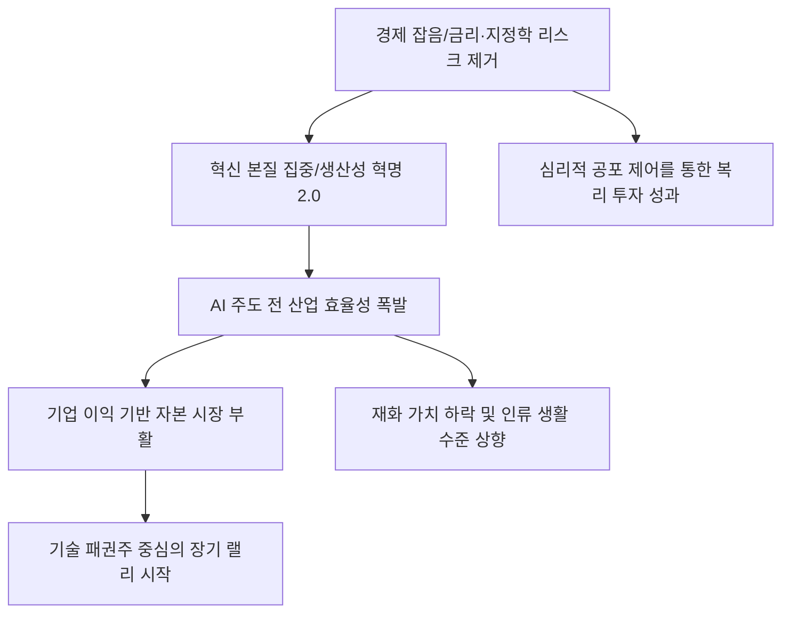

# 거시/혁신 분석: 켄 캐플런의 '경제 잡음 제거'와 AI 발 생산성 혁명 및 자본 시장의 부활
## 투자 신호 + 사회적 영향 평가

---

## 📌 기사 기본 정보

- **날짜**: 2026-03-04
- **출처**: 글로벌 거시 경제 전략 분석 및 미래 기술 경영 리포트
- **카테고리**: 경제 > 거시경제 > 기술혁신
- **핵심 주제**: 켄 캐플런(Ken Kaplan)의 시각을 통해 단기적인 인플레이션과 금리 변동이라는 '경제 잡음(Noise)'을 제거하고, AI 혁신이 주도하는 근본적인 '생산성 혁명'이 어떻게 자본 시장의 장기적 부활과 인류의 질적 성장을 견인할 것인가에 대한 프레임워크 분석

**메타데이터**
- 주요 이슈: 거시 경제의 불확실성을 넘어서는 기술적 특이점 도래
- 핵심 키워드: 경제 잡음 제거(Noise Reduction), 생산성 혁명 2.0, 자본의 기술적 부활
- 주요 주체: 글로벌 우량 성장 기업, 전략적 장기 투자자, AI 인프라 공급자
- 키워드: 켄 캐플런, 경제 잡음, 생산성 혁명, 자본 시장 부활, AI 산업화

---

## 🔍 기사를 통한 투자 신호 추출

### 1단계: 핵심 사건 분해

**What (무엇이 일어났는가?)**
- 오늘날 시장은 '금리 0.25%p 인상 여부'나 '단기 유가 등락'과 같은 지엽적인 뉴스(잡음)에 과도하게 반응하고 있음. 하지만 켄 캐플런은 이러한 잡음을 걷어내면, AI가 전 산업의 효율을 기하급수적으로 높이는 '거대한 생산성 상승'이라는 거시적 흐름이 보인다고 주장함. 이는 과거 인터넷 보급 시기보다 더 강력한 자본 시장의 장기 랠리를 의미함.

**When (언제 일어났는가?)**
- 2026-03-04 (지정학적 리스크와 통화 정책의 불확실성이 극대화되어 투자자들이 본질적인 성장 동력을 놓치고 있는 혼란의 시기)

**Why (왜 이 중요한가?)**
- 잡음에 휩쓸린 공포 매도는 '세기의 투자 기회'를 놓치게 만들기 때문
- AI는 단순한 유행이 아니라, '비용'을 '수익'으로 바꾸는 근본적인 생산 공정의 재편이기 때문
- 자본 시장은 결국 '미래 현금 흐름의 현재 가치'이며, 기술이 그 흐름을 폭발시킬 것이기 때문

**Who (누가 주도하는가?)**
- 잡음에 흔들리지 않고 핵심 기술을 선점하는 '확신(Conviction) 투자자'
- AI를 실제 비즈니스 모델에 이식하여 실적 수치로 증명해내는 테크 주도 기업들

---

### 2단계: 투자 신호 해석

#### A. **긍정적 신호 (Bullish)**

**① '실질 생산성'이 숫자로 찍히는 AI 수혜 하드웨어 및 인프라 사**
- **신호**: 데이터 센터 수요 폭증과 AI 칩의 공급 부족 장기화 
- **의미**: 잡음과 관계없이 '실제로 팔리는 물건'이 있는 곳에는 자본이 몰릴 수밖에 없음
- **투자 기회**: 차세대 반도체 공정 장비주, 데이터 센터용 전력 인프라 기기주

**② 경제 잡음을 스스로 걸러내는 '디지털 자산 관리 및 알고리즘' 산업**
- **신호**: AI 기반의 정교한 자산 배분 모델이 시장 수익률을 압도하기 시작함
- **의미**: 인간의 '감정적 잡음'을 배제한 기계적 투자가 시장의 주류가 됨
- **투자 기회**: 퀀트 투자 인프라 제공 기업, AI 기반 리서치 사, 자동화 자산 운용 플랫폼

---

#### B. **위험 신호 (Bearish)**

**③ '잡음'을 먹고 사는 단기 투기 테마 및 고변동성 파생 상품**
- **신호**: 실체 없는 뉴스에 널뛰기를 반복하다 본질적인 반등 시점에서 소외됨
- **의미**: 장기적 생산성 혁명을 믿지 못하고 단타에 치중하는 자본은 결국 마이너스 수익률 기록
- **투자 리스크**: 정기적인 실적 발표 없이 뉴스 헤드라인에만 의존하는 급등주

**④ 기술 혁신에서 소외된 '구경제(Old Economy)'의 만성적 가치 하락**
- **신호**: AI 도입에 실패한 전통적 제조 및 서비스업의 마진율 지속 하락
- **의미**: 세상은 효율화되는데 자기만 제자리라면, 상대적 가치는 '제로'에 수렴함
- **투자 리스크**: 디지털 전환 예산이 부족하고 혁신 의지가 없는 좀비 기업

---

### 3단계: 섹터별 투자 기회 매트릭스

#### ✅ **높은 기대도 + 낮은 리스크**

**글로벌 생산성 혁명을 '안보' 차원에서 지원하는 국가 전략 기술주**
- 잡음이 많은 시장에서도 국가가 보조금을 주고 보호해주는 핵심 산업은 흔들리지 않는 뿌리가 됨
- **투자 추천도**: ⭐⭐⭐⭐⭐

---

## 💰 구체적 투자 신호 변환

### 신호 1: '헤드라인'을 끄고 '영업이익률'을 켜라

**투자 해석**: 기사는 투자자들이 '뉴스'가 아닌 '실체'에 집중해야 함을 시사함. 켄 캐플런의 핵심은 '기술이 비용을 얼마나 극적으로 낮추는가'를 보는 것임. 투자자는 지금 즉시 포트폴리오 내 종목들이 AI를 통해 인건비나 공정 비용을 20% 이상 절감할 계획이 있는지 확인해야 함. 그런 종목은 어떠한 매크로 잡음 속에서도 결국 자본 시장의 부활을 주도할 '진짜 주인공'이 될 것임.

---

## 🌍 사회적 영향 평가

### A. 긍정적 사회 영향
- **산업 전반의 효율성 평준화**: AI 생산성 혁명이 공급망과 물류의 비효율을 줄여, 전 지구적 물가 안정과 생활 필수품의 가격 하락에 기여
- **노동의 질적 전환**: 반복적이고 소모적인 업무를 AI에 맡기고, 인간은 더 창의적이고 가치 있는 일에 집중하게 되어 사회 전체의 자아실현 욕구 증대

### B. 부정적 사회 영향
- **디지털 정보 격차에 따른 부의 편중**: 캐플런의 시각(잡음 제거 능련)을 가진 소수의 기술 엘리트만 자본 증식의 혜택을 누리고, 그렇지 못한 대중은 시장 변동성의 소모품으로 전락하는 사회적 불평등
- **인간 직관의 실종과 알고리즘 맹신**: 모든 판단을 시스템에 맡기며 발생하는 'AI 블랙박스 리스크'와, 이로 인해 예기치 못한 시장 오작동 시 발생하는 대규모 사회적 손실 가능성 리스크

---

## 🎯 결론: 당신의 투자 전략 수립

- **즉시 실행**: 단기 뉴스 중심의 단타 비중 전량 매도 유도, AI 인프라 대장주에 1년 이상 장기 투자 포지션 구축
- **3개월 후**: AI 기술이 실제 기업들의 1분기 실적(어닝)에 미친 생산성 향상 비율 통계 확인 후 비중 확대 조율

---

## 📝 Obsidian 연결 구조

