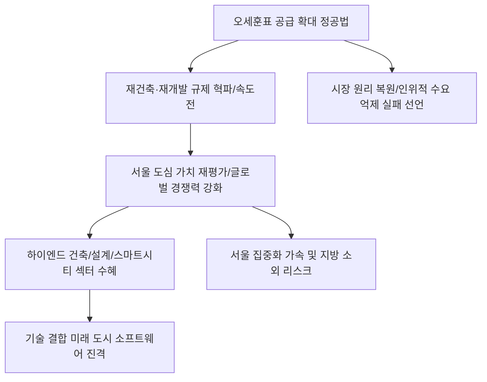

# 부동산/정책 분석: 오세훈의 '공급 확대' 정공법과 미래 도시 소프트웨어 전략
## 투자 신호 + 사회적 영향 평가

---

## 📌 기사 기본 정보

- **날짜**: 2026-03-04
- **출처**: 서울시 도시 개발 계획 및 대한민국 부동산 정책 심층 진단 리포트
- **카테고리**: 경제 > 부동산 > 정책/도시개발
- **핵심 주제**: 서울시 오세훈 시장이 추진하는 '공급 확대 정공법'의 실질적 효과와 "시장을 이기려는 정부(규제 만능주의)는 필패한다"는 강력한 경고 메시지 분석, 그리고 하드웨어 중심의 도시 개발을 넘어 기술과 문화가 결합된 '미래 도시 소프트웨어' 전략의 향방 분석

**메타데이터**
- 주요 이슈: 재개발·재건축 규제 완화를 통한 신속한 주택 공급
- 핵심 철학: 시장 원리 정중행(正道行), 초고층 클러스터와 수변 공간 개발
- 주요 주체: 서울특별시, 국토교통부, 국내 대형 건설사, 서울 시민
- 키워드: 공급 확대, 시장 정공법, 미래 도시 소프트웨어, 그레이트 한강, 신속통합기획

---

## 🔍 기사를 통한 투자 신호 추출

### 1단계: 핵심 사건 분해

**What (무엇이 일어났는가?)**
- 과거의 인위적인 수요 억제(대출 규제, 세금 폭탄)가 아닌 '양질의 주택을 충분히 공급하겠다'는 시장 친화적 정책이 서울시 주도로 본격화됨. 용적률 제한 완화와 '신속통합기획'을 통해 사업 속도를 획기적으로 줄이며, 한강변을 중심으로 뉴욕이나 런던 같은 글로벌 경쟁력을 갖춘 초고층 스카이라인을 구축하는 '미래 도시' 리모델링이 시작됨.

**When (언제 일어났는가?)**
- 2026-03-04 (수도권 주거 안정이 차기 지방선거와 대선의 핵심 키워드로 부상하며 정책의 실질적 결과(입주 물량 확보)가 필요한 시점)

**Why (왜 이 중요한가?)**
- 부동산 가격은 규제가 아닌 '수익성'과 '물량'에 의해 결정된다는 시장의 진리를 확인시켜주기 때문
- 서울의 도시 경쟁력이 국가 전체의 부와 연결되는 '도시 가치 극대화' 전략이기 때문
- 노후화된 도심을 방치할 경우 발생하는 사회적 비용(슬럼화, 안전 사고)을 예방하기 위함

**Who (누가 주도하는가?)**
- '시장 파이터'를 자처하며 공급 폭탄을 투하하는 서울시 행정부
- 규제 완화의 흐름을 타고 고부가가치 정비 사업에 뛰어드는 대형 건설 및 건축 설계 사

---

### 2단계: 투자 신호 해석

#### A. **긍정적 신호 (Bullish)**

**① 하이엔드 건축 설계 및 '공간 테크' 전문 기업의 가치 급등**
- **신호**: 초고층 랜드마크 건립 허가 및 수변 공간 특화 설계 주문화
- **의미**: 단순 성냥갑 아파트가 아닌 '작품'으로서의 건축 수요 폭증. 설계 비중과 부가가치 상승
- **투자 기회**: 국내 1위 건축 설계 로펌 스타일 사, BIM(빌딩정보모델링) 솔루션 기업

**② 서울 도심 '노후 정비 사업' 수주 점유율이 높은 상위 5대 건설사**
- **신호**: 신속통합기획 및 구역 지정 가속화에 따른 일감 확보
- **의미**: 지방 사업은 죽어도 서울 요지의 재개발권은 현금 흐름의 황금 알을 낳는 거위가 됨
- **투자 기회**: 서울 내 대규모 단지 정비 사업 권한을 많이 쥔 1군 건설 브랜드 기업

---

#### B. **위험 신호 (Bearish)**

**③ '시장 억제'에만 매달리는 중앙 정부 주도의 획일적 신도시 개발**
- **신호**: 서울 도심 공급 확대 정책과 대비되는 접근성 떨어지는 외곽 신도시의 외면
- **의미**: 서울의 매력이 높아질수록 서울 밖 베드타운의 자산 가치는 상대적으로 크게 하락함
- **투자 리스크**: 서울 접근성이 낮은 수도권 외곽 토지 및 미분양 우려가 큰 지방 건설사

**④ 규제 강화에만 베팅했던 '하락론자' 대상의 부동산 파생 상품/매물**
- **신호**: 공급 확대가 '가격 폭락'이 아닌 '가치의 질적 상향'으로 이어질 경우의 오판 리스크
- **의미**: 신규 공급되는 프리미엄 주택들이 주변 시세를 견인하며 장기 우상향의 기준을 바꿈
- **투자 리스크**: 공급 폭탄 뉴스만 듣고 무조건적인 하락을 예상한 자산 매도 및 공매도 포지션

---

### 3단계: 섹터별 투자 기회 매트릭스

#### ✅ **높은 기대도 + 낮은 리스크**

**미래 도시의 소프트웨어인 '스마트 시티 운영 및 자율주행 정밀 지도' 기업**
- 도시가 고밀도화·초고층화될수록 내부의 이동과 관리는 소프트웨어가 담당함. 오세훈 시장의 '미래 도시' 핵심은 결국 지능형 도시 운영임
- **투자 추천도**: ⭐⭐⭐⭐⭐

---

## 💰 구체적 투자 신호 변환

### 신호 1: '규제의 틈'이 아닌 '크레인의 움직임'을 보라

**투자 해석**: 기사는 부동산 투자의 패러다임이 '규제 피해 다니기'에서 '개발의 핵심지로 침투하기'로 환치되었음을 시사함. 서울시의 자력 갱생은 곧 '서울 집중화'의 극대화를 의미함. 투자자는 지금 즉시 서울 외곽의 비우량 자산을 정리하고, '오세훈표 개발'이 진행되는 한강변과 도심 핵심 거점의 지분(조합원 자격이나 관련 상장사)을 확보해야 함. 시장과 싸우지 않는 정부와 손잡는 것이 이번 사이클의 필승법임.

---

## 🌍 사회적 영향 평가

### A. 긍정적 사회 영향
- **서울의 글로벌 도시 경쟁력 제고**: 노후화된 도심을 첨단 기술과 수변 녹지가 어우러진 공간으로 변모시켜 세계적인 자본과 인재를 끌어들이는 메트로폴리탄으로 도약
- **주거 품질의 상향 평준화**: 신속한 공급을 통해 고질적인 주택 부족 문제를 해결하고, 시민들에게 보다 쾌적하고 안전한 최첨단 주거 환경 제공 기여

### B. 부정적 사회 영향
- **젠트리피케이션과 서민 소외 가중**: 대대적인 재개발 과정에서 원주민들이 쫓겨나고, 지나치게 인상된 분양가로 인해 일반 서민들이 느끼는 박탈감과 주거 격차 심화
- **서울 집중화에 따른 국토 균형 발전 저해**: 서울이 너무 매력적인 '슈퍼 시티'가 되면서 지방의 인구와 자본이 블랙홀처럼 빨려 들어가 지방 소멸과 국가 전체적 성장 불균형 리스크 증대

---

## 🎯 결론: 당신의 투자 전략 수립

- **즉시 실행**: 수도권 외곽 비인기 부동산 매도 유도, 서울 핵심 정비 사업 리스트 및 관련 설계/건설 대장주 분할 매수
- **3개월 후**: 서울시 신규 구역 지정 현황과 실제 이주 수요 데이터를 바탕으로 관련 내수 소비재(인테리어 등) 섹터 타점 조율

---

## 📝 Obsidian 연결 구조

