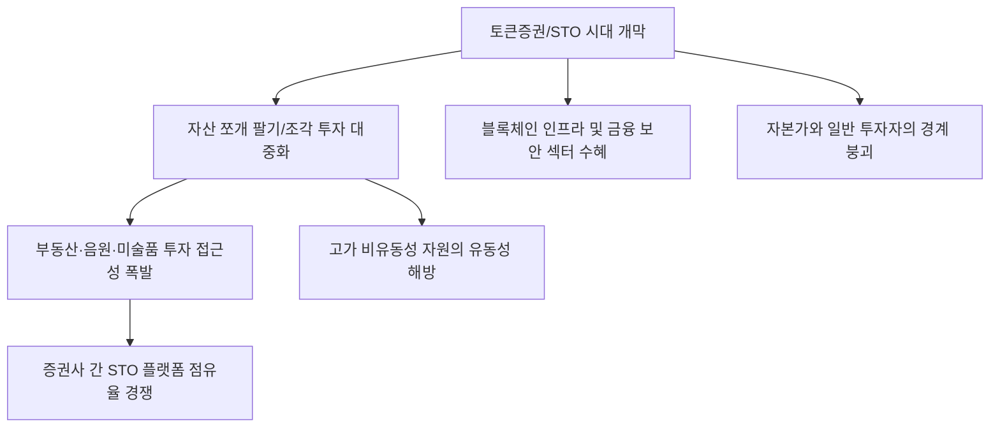

# 금융/혁신 분석: 음악과 빌딩을 '쪼개 파는' 토큰증권(STO) 시대의 본격 개막
## 투자 신호 + 사회적 영향 평가

---

## 📌 기사 기본 정보

- **날짜**: 2026-03-05
- **출처**: 대한민국 기술 금융 혁신 및 토큰 증권(STO) 시장 가이드라인 분석 리포트
- **카테고리**: 경제 > 금융 > 핀테크/혁신전략
- **핵심 주제**: 자산 유동화의 새로운 패러다임인 토큰증권(Security Token Offering, STO) 시장의 법적·기술적 기반이 완성되며, 고가 빌딩, 예술품, 음원 저작권 등 고액 자산을 소액으로 쪼개 파는 '조각 투자' 대중화 시대의 개막 분석

**메타데이터**
- 주요 이슈: 블록체인을 통한 증권의 디지털화(STO) 입법화 및 가이드라인 확정
- 핵심 자산: 고가 부동산, 음원 수익권, 미술품, 선박/항공기 금융
- 주요 주체: 금융위원회, 한국거래소(KRX), 대형 증권사, 조각 투자 플랫폼 스타트업
- 키워드: STO, 토큰증권, 조각 투자, 자산 유동화, 디지털 혁신 금융

---

## 🔍 기사를 통한 투자 신호 추출

### 1단계: 핵심 사건 분해

**What (무엇이 일어났는가?)**
- 과거 수십억, 수백억 원이 있어야만 투자할 수 있었던 우량 자산들이 블록체인 기술을 통해 '토큰' 단위로 쪼개져 일반 개인들도 단돈 몇만 원으로 건물주가 되거나 히트곡의 주인이 될 수 있는 길이 열림. 정부의 제도권 편입 선언으로 신뢰성이 확보되며, 증권사들이 미래 먹거리로 점찍고 앞다투어 시장 선점에 나섬.

**When (언제 일어났는가?)**
- 2026-03-05 (자본시장법 개정안 통과와 함께 한국거래소의 신종 증권 시장 시범 운영이 본격화된 시점)

**Why (왜 이 중요한가?)**
- 부동산 등 '무거운 자산'에 묶인 유동성을 해방해 자본 시장 전반의 활력을 높이기 때문
- 개인 투자자들에게 기관들만 누리던 대체 투자(Alternative Investment) 기회를 제공하기 때문
- 금융 분야의 '디지털 주권' 확보와 글로벌 표준 경쟁에서 앞서나가기 위함

**Who (누가 주도하는가?)**
- 발행-유통 플랫폼을 선점하려는 미래에셋, 한국투자 등 대형 증권사 컨소시엄
- 검증된 실물 자산을 확보하고 있는 부동산 디벨로퍼 및 콘텐츠 제작사

---

### 2단계: 투자 신호 해석

#### A. **긍정적 신호 (Bullish)**

**① 'STO 인프라 및 보안' 기술을 제공하는 블록체인/보안 솔루션 사**
- **신호**: 증권사들의 분산 원장 시스템 구축 발주 및 보안 인증 수요 폭증
- **의미**: 시장의 승자가 누가 되든, 그 시스템을 깔아주는 '곡괭이와 삽' 기업은 무조건 돈을 범
- **투자 기회**: 국내 유력 블록체인 솔루션 기업, 생체 인증 및 보안 프로토콜 기술 전문 사

**② '음원 IP 및 킬러 콘텐츠'를 보유한 엔터테인먼트 및 IP 홀딩스**
- **신호**: 과거 잠자고 있던 비유동성 IP의 토큰화 및 자금 조달 활성화
- **의미**: 기업 가치가 '보유 IP의 현재 가치 합산'으로 재평가되며 자산 유동화 이익 발생
- **투자 기회**: 유명 작곡가/가수 IP를 대량 보유한 상장사, 검증된 부동산 지식 산업 센터 보유 리츠

---

#### B. **위험 신호 (Bearish)**

**③ '검증되지 않은 자산'을 무리하게 토큰화하는 신생 조각 투자 플랫폼**
- **신호**: 수익성 부풀리기 공시 및 자산 가치 평가 체계의 불투명성 논란 
- **의미**: 제도 초기 열풍에 편승한 '먹튀(Rug-pull)'성 기획 상품 등장 가능성
- **투자 리스크**: 자본금이 적고 제도권 증권사와 협력이 없는 단독형 조각 투자 앱

**④ 전통적 방식의 '부동산 간접 투자' 소형 펀드**
- **신호**: STO의 높은 접근성과 환금성에 밀린 기존 부동산 사모 펀드의 소외
- **의미**: 더 빠르고 더 투명한 STO 시장으로 투자 자금 대이동(Money Move) 발생 시 충격
- **투자 리스크**: 가입과 해지가 어려운 폐쇄형 부동산 투자 신탁 상품

---

### 3단계: 섹터별 투자 기회 매트릭스

#### ✅ **높은 기대도 + 낮은 리스크**

**STO 유통 시장의 지배자인 '대형 증권사 및 한국거래소 계열사'**
- 개별 자산은 망할 수 있어도, 그 자산들이 거래되는 '거래소'와 '계좌'를 쥐고 있는 곳은 수수료와 데이터를 영구적으로 독점함
- **투자 추천도**: ⭐⭐⭐⭐⭐

---

## 💰 구체적 투자 신호 변환

### 신호 1: '소유'보다 '수익권'의 시대가 온다

**투자 해석**: 기사는 자산의 정의가 '실물 점유'에서 '디지털 수익 공유'로 이동했음을 시사함. 투자자는 지금 즉시 '내가 다 사야 한다'는 고정관념을 버려야 함. 대신, 수익률이 좋은 자산을 잘게 쪼개어 수천 명에게 팔 수 있는 '조각 투자 플랫폼'의 지배력을 확인해야 함. STO는 2026년 금융 투자 시장의 가장 강력한 성장 주도주가 될 것이며, 이 중에서 특히 '부동산'과 'IP'를 결합한 플랫폼이 초기 승기를 잡을 것임.

---

## 🌍 사회적 영향 평가

### A. 긍정적 사회 영향
- **일반 대중의 자녀 자산 형성 사다리 복원**: 소액으로도 우량한 부동산이나 예술품에 투자하여 자본 소득을 누릴 수 있게 함으로써 부의 불평등 완화 및 경제적 기회 민주화 기여
- **실물 경제의 자금 조달 원활화**: 자금이 필요한 다양한 예술, 건축, 콘텐츠 제작 분야에 대중의 자금이 직접 흘러 들어가 창작 생태계 활성화 및 일자리 창출 유도

### B. 부정적 사회 영향
- **자산 버블 형성과 개인 투자자 피해**: 자극적인 마케팅에 현혹되어 실체 없는 가치에 투기하는 광풍이 불 경우 사회적 손실 막대
- **디지털 격차에 따른 소외**: 블록체인이나 핀테크에 익숙하지 않은 세대는 새로운 투자 기회에서 소외되어 또 다른 형태의 자산 양극화 발생 위험

---

## 🎯 결론: 당신의 투자 전략 수립

- **즉시 실행**: 포트폴리오 내 STO 인프라 구축 핵심 보안/SW 기업 비중 확대, 대형 증권주 매수 관찰
- **3개월 후**: 조각 투자 1호 상장 상품의 수익률 성적표와 유통 거래량 확인 후 직접 투자 상품군 선별

---

## 📝 Obsidian 연결 구조

