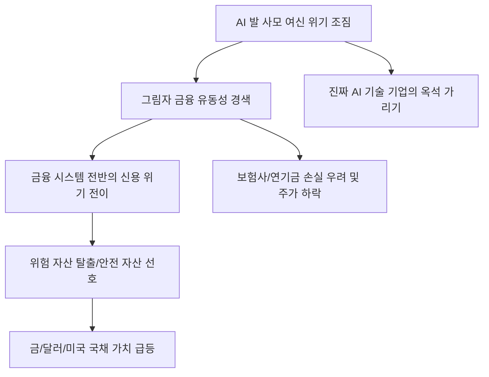

# 거시/리스크 분석: '탄광 속 카나리아'의 귀환, AI 발 사모 여신 유동성 위기
## 투자 신호 + 사회적 영향 평가

---

## 📌 기사 기본 정보

- **날짜**: 2026-03-05
- **출처**: 글로벌 금융 리스크 모니터링 및 AI 산업 자본 흐름 정밀 분석 리포트
- **카테고리**: 경제 > 거시경제 > 금융리스크
- **핵심 주제**: AI 산업의 과잉 투자와 거품 우려 속에서, 전통적 은행권 밖에서 급팽창한 '사모 여신(Private Credit)' 시장이 유동성 경색 조짐을 보이며 금융 위기의 전조인 '탄광 속 카나리아' 역할을 하고 있는 현상 분석 및 연쇄 부도 가능성 진단

**메타데이터**
- 주요 이슈: 고금리 지속 속 사모 대출 펀드(PDF)의 환매 중단 우려
- 핵심 리스크: AI 스타트업 부실 전이, 그림자 금융(Shadow Banking)의 불투명성
- 주요 주체: 글로벌 사모펀드(PE), AI 벤처 캐피털(VC), 연기금, 금융 안정 위원회(FSB)
- 키워드: 탄광 속 카나리아, 사모 여신 위기, AI 거품 붕괴, 유동성 블랙홀, 그림자 금융

---

## 🔍 기사를 통한 투자 신호 추출

### 1단계: 핵심 사건 분해

**What (무엇이 일어났는가?)**
- 지난 수년간 AI 혁신에 배팅하며 급격히 덩치를 키운 '사모 여신(비은행권 대출)' 시장에 경고등이 켜짐. 실질적인 수익을 내지 못하는 AI 기업들이 고금리 이자를 감당하지 못해 연체가 급증하자, 이들에게 돈을 빌려준 사모 펀드들이 자금 회수에 난항을 겪으며 유동성이 마르는 '신용 경색'의 초기 징후가 포착됨. 2008년 서브프라임 모기지 사태처럼 '보이지 않는 곳'에서 위기가 시작되고 있음.

**When (언제 일어났는가?)**
- 2026-03-05 (AI에 대한 장밋빛 전망이 '실적 확인' 단계로 전환되며, 자본의 옥석 가리기가 본격적으로 시작된 시점)

**Why (왜 이 중요한가?)**
- 사모 여신은 제도권 은행과 달리 공시 의무가 없어 부실 규모 파악이 불가능하기 때문
- AI 산업의 자금줄이 마를 경우 전 세계 기술 혁신 동력이 한꺼번에 멈출 리스크가 있기 때문
- 사모 펀드에 막대한 자금을 넣은 연기금과 보험사의 손실로 이어져 '전 국민 연금 위기'로 전이되기 때문

**Who (누가 주도하는가?)**
- 수익률 부진에 직면한 AI 유니콘 기업 및 이들의 채무를 떠안은 공격적 사모 펀드
- 리스크 전이 방지를 위해 긴급 모니터링에 착수한 글로벌 금융 당국

---

### 2단계: 투자 신호 해석

#### A. **긍정적 신호 (Bullish)**

**① 위기 속에서 빛나는 '현금 부자(Cash-rich)' 우량 빅테크**
- **신호**: 사모 시장의 유동성 경색에도 불구하고 자체 현금 흐름으로 투자를 지속하는 기업
- **의미**: 경쟁자들이 자금난으로 사라질 때 저가에 핵심 인재와 기술을 흡수할 수 있는 '최종 승자'
- **투자 기회**: FCF(잉여현금흐름)가 시총 대비 압도적인 미국 빅테크, 부채 비율 30% 이하 기술주

**② 부실 자산을 헐값에 매입하여 재구조화하는 'NPL(부실채권) 전문 금융사'**
- **신호**: 시장에 쏟아지는 사모 여신 담보 매물 및 부실 펀드 지분
- **의미**: 남들이 피 흘릴 때 쇼핑하는 자본가들에게는 세기적 기회 도래
- **투자 기회**: 글로벌 대체 투자 전문 상장사 중 'Distressed Asset' 전문 펀드

---

#### B. **위험 신호 (Bearish)**

**③ AI 테마로 급등했으나 '사모 펀드 대출' 의존도가 높은 기술주**
- **신호**: 부채 상환 기간 도래 및 고금리 리파이낸싱 실패 소식
- **의미**: 기술력이 아무리 좋아도 당장 갚을 돈이 없어 '부도' 처리될 위험 상존
- **투자 리스크**: 자금 조달 창구가 사모 시장에 편중된 AI 스타트업 및 중소형 코스닥 기술주

**④ 사모 펀드 투자 비중이 높은 '보험 및 연기금' 관련 금융주**
- **신호**: 대체 투자 자산 가치 하락(Mark-to-market)에 따른 평가 손실 반영 시작
- **의미**: 겉으로는 멀쩡해 보이지만, 장부 밑바닥에 '사모 여신' 폭탄을 안고 있는 형국
- **투자 리스크**: 운용 수익률이 급락하고 있는 대형 생명보험사, 자산운용사 주

---

### 3단계: 섹터별 투자 기회 매트릭스

#### ✅ **높은 기대도 + 낮은 리스크**

**글로벌 '안전 자산'인 미국 국채 및 금(Gold)**
- 탄광 속 카나리아가 죽어갈 때는 모든 위험 자산에서 탈출해야 함. 결국 가장 투명하고 믿을 수 있는 '최후의 보루'로 자금이 역류함
- **투자 추천도**: ⭐⭐⭐⭐⭐

---

## 💰 구체적 투자 신호 변환

### 신호 1: '그림자'에서 '빛'으로 자본을 대피시켜라

**투자 해석**: 기사는 금융 위기의 시스템적 전이 가능성을 경고함. 사모 여신은 금융 시스템의 하수구와 같아서, 여기서 역류가 시작되면 도시 전체(제도권 금융)가 오염됨. 투자자는 지금 즉시 '불투명한 투자' 비중을 0에 가깝게 줄여야 함. 비상장 자산, 사모 펀드 간접 투자, 레버리지가 높은 하이일드 채권은 가장 먼저 버려야 할 우선순위임. 현금을 들고 '카나리아의 비명'이 멈출 때까지 관망하는 것이 최고의 수익률을 지키는 방법임.

---

## 🌍 사회적 영향 평가

### A. 긍정적 사회 영향
- **자본 시장의 건전성 회복과 거품 제거**: 실체 없는 AI 프로젝트에 무분별하게 퍼부어지던 자본이 정리되며, 인류 문명을 실질적으로 발전시킬 수 있는 '진짜 기술'에만 자원이 집중되는 정화 과정 유도
- **금융 당국의 규제 사각지대 해소**: 그림자 금융에 대한 강력한 공시 제도와 리스크 관리 체계를 수립하여 향후 유사한 대규모 위기 발생을 사전 차단하는 기반 마련

### B. 부정적 사회 영향
- **혁신 동력 상실과 경기 침체 가속화**: 유동성 경색으로 인해 유망한 초기 기업들까지 도산하며 국가 미래 경쟁력이 약화되고, 대규모 해고로 인한 중산층의 붕괴 사회적 불안 우려
- **공적 자금 투입에 따른 국민 부담 증대**: 위기가 연기금이나 대형 금융사로 전이될 경우, 결국 국민의 세금이나 연금 자산으로 민간의 실책을 메워줘야 하는 사회적 불의와 갈등 발생 위험

---

## 🎯 결론: 당신의 투자 전략 수립

- **즉시 실행**: 포트폴리오 내 중소형 성장주 전량 매도 유도, 현금 비중 50% 이상 상향, 미국 장기 국채 및 금 비중 확대
- **3개월 후**: 주요 사모 펀드들의 환매 상황과 델타 리스크 통계 확인 후 실적 기반의 독점 기술주 분할 매수 타점 조율

---

## 📝 Obsidian 연결 구조

