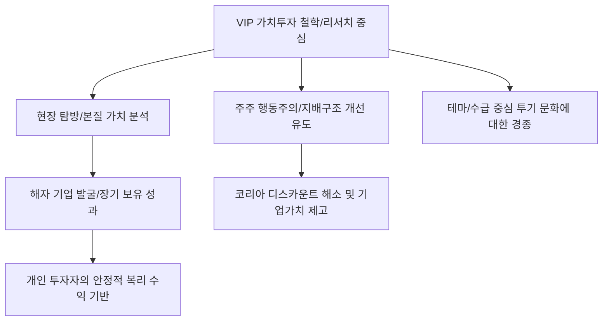

# 금융/투자 분석: VIP자산운용의 '리서치에 미친' 가치투자 철학과 시장 생존법
## 투자 신호 + 사회적 영향 평가

---

## 📌 기사 기본 정보

- **날짜**: 2026-03-06
- **출처**: 대한민국 가치투자 명가 및 자산운용사 운용 철학 분석 리포트
- **카테고리**: 경제 > 금융 > 자산운용/투자철학
- **핵심 주제**: "리서치에 미친 사람들"로 불리는 VIP자산운용의 현장 중심 가치투자 철학을 조명하고, 단기 변동성과 알고리즘 매매가 지배하는 시장에서 '기업의 본질적 가치'를 쫓는 정통 가치투자가 여전히 유효한 전략임을 증명하는 운용 전략 분석

**메타데이터**
- 주요 인물: 김민국·최준철 공동대표 등 가치투자 1세대
- 핵심 철학: 철저한 현장 탐방, 해자(Moat) 보유 기업 발굴, 초장기 보유
- 주요 주체: VIP자산운용, 가치투자자, 코리아 디스카운트 해소 추진 주체
- 키워드: VIP자산운용, 가치투자, 리서치 중심, 딥 다이브(Deep Dive), 행동주의 펀드

---

## 🔍 기사를 통한 투자 신호 추출

### 1단계: 핵심 사건 분해

**What (무엇이 일어났는가?)**
- AI와 퀀트 투자가 득세하며 인간의 리서치 능력이 무시당하는 시대에, 직접 발로 뛰며 기업의 수익 모델과 경영진의 도덕성을 검증하는 '아날로그식 딥 리서치'가 역설적으로 가장 높은 수익률과 안정성을 보여줌. 특히 VIP자산운용은 단순 보유를 넘어 주주 서한 발송 등 적극적인 주주 행동주의를 결합하여 기업 가치를 직접 끌어올리는 '가치투자 2.0' 모델을 제시함.

**When (언제 일어났는가?)**
- 2026-03-06 (글로벌 변동성 확대로 실체 없는 테마주들이 무너지고, 실적이 뒷받침되는 저평가 우량주들의 복원력이 주목받는 시점)

**Why (왜 이 중요한가?)**
- AI가 긁어오지 못하는 '경영진의 눈빛'과 '현장의 분위기'가 여전히 투자의 핵심 변수이기 때문
- '코리아 디스카운트' 해결의 실마리가 결국 기업의 거버넌스 개선(가치 투자자의 역할)에 있기 때문
- 변동성 장세에서 개인 투자자들이 흔들리지 않을 '심리적 닻(Anchor)'을 제공하기 때문

**Who (누가 주도하는가?)**
- 수십 년간 한결같이 가치투자의 길을 걸어온 VIP의 리서치 조직
- 기업의 내재 가치보다 싼 현금을 보유한 중소형 우량주들

---

### 2단계: 투자 신호 해석

#### A. **긍정적 신호 (Bullish)**

**① 가치투자자가 선호하는 '지배구조 개선 및 고배당' 잠재 기업**
- **신호**: VIP와 같은 대형 가치투자 운용사가 지분을 확보하거나 주주 행동주의를 예고한 기업
- **의미**: 전문가가 이미 현장 점검을 끝낸 '안전한 저평가주'라는 보증수표
- **투자 기회**: 자사주 소각 및 배당 확대 여력이 큰 중견 우량주, 밸류업 프로그램 수혜주

**② 리서치 역량을 시스템화한 '핀테크 리서치 툴 및 데이터' 기업**
- **신호**: 가치투자자들이 사용하는 심층 리서치 데이터 정제 기술에 대한 수요 증대 
- **의미**: 인간의 직관을 돕는 '데이터 정제'가 AI보다 더 비싼 대우를 받음
- **투자 기회**: 기업용 데이터 터미널 개발사, 공시 분석 AI 솔루션 전문 기업

---

#### B. **위험 신호 (Bearish)**

**③ '리서치 근거' 없이 테마와 수급으로만 급등한 좀비 기술주**
- **신호**: 가치투자자들이 "절대 사지 않는" 고밸류 저수익 종목들의 변동성 확대
- **의미**: 거품이 빠질 때 가장 먼저, 가장 깊게 하락할 대상
- **투자 리스크**: 실질 영업이익 없이 미래 성장성만으로 시총 상위에 오른 테마주

**④ 운용 철학 없이 유행하는 ETF만 복제하는 '무색무취' 자산운용사**
- **신호**: 지수 하락기에 방어력이 전혀 없는 단순 복제 펀드들의 수익률 급락
- **의미**: 시장의 신뢰가 '철학 있는 운용사'로 쏠리며 자금 이탈 가속화
- **투자 리스크**: 독자적 분석 역량 없이 마케팅으로만 수탁고를 키운 운용사 및 관련주

---

### 3단계: 섹터별 투자 기회 매트릭스

#### ✅ **높은 기대도 + 낮은 리스크**

**글로벌 '가치투자'의 대가들이 장기 보유 중인 국내외 지주사**
- 철저한 현장 조사와 리서치를 거친 종목들은 일시적 하락이 곧 '축복의 매수 기회'임이 역사적으로 증명됨
- **투자 추천도**: ⭐⭐⭐⭐⭐

---

## 💰 구체적 투자 신호 변환

### 신호 1: '속도' 경쟁을 포기하고 '깊이' 경쟁에 올라타라

**투자 해석**: 기사는 투자의 성패가 '얼마나 빨리 사느냐'가 아니라 '얼마나 잘 이해하느냐'에 달려 있음을 시사함. 투자자는 지금 즉시 포트폴리오를 점검하여, 내가 왜 이 주식을 샀는지 10분 동안 설명할 수 없는 종목은 전량 매도해야 함. VIP자산운용처럼 '현장'의 목소리를 담은 리포트를 발행하거나 그런 철학을 공유하는 기업의 주주가 되는 것이, AI가 지배하는 시장에서 인간 투자자가 승리하는 유일한 길임.

---

## 🌍 사회적 영향 평가

### A. 긍정적 사회 영향
- **올바른 투자 문화 정착과 금융 문맹 퇴치**: 투기가 아닌 '기업과 동행하는 투자'의 가치를 전파하여 국민의 장기 자산 형성 안정화에 기여
- **기업 거버넌스 투명성 강화**: 가치투자자들의 감시 기능을 통해 대주주의 전횡을 막고 소액 주주의 권리를 보호함으로써 한국 자본 시장의 신뢰도와 국격 육성

### B. 부정적 사회 영향
- **장기 투자에 따른 기회비용 소외**: 모멘텀 장세에서 가치투자 원칙을 지키다 소외되는 개인 투자자들의 심리적 박탈감과 이탈 현상 발생
- **가치주의 '저평가 함정(Value Trap)' 고착**: 정체된 산업군에 자본이 묶여 정작 기술 혁신이 필요한 곳에 자금이 흐르지 못하는 자본 배분의 비효율성 우려 리스크

---

## 🎯 결론: 당신의 투자 전략 수립

- **즉시 실행**: 테마성 단기 보유 종목 수익 실현 후 리서치 기반 가치주로 30% 리밸런싱, 가치투자 운용사의 지분 공시 추적 시작
- **3개월 후**: 보유 종목의 주주 총회 결과 및 거버넌스 개선 의지(주주 환원책 발효 등) 데이터 확인

---

## 📝 Obsidian 연결 구조

