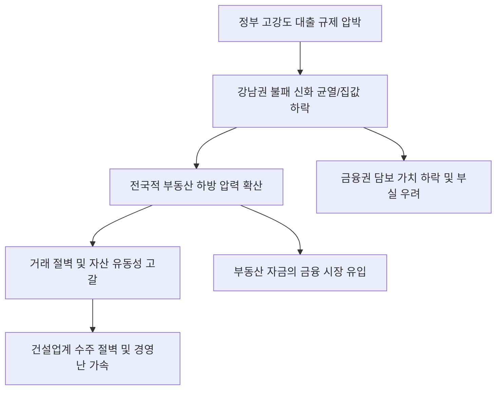

# 부동산/거시 분석: 규제 압박과 강남권 집가 하락, 부동산 시장의 '하방 압력' 진단
## 투자 신호 + 사회적 영향 평가

---

## 📌 기사 기본 정보

- **날짜**: 2026-03-06
- **출처**: 대한민국 부동산 시장 정밀 모니터링 및 정부 규제 효과 분석 리포트
- **카테고리**: 경제 > 부동산 > 시장동향
- **핵심 주제**: 정부의 강력한 대출 규제와 세무 조사 등 전방위적 압박 속에 '절대 무너지지 않을 것' 같던 강남권 집값이 하락세로 반전하며 전반적인 부동산 시장에 하방 압력이 가중되는 현상 분석 및 향후 시장 재편 시나리오 전망

**메타데이터**
- 주요 이슈: 강남 3구(강남, 서초, 송파) 주요 단지 실거래가 하락 및 거래 실종
- 핵심 규제: 스트레스 DSR 확대 적용, 고가 주택 담보 대출 제한, 자금 출처 조사 강화
- 주요 주체: 국토교통부, 금융위원회, 강남 집주인, 무주택 대기 수요자
- 키워드: 강남권 하락, 규제 압박, 부동산 하방 압력, 거래 절벽, 심리적 저지선 붕괴

---

## 🔍 기사를 통한 투자 신호 추출

### 1단계: 핵심 사건 분해

**What (무엇이 일어났는가?)**
- 정부가 가계 부채 관리를 위해 대출의 '양'과 '질'을 동시에 조이는 고강도 대책을 내놓자, 가장 먼저 타격을 받은 것은 대출 의존도가 높은 고가 주택 시장임. 특히 '강남 불패'의 상징이었던 주요 재건축 단지에서 수억 원 떨어진 급매물이 나오기 시작했으며, 이는 시장 전체에 "이제 진짜 떨어진다"는 강력한 하방 신호를 보내고 있음.

**When (언제 일어났는가?)**
- 2026-03-06 (고금리 장기화 공포와 정부의 규제 타임라인이 맞물려 투자자들의 인내심이 임계점에 도달한 시점)

**Why (왜 이 중요한가?)**
- 강남 집값은 한국 부동산의 '최후의 보루'이자 전체 시장의 방향타이기 때문
- 심리적 지지선이 무너질 경우 영끌족의 자산 투항(Capitulation)이 연쇄적으로 발생할 수 있기 때문
- 자산 가치 하락에 따른 역자산 효과가 내수 소비 위축으로 이어지기 때문

**Who (누가 주도하는가?)**
- 실질적인 대출 규제 권한을 쥔 금융 당국과 탈세 조사를 강화한 국세청
- 버티다 못한 급매물을 내놓는 다주택자와 고위험 레버리지 보유자

---

### 2단계: 투자 신호 해석

#### A. **긍정적 신호 (Bullish)**

**① '실거주 목적' 무주택자의 생애 첫 집 마련 기회 확대**
- **신호**: 거품이 빠진 강남 외곽 및 차상위 입지에서의 급매물 증가 
- **의미**: 비정상적으로 높았던 진입 장벽이 낮아지며 건전한 실수요 기반의 시장 재편 시작
- **투자 기회**: 정부 지원 저금리 대출(특례보금자리론 등) 활용 가능 구간 진입

**② 부동산 자금의 '머니무브'를 흡수하는 금융 투자 업계의 호황**
- **신호**: 부동산 매수 관망세 확산에 따른 주식, 채권형 펀드 설정액 급증
- **의미**: 부동산에 잠겼던 유동성이 금융 시장으로 흘러 들어와 증시의 체질 강화
- **투자 기회**: 자산 운용 수익이 급증하는 대형 증권주, 글로벌 분산 투자 ETF

---

#### B. **위험 신호 (Bearish)**

**③ '담보 가치 하락'에 따른 금융권 부실 채권 증대 리스크**
- **신호**: LTV(주택담보대출비율) 경계선에 걸린 대출 계좌의 마진콜 위기
- **의미**: 집값 하락이 은행의 건전성 악화로 이어지는 시스템 리스크 전조
- **투자 리스크**: 가계 대출 비중이 높고 부동산 담보 설정액이 큰 시중 은행 및 저축은행

**④ 분양가 상한제와 수요 위축이 겹친 '주택 건설 섹터'의 수익성 악화**
- **신호**: 재개발/재건축 추진 중단 및 신규 분양 미달 사태 속출
- **의미**: 수주 절벽과 미분양 대금 미회수로 인한 건설사들의 유동성 위기 상시화
- **투자 리스크**: 국내 주택 사업 의존도가 70% 이상인 대형 건설주 및 자재 공급 사

---

### 3단계: 섹터별 투자 기회 매트릭스

#### ✅ **높은 기대도 + 낮은 리스크**

**부동산 경기와 상관관계가 낮은 '필수 인프라 및 에너지' 섹터**
- 집값이 떨어져도 전기는 써야 하고 물류는 돌아감. 경기 하강기에는 실체가 있는 현금 흐름을 가진 종목이 안전함
- **투자 추천도**: ⭐⭐⭐⭐

---

## 💰 구체적 투자 신호 변환

### 신호 1: '불패' 신화의 뒷문이 열렸다, 전략적 관망을 유지하라

**투자 해석**: 기사는 부동산 시장의 '권력 이동'을 시사함. 이제 사는 사람(매수자)이 왕인 시장임. 투자자는 지금 즉시 '바닥'을 예단하고 성급하게 진입해서는 안 됨. 강남권 하락이 6개월 이상 지속되고 신용 연체율이 정점을 찍는 시점까지 현금을 확보해야 함. 현재의 하락은 단순 조정이 아니라, 부채 기반 성장의 한계를 드러내는 구조적 변화임. 무거운 자산(집)보다 가벼운 자산(현금/달러)을 쥐고 폭풍이 지나가길 기다려야 할 때임.

---

## 🌍 사회적 영향 평가

### A. 긍정적 사회 영향
- **부동산 투기 심리 억제와 주거 정의 회복**: 불로소득에 대한 기대를 낮추고 주택을 '투기 수단'이 아닌 '거주 공간'으로 인식하게 함으로써 장기적인 사회 안정 기여
- **자본의 생산적 재배치**: 부동산에만 몰두하던 국가적 역량이 기술 혁신이나 창업 등 더 생산적인 분야로 흘러갈 수 있는 체질 개선의 기회 제공

### B. 부정적 사회 영향
- **자영업 및 내수 경기의 급격한 위축**: 집값 하락으로 인한 소비 심리 악화는 의류, 외식, 여행 등 서민들의 생활 밀착형 산업에 타격을 주어 민생 고통 가중
- **'하우스 푸어'의 재등장과 가정 붕괴**: 무리하게 대출을 받아 집을 산 영끌 세대가 금리 부담과 자산 가치 하락의 이중고를 견디지 못해 파산하며 발생하는 사회적 비극 및 안전망 훼손 리스크

---

## 🎯 결론: 당신의 투자 전략 수립

- **즉시 실행**: 부동산 관련 레버리지 포지션 축소, 국내 건설사 및 부동산업 종목 비중 10% 이하로 조정
- **3개월 후**: 수도권 아파트 경매 낙찰률 및 경매 물량 추이 분석 후 진바닥(Real Bottom) 신호 확인

---

## 📝 Obsidian 연결 구조

