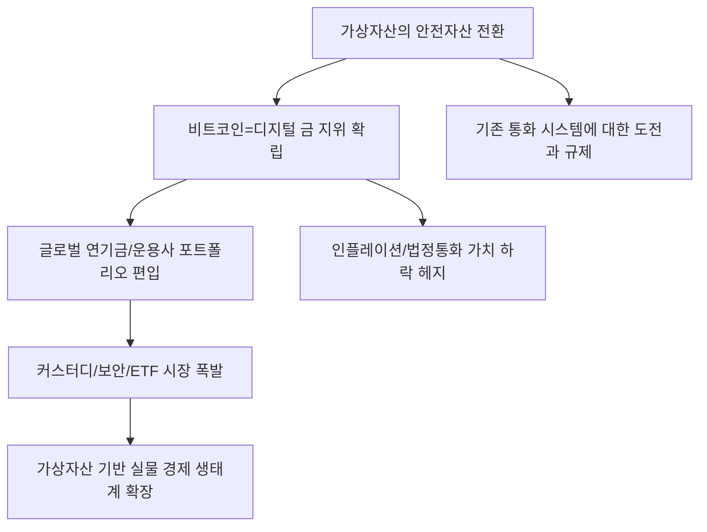

# 가상자산/금융 분석: 금(Gold)보다 금 같은 '비트코인', 가상자산의 안전자산 전환
## 투자 신호 + 사회적 영향 평가

---

## 📌 기사 기본 정보

- **날짜**: 2026-03-06
- **출처**: 글로벌 자산 배분 전략 및 가상자산 제도권 편입 분석 리포트
- **카테고리**: 경제 > 가상자산 > 자산배분
- **핵심 주제**: 지정학적 리스크와 법정 화폐 가치 하락 속에서 비트코인이 단순 투기 수단을 넘어 '디지털 금(Digital Gold)'으로서의 지위를 확고히 하며, 기관 투자자들의 포트폴리오 내 안전 자산으로 공식 편입되는 '가상자산의 안전자산화' 현상 분석

**메타데이터**
- 주요 이슈: 비트코인 현물 ETF 유입액 역대 최대치 경신
- 핵심 컨셉: 디지털 희소성(Scarcity), 무국적 자산, 24/7 유동성
- 주요 주체: 블랙록(BlackRock), 피델리티, 글로벌 연기금, 비트코인 맥시멀리스트
- 키워드: 비트코인, 디지털 금, 안전자산 전환, 인플레이션 헤지, 제도권 편입

---

## 🔍 기사를 통한 투자 신호 추출

### 1단계: 핵심 사건 분해

**What (무엇이 일어났는가?)**
- 전 세계적인 고물가와 전쟁 리스크가 지속되자, 투자자들이 전통적 안전 자산인 금뿐만 아니라 비트코인을 '가치 저장 수단'으로 선택하기 시작함. 특히 주요국 통화 가치가 흔들릴 때마다 비트코인 가격이 급등하며 상관관계가 금과 유사해지는 현상(Safe-haven behavior)이 통계적으로 확인됨. 기관들의 막대한 자금이 ETF를 통해 유입되며 변동성이 낮아지고 신뢰도가 상승함.

**When (언제 일어났는가?)**
- 2026-03-06 (지정학적 불안과 미 연준의 금리 가이드라인 불확실성이 실질 화폐 가치에 대한 불신으로 번진 시점)

**Why (왜 이 중요한가?)**
- 자산 배분의 '문법'이 바뀌었기 때문 (주식/채권에서 주식/채권/비트코인으로)
- 국가가 통제할 수 없는 '알고리즘 기반 희소성'이 가장 강력한 안보 자산이 되었기 때문
- 기존 금융 시스템의 붕괴 리스크에 대한 유일한 '오프 램프(Off-ramp)'로 기능하기 때문

**Who (누가 주도하는가?)**
- 자산 배분 비중을 공식적으로 수정한 글로벌 대형 자산 운용사
- 자국 통화 붕괴를 경험하고 비트코인으로 부를 지키려는 신흥국 자산가 및 대중

---

### 2단계: 투자 신호 해석

#### A. **긍정적 신호 (Bullish)**

**① '가상자산 인프라 및 커스터디(Custody)' 서비스 제공 기업**
- **신호**: 기관 자금 유입에 따른 전문적인 보관 및 관리 수요 폭증 
- **의미**: 금을 안전하게 보관해주는 금고 주인이 돈을 벌듯, 디지털 자산을 보관해주는 금융사가 핵심 수익원으로 부상
- **투자 기회**: 가상자산 수탁 면허 보유 은행, 블록체인 보안 지갑 개발사, 글로벌 거래소 상장주

**② 비트코인을 대차대조표에 보유한 '기업형 가치 투자처'**
- **신호**: 현금 대신 비트코인을 보유하여 자산 가치를 방어하는 상장사 수 증가
- **의미**: 기업의 밸류에이션이 본업 수익 + 보유 비트코인 가치로 재산정되며 멀티플 상향
- **투자 기회**: 마이크로스트래티지 등 비트코인 대량 보유 상장사, 비트코인 채굴 하드웨어 리더

---

#### B. **위험 신호 (Bearish)**

**③ 통화 권력을 위협받는 국가 주도의 '디지털 화폐(CBDC)' 기술**
- **신호**: 비트코인의 득세로 인한 민간 가상자산 통제력 상실 우려 
- **의미**: 정부는 규제를 통해 비트코인의 안전자산화를 방해할 강력한 동기를 가짐
- **투자 리스크**: 정부 규제 한마디에 비즈니스 모델이 흔들리는 로컬 알트코인 프로젝트

**④ 인플레이션 헤지 능력을 상실한 '저수익 전통 채권'**
- **신호**: 실질 금리가 마이너스인 상태에서 비트코인으로 빠져나가는 투자 자금
- **의미**: 채권의 '안전 자산' 지위가 비트코인에 의해 일부 대체되며 수요 감소 및 가격 하락
- **투자 리스크**: 고정 금리 장기 국채 중심의 보수적 연금 펀드

---

### 3단계: 섹터별 투자 기회 매트릭스

#### ✅ **높은 기대도 + 낮은 리스크**

**글로벌 '가상자산 ETF'를 운용하는 대형 자산운용사**
- 어떤 코인이 오르든 거래와 자산 규모에 따른 운용 수수료를 챙기는 운용사는 가산자산의 '세금 징수원'과 같은 지위를 누림
- **투자 추천도**: ⭐⭐⭐⭐⭐

---

## 💰 구체적 투자 신호 변환

### 신호 1: '디지털 영토' 선점이 향후 10년의 부를 결정한다

**투자 해석**: 기사는 자산의 패러다임이 '물리적 실체'에서 '수학적 증명'으로 이동했음을 선언함. 투자자는 지금 즉시 포트폴리오의 최소 5~10%를 비트코인(또는 비트코인 ETF)으로 채워야 함. 단순히 수익을 내기 위해서가 아니라, 기존 금융 시스템의 마비나 화폐 가치 폭락에 대비한 '보험(Insurance)'으로서의 성격이 강함. 비트코인은 이제 선택이 아니라 필수적인 자산 방어 도구임.

---

## 🌍 사회적 영향 평가

### A. 긍정적 사회 영향
- **개인의 금융 주권 강화 및 국부 보호 유도**: 국가의 잘못된 통화 정책이나 정치적 불안으로부터 개인의 자산을 지킬 수 있는 수단을 제공하여 국민 전체의 경제적 안전망 강화
- **금융 서비스의 투명성 및 효율성 제고**: 블록체인 기반의 자산 거래가 확산되며 중간 단계의 비용을 줄이고 거래의 위변조 가능성을 차단하여 보다 신뢰할 수 있는 경제 생태계 구축

### B. 부정적 사회 영향
- **자산 양극화의 새로운 형태 등장**: 정보력이 빠르고 가상자산을 선점한 이들과 그렇지 못한 서민/노년층 간의 부의 격차가 돌이킬 수 없는 수준으로 벌어지는 사회적 불평등 심화
- **에너지 소비 및 환경 논란 지속**: 비트코인 채굴에 들어가는 막대한 전력 소모가 기후 위기 시대의 환경 보호 가치와 충돌하며 발생하는 사회적 갈등 및 규제 리스크 상시화

---

## 🎯 결론: 당신의 투자 전략 수립

- **즉시 실행**: 가상자산 현물 ETF 적립식 매수 시작, 가상자산 관련 글로벌 운용사 및 인프라주 분할 매수
- **3개월 후**: 미 대선 공약 내 가상자산 규제 가이드라인과 글로벌 중앙은행들의 금 보유량 대비 비트코인 보유 추이 분석

---

## 📝 Obsidian 연결 구조

