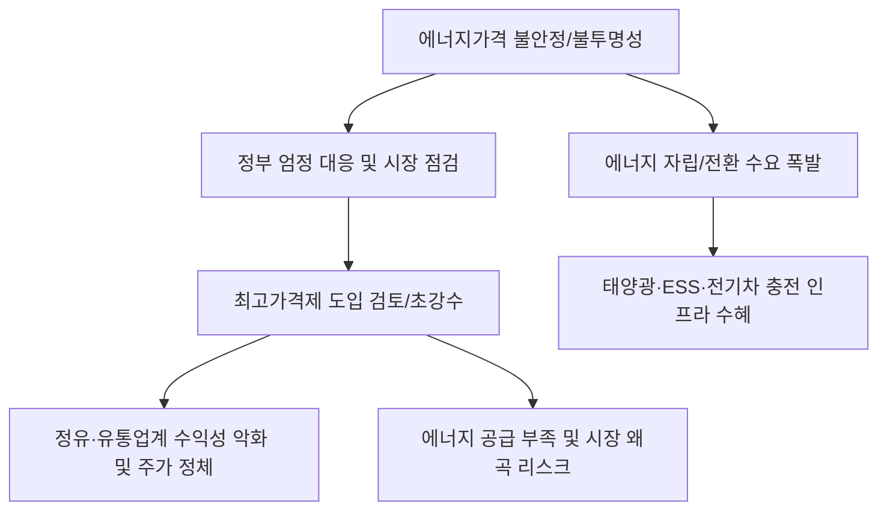

# 에너지/정책 분석: 에너지가격 불안정과 '최고가격제' 검토, 민생 안보의 배수진
## 투자 신호 + 사회적 영향 평가

---

## 📌 기사 기본 정보

- **날짜**: 2026-03-06
- **출처**: 대한민국 산업통상자원부 에너지 정책 및 소비자 물가 안정 긴급 리포트
- **카테고리**: 경제 > 거시경제 > 에너지/정책
- **핵심 주제**: 국제 유가 불안정에 편승한 국내 주유소의 '기름값 바가지' 행위에 대한 정부의 엄정 대응 방침과, 민생 경제 붕괴를 막기 위해 시장 경제 최후의 수단인 '최고가격제(Price Ceiling)' 도입 검토라는 초강수 카드 분석

**메타데이터**
- 주요 이슈: 국제 유가 하락 시 미반영, 상승 시 즉각 반영되는 '비대칭적 가격 결정' 근절
- 핵심 정책: 합동 점검반 운영, 최고가격제 도입을 위한 법적 근거 검토
- 주요 주체: 산업통상자원부, 공정거래위원회, 정유 4사, 대한석유협회
- 키워드: 에너지가격 불안정, 최고가격제, 기름값 바가지, 시장 통제, 에너지 안보

---

## 🔍 기사를 통한 투자 신호 추출

### 1단계: 핵심 사건 분해

**What (무엇이 일어났는가?)**
- 국제 유가의 변동성이 커지는 틈을 타 국내 일부 유통 단계에서 부당 이득을 취하는 징후가 포착됨. 정부는 이를 '민생 침해 범죄'로 규정하고, 현장 조사를 넘어 가격에 상한선을 두는 '최고가격제'라는 시장 경제의 금기어를 꺼내 들며 정유·유통업계를 강하게 압박함. 이는 단순한 물가 관리를 넘어 전 사회적 '에너지 안보' 차원의 결단임.

**When (언제 일어났는가?)**
- 2026-03-06 (중동의 재지정학적 리스크로 국제 유가 출렁임이 심화되고, 선거 등 정치적 일정과 맞물려 물가 안정이 정권의 사활적 과제가 된 시점)

**Why (왜 이 중요한가?)**
- 에너지는 모든 산업의 '쌀'이어서, 기름값 폭등은 전방위적 인플레이션의 방차선이기 때문
- 정부가 가격에 개입한다는 것은 '시장 원리'보다 '사회적 생존'을 우선시한다는 강력한 정책 신호이기 때문
- 정유사 및 유통사의 이익 마진이 정책적으로 강제 축소될 위기에 처했기 때문

**Who (누가 주도하는가?)**
- 물가 안정의 총대를 멘 산업부와 기재부, 불공정 행위를 조사하는 공정위
- 가격 통제에 반발하며 시스템적 한계(재고 비용 등)를 주장하는 정유 업계

---

### 2단계: 투자 신호 해석

#### A. **긍정적 신호 (Bullish)**

**① '가격 통제' 리스크가 없는 '그린 에너지 및 전력 효율' 솔루션 기업**
- **신호**: 화석 연료 가격 불안정과 정부 규제의 피로감이 극단에 달하며 '에너지 자립' 수요 폭증
- **의미**: 비싼 기름을 대체하는 전기차 충전 인프라, 태양광 자가발전 시스템이 '반사 이익'의 정점에 섬
- **투자 기회**: 국내 전기차 충전 통합 플랫폼 사, 중소형 태양광 발전 시공주, 스마트 그리드 제어 기술주

**② 정부 주도의 '에너지 인프라 현대화' 수혜 공기업 및 대형 제조 사**
- **신호**: 가격 통제 대신 시스템적 원가 절감을 위한 국가적 전력망·물류 고도화 투자 확대
- **의미**: 가격을 못 올리게 하는 대신, 비용을 낮출 수 있는 인프라를 국가가 깔아줌
- **투자 기회**: 전력 기자재 대장주, 가스/석유 공공 인프라 유지보수 전문 기업

---

#### B. **위험 신호 (Bearish)**

**③ '이익 상한선'이 씌워지는 정유 및 에너지 유통 섹터**
- **신호**: 최고가격제 검토 소식에 따른 마진 확대 가능성 원천 차단 
- **의미**: 국제 유가 상승이라는 호재(판매가 상승)가 규제에 막혀 '비용 상승'으로만 작용하는 최악의 구간 진입
- **투자 리스크**: 국내 매출 비중이 절대적인 정유 4사 관련 지주사, 주유소 프랜차이즈 운영 기업

**④ 가격 전가 능력이 전무한 '에너지 다소비' 기반 영세 제조/물류업**
- **신호**: 최고가격제에도 불구하고 여전히 높은 절댓값의 에너지 비용 부담
- **의미**: 정부 개입은 '급격한 상승'을 막을 뿐, 이미 높아진 비용 구조를 해결해주지는 못함
- **투자 리스크**: 저가 수주 위주의 운송업, 유류비 비중이 높은 고속버스/해운 관련 중소 종목

---

### 3단계: 섹터별 투자 기회 매트릭스

#### ✅ **높은 기대도 + 낮은 리스크**

**국내 가격 규제 영향권 밖인 '글로벌 원유 개발(E&P)' 직접 투자 기업**
- 국내 유통가격을 누를수록 해외에서 원유를 캐는 기업의 가치는 가려진 채 저평가될 확률이 높음. 글로벌 유가 수혜를 그대로 누리는 업스트림 기업은 규제 리스크의 완벽한 회피처임
- **투자 추천도**: ⭐⭐⭐⭐⭐

---

## 💰 구체적 투자 신호 변환

### 신호 1: '시장 가격'이 아닌 '고통의 한계점'이 주가를 결정한다

**투자 해석**: 기사는 에너지 시장이 '수요-공급'의 경제학을 넘어 '정치와 안보'의 영역으로 진입했음을 시사함. 투자자는 지금 즉시 '정유주의 실적 개선 기대감'을 접어야 함. 정부가 최고가격제를 '검토'한 것만으로도 해당 섹터의 밸류에이션 멀티플은 깎여 내려갈 것임. 대신, 정책의 칼날이 미치지 못하는 '해외 에너지 생산 시설'을 가졌거나 기름을 전혀 쓰지 않는 '에너지 전환 기업'으로 자산의 중심축을 옮겨야 함.

---

## 🌍 사회적 영향 평가

### A. 긍정적 사회 영향
- **서민 가계의 생존권 보장 및 물가 안정 기여**: 에너지가격 폭등으로 인한 도미노성 물가 인상을 차단하여 취약 계층의 생활고를 완화하고 사회적 안정을 유지하는 강력한 보호막 역할 수행
- **유통 시장의 투명성 강화**: 불투명한 가격 결정 구조를 가진 에너지 유통 단계를 정부가 점검하여, 고질적인 '바가지' 관행을 뿌리 뽑고 공정한 시장 질서 확립

### B. 부정적 사회 영향
- **공급 부족과 암시장 형성의 경제적 부작용**: 인위적인 가격 억제는 결국 공급자의 판매 유인을 떨어뜨려 '기름 부족 사태'나 뒷거래 등 시장 왜곡을 초래하는 교과서적 리스크 내포
- **기업의 투자 의지 꺾기**: 정당한 영업 이익을 가로막는 규제는 차세대 에너지 전환에 필요한 민간 기업의 투자 여력을 고갈시켜 국가 전체의 에너지 경쟁력 약화 사회적 손실 가능성

---

## 🎯 결론: 당신의 투자 전략 수립

- **즉시 실행**: 국내 정유/에너지 유통주 비중 축소, 해외 에너지 개발(E&P) ETF 편입, 전기차 인프라 대장주 분할 매수
- **3개월 후**: 최고가격제 실제 시행 여부와 에너지 바우처 지원 규모 등 재정 정책의 결합 성과 확인 후 리밸런싱

---

## 📝 Obsidian 연결 구조

