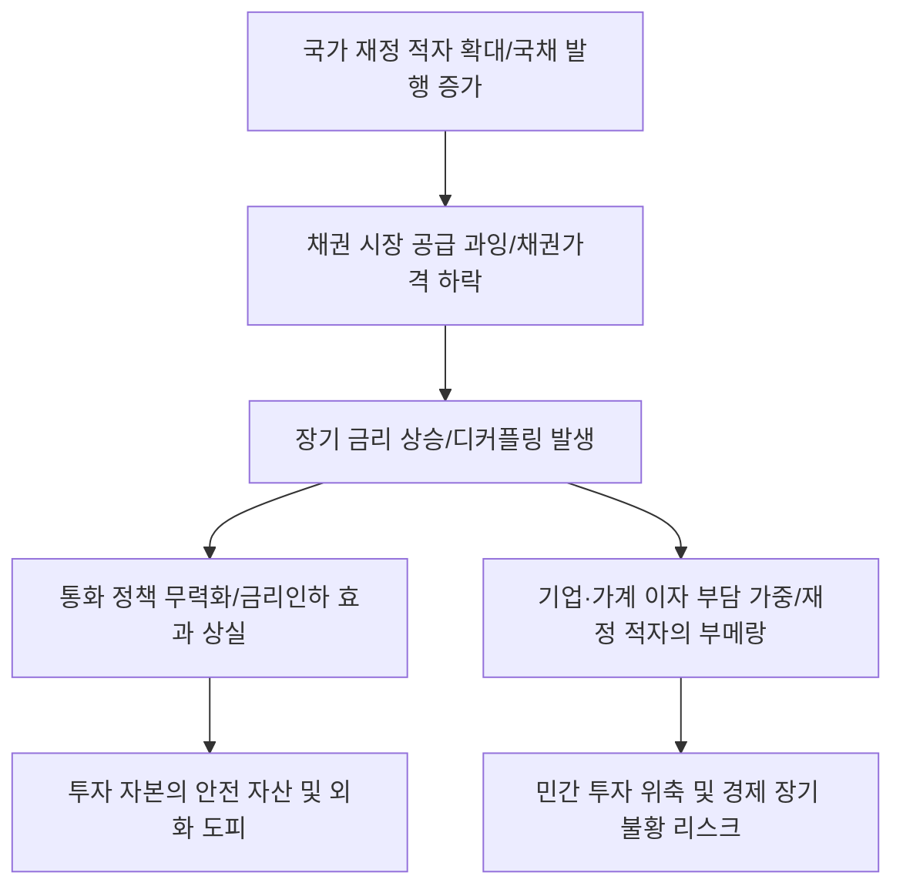

# 거시/금융 분석: 금리 디커플링과 재정 적자의 '부메랑' 위기
## 투자 신호 + 사회적 영향 평가

---

## 📌 기사 기본 정보

- **날짜**: 2026-03-06
- **출처**: 글로벌 거시 채권 시장 및 국가 재정 건전성 정밀 진단 리포트
- **카테고리**: 경제 > 거시경제 > 채권/금융
- **핵심 주제**: 중앙은행의 기준 금리가 동결되거나 하락함에도 불구하고, 시장의 장기 금리(국채 10년물 등)는 오히려 상승하는 '금리 디커플링(Decoupling)' 현상과, 과도한 정부 재정 지출로 인한 국채 발행 증가가 금리를 끌어올려 경제에 타격을 주는 '재정 적자의 부메랑' 효과 분석

**메타데이터**
- 주요 이슈: 기준 금리 인하 기대에도 꿈쩍 않는 (혹은 오르는) 시중 금리
- 핵심 원인: 재정 적자 보전을 위한 국채 과잉 공급, 인플레이션 기대 고착화
- 주요 주체: 미 연준(Fed), 한국은행, 국회/기재부(재정 당국), 글로벌 채권 투자자
- 키워드: 금리 디커플링, 재정 적자 부메랑, 국채 금리 급등, 구축 효과(Crowding-out), 통화-재정 정책 충돌

---

## 🔍 기사를 통한 투자 신호 추출

### 1단계: 핵심 사건 분해

**What (무엇이 일어났는가?)**
- 중앙은행이 경기 부양을 위해 금리를 낮추려 해도, 정작 실물 경제와 주택담보대출의 기준이 되는 '장기 국채 금리'는 정부의 막대한 빚(국채 발행) 때문에 내려가지 않고 있음. 정부가 경기 살리겠다고 돈을 쓰려고 국채를 찍어내니 국채 가격은 떨어지고 금리는 오르는 모순적 상황이 발생함. 이는 시장의 자금이 정부로만 쏠려 정작 민간 기업이 쓸 돈이 없어지는 '구축 효과'로 이어짐.

**When (언제 일어났는가?)**
- 2026-03-06 (각국 정부가 선거와 복지 지출 확대로 재정 적자 규모가 역대 최대를 기록하며 채권 시장의 수급 불균형이 임계점을 넘은 시점)

**Why (왜 이 중요한가?)**
- 정부의 금리 정책이 시장에서 먹히지 않는 '정책 무력화' 단계에 진입했기 때문
- 장기 금리 상승은 기업의 설비 투자와 가계의 부동산 구입에 치명적인 비용 부담을 주기 때문
- 국가 신용 등급 하락과 외인 자금 이탈의 도화선이 될 수 있기 때문

**Who (누가 주도하는가?)**
- 지지율을 위해 재정 지출을 멈추지 않는 정치권
- 정부의 상환 능력을 의심하며 더 높은 금리를 요구하는 글로벌 '채권 자판기(Bond Vigilantes)'

---

### 2단계: 투자 신호 해석

#### A. **긍정적 신호 (Bullish)**

**① '금리 상승' 환경에서 수익성이 개선되는 '변동금리 기반' 금융 상품 및 리스**
- **신호**: 기준 금리가 낮아도 시장 금리가 오르며 예대마진 및 리스 수익 확대
- **의미**: 장기 금리 추종형 결제 구조를 가진 기업은 '고금리 장기화'의 수혜를 입음
- **투자 기회**: 기업 대출 비중이 높은 대형 은행, 설비 리스/렌탈 전문 기업

**② 정부 부채와 무관하게 독자적 현금 흐름을 창출하는 '초우량 플랫폼'**
- **신호**: 국가 재정에 의존하지 않고 전 세계에서 현금을 긁어모으는 비즈니스 모델
- **의미**: 국가 리스크(신용 등급 하강 등)가 발생할 때 자본이 대피하는 '민간 안전 자산'
- **투자 기회**: 글로벌 1위 플랫폼 빅테크, 현금성 자산 보유량이 부채보다 많은 기술주

---

#### B. **위험 신호 (Bearish)**

**③ '장기 금리'에 민감한 고평가 성장주 및 장치 산업**
- **신호**: 미래 가치를 현재로 끌어올 때 사용하는 할인율(장기 금리) 하락 실패 
- **의미**: 기준 금리가 인하되어도 주가는 오르지 않고 오히려 밸류에이션 하향 압박 직면
- **투자 리스크**: 바이오, 2차전지 등 당장 수익은 없으나 장기 성장성으로 버티는 섹터

**④ 재정 지출 효과가 상쇄되는 '정부 수주 기반' 토목·건설업**
- **신호**: 정부가 예산을 집행해도 금리 상승으로 인한 자본 비용이 더 커지는 모순
- **의미**: 일감은 늘어났으나 이자 내고 나면 적자인 상황(재정 적자의 부메랑) 고착화
- **투자 리스크**: 공공 인프라 수주 위주의 중견 건설사, 정부 조달 비중이 70% 이상인 장비 사

---

### 3단계: 섹터별 투자 기회 매트릭스

#### ✅ **높은 기대도 + 낮은 리스크**

**글로벌 '물가 연동 채권(TIPS)' 및 '단기 국채'**
- 장기 금리가 불안할 때는 기간을 짧게 가져가거나, 인플레이션 기대를 반영하는 자산으로 대피하는 것이 가장 현명함
- **투자 추천도**: ⭐⭐⭐⭐⭐

---

## 💰 구체적 투자 신호 변환

### 신호 1: '한은의 입'보다 '경매 낙찰률(국채)'을 보라

**투자 해석**: 기사는 통화 정책의 시대가 가고 '재정 정책과 수급'의 시대가 왔음을 시사함. 투자자는 지금 즉시 한국은행의 금리 인하 뉴스에 환호하는 것을 멈춰야 함. 시중 은행의 주택담보대출 금리가 기준 금리를 따라오는지, 아니면 국채 금리를 따라 오르는지 확인해야 함. 만약 후자라면, 부동산과 성장주는 여전히 '겨울'임. 지금의 금리 인하 기대는 재정 적자라는 거대한 암초에 걸려 좌초할 위험이 매우 큼.

---

## 🌍 사회적 영향 평가

### A. 긍정적 사회 영향
- **국가 재정 규율에 대한 사회적 공감대 확산**: "무상 지원"의 대가가 결국 "내 금리 인상"으로 돌아온다는 것을 대중이 체감하며, 선심성 포퓰리즘 정책을 견제하는 시민 의식 고도화
- **자본 효율성 중시 경제로의 강제 전환**: 금리가 낮아지지 않는 환경에서 살아남기 위해 오로지 실질적인 이익과 혁신을 만드는 기업들만 생존하게 되어 장기적인 산업 경쟁력 정화 개혁 가능

### B. 부정적 사회 영향
- **서민들의 이자 부담 장기화와 가계 파산 리스크**: 기준 금리가 낮아져도 대출 금리는 여전히 높아 서민들이 직접적인 금리 인하 혜택에서 소외되며 빚 더미에 앉는 불합리 가중
- **국가 신용 위기와 환율 불안 도래**: 감당 못 할 수준의 국가 부채 증가는 국채 가치 폭락과 자본 유출로 이어져 '제2의 외환위기'를 초래할 수 있는 원천적인 국가 존립 리스크 사회적 공포

---

## 🎯 결론: 당신의 투자 전략 수립

- **즉시 실행**: 장기 채권 ETF 전량 매도 유도, 현금성 자산 비중 확대, 재무 건전성이 불량한 성장주 정리
- **3개월 후**: 정부의 추경 규모와 국채 발행 한도 증액 여부 확인 후 금리 디커플링 해소 시점 타점 조율

---

## 📝 Obsidian 연결 구조

