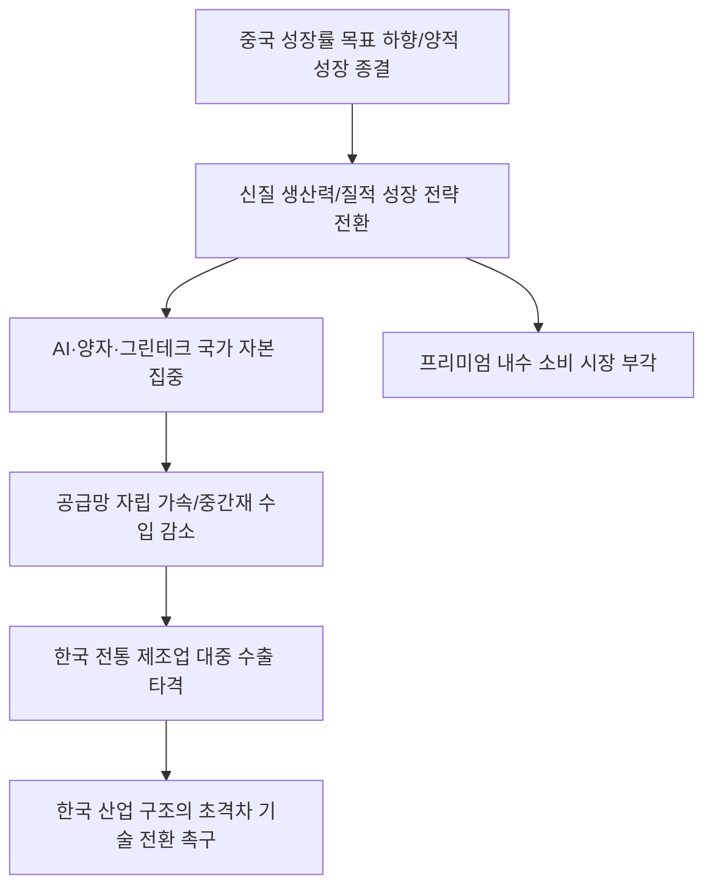

# 거시/국가 분석: 중국의 성장률 목표 하향과 '신질(新質) 생산력'으로의 질적 대전환
## 투자 신호 + 사회적 영향 평가

---

## 📌 기사 기본 정보

- **날짜**: 2026-03-06
- **출처**: 중국 양회(兩會) 분석 및 글로벌 경제 질서 재편 정밀 리포트
- **카테고리**: 경제 > 거시경제 > 중국/통상
- **핵심 주제**: 중국 정부가 연간 경제성장률 목표치를 하향 조정하며 과거의 양적 성장에서 벗어나, 인공지능(AI), 양자 기술, 친환경 에너지 등 고도화된 기술 기반의 '신질 생산력(New Quality Productive Forces)' 중심의 질적 성장으로 패러다임을 공식적으로 전환하는 전략 분석

**메타데이터**
- 주요 이슈: 중국 GDP 성장률 목표치 인하(5% 미만 가능성)
- 핵심 전략: 신질 생산력(친환경, 첨단기술, 디지털 경제) 집중 육성
- 주요 주체: 중국 국무원, 시진핑 주석, 글로벌 공급망 참여 기업, 대중 수출 한국 기업
- 키워드: 중국 성장률 하향, 신질 생산력, 질적 성장, 공급망 자립, 중실 경제(금융 실물 조화)

---

## 🔍 기사를 통한 투자 신호 추출

### 1단계: 핵심 사건 분해

**What (무엇이 일어났는가?)**
- 중국이 그동안 유지해온 '고속 성장'의 욕심을 내려놓고 고착화된 부동산 부실과 부채를 정리하기 위한 '저성장-고효율' 체제로의 전환을 선언함. 특히 시진핑 주석이 강조한 '신질 생산력'은 단순한 제조가 아닌, 우주, 해양, AI 등 미래 영토를 선점하기 위한 '기술 굴기'에 국가 자원을 몰아주겠다는 강력한 의지 표현임.

**When (언제 일어났는가?)**
- 2026-03-06 (중국 최대 정치 행사인 양회에서 2026년 경제 운용 방향이 확정되어 발표된 시점)

**Why (왜 이 중요한가?)**
- 전 세계 성장의 엔진이었던 중국의 감속은 글로벌 원자재 가격 하락과 경기 침체의 시그널이기 때문
- 중국이 더 이상 한국의 부품을 사서 조립하는 나라가 아니라, 첨단 기술에서 한국을 '압도'하려는 전략으로 선회했기 때문
- '신질 생산력' 관련 분야에서 전례 없는 보조금과 시장 개입이 예상되기 때문

**Who (누가 주도하는가?)**
- 국가 중심의 경제 재편을 진두지휘하는 시진핑 지도부
- 국영 기업 및 정부의 전폭적인 지원을 받는 첨단 테크 스타트업

---

### 2단계: 투자 신호 해석

#### A. **긍정적 신호 (Bullish)**

**① 중국의 '신질 생산력' 투자와 궤를 같이하는 '글로벌 테크 인프라' 기업**
- **신호**: 중국의 AI, 데이터 센터, 양자 통신 분야 대규모 투자 집행 뉴스
- **의미**: 중국이 기술 자립을 서두를수록 전 세계적으로 관련 원천 기술과 장비의 가치가 상승함
- **투자 기회**: 중국에 장비를 팔 수 있는 글로벌 노광장비 사, 양자 암호 및 AI 보안 선도 기업

**② 중국 내수 시장의 '질적 소비'와 연계된 프리미엄 브랜드**
- **신호**: 물량 위주의 소비보다는 소수의 '고퀄리티 생활' 선호 현상 강화
- **의미**: 중국의 중산층이 '가성비'가 아닌 '브랜드 가치'와 '건강'에 돈을 쓰기 시작함
- **투자 기회**: 중국 내 점유율이 견고한 글로벌 헬스케어, 명품 의류, 고사양 디지털 기기주

---

#### B. **위험 신호 (Bearish)**

**③ 중국의 '전통 제조 및 건설' 의존도가 높은 소재 섹터**
- **신호**: 중국 부동산 시장 침체 장기화 및 대규모 인프라 투자 축소 
- **의미**: 철강, 화학, 기계 등 과거 중국의 양적 성장에 기댔던 산업들의 수요가 영구적으로 감소함
- **투자 리스크**: 대중 수출 비중이 높은 철강주, 화학 범용 제품군, 대형 굴착기 등 건설 기계주

**④ 중국의 '기술 자립'에 의해 대체될 예정인 한국의 중간재 부품 기업**
- **신호**: 중국산 반도체, 디스플레이, 배터리 자급률 급격한 상승
- **의미**: 어제의 고객(중국 기업)이 오늘의 경쟁자가 되어 한국의 시장 점유율을 갉아먹음
- **투자 리스크**: 독보적 기술 차별화 없이 가격으로 경쟁하는 IT 부품 사, 구형 공정 반도체주

---

### 3단계: 섹터별 투자 기회 매트릭스

#### ✅ **높은 기대도 + 낮은 리스크**

**중국을 배제한 '대체 공급망(Chinaless Supply Chain)'의 핵심 국가 및 기업**
- 중국이 질적 성장에 집중하며 공급망을 폐쇄화할수록 인도, 베트남 등 '넥스트 차이나'를 선점한 기업의 가치는 비약적으로 상승함
- **투자 추천도**: ⭐⭐⭐⭐⭐

---

## 💰 구체적 투자 신호 변환

### 신호 1: '차이나 보너스'는 끝났다, '차이나 리스크'를 기술로 돌파하라

**투자 해석**: 기사는 중국이 더 이상 한국 경제의 '호구'가 아님을 시사함. 중국은 이제 '신질 생산력'이라는 이름 하에 우리와 같은 운동장에서 경쟁함. 투자자는 지금 즉시 '중국 리오프닝' 같은 낡은 테마에 기대는 종목을 전량 매도해야 함. 대신, 중국이 아직 따라오지 못한 '초격차 기술'을 가졌거나, 중국 시장을 포기하고도 미국/유럽/인도에서 잘 나가는 종목에 집중해야 함. 중국의 질적 성장은 한국에겐 '기회'가 아니라 '존망의 시험대'임.

---

## 🌍 사회적 영향 평가

### A. 긍정적 사회 영향
- **글로벌 환경 및 기술 표준의 상향 평준화**: 중국이 '질적 성장'과 '친환경 생산력'을 강조하며 전 세계 탄소 배출 저감과 첨단 기술의 상용화 속도를 높이는 긍정적 촉매제 역할 수행
- **국내 기업들의 혁신 체질 개선 유도**: 중국 시장의 문턱이 높아짐에 따라 우리 기업들이 안주하지 않고 세계 시장에서 통하는 독보적 기술력을 확보하도록 강제하는 강력한 변화의 동력 제공

### B. 부정적 사회 영향
- **글로벌 경제 블록화 및 냉전 체제 가속화**: 중국의 공급망 자립 강화는 서방 국가들과의 디커플링(Decoupling)을 심화시켜 글로벌 분업의 효율성을 떨어뜨리고 전 세계적인 물가 상승 유발
- **국내 수출 산업의 구조조정과 고용 충격**: 대중 수출에 의존하던 전통 산업군의 몰락은 대규모 실업과 지역 경제 위축을 초래하며 사회적 불평등과 세대 간 갈등을 심화시키는 리스크

---

## 🎯 결론: 당신의 투자 전략 수립

- **즉시 실행**: 대중 수출 비중 50% 이상인 전통 제조주 비중 축소, '신질 생산력' 경쟁 분야인 AI/양자/그린테크 대장주로 교체
- **3개월 후**: 중국의 실제 월간 GDP 데이터와 첨단 기술 분야 수출입 통계를 통해 질적 성장 전략의 실효성 여부 재검포

---

## 📝 Obsidian 연결 구조

