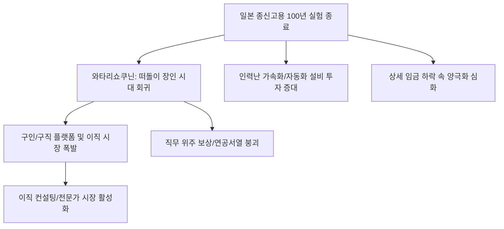

# 노동/거시 분석: 일본 종신고용의 최후와 '와타리쇼쿠닌(떠돌이 장인)' 시대의 회귀
## 투자 신호 + 사회적 영향 평가

---

## 📌 기사 기본 정보

- **날짜**: 2026-03-07
- **출처**: 글로벌 노동 경제 분석 및 일본 사회 구조 변화 리포트
- **카테고리**: 경제 > 노동 > 일본/거시
- **핵심 주제**: 일본 경제의 상징이었던 100년 전통의 '종신고용(Lifetime Employment)' 시스템이 실질 임금 하락과 인력난 속에 공식적으로 막을 내리는 현상과, 특정 회사에 얽매이지 않고 실력 하나로 살아가는 '와타리쇼쿠닌'식 프리랜서/유연 노동 시대의 도래 및 이에 따른 사회·경제적 파급 효과 분석

**메타데이터**
- 주요 이슈: 일본 3대 고용 관행(종신고용, 연공서열, 기업별 노조)의 동시 붕괴
- 핵심 키워드: 와타리쇼쿠닌(渡り職人), 조빙(Jobbing) 사회 전환, 실질임금 24개월 연속 하락
- 주요 주체: 내각부, 경단련(Keidanren), 일본 Z세대 직장인, 해외 우수 인력
- 키워드: 종신고용 종료, 유연 노동, 실질임금 하락, 인건비 불황, 와타리쇼쿠닌

---

## 🔍 기사를 통한 투자 신호 추출

### 1단계: 핵심 사건 분해

**What (무엇이 일어났는가?)**
- 일본 대기업조차 정년까지 고용을 보장해주던 관행을 포기하고 실력 위주의 '직무별 채용(Job-based hiring)'으로 급격히 선회함. 물가는 오르는데 월급은 제자리걸음인 상황에서, 젊은이들은 기업에 대한 충성심을 버리고 몸값을 올리기 위해 수시로 직장을 옮기는 '와타리쇼쿠닌(떠돌이 장인)'의 삶을 선택하게 됨.

**When (언제 일어났는가?)**
- 2026-03-07 (인플레이션 압력으로 인해 일본의 실질 임금이 역대 최장 기간 하락세를 기록하며 노동자들의 이직 열풍이 상수가 된 시점)

**Why (왜 일어났는가?)**
- 저출산·고령화로 인한 만성적 인력난으로 기업 간 '인재 뺏기' 경쟁 심화
- 디지털 트랜스포메이션(DX) 시대에 연공서열식 보상 체계로는 우수 인재 확보 불가능
- 전통적 종신고용을 유지하기엔 일본 대기업의 글로벌 마진율이 한계에 도달했기 때문

**Who (누가 주도하는가?)**
- 이직을 통해 연봉을 높이려는 IT 및 전문직 젊은 세대
- 성과 위주의 보상 체계 도입을 선언한 도요타, 히타치 등 일본 주요 대기업

---

### 2단계: 투자 신호 해석

#### A. **긍정적 신호 (Bullish)**

**① 'HR 테크' 및 '전문직 헤드헌팅' 플랫폼의 폭발적 성장**
- **신호**: 종신고용 붕괴로 인한 일본 내 이직 시장 규모 사상 최대치 
- **의미**: "직장은 교환 가능한 무대"라는 인식이 퍼지며 구인 유동성 폭증
- **투자 기회**: 일본 시장 점유율 1위 구인/구직 플랫폼 기업, 전문직 이직 매칭 AI 스타트업

**② '조빙(Jobbing)' 고도화에 따른 기업용 자동화 솔루션 수요 증대**
- **신호**: 잦은 이직으로 인한 업무 공백을 메우기 위한 업무 표준화 및 자동화 투자 확대
- **의미**: 사람이 떠나도 시스템이 돌아가게 하는 기술에 기업들이 아낌없이 투자함
- **투자 기회**: 일본 내 DX 컨설팅 선도 기업, 업무 프로세스 자동화(RPA) 전문 사

---

#### B. **위험 신호 (Bearish)**

**③ '내수 중심' 중소기업의 도태 및 인력난 고사 위험**
- **신호**: 대기업으로만 쏠리는 인재와 임금 인상 여력이 없는 영세 기업의 구인난
- **의미**: 일본 경제의 허리인 중소기업들이 사람을 못 구해서 문을 닫는 '흑자 도산' 증가
- **투자 리스크**: 일본 로컬 소비재 소형주, 중소 제조 하청업체

**④ 가처분 소득 정체에 따른 '일본 내수 유통' 시장의 활력 저하**
- **신호**: 실질 임금 하락 지속으로 인한 가계의 극단적 절약 모드
- **의미**: 일본 자국 내 시장에서만 장사하는 주식은 장기적인 밸류에이션 하락 우려
- **투자 리스크**: 일본 위주 백화점, 중저가 패션 브랜드, 국내 여행사

---

### 3단계: 섹터별 투자 기회 매트릭스

#### ✅ **높은 기대도 + 낮은 리스크**

**일본 내 자산보다 '해외 매출 비중'이 높은 일본 수출 대장주**
- 일본 내부의 고용 불안과 임금 하락 리스크를 해외에서의 강력한 브랜드 파워와 수익으로 상쇄하는 기업이 가장 안전함
- **투자 추천도**: ⭐⭐⭐⭐⭐

---

## 💰 구체적 투자 신호 변환

### 신호 1: '회사'라는 울타리가 사라진 자리에 '플랫폼'이 들어선다

**투자 해석**: 기사는 일본 사회가 '소속'의 시대에서 '능력'의 시대로 이동했음을 시사함. 이는 주식 시장에서 인건비 관리에 성공하고 핵심 인재를 유치한 기업만이 살아남는 '진검승부'의 시작임. 투자자는 지금 즉시 일본 포트폴리오를 '전통적 제조'에서 'HR 플랫폼 및 해외 수출 우량주'로 재편해야 함. 와타리쇼쿠닌의 시대에 수혜를 입는 것은 그들을 연결해주는 플랫폼과 그들이 만든 결과물을 전 세계에 파는 글로벌 기업임.

---

## 🌍 사회적 영향 평가

### A. 긍정적 사회 영향
- **노동 시장의 유동성 및 생산성 향상**: 평생 한 직장에 안주하던 관행에서 벗어나 최적의 재능을 최적의 자리에 배치하는 시장 원리 작동으로 일본 병을 치료하는 계기 마련
- **개인의 전문성 강화 및 자립도 제고**: 회사에 의존하지 않는 독립적인 기술자가 대우받는 사회 분위기 형성을 통해 개인의 성취감과 국가 전체의 기술 숙련도 향상

### B. 부정적 사회 영향
- **사회적 안전망 붕괴와 미래 불확실성 증대**: 회사가 모든 것을 책임져주던 '유사 가족' 기능이 사라지며 노후 대비 부족, 고립된 노동자 등 새로운 사회적 빈곤 계층 양산 우려
- **소득 양극화의 극단화**: 몸값이 비싼 상위 전문직과 단순 반복 노동을 하는 비정규직 하위 계층 간의 소득 격차가 일본 특유의 중산층 사회를 붕괴시키는 리스크

---

## 🎯 결론: 당신의 투자 전략 수립

- **즉시 실행**: 일본 내수주 비중 축소 및 일본 HR 테크 선도주로의 교체 매수, 엔화 가치 변동성에 따른 일본 수출주 포지션 조절
- **3개월 후**: 일본 가계의 실질 임금 반등 여부와 주요 기업들의 '와타리쇼쿠닌' 타겟 채용 전략 성과 확인 후 리밸런싱

---

## 📝 Obsidian 연결 구조

