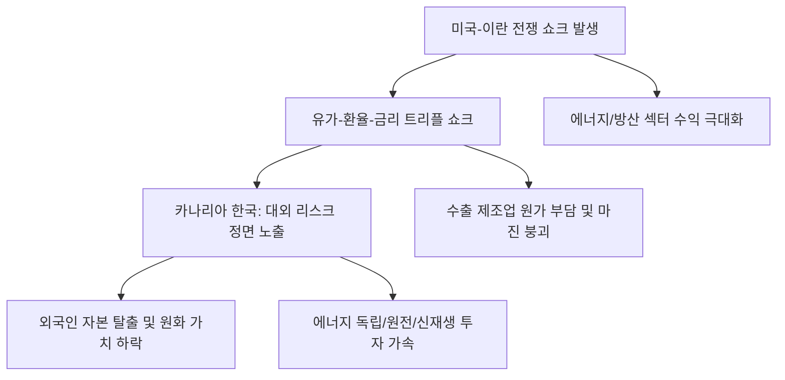

# 거시/리스크 분석: 미국-이란 전쟁 쇼크와 '탄광 속 카나리아' 한국 경제의 위기
## 투자 신호 + 사회적 영향 평가

---

## 📌 기사 기본 정보

- **날짜**: 2026-03-07
- **출처**: 글로벌 지정학적 리스크 및 한국 거시 경제 긴급 분석 리포트
- **카테고리**: 경제 > 거시경제 > 리스크관리
- **핵심 주제**: 미국과 이란의 직접적 충돌 가능성이 현실화되며 발생하는 유가 폭등, 환율 급등, 금리 인상의 '트리플 쇼크' 현상과, 글로벌 위기 시 가장 먼저 신호가 나타나는 '탄광 속의 카나리아'로서 한국 경제가 직면한 구조적 취약성 정밀 분석

**메타데이터**
- 주요 이슈: 호르무즈 해협 봉쇄 위기, 국제 유가 $120 돌파 시나리오
- 핵심 리스크: 한국의 에너지 수입 의존도(90%+) 발 외환 위기, 수출 경쟁력 붕괴
- 주요 주체: 백악관, 이란 혁명수비대, 한국은행, 글로벌 원자재 시장
- 키워드: 미국 이란 전쟁, 트리플 쇼크, 탄광 속 카나리아, 호르무즈 리스크, 경상수지 적자

---

## 🔍 기사를 통한 투자 신호 추출

### 1단계: 핵심 사건 분해

**What (무엇이 일어났는가?)**
- 미국과 이란 사이의 군사적 긴장이 단순 협박을 넘어 '전면전' 양상으로 치닫자, 전 세계 원유 물동량의 관문인 호르무즈 해협이 폐쇄될 위기에 처함. 이 여파로 유가는 수직 상승하고 안전 자산인 달러로 자금이 쏠리며, 에너지 수입국이자 소규모 개방 경제인 한국은 환율과 물가가 동시에 폭발하는 '복합 위기'의 정중앙에 놓임.

**When (언제 일어났는가?)**
- 2026-03-07 (국제 사회의 중재 노력이 실패하고 양측의 무력 충돌 보도가 전 세계 타전된 시점)

**Why (왜 한국이 가장 위험한가?)**
- 기름 한 방울 나지 않으면서도 중동 원유 의존도가 압도적으로 높기 때문
- 글로벌 투자자들이 위기 시 신흥국 중 가장 유동성이 풍부한 한국 자산을 가장 먼저 팔아치우기 때문
- 수출 원가 상승으로 인해 무역 수지가 급격히 악화될 수밖에 없는 구조적 한계

**Who (누가 주도하는가?)**
- 에너지 주권을 무기화하며 미국을 압박하는 이란
- 달러 패권을 수호하며 지정학적 개입을 공식화한 미국

---

### 2단계: 투자 신호 해석

#### A. **긍정적 신호 (Bullish)**

**① '지정학적 헤지'의 대명사인 원자재 및 방위 산업의 실적 폭주**
- **신호**: 전쟁 개시와 동시에 국제 유가 및 방산 발주 공시 봇물
- **의미**: 세상이 불안할수록 '에너지'와 '무기'를 가진 자가 모든 부를 독식함
- **투자 기회**: 미국/중동 기반 에너지 개발사, 글로벌 방산 대장주, 금 및 비트코인

**② '에너지 전환 및 효율화' 관련 핵심 기술 기업의 가치 재발견**
- **신호**: 화석 연료 리스크를 피하기 위한 원전 재가동 및 재생에너지 투자 확대 뉴스
- **의미**: 비싼 기름을 대체할 수 있는 기술 자체가 '생존 자산'이 됨
- **투자 기회**: 원전 기자재 선도 기업, 신재생 에너지 저장 장치(ESS) 전문 사

---

#### B. **위험 신호 (Bearish)**

**③ 에너지 수입 대금 부담에 따른 '원화 가치 하락'과 외인 자본 탈출**
- **신호**: 환율 1500원 돌파 및 국채 금리 급등
- **의미**: 한국 자산에 대한 신뢰가 낮아지며 주식-채권-원화가 함께 떨어지는 '트리플 약세'
- **투자 리스크**: 국내 코스피/코스닥 전 섹터 (에너지 제외), 내수 위주 건설/유통주

**④ 물류비와 원가 압박을 견디지 못하는 '수출 제조업'의 마진 증발**
- **신호**: 수입 물가 지수 최고치 경신 및 상하이컨테이너운임지수(SCFI) 급등 
- **의미**: 수출을 해도 물류비와 기름값을 내고 나면 남는 게 없는 '적자 수출' 상태 진입
- **투자 리스크**: 에너지 다소비 산업(철강, 화학, 가전), 배송 비용에 민감한 이커머스

---

### 3단계: 섹터별 투자 기회 매트릭스

#### ✅ **높은 기대도 + 낮은 리스크**

**국제 유가와 환율에 반대로 움직이는 '달러 표시 안전 자산' 및 '글로벌 에너지 ETF'**
- 한국 경제가 '카나리아'처럼 죽어갈 때, 살아남는 유일한 방법은 위기의 원인(에너지)이나 위기의 결과(달러/금)에 투자하는 것임
- **투자 추천도**: ⭐⭐⭐⭐⭐

---

## 💰 구체적 투자 신호 변환

### 신호 1: '카나리아'가 쓰러지기 전에 광산에서 탈출하라

**투자 해석**: 기사는 한국 경제가 글로벌 위기에 가장 취약한 '약점'을 고스란히 노출했음을 시사함. 투자자는 지금 즉시 포트폴리오의 70% 이상을 '국내 자산'에서 '해외 안전 자산'으로 리밸런싱해야 함. 전쟁이 단기에 끝나지 않는다면 원화 가치 하락은 일시적이 아닌 '구조적 붕괴'가 될 수 있음. 지금의 주가 하락은 '저가 매수' 기회가 아니라 '자산 대이동'의 강력한 경고음으로 받아들여야 함.

---

## 🌍 사회적 영향 평가

### A. 긍정적 사회 영향
- **에너지 및 안보 자립에 대한 국가적 대각성**: 지정학적 리스크에 노출된 한국의 민낯을 확인하고, 원전 강화와 재생에너지 확보 등 실질적인 '에너지 주권' 확립을 위한 초당적 논의 가속화
- **공급망 다변화 및 국산화 기술의 가치 부각**: 해외 의존도를 낮추기 위한 핵심 소재/부품 국산화 기업들에 대한 사회적 지원과 관심이 높아지며 탄탄한 산업 생태계 구축 계기 마련

### B. 부정적 사회 영향
- **전방위적 물가 폭등으로 인한 서민 생활고 가중**: 유가 발 물가 대란은 전기, 가스, 교통비뿐만 아니라 밥상 물가까지 전이되어 취약 계층을 생존의 위기로 내모는 사회적 재난 화
- **글로벌 경기 침체 가속화에 따른 고용 불안**: 제조업 위주인 한국 산업의 실적 악화는 대규모 명예퇴직과 채용 동결로 이어져 사회 전반에 걸친 미래 불확실성과 세대 갈등 고착화

---

## 🎯 결론: 당신의 투자 전략 수립

- **즉시 실행**: 국내 주식/채권 비중 최소화, 달러 현금 및 금(Gold) 비중 극대화, 에너지 레버리지 상품을 통한 단기 헤지 수행
- **3개월 후**: 호르무즈 해협 통행 재개 여부와 국제 유가 안정화 속도를 확인하며 국내 우량 수출주(반도체 등) 저점 매수 타점 조율

---

## 📝 Obsidian 연결 구조

