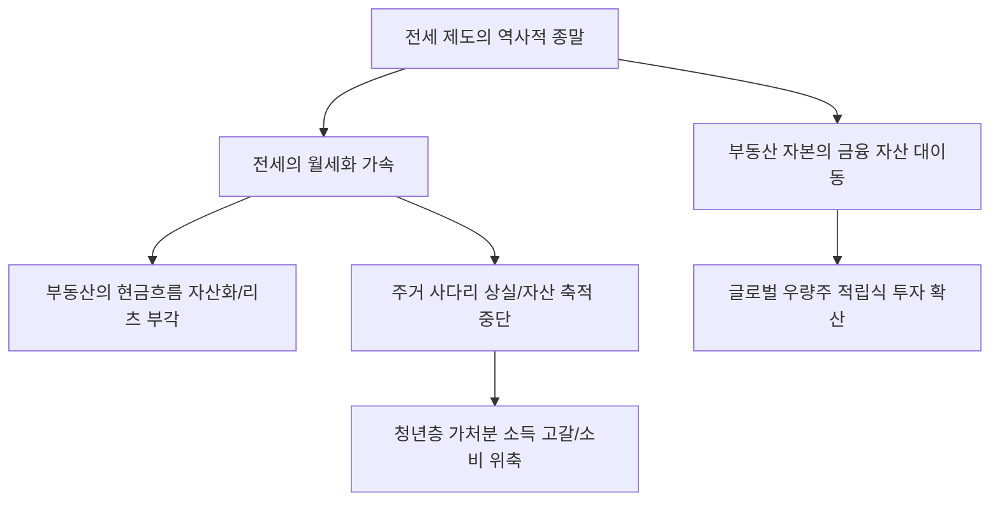

# 부동산/거시 분석: '주거 사다리' 규제의 역설과 전세 제도의 역사적 종말
## 투자 신호 + 사회적 영향 평가

---

## 📌 기사 기본 정보

- **날짜**: 2026-03-07
- **출처**: 대한민국 주택 임대 시장 및 서민 주거 정책 분석 리포트
- **카테고리**: 경제 > 부동산 > 주거정책
- **핵심 주제**: 임대차 3법 등 주거 사다리를 지키기 위해 도입된 규제들이 오히려 전세 매물 실종과 전세의 월세화를 가속하며 한국 특유의 '전세 제도'가 역사적 종말을 맞이하고 있는 현상과 그에 따른 자산 형성 경로의 재편 분석

**메타데이터**
- 주요 이슈: 전세가 월세로 빠르게 전환되는 '월세화(Rent-ification)' 현상
- 핵심 규제: 전월세 신고제, 상한제, 계약갱신청권 등 임대차 3법의 부작용 논란
- 주요 주체: 무주택 세입자, 다주택 임대인, 국토교통부, 한국부동산원
- 키워드: 주거 사다리 붕괴, 전세의 종말, 월세 시대, 전세 사기 후폭풍, 임대인 우위 시장

---

## 🔍 기사를 통한 투자 신호 추출

### 1단계: 핵심 사건 분해

**What (무엇이 일어났는가?)**
- 서민들의 내 집 마련을 위한 발판이었던 '전세'가 전세 사기에 대한 공포와 과도한 규제로 인해 시장에서 사라지고 있음. 대신 임대인은 목돈 대신 매달 현금을 받는 '월세'로 전환하고 있으며, 이는 세입자에게 사다리를 걷어차는 결과(자산 축적 기회 상실)를 초래 중임.

**When (언제 일어났는가?)**
- 2026-03-07 (고금리 기조가 고착화되고 임대차법 시행 이후의 계약 기간이 만료되며 신규 시세가 반영되는 '전세 소멸기'의 정점)

**Why (왜 일어났는가?)**
- 전세금 반환 리스크로 인해 은행 대출보다 전세를 더 '위험한 빚'으로 인식하기 시작했기 때문
- 임대인들이 보유세 부담을 전가하기 위해 전세를 월세로 전환하여 현금 흐름 확보를 원하기 때문
- 정부의 강력한 대출 규제로 인해 전세 자금을 조달하는 것이 월세 이자를 내는 것보다 힘들어졌기 때문

**Who (누가 주도하는가?)**
- 월세 수입을 통해 노후 자금을 확보하려는 중장년층 임대인
- 전세 리스크를 회피하고 안전하게 월세를 선택할 수밖에 없는 청년/서민 세입자

---

### 2단계: 투자 신호 해석

#### A. **긍정적 신호 (Bullish)**

**① '수익형 부동산' 및 '기업형 임대 주택' 시장의 밸류에이션 상승**
- **신호**: 전세 수요가 월세로 전환되며 임대료(Yield)가 지속적으로 상승하는 현상
- **의미**: 부동산이 시세 차익(Capital Gain)이 아닌 임대 수익(Monthly Cashflow) 자산으로 정착됨
- **투자 기회**: 국내 상장 부동산 리츠(REITs), 월세 수익형 꼬마빌딩, 임대 관리 전문 서비스 주

**② 가계의 현금 흐름 관리와 연계된 '모바일 핀테크/결제' 서비스의 확장**
- **신호**: 고정적인 월세 납부 및 월세 대환 대출, 포인트 결제 서비스 수요 증가
- **의미**: 월세가 가계 지출의 최대 항목이 되며 이를 관리하는 금융 플랫폼의 지배력 강화
- **투자 기회**: 월세 납부 기반 신용 점수 관리 앱, 월세 자동 이체 솔루션 공급 사

---

#### B. **위험 신호 (Bearish)**

**③ '내 집 마련' 꿈의 유예에 따른 대형 건설/주택 섹터의 장기 불황**
- **신호**: 전세 보증금을 지렛대로 집을 사던 '갭투자'의 종말
- **의미**: 신규 분양이나 매매 수요의 화력이 급감함. 건설사들의 미분양 리스크 상시화
- **투자 리스크**: 국내 주택 사업 비중이 높은 대형 건설사, 가구 및 인테리어 섹터

**④ 가처분 소득 고갈에 따른 '내수 소비재(Retail)' 시장의 침체**
- **신호**: 소득의 상당 부분이 저축(전세금)이 아닌 지출(월세)로 사라짐
- **의미**: 2030 세대의 소비력이 월세라는 '블랙홀'에 빠져 내수 경기가 하향 평탄화됨
- **투자 리스크**: 백화점, 명품, 고가 외식업, 자동차 등 고관여 소비재 섹터

---

### 3단계: 섹터별 투자 기회 매트릭스

#### ✅ **높은 기대도 + 낮은 리스크**

**글로벌 자산으로 부의 대피를 돕는 '해외 투자 플랫폼 및 상장지수펀드(ETF)'**
- 국내 부동산으로 자산 형성이 불가능해진 청년층의 자금은 결국 '해외 우량주 적립식 투자'로 향함. 주거 사다리가 끊긴 세대의 유일한 탈출구임
- **투자 추천도**: ⭐⭐⭐⭐⭐

---

## 💰 구체적 투자 신호 변환

### 신호 1: '갭투자'의 시대가 지고 'YIELD(수익률)'의 시대가 온다

**투자 해석**: 기사는 한국 부동산 시장의 근간이었던 전세 제도가 붕괴되었음을 뜻함. 이는 부동산이 '투자 상품'에서 '소비 상품'으로 바뀌었음을 의미함. 투자자는 지금 즉시 '아파트 시세 차익'에만 몰두하는 전략을 버리고, 월세를 기반으로 배당을 주는 '리츠'나 '수익형 자산'으로 포트폴리오를 옮겨야 함. 또한, 월세 지출 증가로 위축될 국내 내수 소비재 종목은 과감히 제외하고 고성장하는 글로벌 기술주 위주로 자산을 재배치해야 함.

---

## 🌍 사회적 영향 평가

### A. 긍정적 사회 영향
- **부동산 시장의 투명성 및 안정성 제고**: 전세 뒤에 숨겨졌던 과도한 레버리지(갭투자)가 사라지면서 부동산 가격의 거품이 빠지고 임대차 관계가 보다 명확한 계약 중심으로 정착
- **금융 자산으로의 자본 대이동**: 부동산에만 과도하게 쏠려 있던 국가적 자본이 생산적인 주식, 채권, 기술 투자 등으로 흘러들어가며 국가 경제의 유연성 향상 기여

### B. 부정적 사회 영향
- **서민들의 '자립 기반' 상실과 빈곤의 대물림 가속**: 전세를 통해 목돈을 만들던 경로가 차단되어, 평생 월세를 내며 자산을 축적하지 못하는 '주거 빈곤 계층(Rent-poor)' 양산 위험
- **사회적 갈등 심화 및 저출산의 결정적 타격**: 주거비 부담이 곧 결혼과 출산 포기로 연결되며 국가 존립 자체를 위협하는 인구 구조적 붕괴 리스크 강화

---

## 🎯 결론: 당신의 투자 전략 수립

- **즉시 실행**: 국내 건설/부동산 직접 매수 비중 축소 및 국내외 상장 리츠 포트폴리오 편입, 가처분 소득 감소로 타격받을 종목 매도
- **3개월 후**: 정부의 전세제도 보완책(공공 전세 등) 성과와 월세 전환율 추이 확인 후 리밸런싱

---

## 📝 Obsidian 연결 구조

