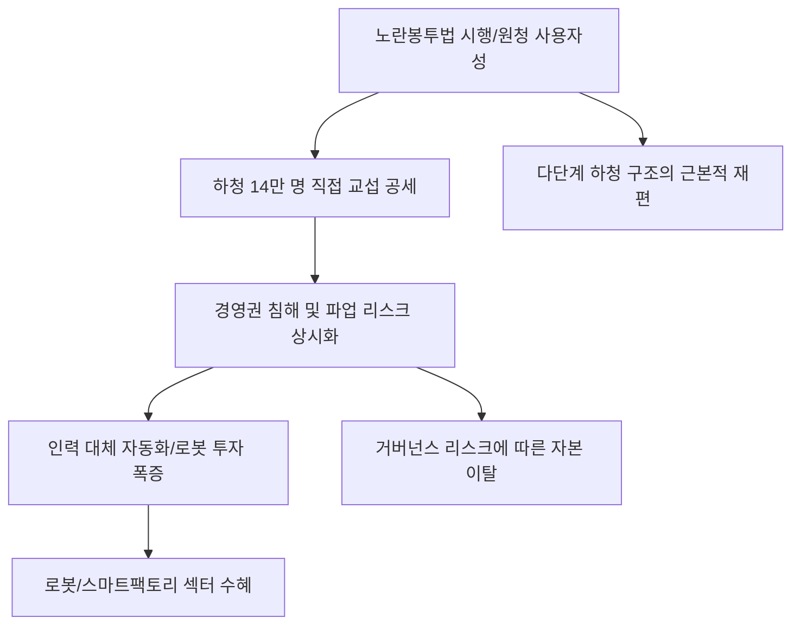

# 노동/산업 분석: 노란봉투법 시행과 원청 사용자성 확대, 거버넌스 리스크 관리
## 투자 신호 + 사회적 영향 평가

---

## 📌 기사 기본 정보

- **날짜**: 2026-03-09
- **출처**: 대한민국 노동법 개정 및 기업 거버넌스 리스크 분석 리포트
- **카테고리**: 경제 > 노동 > 산업/ESG
- **핵심 주제**: 노란봉투법(노동조합 및 노동관계조정법 2·3조 개정안) 시행에 따라 원청 기업의 사용자 책임이 하청 노동자에게까지 확대되며, 14만 명에 달하는 하청 노동자들의 직접 교섭 공세와 이에 따른 기업들의 경영권 방어 및 거버넌스 리스크 관리 전략 분석

**메타데이터**
- 주요 법안: 노란봉투법(노동자 범위 확대, 손해배상 청구 제한)
- 핵심 변화: 실질적 지배력을 가진 원청을 '사용자'로 인정(대법원 판례 입법화)
- 주요 주체: 고용노동부, 민주노총/한국노총, 대형 제조 원청 기업, 하청 노동자
- 키워드: 노란봉투법, 원청 사용자성, 하청 교섭, 파업권 확대, ESG 거버넌스 리스크

---

## 🔍 기사를 통한 투자 신호 추출

### 1단계: 핵심 사건 분해

**What (무엇이 일어났는가?)**
- 그동안 하청 업체 직원은 원청과 직접 계약 관계가 아니라는 이유로 원청에 교섭을 요구할 수 없었으나, 새 법 시행으로 원청이 이들의 '진짜 사장' 대우를 받게 됨. 이제 대형 자동차, 조선, 건설 현장은 수십 개의 하청 노조와 개별적으로 협상해야 하는 상황에 놓였으며, 불법 파업에 대한 손해배상 청구도 사실상 가로막힘.

**When (언제 일어났는가?)**
- 2026-03-09 (법안 공포 후 유예 기간이 종료되고 산업 현장에서 실질적인 교섭 요구가 빗발치기 시작한 시점)

**Why (왜 일어났는가?)**
- 간접 고용(비정규직, 하청) 구조를 통해 책임을 회피해온 기업 문화에 대한 사법부와 입법부의 경고
- 국제노동기구(ILO) 결사보장 원칙 준수라는 글로벌 ESG 스탠다드 부합화 과정
- 실질적인 업무 지시는 원청이 하면서 책임은 하청이 지는 구조의 불합리성 해소 요구

**Who (누가 주도하는가?)**
- 법 시행력을 바탕으로 대대적 공세를 펼치는 거대 노조
- 경영권 침해와 파업 피해를 우려하며 헌법 소원 및 대응 매뉴얼 구축에 나선 경영계(경총 등)

---

### 2단계: 투자 신호 해석

#### A. **긍정적 신호 (Bullish)**

**① '법무 및 노무 리스크 관리' 솔루션을 제공하는 전문 서비스 사의 수요 폭증**
- **신호**: 기업들의 노무 컨설팅 및 로펌 자문 비용 예산 증액
- **의미**: 법이 복잡해질수록 이를 해석하고 방어해주는 '두뇌'의 가치는 절대적임
- **투자 기회**: 노동 전문 로펌 파트너십 기업, 기업용 법무 지원(Compliance) IT 솔루션 사

**② '자동화 및 로봇 공정' 도입 속도의 비약적 가속화**
- **신호**: 노사 갈등 리스크를 회피하기 위해 인력 투입 자체를 줄이려는 경영진의 의지
- **의미**: 노란봉투법은 역설적으로 '사람 없는 공장'에 대한 투자를 정당화하는 강력한 동력이 됨
- **투자 기회**: 산업용 로봇 감속기 제조사, 공정 자동화 소프트웨어 선도 기업, 자율주행 스마트 물류 사

---

#### B. **위험 신호 (Bearish)**

**③ 하청 비중이 높은 '대형 장치 산업'의 비용 불확실성 상시화**
- **신호**: 원청-하청 간의 직접 교섭 체결 비용 및 파업에 따른 공정 중단 리스크 현실화
- **의미**: 인건비 조절을 통한 이익 방어가 불가능해지며, 주가 밸류에이션의 '노무 리스크' 할인 발생
- **투자 리스크**: 조선, 자동차, 철강, 대형 건설업종 등 다단계 하청 구조를 가진 섹터

**④ 'ESG 등급 강등'에 따른 외국인 투자자의 자금 이탈**
- **신호**: 노사 분규 장기화 및 불공정 거래 논란으로 인한 거버넌스 점수 하락
- **의미**: 사회적 책임(S)과 거버넌스(G) 리스크를 극도로 꺼리는 글로벌 ESG 펀드들이 매도세로 돌아섬
- **투자 리스크**: 노조 조직률이 높고 분규가 잦은 상장 대기업

---

### 3단계: 섹터별 투자 기회 매트릭스

#### ✅ **높은 기대도 + 낮은 리스크**

**노사 리스크로부터 자유로운 '지식 라이선스 및 디지털 자산' 기업**
- 직원이 수만 명인 공장보다, 소수의 핵심 인재가 IP(지적재산권)로 돈을 버는 기업은 법 개정의 타격에서 완전히 벗어나 있음
- **투자 추천도**: ⭐⭐⭐⭐⭐

---

## 💰 구체적 투자 신호 변환

### 신호 1: '노란봉투'는 로봇을 부르고, 로봇은 '수익성'을 부른다

**투자 해석**: 기사는 한국의 전통적 노동 집약형 산업 구조가 한계에 부딪혔음을 시사함. 노란봉투법 체제 하에서 사람을 쓰는 리스크는 감당하기 어려운 수준이 될 것임. 투자자는 지금 즉시 '노동 집약적'인 대형 제조주에서 '기술 집약적'인 자동화 수혜주로 포트폴리오를 대폭 이동해야 함. 노사 갈등이 심해질수록 로봇 팔은 더 빨리 움직일 것이고, 그 로봇을 만드는 기업이 이번 법 개정의 진정한 수혜자가 될 것임.

---

## 🌍 사회적 영향 평가

### A. 긍정적 사회 영향
- **일하는 사람의 실질적 기본권 보장**: 무늬만 사장이 아닌 '진짜 책임'을 가진 사람과 협상하게 함으로써 하청 노동자의 처우 개선과 사회적 양극화 완화 기여
- **투명한 상생 협력 관계 구축**: 원-하청 간의 비정상적인 책임 전가 구조를 바로잡고 소통을 정례화하여 장기적인 신뢰 기반의 협력 생태계 조성

### B. 부정적 사회 영향
- **산업 경쟁력 약화 및 '해외 이전' 가속화**: 노무 리스크를 견디지 못한 핵심 산업 기지들이 공장을 해외로 옮기면서 예기치 못한 '국내 일자리 소멸' 초래
- **노노(勞勞) 갈등 및 사회적 비용 폭증**: 원청 노조(정규직)와 하청 노조 간의 이해관계 충돌 및 잦은 파업으로 인한 물류/생산 마비로 전 국민이 겪는 불편과 경제적 손실 가중

---

## 🎯 결론: 당신의 투자 전략 수립

- **즉시 실행**: 하청 구조가 복잡한 대형 제조사 비중 축소, 산업용 로봇 및 자동화 핵심 소재주로 교체 매수
- **3개월 후**: 주요 사업장의 하청 노조 교섭 타결 여부 및 임금 인상 폭 데이터 확인 후 실적 추정치 리밸런싱

---

## 📝 Obsidian 연결 구조

