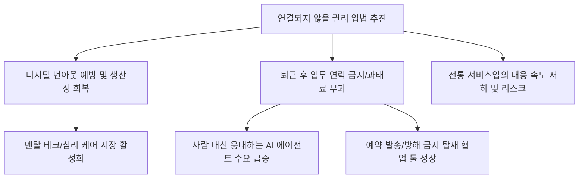

# 노동/고용 분석: '연결되지 않을 권리'와 디지털 번아웃 시대의 노동 주권 회복
## 투자 신호 + 사회적 영향 평가

---

## 📌 기사 기본 정보

- **날짜**: 2026-03-09
- **출처**: 대한민국 근로 기준법 개정 및 디지털 노동 환경 분석 리포트
- **카테고리**: 경제 > 노동 > 고령/고용정책
- **핵심 주제**: 퇴근 후 카톡 등으로 업무 지시를 내리는 '디지털 초연결'의 부작용을 막기 위한 '연결되지 않을 권리(Right to Disconnect)'의 입법화 추진과, 디지털 번아웃에 시달리는 노동자들의 생산성 회복 및 새로운 노동 주권 패러다임 분석

**메타데이터**
- 주요 법안: 근로기준법 개정(퇴근 후 업무지시 금지 및 위반 시 과태료)
- 핵심 키워드: 디지털 번아웃, 연결되지 않을 권리, 집중 근무제, 슬랙오프(Slack-off) 예방
- 주요 주체: 고용노동부, 기업 인사팀, 직장인, 협업 툴(SaaS) 개발사
- 키워드: 연결되지 않을 권리, 디지털 번아웃, 노동 주권, 퇴근 후 카톡 금지, 업무 효율화

---

## 🔍 기사를 통한 투자 신호 추출

### 1단계: 핵심 사건 분해

**What (무엇이 일어났는가?)**
- 정부와 정치권이 퇴근 후 업무 연락을 사실상의 '추가 근로'로 규정하고 이를 법적으로 금지하는 방안을 본격 추진함. 스마트폰으로 인해 24시간 업무 대기 상태에 처한 직장인들에게 '완전한 휴식'을 보장하여 만성화된 번아웃을 예방하고 삶의 질을 높이겠다는 취지임.

**When (언제 일어났는가?)**
- 2026-03-09 (원격 근무와 유연 근무가 정착된 이후, 공과 사의 경계가 무너진 '디지털 과잉 노동'의 폐해가 사회 문제로 비등한 시점)

**Why (왜 일어났는가?)**
- 디지털 스트레스로 인한 정신 건강 악화와 이로 인한 장기적 노동 생산성 저하 방지
- 일과 삶의 균형(워라밸)을 중시하는 MZ세대의 강력한 요구 반영
- 프랑스 등 유럽 선진국들의 성공적 입법 사례 벤치마킹

**Who (누가 주도하는가?)**
- 노동 인권 보호를 앞세운 고용노동부 및 사회적 합의 기구
- 생산성 중심의 유연한 조직 문화를 선도하는 실리콘밸리형 국내 테크 기업들

---

### 2단계: 투자 신호 해석

#### A. **긍정적 신호 (Bullish)**

**① '업무 자동화 및 예약 발송' 기능이 탑재된 기업용 협업 툴(SaaS) 기업**
- **신호**: 퇴근 후 연락 금지 법안 준수를 돕는 '업무 분리 솔루션' 수요 폭증
- **의미**: 강제로 연결을 끊어주면서도 협업을 유지하게 돕는 기술의 가치가 급상승함
- **투자 기회**: 예약 발송·지능형 방해 금지 기능이 강화된 협업 소프트웨어(B2B SaaS) 기업

**② '멘탈 테크(Mental Tech)' 및 스트레스 관리 웰니스 산업의 확장**
- **신호**: 기업들이 직원들의 디지털 번아웃 관리를 위해 제공하는 복지 예산 증액
- **의미**: 정신 건강 케어가 단순 복지를 넘어 '필수 경영 리스크 관리' 항목이 됨
- **투자 기회**: 명상 앱 플랫폼, 비대면 심리 상담 서비스, 웨어러블 헬스케어 기기 사

---

#### B. **위험 신호 (Bearish)**

**③ '상시 대응'이 경쟁력이었던 전통 서비스업 및 수주형 제조 기업**
- **신호**: 즉각적 피드백이 불가능해짐에 따른 고객 대응 속도 저하 우려
- **의미**: 시스템 전환 준비 없이 법만 지킬 경우 영업 기회 손실 및 경쟁력 약화 가능성
- **투자 리스크**: 시스템 자동화가 안 된 상태에서 인력의 '24시간 대기'로 버텨온 구시대적 용역 사

**④ 기업의 '인건비 및 관리 비용' 상승 압박**
- **신호**: 퇴근 후 연락이 안 되므로 교대 근무자를 늘리거나 인력을 충원해야 하는 상황 발생 
- **의미**: 마진율이 낮은 한계 기업들에게는 추가적인 비용 리스크로 작용
- **투자 리스크**: 관리 효율성이 낮고 고정비 비중이 높은 인력 중심 중소 상장사

---

### 3단계: 섹터별 투자 기회 매트릭스

#### ✅ **높은 기대도 + 낮은 리스크**

**AI 기반 '업무 자율 에이전트' 개발 기업**
- 사람이 퇴근해도 AI 에이전트가 고객의 문의에 실시간 응대하고 업무를 처리함. 법을 지키면서도 24시간 돌아가는 공장을 가동하게 하는 핵심 기술임
- **투자 추천도**: ⭐⭐⭐⭐⭐

---

## 💰 구체적 투자 신호 변환

### 신호 1: '연결을 끊어주는 기술'이 역설적으로 더 큰 돈이 된다

**투자 해석**: 기사는 노동의 패러다임이 '시간 투입'에서 '밀도 있는 집중'으로 바뀌었음을 시사함. 이제 기업의 경쟁력은 직원을 24시간 괴롭히는 것이 아니라, 퇴근 후에 확실히 쉬게 하고 업무 시간에 'AI'를 얼마나 잘 활용하느냐에 달려 있음. 투자자는 지금 즉시 '인력 갈아넣기'식 구태 기업을 정리하고, 직원과 고객을 연결하는 '지능형 중간자(AI/SaaS)'를 가진 기업으로 이동해야 함. 연결을 끊어주는 권리가 보장될수록, 그 공백을 메워주는 기술의 수익은 극대화될 것임.

---

## 🌍 사회적 영향 평가

### A. 긍정적 사회 영향
- **디지털 건강권 보장 및 번아웃 예방**: 가계와 사회 전체의 정신적 피로도를 낮추어 장기적인 실질 주관적 행복도 향상 및 의료비 절감 기여
- **저녁이 있는 삶을 통한 내수 소비 진작**: 퇴근 후 자유 시간을 보장받은 직장인들이 운동, 문화 체험, 자기 개발 등에 시간을 쓰며 새로운 서비스 산업 활성화 유도

### B. 부정적 사회 영향
- **긴급 상황 대응력 약화에 따른 안전 리스크**: 재난, 보안 사고 등 초각을 다투는 상황에서도 '연락 금지' 뒤에 숨는 업무 태만(Slack-off) 발생 가능성 및 책임 소재 갈등
- **고용 형태에 따른 새로운 차별**: 법의 보호를 받는 정규직과 달리, 실시간 응대가 평판과 직결되는 플랫폼 노동자/자영업자와의 '연결의 격차' 발생 및 사회적 불평등 심화 위험

---

## 🎯 결론: 당신의 투자 전략 수립

- **즉시 실행**: 포트폴리오 내 업무 자동화/협업 툴 선도 기업 비중 확대, 구태의연한 관리 방식의 기업 비중 축소
- **3개월 후**: 관계 부처의 법안 세부 시행령(예외 상황 규정 등) 발표 내용 확인 후 AI 에이전트 섹터 집중 투자

---

## 📝 Obsidian 연결 구조

