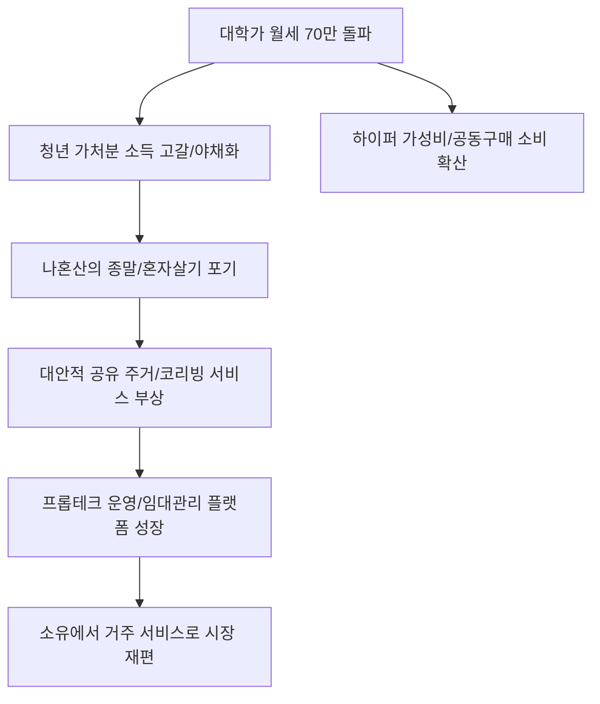

# 부동산/사회 분석: 대학가 월세 70만 원 시대와 '주거 공유 경제'의 탄생
## 투자 신호 + 사회적 영향 평가

---

## 📌 기사 기본 정보

- **날짜**: 2026-03-09
- **출처**: 대한민국 청년 주거 실태 및 도시 부동산 트렌드 리포트
- **카테고리**: 경제 > 부동산 > 사회정책
- **핵심 주제**: 수도권 주요 대학가 원룸 월세가 70만 원을 돌파하며 청년들의 주거 부담이 임계치에 도달한 현상과, 혼자 사는 삶(나혼산)을 포기하고 다시 모여 살거나 공유 주거를 선택하는 '대안적 공유 경제'의 부상 및 사회적 영향 분석

**메타데이터**
- 주요 지표: 대학가 평균 월세 70만 원 돌파, 청년 주거비 비중 소득 대비 40% 상회
- 핵심 트렌드: 나혼산(혼자 살기)의 종말 → 공유 주택(Co-living), 커뮤니티 하우스 부상
- 주요 주체: 2030 청년 세대, 임대인, 공유 주거 플랫폼 스타트업, 국토교통부
- 키워드: 대학가 월세 쇼크, 청년 주거 절규, 코리빙 하우스, 공유 경제, 주거 사다리 붕괴

---

## 🔍 기사를 통한 투자 신호 추출

### 1단계: 핵심 사건 분해

**What (무엇이 일어났는가?)**
- 대학생과 사회초년생들이 주로 거주하는 원룸 시세가 감당 불가능한 수준으로 폭등함. 식비와 교통비를 아껴도 월세를 내면 '야채(사회적 활동 없이 방에만 머무는 상태)'가 될 수밖에 없는 청년들이, 비용 절감과 정서적 유대를 위해 거실과 주방을 공유하는 '코리빙(Co-living)' 모델로 대거 이동 중임.

**When (언제 일어났는가?)**
- 2026-03-09 (입학 시즌과 맞물려 월세 가격이 전년 대비 15% 이상 급등하며 주거 불안이 사회적 이슈로 비화된 시점)

**Why (왜 일어났는가?)**
- 전세 사기 공포로 인한 '전세의 월세화' 가속 및 월세 수요 쏠림
- 고금리로 인한 임대인의 이자 부담 전가 및 물가 상승분 반영
- 도심 내 저가 주택 공급 부족과 1인 가구 주거 가이드라인 부재

**Who (누가 주도하는가?)**
- 높은 월세 수익을 극대화하려는 노후 임차인(Landlord)
- 공간 효율성을 극대화해 중저가 주거 솔루션을 제공하는 프롭테크(Prop-tech) 스타트업

---

### 2단계: 투자 신호 해석

#### A. **긍정적 신호 (Bullish)**

**① '기업형 코리빙(Co-living)' 및 '임대 관리 SaaS' 플랫폼의 확장**
- **신호**: 개인 원룸보다 쾌적하면서 가격은 합리적인 공유 주력 주택의 입주율 및 대기 수요 급증
- **의미**: 주거가 '소유'의 영역에서 '운영과 서비스'의 영역으로 이동함. 규모의 경제를 가진 대형 브랜드가 시장 장악
- **투자 기회**: 기업형 임대 주택 리츠(REITs), 공유 주거 전문 프롭테크 기업, 건물 자동 관리 시스템 사

**② 가성비 중심의 '편의점 식단' 및 '공동 구매/구독' 시장의 활성화**
- **신호**: 주거비 부담에 따른 청년들의 극단적 식비 절감 및 생필품 공동 구매 이용률 증가
- **의미**: 청년 타겟 브랜드들은 이제 '럭셔리'가 아닌 '하이퍼 가성비'에서 승부를 봐야 함
- **투자 기회**: PB 상품 경쟁력이 압도적인 편의점주, 소액 단위 식자재 배송 플랫폼

---

#### B. **위험 신호 (Bearish)**

**③ '나홀로 소비' 테마의 몰락 및 1인 가구 타겟 프리미엄 가전 침체**
- **신호**: 소형 명품, 비싼 취미 가전(커피머신 등)의 구매력 하락 
- **의미**: "혼자만의 공간을 꾸민다"는 로망이 사라지며 관련 내수 소비가 급감함
- **투자 리스크**: 고가형 소형 가전 제조사, 취미 기반 D2C 브랜드

**④ 대학가 인근 '낡은 다가구/다세대' 주택의 담보 가치 하락**
- **신호**: 기업형 코리빙 하우스 등장으로 인한 경쟁력 상실 및 공실 발생 시작
- **의미**: 관리 안 되는 낡은 원룸은 이제 시장에서 외면받으며 자산 가치가 빠르게 하락함
- **투자 리스크**: 건축 연도가 오래된 대학가 원룸 밀집 지역의 부동산 및 관련 담보 대출

---

### 3단계: 섹터별 투자 기회 매트릭스

#### ✅ **높은 기대도 + 낮은 리스크**

**공유 주거 내 '라이프스타일 서비스'를 제공하는 플랫폼**
- 방은 같이 써도 개인의 취향은 포기 못 함. 세탁, 청소, 커뮤니티 활동을 대행해주는 서비스는 코리빙 확대와 비례해 성장함
- **투자 추천도**: ⭐⭐⭐⭐

---

## 💰 구체적 투자 신호 변환

### 신호 1: '집'은 사는 곳이 아니라 '사용하는 서비스'가 된다

**투자 해석**: 기사는 청년 주거가 '공간의 점유'에서 '기능의 공유'로 패러다임이 바뀌었음을 시사함. 투자자는 지금 즉시 '개별 원룸' 중심의 부동산 매매 방식에서 벗어나, 기업이 운영하고 관리하는 '주거 서비스 지배력'을 가진 기업에 투자해야 함. 청년들이 돈이 없어 모여 사는 것이 아니라, 비용 대비 최대의 효용을 위해 '똑똑한 공유'를 선택하고 있다는 점에 주목해야 함. 프롭테크는 이제 단순 중개가 아닌 '주거 운영업'으로 진화 중임.

---

## 🌍 사회적 영향 평가

### A. 긍정적 사회 영향
- **고립된 청년들의 커뮤니티 복원**: 혼자 살며 '야채'처럼 지내던 청년들이 거실과 주방을 공유하며 자연스럽게 사회적 관계를 맺고 정서적 안정과 외로움 해소 기여
- **자원의 효율적 활용과 지속 가능한 도시**: 공간과 물건을 공유함으로써 자원 낭비를 줄이고, 도심 내 주거 밀도를 효율적으로 관리하는 새로운 도시 모델 제시

### B. 부정적 사회 영향
- **'주거 사다리' 상실로 인한 미래 설계 포기**: 소득의 절반을 월세로 내며 저축이 불가능해진 청년들이 결혼이나 내 집 마련을 영구 포기하며 사회적 활력 저하 및 저출산 가속화
- **공유 주거 내 갈등과 사생활 침해**: 타인과의 밀착 거주에서 오는 스트레스와 범죄 노출 위험 등 새로운 형태의 사회적 갈등과 관리 사각지대 발생 위험

---

## 🎯 결론: 당신의 투자 전략 수립

- **즉시 실행**: 전통적 건설/부동산 섹터 비중 줄이고, 기업형 임대관리 및 프롭테크 관련 상장 리츠/ETF 관심 종목 편입
- **3개월 후**: 정부의 청년 주거 지원비 상향 여부 및 신규 공유 주택 공급량 데이터 확인 후 리밸런싱

---

## 📝 Obsidian 연결 구조

