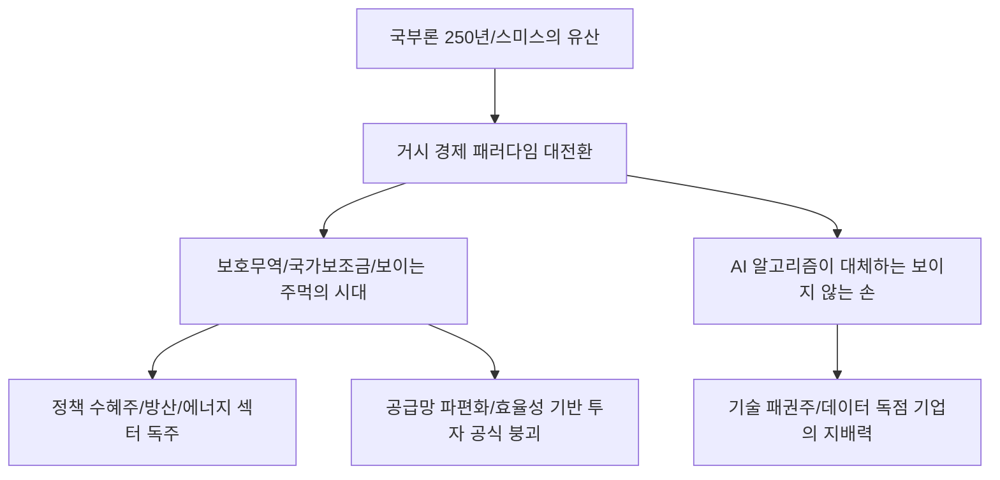

# 경제사/철학 분석: 국부론 250년과 '보이지 않는 손'의 위기, 새로운 시장 질서
## 투자 신호 + 사회적 영향 평가

---

## 📌 기사 기본 정보

- **날짜**: 2026-03-09
- **출처**: 글로벌 경제사 및 현대 시장 경제 철학 비평 리포트
- **카테고리**: 경제 > 경제사/철학 > 거시경제
- **핵심 주제**: 애덤 스미스의 『국부론(The Wealth of Nations)』 출간 250주년을 맞아, 보호무역주의 강화와 정부 개입 확대 속에서 '보이지 않는 손(Invisible Hand)'과 자유 시장 질서의 유효성을 재점검하고, 기술 패권 시대의 새로운 경제 패러다임 분석

**메타데이터**
- 주요 기념: 국부론 출간 250주년 (1776~2026)
- 핵심 논쟁: 시장의 자기 조절 기능 vs 국가 안보 및 공급망 보호를 위한 정부 개입
- 주요 주체: 애덤 스미스적 자유주의자, 신보호무역주의 정부, 글로벌 빅테크 독점체
- 키워드: 애덤 스미스, 국부론 250년, 보이지 않는 손, 시장 실패, 국가 자본주의, 기술 패권

---

## 🔍 기사를 통한 투자 신호 추출

### 1단계: 핵심 사건 분해

**What (무엇이 일어났는가?)**
- 자원의 효율적 배분을 시장에 맡겼던 지난 수십 년간의 '세계화(Liberalism)' 질서가 저물고, 국가가 보조금을 주고 수출을 막는 '국가 자본주의'와 '블록 경제'가 다시 득세함. 국부론의 본질인 '자유 무역'이 국가 안보라는 명분에 밀려나는 대전환기를 맞아, 자유 시장의 핵심인 '축적'과 '분업'의 원리가 어떻게 변질되고 있는지 성찰함.

**When (언제 일어났는가?)**
- 2026-03-09 (국부론 출간 250년을 기념함과 동시에, 전 세계적으로 관세 장벽이 높아지고 반정부 시위와 사회적 양극화가 정점에 달한 시점)

**Why (왜 이 중요한가?)**
- 우리가 믿어온 투자의 근간(경쟁과 효율)이 송두리째 흔들리고 있기 때문
- '보이지 않는 손'이 아닌 '보이는 주먹(정부 보조금과 제재)'이 주가와 환율을 결정하는 시대가 되었기 때문

**Who (누가 주도하는가?)**
- 자국 산업 보호를 위해 천문학적 보조금을 쏟아붓는 주요 강대국 정부
- 시장 지배력을 넘어 국가 이상의 권력을 행사하는 글로벌 플랫폼 기업

---

### 2단계: 투자 신호 해석

#### A. **긍정적 신호 (Bullish)**

**① '보이는 주먹(정부 보조금)'의 직접 수혜를 입는 국가 전략 산업**
- **신호**: 반도체법(CHIPS Act), 인플레이션 감축법(IRA) 등 정부의 막대한 재정 투입
- **의미**: 이제 효율성보다 '정치적 선택'을 받은 기업이 무조건 이김. 시장 경쟁이 아닌 세금 지원으로 성장하는 구조
- **투자 기회**: 국내외 반도체 보조금 수혜주, 차세대 에너지 인프라 핵심 기업

**② 독점적 데이터를 기반으로 '시장 질서'를 창출하는 플랫폼 제국**
- **신호**: 스미스가 말한 '분업'의 끝판왕인 AI와 로봇 기술의 독점화
- **의미**: 소수의 기술 기업이 보이지 않는 손 대신 '알고리즘'으로 자원을 배분함
- **투자 기회**: 글로벌 AI 파운데이션 모델 보유주, 클라우드 인프라 독점 기업

---

#### B. **위험 신호 (Bearish)**

**③ '경쟁력' 하나로 버티던 글로벌 자유 무역 수혜 중견 제조업**
- **신호**: 국가 간 관세 장벽 및 비관세 장벽(탄소세 등)의 상시화
- **의미**: 아무리 싸고 좋은 물건을 만들어도 정치적 논리로 수출이 전면 차단될 위험
- **투자 리스크**: 정부의 보호막이 없는 중립국 기반의 수출 전문 제조 사

**④ 시장 원리를 무시한 '가격 규제' 섹터의 만성적 리스크**
- **신호**: 물가 안정을 명분으로 한 인위적인 가격 통제와 이익 환수 논의 확대
- **의미**: 시장 가격(Invisible Hand)이 작동하지 않아 투자 유인이 사라지고 산업 경쟁력 약화
- **투자 리스크**: 통신, 유틸리티, 국민 먹거리 관련 필수 소비재 섹터

---

### 3단계: 섹터별 투자 기회 매트릭스

#### ✅ **높은 기대도 + 낮은 리스크**

**국가 안보와 직결된 '방위 산업 및 자체 공급망' 보유 기업**
- 자유 시장이 무너질수록 국가가 챙겨주는 유일한 섹터는 방산임. 스미스도 "국방이 풍요보다 중요하다"고 언급했음을 기억해야 함
- **투자 추천도**: ⭐⭐⭐⭐⭐

---

## 💰 구체적 투자 신호 변환

### 신호 1: '시장'을 믿지 말고 '권력'의 이동 경로를 믿어라

**투자 해석**: 기사는 고전적 의미의 자유 시장은 이제 존재하지 않음을 시사함. 투자자는 지금 즉시 '가장 효율적인 기업'을 찾는 대신 '가장 강력한 국가 지지를 받는 기업'을 찾아야 함. 보이지 않는 손은 가상 공간(AI 알고리즘)으로 숨어들었고, 지상에서는 '보이는 주먹(정책)'이 시장을 지배함. 국부론의 교훈은 이제 '개인의 이기심'이 국가의 '기술 패권'과 얼마나 일치하느냐에 따라 수익이 결정되는 방식으로 발현되고 있음.

---

## 🌍 사회적 영향 평가

### A. 긍정적 사회 영향
- **자본주의의 도덕적 토대 재발견**: 애덤 스미스가 국부론 전 '도덕감정론'에서 강조한 공감(Sympathy)의 가치를 되새겨, 약탈적 자본주의를 지양하고 사회적 가치와 공존하는 따뜻한 시장 경제 추구
- **국가 전략적 기술 투자 가속화**: 시장에만 맡겨두기엔 너무 중요한 기술(양자, AI 등)에 국가 역량을 집중하여 인류 문명의 진보를 앞당기는 긍정적 역할

### B. 부정적 사회 영향
- **자유 경쟁의 상실과 관료주의의 부활**: 정부의 과도한 개입으로 인해 기업가 정신이 퇴색하고, 보조금 사냥(Rent-seeking)에만 몰두하는 비효율적 경제 구조 고착화
- **글로벌 경제의 파편화와 사회적 비용 급증**: 분업의 이점이 사라지고 자국 우선주의가 득세하며 전 세계적인 물가 상승과 저소득 국가의 빈곤 문제 심화 사회적 리스크

---

## 🎯 결론: 당신의 투자 전략 수립

- **즉시 실행**: 자유 무역 의존도가 높고 보호막이 없는 평범한 내수주 비중 축소, 정부 전략 자산(반도체, 에너지, 방산) 비중 50% 이상 상향
- **3개월 후**: 주요국의 자국 우선주의 법안(관세 등) 추가 발효 시나리오별 대응 전략 수정 및 AI 데이터 패권주 리밸런싱

---

## 📝 Obsidian 연결 구조

