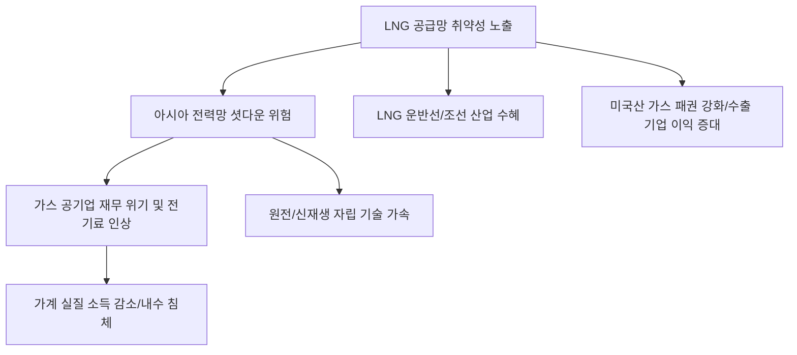

# 에너지/산업 분석: 중동 전쟁의 이중 충격과 LNG 공급망의 '아킬레스건'
## 투자 신호 + 사회적 영향 평가

---

## 📌 기사 기본 정보

- **날짜**: 2026-03-09
- **출처**: 글로벌 에너지 공급망 및 아시아 전력 수급 정밀 분석 리포트
- **카테고리**: 경제 > 에너지 > 산업/공급망
- **핵심 주제**: 중동발 지정학적 위기가 초래한 원유 가격 상승보다 더 치명적인 '액화천연가스(LNG) 공급망의 취약성' 분석과, 석탄과 원전을 대체해 아시아 전력망의 기저 부하를 담당하고 있는 가스 공급 중단이 가져올 블랙아웃 및 산업 마비 리스크 분석

**메타데이터**
- 주요 이슈: 호르무즈 해협 및 카타르발 LNG 운송 경로 차단 위험
- 핵심 변수: LNG 수입 비중(한국/일본/대만 등), 가스 발전 의존도, LNG 운반선 운임
- 주요 주체: 카타르에너지, 한국전력/가스공사, 일본 JERA, 글로벌 해운사
- 키워드: LNG 공급망 위기, 가스 발전의 역설, 에너지 아킬레스건, 전력망 붕괴 리스크, 가스 가격 폭등

---

## 🔍 기사를 통한 투자 신호 추출

### 1단계: 핵심 사건 분해

**What (무엇이 일어났는가?)**
- 일반 대중은 유가 상승에만 주목하고 있으나, 실제 아시아 경제를 멈출 수 있는 진짜 시한폭탄은 '가스'임. 한국과 일본 등 주요 제조 국가들이 탄소 중립을 위해 석탄 발전을 줄이고 LNG 비중을 대폭 높였는데, 중동 전쟁으로 LNG 공급로가 막힐 경우 전기료 폭등은 물론 반도체, 철강 등 핵심 산업 공장이 멈춰야 하는 사상 초유의 '전력 안보 위기'가 가시화됨.

**When (언제 일어났는가?)**
- 2026-03-09 (중동의 주요 가스 공동 개발지 근처에서 물리적 충돌 신호가 포착되며 글로벌 LNG 가격 지수인 JKM이 급등하기 시작한 시점)

**Why (왜 이 중요한가?)**
- 원유는 전략 비축유로 수개월을 버틸 수 있지만, LNG는 저장 탱크 규모가 작아 장기 보관이 어렵고 공급 중단 시 즉각적으로 전력 생산에 타격이 오기 때문
- 아시아 국가들의 에너지 믹스에서 LNG가 '브릿지 에너지'로서 독보적인 지위를 차지하고 있기 때문

**Who (누가 주도하는가?)**
- 공급망의 목줄을 쥐고 있는 카타르 등 중동 산유국
- 부족한 가스를 선점하기 위해 웃돈(Premium)을 얹어주며 경쟁하는 아시아와 유럽의 수입사들

---

### 2단계: 투자 신호 해석

#### A. **긍정적 신호 (Bullish)**

**① '초고부가가치 LNG 운반선' 및 '부유식 저장 재기화 설비(FSRU)' 제조사**
- **신호**: 가스 도입 경로 다변화(중동발 → 미국/호주발)를 위한 신규 선박 발주 폭증
- **의미**: 배가 곧 '저장소'이자 '파이프라인'인 시대. LNG 운반선 기술력을 독점한 조선사의 멀티플 상향
- **투자 기회**: 국내 대형 조선 3사, LNG 화물창 원천 기술 보유사, FSRU 특화 조선사

**② 에너지 안보의 대안인 '원자력 및 신재생 에너지' 전환 가속화**
- **신호**: 가스 가격 폭등으로 인한 에너지 자립 요구 극대화
- **의미**: 비싼 수입 가스 대신 자국 내에서 생산 가능한 에너지원에 대한 국가적 발주 집중
- **투자 기회**: 차세대 SMR(소형 모듈 원자로) 핵심 부품사, 해상 풍력 인프라 선도 기업

---

#### B. **위험 신호 (Bearish)**

**③ 가스료 폭등을 전가하지 못하는 '전력 및 가스 공급 공기업'의 재무 파편화**
- **신호**: 정부의 민생 안정을 위한 가격 통제 압박
- **의미**: 원가는 10배 올랐는데 소매가는 고정되어 자본 잠식 위기 직면
- **투자 리스크**: 가스 수입 비중이 높고 부채 비율이 한계점에 도달한 유틸리티 상장사

**④ 에너지 다소비 장치 산업(철강, 화학, 반도체)의 '셧다운' 리스크**
- **신호**: 전력 수급 제한(Blackout warning) 경고 발령
- **의미**: 공장이 며칠만 멈춰도 연간 수익이 증발함. 특히 가스 기반 공정이 많은 화학업계 직격탄
- **투자 리스크**: 에너지 위기 대응 매뉴얼이 없는 국내 중견 제조업

---

### 3단계: 섹터별 투자 기회 매트릭스

#### ✅ **높은 기대도 + 낮은 리스크**

**미국 내 셰일 가스를 생산하고 직접 수출 터미널을 보유한 '미국 에너지 메이저'**
- 중동이 막혀도 미국산 가스는 안전하며, 오히려 가격 상승의 수혜를 고스란히 입음. 아시아 국가들은 이제 미국산 가스를 구걸해야 하는 상황임
- **투자 추천도**: ⭐⭐⭐⭐⭐

---

## 💰 구체적 투자 신호 변환

### 신호 1: '원유'는 차를 멈추지만, '가스'는 문명을 멈춘다

**투자 해석**: 기사는 에너지 위기의 본질이 석유에서 가스로 이동했음을 경고함. 투자자는 지금 즉시 포트폴리오의 '에너지 안보' 점검을 해야 함. 가스 가격 급등 시 전력 비용을 감당할 수 있는 기업인지 확인하고, 가스 도입 인프라(조선, 저장)를 가진 기업으로 비중을 옮겨야 함. 특히 LNG 운반선 분야는 한국이 전 세계 압도적 1위이므로, 에너지 위기가 길어질수록 조선주의 실적은 상상을 초월할 것임.

---

## 🌍 사회적 영향 평가

### A. 긍정적 사회 영향
- **에너지 주권에 대한 국가적 대각성 촉발**: 수입 에너지의 취약성을 뼈저리게 느끼고 원전 재가동, 재생에너지 확대 등 에너지 자립을 위한 초당적 협력과 기술 투자 가속화
- **산업계의 에너지 효율성 비약적 향상**: 고비용 시대를 견디기 위한 스마트 그리드 및 저소득 에너지 효율화 솔루션 도입이 앞당겨지며 산업 체질 개선

### B. 부정적 사회 영향
- **'에너지 빈곤층'의 생존 위협과 사회적 불평등**: 전기료·가스비 폭등으로 겨울철 난방과 여름철 냉방을 포기해야 하는 취약 계층의 고통이 심화되며 사회적 갈등 요인으로 부상
- **전력 수급 불안에 따른 정보·공공 서비스 마비**: 데이터 센터 등 디지털 문명의 핵심 인프라가 전력 부족으로 멈출 시 발생하는 사회 전반의 기능 마비와 혼란 리스크

---

## 🎯 결론: 당신의 투자 전략 수립

- **즉시 실행**: 항공/여행 섹터 비중 축소 및 LNG 운반선/조선 섹터 비중 확대, 미국 가스 수출 기업 ETF 편입
- **3개월 후**: 정부의 전략 가스 비축 기지 건설 계획 및 원전 가동률 상향 정책 확인 후 관련 기자재주 리밸런싱

---

## 📝 Obsidian 연결 구조

