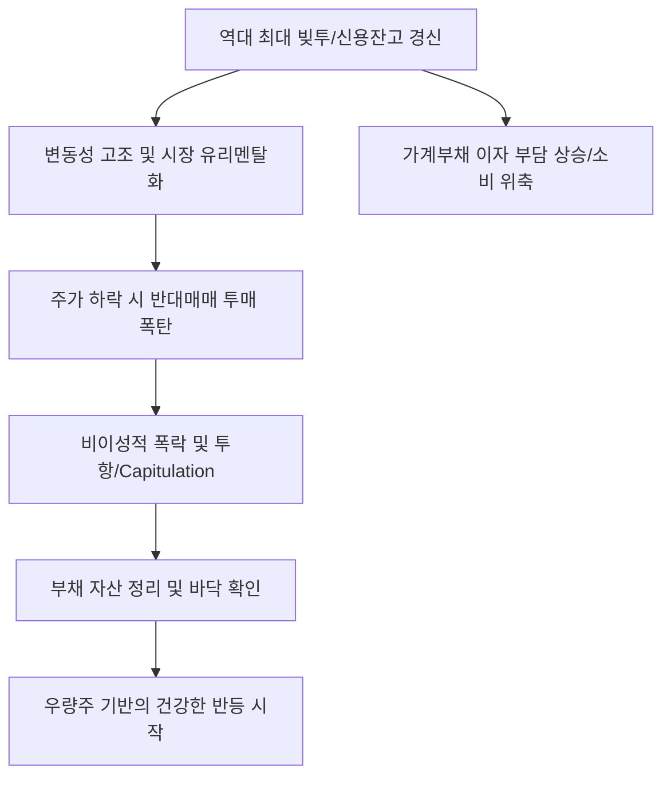

# 금융/리스크 분석: 코스피 변동성과 '역대 최대 빚투', 레버리지 함정의 경고
## 투자 신호 + 사회적 영향 평가

---

## 📌 기사 기본 정보

- **날짜**: 2026-03-09
- **출처**: 대한민국 증시 수급 및 가계 금융 리스크 분석 리포트
- **카테고리**: 경제 > 투자 > 금융리스크
- **핵심 주제**: 코스피의 극심한 변동성 속에서도 개인 투자자들의 신용융자(빚투)가 역대 최고치를 경신하며 반대매매(증권사가 강제로 주식을 파는 행위) 위기가 고조되는 현상과, 마이너스 통장까지 동원된 레버리지 투자의 구조적 위험성 분석

**메타데이터**
- 주요 지표: 신용거래융자 잔고 역대 최고치, 반대매매 위기 계좌 급증, 마이너스 통장 대출액 폭증
- 핵심 리스크: 마진콜(Margin Call) 연쇄 작용, 자산 가격 하락 시 가계 파산 위험, 금융 시스템 불안
- 주요 주체: 빚내서 투자하는 '개미' 투자자, 증권사, 시중은행, 금융감독원
- 키워드: 빚투 광풍, 반대매매 위기, 레버리지 함정, 마이너스 통장 폭주, 증시 변동성

---

## 🔍 기사를 통한 투자 신호 추출

### 1단계: 핵심 사건 분해

**What (무엇이 일어났는가?)**
- 주가가 조금만 반등해도 더 큰 수익을 내기 위해 빚을 내서 주식을 사는 '레버리지 투자'가 한계치에 도달함. 특히 하락장에서 버티기 위해 마이너스 통장까지 헐어 쓰는 '막판 배팅'이 늘어나며, 지수가 3~5%만 급락해도 수조 원대의 주식이 강제로 매도되는 '반대매매 폭탄'이 장착된 상태임.

**When (언제 일어났는가?)**
- 2026-03-09 (글로벌 지정학적 리스크가 고조되며 코스피가 박스권 하단을 테스트하기 시작한 위태로운 시점)

**Why (왜 일어났는가?)**
- "나만 뒤쳐질 수 없다"는 FOMO 심리와 과거의 V자 반등 학습 효과 때문
- 근로 소득만으로는 자산 형성이 불가능하다는 사회적 절박함
- 저금리에서 고금리로 넘어가는 시기에 부채의 무서움을 간과한 낙관적 편향

**Who (누가 주도하는가?)**
- 수익률 극대화를 노리는 2030 영끌 투자자 및 공격적 성향의 전업 투자자
- 이자 수익을 노리고 신용 대출 한도를 유지해온 증권 및 금융권

---

### 2단계: 투자 신호 해석

#### A. **긍정적 신호 (Bullish)**

**① '반대매매' 이후 발생하는 '클린 업(Clean-up)' 효과에 따른 저가 매수 찬스**
- **신호**: 반대매매 물량이 대거 쏟아져 나오며 지수가 비이성적으로 폭락하는 시점
- **의미**: 빚쟁이들이 다 털려 나갔을 때가 시장의 진정한 바닥(V-Bottom)일 확률이 높음
- **투자 기회**: 현금을 넉넉히 보유한 상태에서, 신용 잔고가 바닥을 친 직후 우량주 매수

**② '리스크 관리' 역량이 뛰어난 대형 증권사/은행의 수수료 및 이자 수익 증대**
- **신호**: 증시 변동성 확대로 인한 거래량 폭증 및 신용 이자 수익 증가
- **의미**: 투자자는 울어도, 판을 깔아주는 대형 금융사는 단기적으로 막대한 이익을 봄
- **투자 기회**: 위기 관리 시스템이 견고한 리딩 금융 지주사 및 초대형 IB 증권주

---

#### B. **위험 신호 (Bearish)**

**③ '금융 사다리'의 붕괴로 인한 내수 소비의 장기 침체**
- **신호**: 빚투 손실 확정 및 마이너스 통장 상환 압박 가중 
- **의미**: 투자 실패가 가계 가처분 소득의 증발로 이어져 백화점, 자동차, 여행 등 내수 산업 매출 타격
- **투자 리스크**: 국내 소비재 기업, 프랜차이즈 외식업, 국내 여행 관련주

**④ 증시의 '상방 경직성' 고착화 리스크**
- **신호**: 주가가 조금만 올라오면 빚을 갚기 위한 본전 매도 물량이 쏟아짐
- **의미**: 거대한 매물벽이 형성되어 코스피가 장기간 박스권에 갇히는 답답한 장세 지속
- **투자 리스크**: 코스피 지수 추종 인덱스 펀드 및 대형주 중심 포토폴리오

---

### 3단계: 섹터별 투자 기회 매트릭스

#### ✅ **높은 기대도 + 낮은 리스크**

**글로벌 공급망 우위를 가진 '수출형 대장주'**
- 국내 '빚투' 수급에 좌우되지 않는, 전 세계 자본이 매수하는 글로벌 우량주는 국내 증시 패닉 시에도 상대적인 하방 경직성을 보임
- **투자 추천도**: ⭐⭐⭐⭐

---

## 💰 구체적 투자 신호 변환

### 신호 1: '남의 돈'이 청산될 때가 '내 돈'을 넣을 때다

**투자 해석**: 기사는 지금이 시장의 '임계점'임을 경고함. 빚투 잔고가 역대 최고라는 것은 시장이 아주 작은 충격에도 스스로 무너질 수 있는 유리 멘탈 상태라는 뜻임. 투자자는 지금 즉시 보유 주식의 하락에 대비하는 것보다, '앞으로 쏟아질 반대매매'를 기다리는 인내심이 필요함. 코스피 지수 5~10% 추가 급락 시, 신용 잔고가 급감하는 데이터를 확인하고 진입하는 것이 '안전한 대박'의 공식임.

---

## 🌍 사회적 영향 평가

### A. 긍정적 사회 영향
- **자산 시장의 건전성 회복 및 학습 효과**: 고통스러운 청산 과정을 통해 레버리지 투자의 위험성을 교육하고, 실질적인 가치 투자와 리스크 관리의 중요성을 일깨우는 계기 마련
- **과잉 유동성의 정화**: 생산성 없는 투기 자본이 정리되며 경제 전반의 유동성이 보다 효율적인 산업 자본으로 재편될 수 있는 기회 제공

### B. 부정적 사회 영향
- **청년 세대의 자산 붕괴와 사회적 상실감**: 2030 세대의 빚투 실패는 단순한 금전적 손실을 넘어 결혼 포기, 출산 저하 등 국가 미래 경쟁력 훼손으로 이어짐
- **가계 부채 리스크의 전방위 확산**: 주식 투자 실패가 마이너스 통장 부실로, 다시 1금융권의 대출 건전성 악화로 이어지는 시스템 리스크 전이 사회적 공포 조성

---

## 🎯 결론: 당신의 투자 전략 수립

- **즉시 실행**: 신용 융자 비율이 높은 테마주 전량 매도 및 현금 비중 60% 이상 확보, 일일 반대매매 규모 데이터 모니터링 시작
- **3개월 후**: 증시 신용 잔고가 평년 수준으로 회귀했는지 확인 후, 살아남은 우량주 위주로 포트폴리오 재구축

---

## 📝 Obsidian 연결 구조

