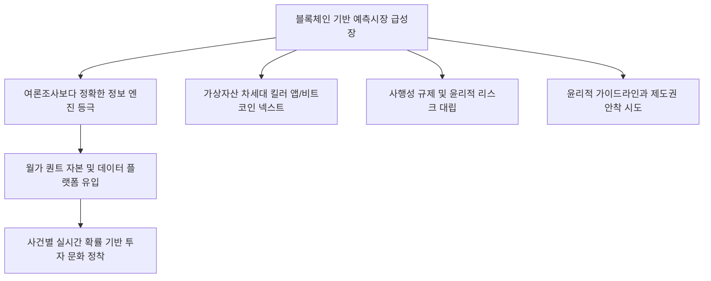

# 금융/혁신 분석: 예측시장(Prediction Market)의 급성장과 '비트코인 넥스트' 테마의 제도권 진입
## 투자 신호 + 사회적 영향 평가

---

## 📌 기사 기본 정보

- **날짜**: 2026-03-09
- **출처**: 글로벌 핀테크 및 가상자산 혁신 금융 리포트
- **카테고리**: 경제 > 투자 > 가상자산/혁신금융
- **핵심 주제**: 미래의 사건(선거, 전쟁, 정책 등)에 배팅하여 수익을 내는 '예측시장'이 블록체인 기술과 결합해 '비트코인 넥스트' 테마로 급성장하며, 단순 투기를 넘어 고도의 정보 플랫폼으로 제도권에 진입하는 현상 분석

**메타데이터**
- 주요 플랫폼: Polymarket(폴리마켓) 등 탈중앙화 예측 시장
- 핵심 기술: 온체인 데이터, 스마트 컨트랙트 기반 자동 정산
- 주요 주체: 글로벌 가상자산 투자자, 데이터 분석가, 미 SEC/CFTC 규제 당국
- 키워드: 예측시장, 정보의 민주화, 블록체인 배팅, 집단지성 0-1 베팅, 제도권 편입

---

## 🔍 기사를 통한 투자 신호 추출

### 1단계: 핵심 사건 분해

**What (무엇이 일어났는가?)**
- 과거 도박으로 치부되던 '예측시장'이 미 대선 및 지정학적 리스크 분석에서 여론조사보다 더 정확한 지표를 보여줌으로써 가치를 증명함. 이에 자극받은 거대 자본이 유입되며 예측시장이 가스비, 트랜잭션 등 블록체인 생태계의 실질적 킬러 앱(Killer App)으로 부상 중임.

**When (언제 일어났는가?)**
- 2026-03-09 (가상자산 시장이 비트코인 이후의 차세대 주도 테마를 찾던 시점에서, 정치/사회적 불확실성이 극대화된 시기)

**Why (왜 일어났는가?)**
- 여론조사는 '말'이지만 예측시장은 '자기 돈'을 걸기 때문에 정보의 정확도가 훨씬 높기 때문
- 블록체인 기술을 통해 중개자 없이 24시간 전 세계 누구나 참여 가능한 인프라 구축
- 규제 당국이 점진적으로 예측시장의 '정보적 가치'를 인정하고 가이드라인을 마련하기 시작했기 때문

**Who (누가 주도하는가?)**
- 정확한 미래 정보를 선점하려는 월가 헤지펀드 및 퀀트 투자자
- 새로운 수익 모델을 찾는 글로벌 가상자산 프로젝트 운영사

---

### 2단계: 투자 신호 해석

#### A. **긍정적 신호 (Bullish)**

**① '데이터 주권'을 가진 예측시장 프로토콜 코인의 밸류에이션 재평가**
- **신호**: 예측시장 플랫폼의 거래량(TVL) 및 사용자 수 사상 최고치 경신
- **의미**: 예측시장이 단순히 도박판이 아닌 '집단 지성 정보 엔진'으로 자리 잡으며 해당 플랫폼 코인이 기축 통화화될 가능성
- **투자 기회**: 주요 탈중앙화 예측 시장 플랫폼 관련 거버넌스 토큰, 레이어 2 솔루션

**② 여론조사 및 리서치 시장의 '디지털 전환' 가속화 수혜**
- **신호**: 기존 언론사와 리서치 기관이 예측시장 데이터를 인용하기 시작함
- **의미**: 정보 생산 방식이 '설문 분석'에서 '시장 가격 분석'으로 이동하며 관련 테크 기업 성장
- **투자 기회**: 온체인 데이터 분석 전문 기업, 예측 알고리즘 개발 AI 스타트업

---

#### B. **위험 신호 (Bearish)**

**③ '사행성 논란'에 따른 극단적 규제 및 서비스 일시 중단 리스크**
- **신호**: 규제 당국(SEC/CFTC)의 미등록 증권 또는 불법 도박 혐의 조사 착수
- **의미**: 제도권 안착 과정에서 진통이 따를 수 있으며, 일시적인 유동성 잠김 현상 발생 가능
- **투자 리스크**: 규제 불확실성이 높은 국가 기반의 예측 시장 참여

**④ 자극적 사건 배팅에 따른 '윤리적 리스크' 및 브랜드 가치 하락**
- **신호**: 전쟁 사상자 수 예측 등 반윤리적 테마에 자금이 쏠리는 현상
- **의미**: 사회적 비난 여론이 거세질 경우, 기관 투자자들의 자금이 대규모로 이탈할 위험
- **투자 리스크**: 필터링 시스템이 없는 극단적 탈중앙화 예측 플랫폼

---

### 3단계: 섹터별 투자 기회 매트릭스

#### ✅ **높은 기대도 + 낮은 리스크**

**예측시장의 정보를 바탕으로 '알파'를 창출하는 '정량 데이터(Quant) 펀드'**
- 예측시장이 맞든 틀리든, 그 에너지가 가리키는 방향을 읽어 핵심 자산에 배팅하는 기업은 시장 환경과 무관하게 수익 창출 가능
- **투자 추천도**: ⭐⭐⭐⭐

---

## 💰 구체적 투자 신호 변환

### 신호 1: '설문'은 속여도 '돈'은 속이지 못한다

**투자 해석**: 기사는 세상 모든 정보가 '가격'으로 환산되는 시대가 활짝 열렸음을 시사함. 투자자는 이제 증시 분석 시 전문가의 리포트뿐만 아니라, 예측시장의 '실시간 확률'을 필수 지표로 활용해야 함. 예측시장은 비트코인이 꿈꿨던 '신뢰의 분산화'를 실질적인 데이터로 증명하는 두 번째 파도임. 관련 플랫폼의 기술적 우위를 점한 프로젝트를 선점하는 것이 하반기 가상자산 투자의 핵심 전략임.

---

## 🌍 사회적 영향 평가

### A. 긍정적 사회 영향
- **정보의 투명성 및 민주화**: 소수가 독점하던 고급 정보나 여론 조작의 위험을 대중의 집단지성 가격으로 상쇄하여 보다 공정한 미래 예측 환경 제공
- **의사결정의 효율성 제고**: 기업이나 정부가 정책을 집행하기 전, 예측시장의 피드백을 통해 실패 확률을 미리 계산하고 자원 낭비를 방지하는 도구로 활용 가능

### B. 부정적 사회 영향
- **투기 광풍과 도박 중독 확산**: 모든 사건을 '돈 내기'로 치부하며 사회적 진지함을 저해하고, 특히 젊은 층의 사행성 투기 심리를 자극하는 부작용 우려
- **비윤리적 사건의 상품화**: 인간의 존엄성이나 타인의 불행(재난, 전쟁 등)을 수익 수단으로 삼는 것에 대한 정서적 거부감과 가치관 혼란 야기

---

## 🎯 결론: 당신의 투자 전략 수립

- **즉시 실행**: 주요 예측시장 플랫폼(폴리마켓 등)의 트렌드 지표를 포트폴리오 분석 툴에 편입, 관련 유망 프로토콜 코인 분할 매수 시작
- **3개월 후**: 규제 당국의 예측시장 가이드라인 초안 발표 내용 확인 후 제도권 친화적 플랫폼으로 비중 리밸런싱

---

## 📝 Obsidian 연결 구조

