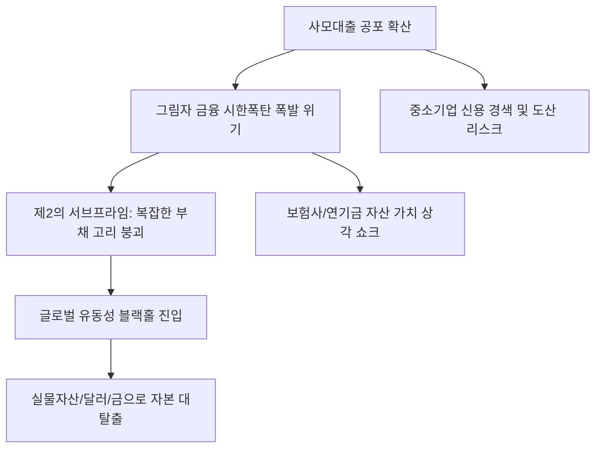

# 금융/리스크 분석: 사모대출 공포와 '그림자 금융'의 시한폭탄, 제2의 서브프라임
## 투자 신호 + 사회적 영향 평가

---

## 📌 기사 기본 정보

- **날짜**: 2026-03-16
- **출처**: 글로벌 금융 시스템 리스크 및 사모대출(Private Credit) 시장 모니터링 리포트
- **카테고리**: 경제 > 금융 > 리스크관리
- **핵심 주제**: 은행권의 규제를 피해 비제도권에서 급성장한 '사모대출(Private Credit)' 시장이 고금리 충격으로 부실화되며, 2008년 서브프라임 모기지 위기의 시발점이 되었던 복잡한 부채 고리가 재현(Déjà Vu)되는 상황과 '그림자 금융(Shadow Banking)'의 폭발 위험성 분석

**메타데이터**
- 주요 이슈: 글로벌 사모대출 시장 규모의 폭발적 팽창 및 연체율 급등
- 핵심 리스크: 투명성 공식화 부재, 레버리지 중복 구조, 장외 시장 위동성 고갈
- 주요 주체: 글로벌 사모펀드(PE), 사모 부채 펀드(PDF), 한계 기업, 규제 당국(FSB 등)
- 키워드: 사모대출 공포, 그림자 금융, 제2의 서브프라임, 유동성 블랙홀, 신용 경색

---

## 🔍 기사를 통한 투자 신호 추출

### 1단계: 핵심 사건 분해

**What (무엇이 일어났는가?)**
- 지난 10년의 저금리 기간 중 은행 대출이 막힌 기업들에게 돈을 빌려주며 수익을 냈던 '사모대출' 시장이, 급격한 금리 인상으로 인해 차주들의 상환 능력이 상실되며 무너지기 시작함. 제도권 밖의 거래라 정확한 부실 규모 파악조차 안 되는 상황에서, 투자자들이 원금을 회수하려는 '뱅크런(펀드런)' 징조가 나타나며 금융 시스템 전체의 뇌관으로 부상함.

**When (언제 일어났는가?)**
- 2026-03-16 (고금리가 예상보다 길어지며(Higher for Longer) 사모대출을 통해 연명하던 좀비 기업들의 이자 보상 배율이 1.0 미만으로 떨어진 시점)

**Why (왜 일어났는가?)**
- 은행 규제 강화로 대출 수요가 감시가 느슨한 '그림자 금융'으로 전이되었기 때문
- 사모 펀드들이 수익률 극대화를 위해 이미 빚이 많은 기업에게 또 빚을 얹어주는 '레버리지론' 남발
- 자산의 시가 평가(Mark-to-Market)가 제대로 되지 않아 위험이 누적되었기 때문

**Who (누가 주도하는가?)**
- 고수익에 눈이 멀어 사모대출 펀드에 막대한 자금을 넣은 연기금, 보험사 등 기관 투자자
- 이자를 못 갚아 자산 매각이나 파산 절차에 들어간 중소 한계 기업들

---

### 2단계: 투자 신호 해석

#### A. **긍정적 신호 (Bullish)**

**① '정통 상업 은행(Commercial Banks)'의 안정성 부각 및 무위험 수익 증대**
- **신호**: 비제도권 금융의 붕괴와 대비되는 튼튼한 제도권 자본 비율
- **의미**: 리스크가 터질수록 국가의 법적 보호를 받는 대형 은행으로 자금이 역류함
- **투자 기회**: 미국 5대 월가 은행 주, 자본 건전성이 극도로 우수한 국내 금융 지주사

**② 부실 자산 처리를 위한 '특수 상황(Special Situation) 펀드'의 기회**
- **신호**: 시장에 헐값으로 쏟아지는 사모대출 채권 및 담보 자산
- **의미**: 위기를 청산하고 재구조화할 수 있는 자본력 있는 해결사들에게는 수십 년 만의 수익 구간
- **투자 기회**: 글로벌 NPL(부실채권) 투자 전문 상장사, 검증된 기업 구조조정 전문가

---

#### B. **위험 신호 (Bearish)**

**③ '연쇄 부도' 가능성이 높은 고위험 BDC(기업개발회사) 및 대체 투자 펀드**
- **신호**: 사모대출 비중이 높은 상장 펀드들의 주가 폭락 및 배당 삭감
- **의미**: 기초 자산의 부실이 즉각적인 원금 손실로 전이되는 구간
- **투자 리스크**: 미국 상장 BDC 섹터, 비상장 자산 비중이 높은 자산운용사 주

**④ 자금 조달 창구가 막힌 '중소형 성장주'의 밸류에이션 증발**
- **신호**: 사모 금융 시장의 경직으로 인한 신규 펀딩 중단 
- **의미**: 매출은 없지만 기술력만으로 버티던 스타트업과 중소형 기술주들이 '자금 난'으로 동사(凍死)
- **투자 리스크**: 벤처 캐피털(VC) 투자 비중이 높은 지주사, 자금 지원이 절실한 비수익 상장사

---

### 3단계: 섹터별 투자 기회 매트릭스

#### ✅ **높은 기대도 + 낮은 리스크**

**글로벌 공급망의 필수재인 '에너지 및 원자재 실물 자산'**
- 금융 시스템(종이 화폐 시스템)이 의심받을 때, 실제 가치가 있는 실물 자산은 상대적 가치가 급등함
- **투자 추천도**: ⭐⭐⭐⭐

---

## 💰 구체적 투자 신호 변환

### 신호 1: '보이지 않는 빚'이 터질 때 '보이는 현금'의 가치는 무한대다

**투자 해석**: 기사는 금융 위기가 보이지 않는 곳(사모 시장)에서 이미 시작되었음을 뜻함. 2008년 위기도 서브프라임이라는 작은 틈에서 시작되어 전체를 무너뜨렸음. 투자자는 지금 즉시 '불투명한 대체 투자' 자산을 전량 정리해야 함. 또한, 사모대출의 부실은 결국 이들에게 돈을 빌려준 보험사나 증권사의 건전성을 악화시킬 것이므로 관련 금융주의 비중도 축소해야 함. 현금을 쥐고 금융 시스템의 대청소가 끝나기를 기다려야 할 때임.

---

## 🌍 사회적 영향 평가

### A. 긍정적 사회 영향
- **금융 시스템의 '정상화'와 투명성 강화**: 그림자 금융에 대한 강력한 공시 의무와 규제 장벽을 구축하여, 향후 유사한 거품이 발생하는 것을 방지하는 제도적 기폭제 역할
- **자본의 생산적 재배치**: 이자 놀이에 치중했던 자본이 실제 가치를 창출하는 산업 자본으로 이동하며 경제의 실질적 기초 체력 강화 유도

### B. 부정적 사회 영향
- **일자리 손실 및 실물 경제 침체**: 중소기업들의 자금줄이 마르면서 발생하는 대규모 해고와 지역 경제 위축은 사회적 불평등과 서민층의 고통을 극대화함
- **국가 부채의 사유화 위험**: 위기가 심화되면 결국 공적 자금이 투입되어 민간 금융사의 실책을 국민의 세금으로 메워줘야 하는 사회적 정의의 훼손 리스크

---

## 🎯 결론: 당신의 투자 전략 수립

- **즉시 실행**: 포트폴리오 내 고위험 대체 투자 상품 전량 매도 및 '무위험' 현금 자산 비중 70% 이상 확보
- **3개월 후**: 주요 사모 펀드들의 환매 상황과 연체 통계 확인 후 금융 위기 전이 속도에 따른 대응 수위 조절

---

## 📝 Obsidian 연결 구조

