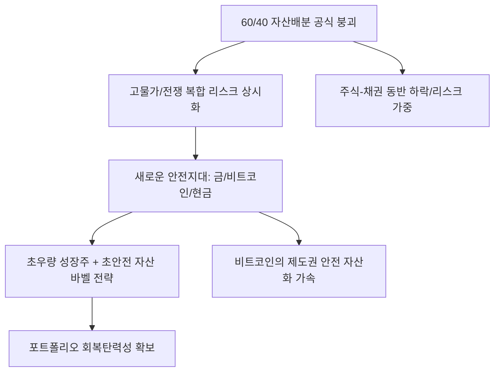

# 금융/투자 분석: 전통적 자산 배분 공식의 붕괴와 중동 전쟁 속 '새로운 안전지대'
## 투자 신호 + 사회적 영향 평가

---

## 📌 기사 기본 정보

- **날짜**: 2026-03-16
- **출처**: 글로벌 자산 배분 및 투자 전략 리서치 리포트
- **카테고리**: 경제 > 금융 > 투자전략
- **핵심 주제**: 주식과 채권이 반대로 움직인다는 전통적 자산 배분 공식(60/40 등)이 고인플레이션과 중동 전쟁이라는 복합 위기 속에서 붕괴된 현상과, 이를 극복하기 위한 '대체 안전 자산' 및 정교한 헤지(Hedge) 전략 분석

**메타데이터**
- 주요 이슈: 자산 간 상관관계(Correlation) 급변, 전통적 분산 투자 무력화
- 핵심 전략: 금/비트코인 등 디지털·실물 금 비중 확대, 변동성 지수(VIX) 활용, 원자재 롱(Long) 전략
- 주요 주체: 글로벌 자산 운용사, 고액 자산가, 헤지펀드, 개인 투자자
- 키워드: 자산 배분 붕괴, 새로운 안전지대, 지정학적 헤지, 퀄리티 자산, 포트폴리오 다변화

---

## 🔍 기사를 통한 투자 신호 추출

### 1단계: 핵심 사건 분해

**What (무엇이 일어났는가?)**
- 과거 경제 위기 시 주식이 빠지면 채권 가격이 올라 손실을 메워주던 공식이 작동하지 않음. 물가 상승과 전쟁 리스크가 겹치자 주식과 채권이 동시에 폭락하는 '동반 하락' 현상이 일상화됨. 투자자들은 이제 국채조차 안전하지 않다고 느끼며, 권력의 개입이 불가능하거나 실물 가치가 보장되는 '제3의 길'을 찾기 시작함.

**When (언제 일어났는가?)**
- 2026-03-16 (중동발 에너지 쇼크로 인해 기대 인플레이션이 다시 꺾이지 않고 상방 압력을 받기 시작한 시점)

**Why (왜 일어났는가?)**
- 인플레이션 시대에는 금리가 오르며 채권 가격이 떨어지는데, 경기 침체 우려로 주식도 같이 떨어지기 때문
- 지정학적 불안이 국가 부채 시스템(국채)에 대한 신뢰를 약화시킴
- 과거의 데이터가 예측하지 못한 '극단적 불확실성(Black Swan)'의 상시화

**Who (누가 주도하는가?)**
- 기존 포트폴리오의 대규모 손실을 겪고 전략을 전면 수정 중인 연기금 및 대형 기관
- 자산 방어의 수단으로 가상자산과 실물 자산을 적극 편입하는 얼리어답터 자산가들

---

### 2단계: 투자 신호 해석

#### A. **긍정적 신호 (Bullish)**

**① '초국가적 안전 자산'인 금(Gold)과 비트코인(BTC)의 지위 격상**
- **신호**: 전쟁 리스크 고조 시 달러와 함께 금·비트코인의 동반 랠리
- **의미**: 이제 비트코인은 투기 자산이 아닌 '리스크 헤지용 디지털 금'으로 인정받음
- **투자 기회**: 현물 금 ETF, 비트코인 현물 ETF, 관련 채굴 및 인프라 우량주

**② 현금 창출 능력이 압도적인 '퀄리티(Quality) 주식'으로의 수급 쏠림**
- **신호**: 지수가 빠져도 배당을 늘리고 현금이 넘치는 기업들의 견고한 주가
- **의미**: 불확실한 미래의 성장이 아닌, 지금 당장 돈을 벌어다 주는 '확실한 이익'에 프리미엄이 붙음
- **투자 기회**: 미국 빅테크 중 잉여현금흐름(FCF) 상위 기업, 글로벌 배당 귀족주

---

#### B. **위험 신호 (Bearish)**

**③ '성장 지향적 기업'의 밸류에이션 파괴 및 자본 조달 단절**
- **신호**: 금리 인하 기대가 멀어지며 미래 가치를 선반영한 성장주의 폭락 
- **의미**: 전통적 자산 배분이 안 먹히는 시장에서 가장 먼저 버려지는 것은 '꿈'만 있는 주식임
- **투자 리스크**: 부채 비율이 높고 수익 실현 시점이 먼 바이오, 이차전지 소재, 우주 항공 스타트업

**④ 국가 신인도 리스크가 가미된 '신흥국 채권 및 통화'**
- **신호**: 달러 패권 강화 속에서 신흥국 자산의 유동성 고갈
- **의미**: 자산 배분의 한 축이었던 신흥국 투자가 분산이 아닌 '리스크 가중' 요인이 됨
- **투자 리스크**: 에너지 자립이 안 되는 아시아/아프리카 신흥국 국가 펀드

---

### 3단계: 섹터별 투자 기회 매트릭스

#### ✅ **높은 기대도 + 낮은 리스크**

**글로벌 에너지 패권을 쥔 '에너지 인프라 및 자원 개발' 주**
- 전쟁은 결국 자원의 희소성을 높임. 자산 배분의 붕괴 속에서 실물을 쥐고 있는 기업은 그 자체로 안전지대임
- **투자 추천도**: ⭐⭐⭐⭐⭐

---

## 💰 구체적 투자 신호 변환

### 신호 1: '60/40'은 죽었다, '바벨 전략'으로 생존하라

**투자 해석**: 기사는 교과서적인 분산 방식이 이제 투자자를 보호해주지 못함을 시사함. 투자자는 지금 즉시 포트폴리오를 '초안전 자산(현금, 금)'과 '초우량 성장주(AI 대장주)'의 양극단으로 배치하는 '바벨 전략(Barbell Strategy)'을 취해야 함. 어중간한 중간 지대(중도적 채권이나 평범한 우량주)는 복합 위기 상황에서 가장 무력하게 무너질 것임.

---

## 🌍 사회적 영향 평가

### A. 긍정적 사회 영향
- **투자자들의 금융 지능 상향 평준화**: 금융 시스템의 허점을 깨닫고 스스로 리스크를 관리하는 능력이 고도화되며, 개인들의 자산 자립도 향상 기여
- **자본의 효율적 재배치**: 생산성 없는 부채 위주의 투자에서 실물 가치와 기술 혁신 위주의 자본 흐름으로 전환되는 정화 과정

### B. 부정적 사회 영향
- **자산 보호 불평등 심화**: 정교한 헤지 전략과 대체 자산을 확보할 수 있는 상류층과, 전통적 적립식 펀드에만 의존하던 서민층 간의 자산 격차 폭발적 확대
- **국가간 금융 안보 전쟁 격화**: 자본의 초국가적 이동(가상자산 등)이 심화되면서 각국 정부의 통제권이 약화되고, 이를 막으려는 규제 장벽과 자유로운 자본 간의 극한 대립 사회적 리스크

---

## 🎯 결론: 당신의 투자 전략 수립

- **즉시 실행**: 전통적 채권 비중 축소, 금/비트코인 등 대체 자산 비중 20%로 상향, 포트폴리오 내 현금 비중 30% 유지
- **3개월 후**: 미 연준의 금리 사이클 안착 여부와 인플레이션 고착화 지표 확인 후 주식형 퀄리티 자산(Big Tech) 비중 확대 시점 조율

---

## 📝 Obsidian 연결 구조

