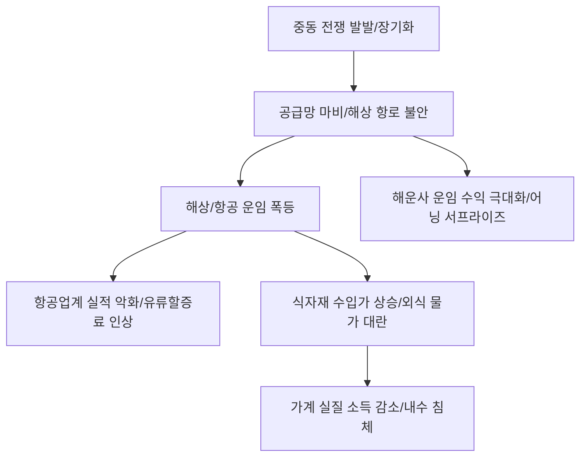

# 물가/지정학 분석: 중동 전쟁의 유탄, 외식·항공·운임의 '물가 연쇄 도미노'
## 투자 신호 + 사회적 영향 평가

---

## 📌 기사 기본 정보

- **날짜**: 2026-03-16
- **출처**: 글로벌 지정학적 리스크 및 공급망 물가 변동 분석 리포트
- **카테고리**: 경제 > 물가 > 지정학/공급망
- **핵심 주제**: 격화되는 중동 전쟁으로 인한 국제 유가 및 해상 운임 폭등이 국내 외식 물가, 항공료, 물류비로 전이되며 서민 가계와 기업 실적에 심각한 타격을 입히는 '물가 대란(Inflation Shock)' 현상과 공급망 리스크 분석

**메타데이터**
- 주요 이슈: 호르무즈 해협 및 홍해 항로 불안에 따른 물류 마비
- 핵심 지표: 상하이컨테이너운임지수(SCFI) 급등, 제트유 가격 상승, 수입 식자재 원가 폭등
- 주요 주체: 항공사, 해운사, 외식 프랜차이즈, 일반 가계, 물류 기업
- 키워드: 중동 전쟁 유탄, 해상 운임 폭등, 항공료 인상, 외식 물가 대란, 공급망 마비

---

## 🔍 기사를 통한 투자 신호 추출

### 1단계: 핵심 사건 분해

**What (무엇이 일어났는가?)**
- 중동 지역의 군사적 충돌이 장기화되면서 전 세계 에너지와 물류의 동맥이 막힘. 이로 인해 국내로 들어오는 원유과 식자재 가격이 치솟고 있으며, 우회 항로 이용에 따른 '물류비 폭탄'이 생산자 물가를 거쳐 소비자 물가로 전면 전이 중. 특히 기름값에 민감한 항공업계와 원가 비중이 높은 외식업계가 직격탄을 맞음.

**When (언제 일어났는가?)**
- 2026-03-16 (전쟁의 범위가 확산되면서 '단기전' 기대를 넘어 글로벌 공급망의 일시적 붕괴가 현실화된 시점)

**Why (왜 일어났는가?)**
- 전 세계 원유의 20%가 통과하는 길목이 위협받으며 에너지 가격의 하방 지지선 붕괴
- 수에즈 운하를 우회하는 아프리카 희망봉 항로 이용으로 인한 운송 기간 및 비용의 물리적 증가
- 누적된 인플레이션 압력이 지정학적 위기를 만나 '최후의 인상' 명분 제공

**Who (누가 주도하는가?)**
- 에너지 가격을 통제하는 산유국과 분쟁 당사국
- 원가 상승분을 가격에 즉각 반영하기 시작한 대형 프랜차이즈 및 항공·물류 대기업

---

### 2단계: 투자 신호 해석

#### A. **긍정적 신호 (Bullish)**

**① 운임 상승의 수혜를 입는 '글로벌 해운 및 종합 물류' 섹터**
- **신호**: 상하이컨테이너운임지수(SCFI) 및 건화물선운임지수(BDI)의 수직 상승
- **의미**: 배가 부족하고 길이 막힐수록 배를 가진 기업들의 협상력과 운임 수익은 폭발함
- **투자 기회**: 글로벌 컨테이너선 대장주, 벌크선 전문 선사, 대체 물류망을 확보한 종합 물류 기업

**② 에너지 인플레이션을 방어하는 '천연가스 및 정유' 섹터**
- **신호**: 유가 상승에 따른 정제마진 및 재고 평가 이익 증대 
- **의미**: 세상이 시끄러울수록 에너지원의 가치는 절대적임
- **투자 기회**: 미국 셰일가스 채굴 기업, 국내외 대형 정유사, 에너지 저장 장치(ESS) 기업

---

#### B. **위험 신호 (Bearish)**

**③ '유류할증료' 인상으로 인한 해외여행 수요 둔화 및 항공사 실적 악화**
- **신호**: 제트유 가격 폭등과 티켓 가격 상승의 악순환
- **의미**: 비싸진 비행기 푯값에 부담을 느낀 소비자들이 여행을 포기하거나 뒤로 미룸
- **투자 리스크**: 부채비율이 높고 유가 변동에 취약한 저가 항공사(LCC), 여행사 관련주

**④ 식자재 원가 전가가 불가능한 '중소 외식업 및 식료품 제조'**
- **신호**: 수입 밀가루, 식용유 등 기초 식자재 가격의 상시적 고공행진
- **의미**: 밥값을 올리면 손님이 끊기고, 안 올리면 적자가 나는 진퇴양난의 상황
- **투자 리스크**: 가처분 소득 감소의 직격탄을 맞는 외식 프랜차이즈, 원가 통제력이 약한 중견 식품사

---

### 3단계: 섹터별 투자 기회 매트릭스

#### ✅ **높은 기대도 + 낮은 리스크**

**글로벌 공급망 재편의 핵심인 '공급망 탄력성(Supply Chain Resilience)' 기술 기업**
- 물류가 막힐수록 AI 기반의 최적 경로 탐색, 재고 예측 기술의 수요는 폭증함. 전쟁 중에도 돈을 벌 수 있는 핵심 기술주임
- **투자 추천도**: ⭐⭐⭐⭐

---

## 💰 구체적 투자 신호 변환

### 신호 1: '이동'의 비용이 '소유'의 가치를 압도한다

**투자 해석**: 기사는 우리가 당연하게 누렸던 '저렴한 물류비'의 시대가 끝났음을 시사함. 이제 모든 자산 가격은 '운송 단가'에 의해 결정될 것임. 투자자는 지금 즉시 '물류 효율성'이 낮은 무거운 제조주를 버리고, 가볍고 수익성이 높으며 물류 리스크에서 자유로운 '소프트웨어/지식 서비스' 섹터로 이동해야 함. 또한, 해운 운임 상승이 실적에 꽂히는 선별적 해운주 매집은 단기적으로 매우 유효한 전략임.

---

## 🌍 사회적 영향 평가

### A. 긍정적 사회 영향
- **공급망 다변화 및 에너지 자립의 필요성 각인**: 이번 위기를 통해 특정 지역(중동)에 대한 과도한 의존이 얼마나 위험한지 깨닫고, 국가적 차원의 에너지/물류 안보 체계를 재구축하는 계기 마련
- **기업들의 생산 공정 효율화 가속**: 원가 압박을 이기기 위한 스마트 팩토리, 에너지 절감 기술 도입이 앞당겨지며 산업 전반의 기술 고도화 기여

### B. 부정적 사회 영향
- **서민 가계의 실질 소득 감소와 삶의 질 저하**: 외식비와 이동 비용 등 생활 밀착형 물가 상승은 취약 계층의 생계 위협과 문화 생활 단절 등 사회적 활력 저하 유발
- **글로벌 인플레이션의 장기 고착화**: 한 번 오른 물가는 쉽게 내려가지 않는 하방 경직성으로 인해 장기간 저성장 고물가라는 '스태그플레이션' 고통을 전 국민에게 강요

---

## 🎯 결론: 당신의 투자 전략 수립

- **즉시 실행**: 항공/여행 섹터 비중 축소 및 글로벌 해운/물류 섹터 분할 매수, 유가 인버스 상품 등 단기 헤지 포지션 구축
- **3개월 후**: 중동 전쟁의 전개 양상(확전 vs 소강)에 따른 물류 상황 재생 점검 후 에너지/물류 섹터 수익 실현 및 다음 주도 섹터 탐색

---

## 📝 Obsidian 연결 구조

