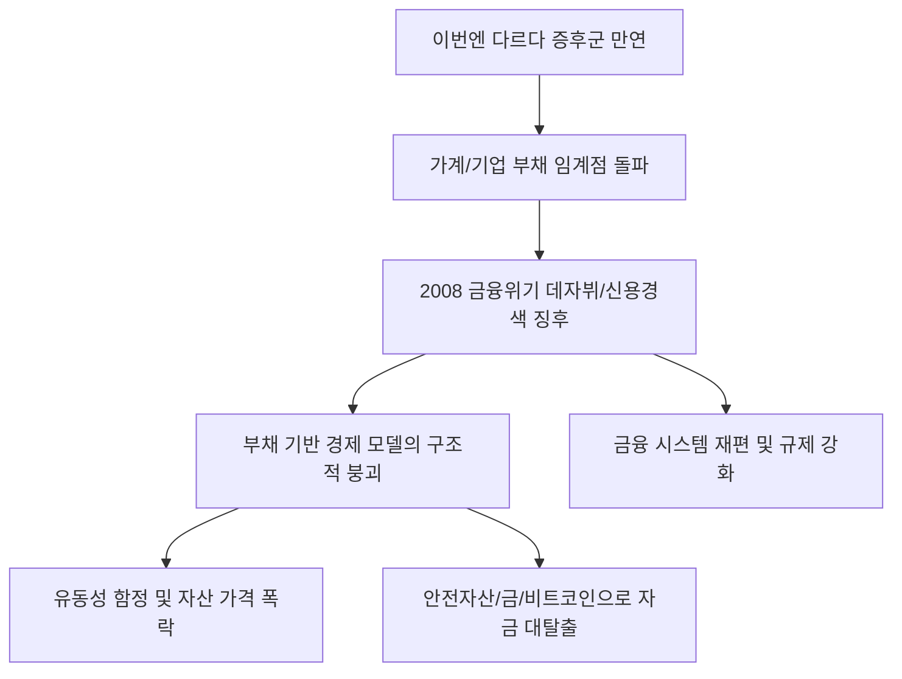

# 금융/리스크 분석: '이번엔 다르다' 증후군과 2008년 금융위기의 데자뷔
## 투자 신호 + 사회적 영향 평가

---

## 📌 기사 기본 정보

- **날짜**: 2026-03-16
- **출처**: 글로벌 거시 금융 리스크 및 부채 구조 정밀 분석 리포트
- **카테고리**: 경제 > 정책 > 금융리스크
- **핵심 주제**: "과거와는 상황이 다르다"는 낙관론 뒤에 숨은 가계·기업 부채의 폭발적 증가와 유동성 과잉의 부작용을 경고하며, 2008년 글로벌 금융위기의 전조와 유사한 현재의 구조적 한계 및 부채 기반 경제 모델의 종말 가능성 분석

**메타데이터**
- 주요 이슈: 낙관 편향(Optimism Bias)에 따른 리스크 과소평가
- 핵심 리스크: 가계부채 임계점 돌파, 부실 부동산 PF, 그림자 금융의 불투명성
- 주요 주체: 미 연방준비제도(Fed), 국제결제은행(BIS), 과다 채무 가계, 한계 기업
- 키워드: 이번엔 다르다(This Time is Different), 금융위기 데자뷔, 부채 기반 경제, 유동성 함정, 하이먼 민스키 모델

---

## 🔍 기사를 통한 투자 신호 추출

### 1단계: 핵심 사건 분해

**What (무엇이 일어났는가?)**
- 자산 가격 상승과 저금리에 취해 "시스템이 견고해져서 이번엔 위기가 오지 않는다"는 '이번엔 다르다 증후군'이 만연함. 하지만 실상은 소득보다 빠르게 늘어난 부채가 한계점에 도달했으며, 금리가 조금만 올라도 전체 시스템이 마비되는 '신용 경색'의 징후가 곳곳에서 포착되고 있음. 2008년 서브프라임 모기지 사태 직전의 공포스러운 기시감(Déjà Vu)이 금융 시장을 엄습 중.

**When (언제 일어났는가?)**
- 2026-03-16 (팬데믹 이후의 과잉 유동성 회수 작업이 길어지며, 빚으로 버티던 경제 주체들의 연쇄 부실이 데이터로 드러나기 시작한 시점)

**Why (왜 일어났는가?)**
- 인간의 망각 능력과 탐욕이 결합하여 과거의 위기를 "특수한 사례"로 치부했기 때문
- 생산성 향상이 아닌 '부채 증대'를 통해 성장을 짜낸 경제 모델의 한계
- 복잡한 파생 상품과 그림자 금융을 통해 부실을 교묘히 숨겨온 금융 공학의 실패

**Who (누가 주도하는가?)**
- 연착륙(Soft Landing) 시나리오를 주장하며 시장을 안심시키는 정책 당국
- 거품의 파티가 끝나기 전 마지막 수익을 챙기려는 투기적 자본

---

### 2단계: 투자 신호 해석

#### A. **긍정적 신호 (Bullish)**

**① '무채무(Zero-Debt)' 및 '막대한 현금성 자산' 보유 기업의 절대적 우위**
- **신호**: 부채 위기 시 자본 비용(Cost of Capital)의 폭등 
- **의미**: 남들이 이자 갚느라 죽어갈 때, 자기 돈으로 사업하고 인수합병(M&A)할 수 있는 기업은 독점적 지위를 굳힘
- **투자 기회**: 현금 보유액이 시가 총액의 상당 부분을 차지하는 가치주, 무차입 경영 기술 기업

**② 위기 시 가치가 상승하는 '반변동성(Anti-Fragile)' 자산의 부상**
- **신호**: 시스템 붕괴 우려가 커질수록 실물 가치가 부각됨
- **의미**: 종이 화폐와 부채 시스템에 대한 신뢰가 깨질 때 빛나는 자산들
- **투자 기회**: 금(Gold), 비트코인(BTC), 달러 현금, 원자재 선물(에너지 등)

---

#### B. **위험 신호 (Bearish)**

**③ '부채 기반'으로 성장해온 REITs(부동산 투자신탁) 및 건설 섹터의 붕괴**
- **신호**: 대출 금리 상승과 부동산 담보 가치 하락의 이중고
- **의미**: 빚을 내서 건물을 사고 이자로 수익을 배분하던 모델은 고금리 시대에 '폭탄'이 됨
- **투자 리스크**: 고비용 리파이낸싱을 앞둔 부동산 리츠, PF 부실 노출도가 높은 건설/증권사

**④ 저신용 '정크 본드(Junk Bond)' 및 고위험 사모펀드(PEF)의 환매 중단**
- **신호**: 누가 누구에게 돈을 빌려줬는지 모르는 불투명한 대출 체인(Chain)의 균열
- **의미**: 위기가 가시화되면 가장 먼저 유동성이 마르며 원금 회수가 불가능해짐
- **투자 리스크**: 하이일드 채권 펀드, 비상장 주식 비중이 높은 대체 투자 상품

---

### 3단계: 섹터별 투자 기회 매트릭스

#### ✅ **높은 기대도 + 낮은 리스크**

**글로벌 '안전 자산'의 끝판왕인 미국 국채 및 금**
- 2008년 데자뷔가 현실화된다면 모든 위험 자산은 투매됨. 이때 '최종 대부자(Lender of Last Resort)'가 보증하는 자산만이 가치를 보존함
- **투자 추천도**: ⭐⭐⭐⭐⭐

---

## 💰 구체적 투자 신호 변환

### 신호 1: '이번엔 다르다'고 말하는 사람이 가장 위험하다

**투자 해석**: 기사는 금융 역사가 반복되고 있으며, 이번에도 예외는 아닐 것임을 경고함. "시스템이 좋아졌다"는 말은 위기의 징조를 가리는 마취제일 뿐임. 투자자는 지금 즉시 '레버리지'를 쓴 모든 투자를 청산해야 함. 부채비율이 높은 종목은 아무리 수익성이 좋아도 이번 장세에서 제외해야 함. 위기는 항상 "괜찮다"는 낙관이 정점에 달했을 때 소리 없이 찾아옴.

---

## 🌍 사회적 영향 평가

### A. 긍정적 사회 영향
- **거품 제거를 통한 경제의 건전성 회복**: 부채로 연명하던 비효율적인 좀비 기업과 자산 거품이 걷히며 실질적인 가치 창출 위주의 경제 체질로 전환되는 계기
- **자본 주의 시스템의 자기 반성과 보강**: 위기를 통해 노출된 금융 인프라의 약점을 보완하고, 투명성을 높이는 강력한 규제와 사회적 감시망 구축

### B. 부정적 사회 영향
- **중산층 및 서민층의 자산 증발과 극심한 부의 양극화**: 위기 시 가장 큰 피해는 정보력이 부족하고 빚을 내서 자산을 산 서민층에게 집중되며 사회적 이동 사다리 붕괴
- **국가 시스템에 대한 근본적 불신과 사회적 혼란**: 경제 붕괴로 인한 대규모 실업, 연금 고갈 공포 등이 겹치며 체제에 대한 저항과 극단적 정치 성향 확산 리스크

---

## 🎯 결론: 당신의 투자 전략 수립

- **즉시 실행**: 대출을 활용한 투자 비중 0%로 축소, 안전 자산(금, 달러) 비중 50% 이상 확보, 포트폴리오의 투명성 재점검
- **3개월 후**: 미 연준의 금리 정책 변화와 주요 은행들의 부실 채권 상각 규모 확인 후 '진짜 바닥' 신호 포착 시 우량 현금 기업 선별 매수

---

## 📝 Obsidian 연결 구조

