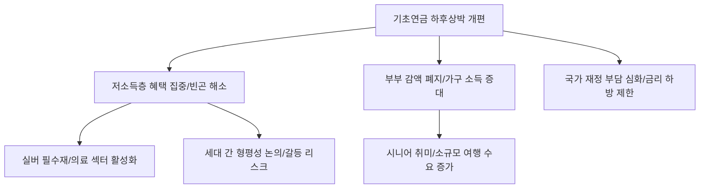

# 사회/복지 분석: 기초연금 '하후상박' 개편과 부부 감액 폐지, 실용적 복지 국가로의 전환
## 투자 신호 + 사회적 영향 평가

---

## 📌 기사 기본 정보

- **날짜**: 2026-03-17
- **출처**: 대한민국 복지 정책 및 공적 이전 소득 분석 리포트
- **카테고리**: 경제 > 사회 > 복지정책
- **핵심 주제**: 노인 빈곤 해소와 재정 효율성을 위해 추진 중인 기초연금의 '하후상박(저소득층 두텁게, 고소득층 완만하게)' 개편안과 20%에 달했던 '부부 합산 감액' 제도 폐지 등 실용적 복지 체계로의 전환이 미치는 사회·경제적 파급 효과 분석

**메타데이터**
- 주요 정책: 기초연금 지급액 40만 원 인상 연동, 소득 하위 70% 대상 차등 지급(하후상박)
- 핵심 이슈: 부부 감액(20%) 제도 폐지(동거 부부 불이익 해소), 수급 자격 심사 기준 완화
- 주요 주체: 보건복지부, 65세 이상 노령층, 국민연금 가입자, 기획재정부
- 키워드: 기초연금 개편, 하후상박 복지, 부부 감액 폐지, 노후 소득 보장, 실용적 복지 국가

---

## 🔍 기사를 통한 투자 신호 추출

### 1단계: 핵심 사건 분해

**What (무엇이 일어났는가?)**
- 정부가 기초연금을 단순한 정액 지급이 아닌, 소득이 적을수록 더 많이 주는 '하후상박' 구조로 설계하고, 그간 비판받았던 '부부가 함께 살면 깎는' 감액 제도를 폐지하기로 결정함. 이는 보편적 복지라는 이름의 포퓰리즘에서 벗어나, 실질적 빈곤층에게 혜택을 집중하는 '타겟팅(Targeting)' 복지로의 전환임.

**When (언제 일어났는가?)**
- 2026-03-17 (국민연금 개혁과 맞물려 노후 소득 보장 체계 전체에 대한 대수술이 시작된 시점)

**Why (왜 일어났는가?)**
- 전 세계 최하위 수준인 노인 빈곤율을 실질적으로 낮추기 위함
- 부부 감액을 피하려고 서류상 이혼을 하는 등 사회적 역설 해소
- 한정된 재정을 가장 필요한 곳에 쏟는 '재정 효율성' 극대화

**Who (누가 주도하는가?)**
- 실용주의 복지 노선을 걷는 현 정부 정책 라인
- 소득 보장을 강력히 요구해 온 노인 권익 단체 및 복지 전문가

---

### 2단계: 투자 신호 해석

#### A. **긍정적 신호 (Bullish)**

**① 하위 계층 '가처분 소득 증대'에 따른 필수 소비재 수요 견고**
- **신호**: 저소득 고령층의 고정 소득 월 10~20만 원 추가 확보
- **의미**: 이들은 소득 대비 소비 성향이 매우 높아, 늘어난 연금은 즉시 생필품, 의약품, 지역 상권 소비로 이어짐
- **투자 기회**: 노년층 필수 의약품 제약사, 건강 지향성 식품 제조사, 지역 밀착형 실버 테크 기업

**② '실버 안보' 및 '시니어 노머드' 산업의 합법적 자금원 확보**
- **신호**: 부부 감액 폐지로 인한 월 16만 원(최대 기준) 가량의 가구 소득 증가
- **의미**: 부부 합산 80만 원 수준의 안정적 소득은 시니어들의 '소규모 여행'이나 '취미 활동'을 지속하게 만드는 기초 재원이 됨
- **투자 기회**: 시니어 특화 여행사, 고령자 친화적 가전 제품 제조사

---

#### B. **위험 신호 (Bearish)**

**③ '재정 부담' 증가에 따른 국채 순발생 및 금리 하락 제한**
- **신호**: 조 단위의 추가 복지 예산 투입 
- **의미**: 복지 지출은 한 번 늘리면 줄이기 어려우며(하방 경직성), 이는 국가 부채 증가로 이어져 장기 금리를 밀어 올리는 압력으로 작용함
- **투자 리스크**: 금리 하락을 기대하는 장기 채권 투자 포트폴리오

**④ '상대적 박탈감'에 따른 국민연금 가입 회피(탈퇴) 현상**
- **신호**: "안 내도 주는 기초연금"과 "더 내고 늦게 받는 국민연금"의 역설
- **의미**: 기초연금 혜택이 커질수록 성실히 연금을 낸 가입자들이 '손해'라고 느껴 연기금의 근간이 흔들릴 위험
- **투자 리스크**: 연기금 자본 유입에 의존하는 국내 증시 대형주

---

### 3단계: 섹터별 투자 기회 매트릭스

#### ✅ **높은 기대도 + 낮은 리스크**

**노령층의 '디지털 복지' 접근성을 높이는 '시니어 핀테크/결제 솔루션'**
- 연금이 오를수록 이를 관리하고 지출하는 디지털 통로의 수요가 급증함. 노인 친화적 UI를 가진 금융 서비스 기업이 승기를 잡음
- **투자 추천도**: ⭐⭐⭐⭐

---

## 💰 구체적 투자 신호 변환

### 신호 1: '은퇴 국가'의 돈은 '약'과 '밥'으로 흐른다

**투자 해석**: 기사는 노령층의 기초 소득 보장이 '양적'으로 확대되었음을 시사함. 이는 한국 내수 시장이 더욱 '고령 중심'으로 재편될 것임을 뜻함. 투자자는 지금 즉시 '청년 타겟' 소비재 비중을 낮추고, 기초연금 확대의 직접 수혜를 입는 '실버 필수재' 섹터로 이동해야 함. 특히 부부 감액 폐지는 가구당 소비력을 유의미하게 높이는 신호이므로, 시니어 부부를 타겟으로 한 서비스 주가 주목받을 것임.

---

## 🌍 사회적 영향 평가

### A. 긍정적 사회 영향
- **노인 빈곤의 실질적 완화 및 국민 존엄성 유지**: 저소득층에게 혜택을 집중하여 절대 빈곤을 줄이고, 부부 동거에 따른 불이익을 없앰으로써 건강한 가족 공동체 유지에 기여
- **복지 체계의 합리화**: 보편적 배분보다 '필요'에 따른 배분을 정착시켜 복지 국가의 지속 가능 모델 제시

### B. 부정적 사회 영향
- **세대 간 형평성 논란 및 사회적 비용 증가**: 젊은 세대의 세금 부담이 늘어나는 상황에서 노년층 복지만 확대된다는 비판과 이에 따른 세대 간 정치적 갈등 격화
- **근로 의욕 및 저축 동기 약화**: "국가가 다 해준다"는 인식이 퍼질 경우 스스로 노후를 준비하려는 개인들의 노력이 저하되는 도덕적 해이 가능성

---

## 🎯 결론: 당신의 투자 전략 수립

- **즉시 실행**: 포트폴리오 내 시니어 헬스케어 및 필수 소비재 비중 10% 확대, 국민연금 개혁 방향과의 상관관계 지속적 추적
- **3개월 후**: 실제 개편안 시행 후 저소득층 소비 지표(통계청 가계동향조사 등) 확인 및 복지 예산 집행 속도 확인

---

## 📝 Obsidian 연결 구조

