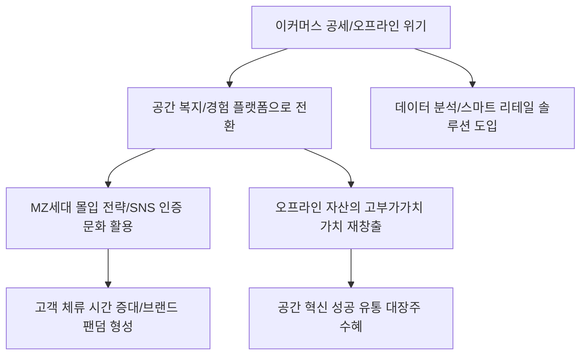

# 비즈니스/유통 분석: 유통업계 '공간 복지'와 MZ세대 몰입 전략의 경제학
## 투자 신호 + 사회적 영향 평가

---

## 📌 기사 기본 정보

- **날짜**: 2026-03-17
- **출처**: 대한민국 유통 트렌드 및 오프라인 비즈니스 혁신 리포트
- **카테고리**: 경제 > 비즈니스 > 유통/마케팅
- **핵심 주제**: 온라인 쇼핑의 공세 속에서 오프라인 유통 채널들이 '공간 복지(Space Welfare)'와 'MZ세대 몰입(Immersion)'을 핵심 키워드로 내세워 단순 판매 공간을 넘어선 문화·경험 플랫폼으로의 대전환을 시도하는 전략 분석

**메타데이터**
- 주요 이슈: 오프라인 공간의 재정의 (Store to Place), 체험형 팝업스토어 열풍
- 핵심 전략: 몰입형 미디어 아트 도입, 커뮤니티 공간화, MZ세대 취향 저격 콘텐츠 큐레이션
- 주요 주체: 신세계·현대 백화점, 복합 쇼핑몰 운영사, MZ세대 소비자, 공간 기획 스타트업
- 키워드: 공간 복지, MZ세대 몰입, 오프라인의 반격, 경험 소비, 리테일테인먼트

---

## 🔍 기사를 통한 투자 신호 추출

### 1단계: 핵심 사건 분해

**What (무엇이 일어났는가?)**
- 백화점과 대형 마트들이 매대(Counter)를 치우고 그 자리에 정원, 갤러리, 쉼터 등 '공간 복지' 시설을 대거 확충함. 이는 당장의 매출보다 고객의 '체류 시간'을 늘려 MZ세대가 스스로 찾아와 사진을 찍고 공유하게 만드는 '몰입형 경험'을 제공하기 위함임. 물건을 파는 곳이 아니라 '시간을 점유하는 곳'으로의 본질적 변화임.

**When (언제 일어났는가?)**
- 2026-03-17 (엔데믹 이후 오프라인의 가치가 재발견되고, 온라인과는 차별화된 오프라인만의 '감각적 자극'이 비즈니스의 핵심 경쟁력이 된 시점)

**Why (왜 일어났는가?)**
- 단순 가격 경쟁으로는 쿠팡 등 이커머스를 이길 수 없다는 절박함
- MZ세대의 '인증샷 문화(Show-off)'와 '가치 소비' 트렌드에 대응
- 공간 자체가 브랜드의 페르소나(Persona)가 되어 장기적인 팬덤 형성 유도

**Who (누가 주도하는가?)**
- 공격적인 리뉴얼을 주도하는 대형 백화점 3사 및 복합몰 운영진
- 공간의 가치를 알아보고 '힙(Hip)'한 공간에 아낌없이 지갑을 여는 MZ세대 소비자

---

### 2단계: 투자 신호 해석

#### A. **긍정적 신호 (Bullish)**

**① '공간 기획 능력'을 검증받은 대형 유통 지부사의 밸류에이션 재평가**
- **신호**: 리뉴얼 후 방문객 수(특히 2030 비중) 및 인당 체류 시간의 급증
- **의미**: 죽어가는 오프라인 자산이 '고부가가치 부동산'으로 부활함. 임대료 수익 중심에서 콘텐츠 수익 중심으로 체질 개선
- **투자 기회**: 더현대서울 등 혁신 공간을 성공시킨 대형 유통 주, 복합몰 상장 리츠

**② '공간 인테리어 및 몰입형 기술' 관련 선도 기업의 수혜**
- **신호**: 팝업스토어 및 몰입형 미디어 아트 설비 발주 폭증
- **의미**: 유통업계의 공간 전쟁은 곧 디자인과 기술의 전쟁임. 이를 구현해주는 테크 기업의 일감이 넘쳐남
- **투자 기회**: 실감형 콘텐츠 제작사, 인테리어 디자인 선도 기업, 스마트 리테일 솔루션 사

---

#### B. **위험 신호 (Bearish)**

**③ 리뉴얼에 뒤처진 '낙후된 지방 백화점 및 일반 대형마트'의 도태 가속**
- **신호**: 공간 혁신이 없는 매장의 집객력 하락 및 매출 상위 매장으로의 자금 쏠림
- **의미**: "어설픈 오프라인"은 더 이상 갈 이유가 없음. 양극화가 심화되며 하위 매장들은 폐점 수순 돌입
- **투자 리스크**: 지역 기반 중소 유통주, 공간 투자 여력이 없는 저마진 할인점

**④ 무분별한 리뉴얼에 따른 '비용 부담' 및 '수익성 악화' 우려**
- **신호**: 자본 지출(CAPEX)은 막대하나 실질적 구매 전환율(Conversion Rate) 저조
- **의미**: "와서 사진만 찍고 물건은 온라인에서 사는" 현상 지속 시, 공간 투자는 빛 좋은 개살구가 됨
- **투자 리스크**: 과도한 부채를 안고 대규모 공간 프로젝트를 진행 중인 신규 시행사

---

### 3단계: 섹터별 투자 기회 매트릭스

#### ✅ **높은 기대도 + 낮은 리스크**

**유통 자산의 '디지털 전환'과 '공간 관리'를 동시에 수행하는 데이터 플랫폼**
- 공간이 복잡해질수록 유동 인구를 분석하고 결제 데이터를 연결하는 기술의 가치는 절대적임. 유통 패러다임 변화의 '두뇌' 역할을 하는 기업
- **투자 추천도**: ⭐⭐⭐⭐

---

## 💰 구체적 투자 신호 변환

### 신호 1: '평당 매출'의 시대가 지고 '분당 가치'의 시대가 온다

**투자 해석**: 기사는 오프라인 유통의 평가지표가 '매출'에서 '체류 시간'으로 바뀌었음을 시사함. 투자자는 이제 유통주를 고를 때 단순히 분기 매출만 볼 것이 아니라, 그 공간이 얼마나 '힙(Hip)'한지, 그리고 MZ세대의 소셜 미디어 점유율이 얼마나 높은지를 확인해야 함. 공간은 이제 제품을 담는 그릇이 아니라, 그 자체로 '수익을 창출하는 IP(지식재산권)'가 되었음. 공간 혁신에 성공한 기업만이 자산 가치를 보존할 것임.

---

## 🌍 사회적 영향 평가

### A. 긍정적 사회 영향
- **도시 문화 인프라의 확충**: 민간 기업의 공간 투자가 도심 속 공원, 갤러리 역할을 수행하며 시민들의 정서적 복지와 문화 향유권 제고에 기여
- **로컬 브랜딩 및 상권 활성화**: 공간 혁신이 지역의 랜드마크가 되어 주변 상권까지 활기를 불어넣는 지역 경제 시너지 효과 창출

### B. 부정적 사회 영향
- **상업화된 공간 복지의 한계**: 기업의 이윤 추구와 결합된 공간은 결국 '구매력 있는 계층'만을 위한 선별적 복지가 될 우려
- **젠트리피케이션 및 소외된 골목 상업 위기**: 대형 자본의 공간 쏠림 현상으로 인해 개성 있는 작은 가게들이 설 자리를 잃고 도시의 다양성이 훼손될 사회적 리스크

---

## 🎯 결론: 당신의 투자 전략 수립

- **즉시 실행**: 보유 중인 유통 섹터 중 '공간 혁신' 성과가 지표(SNS 언급량, 방문객 수)로 확인되는 대장주 위주로 압축
- **3개월 후**: 팝업스토어 및 체험 행사 시즌 종료 후 실질적인 영업이익(구매 전환율) 개선 여부 확인 후 비중 조절

---

## 📝 Obsidian 연결 구조

